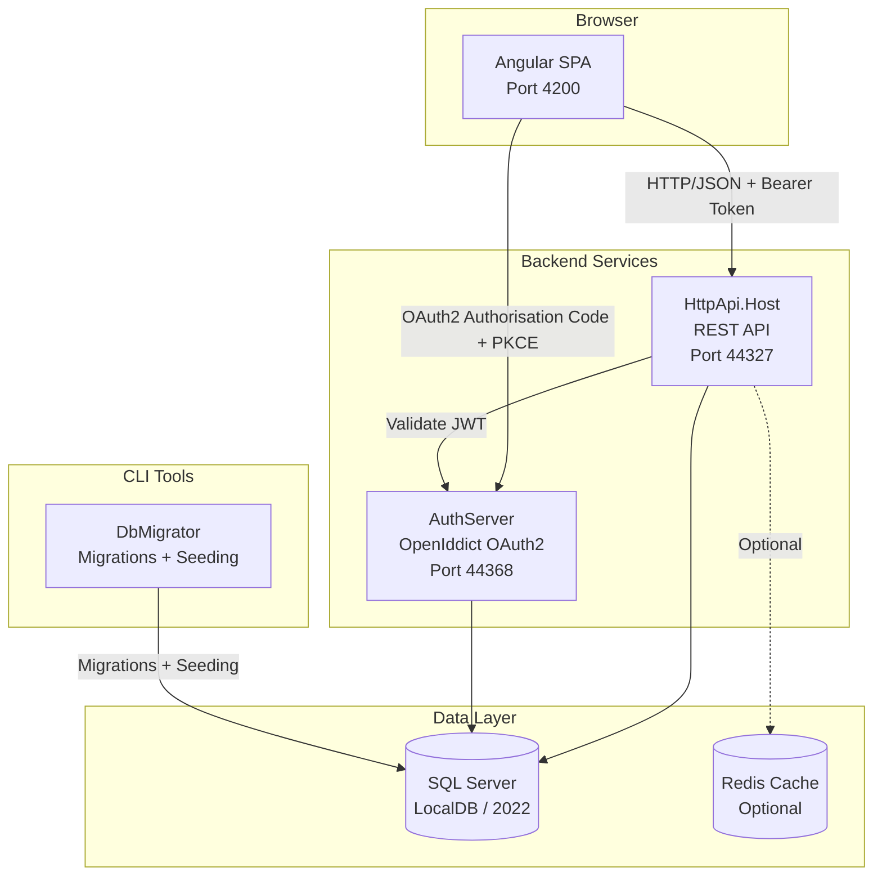
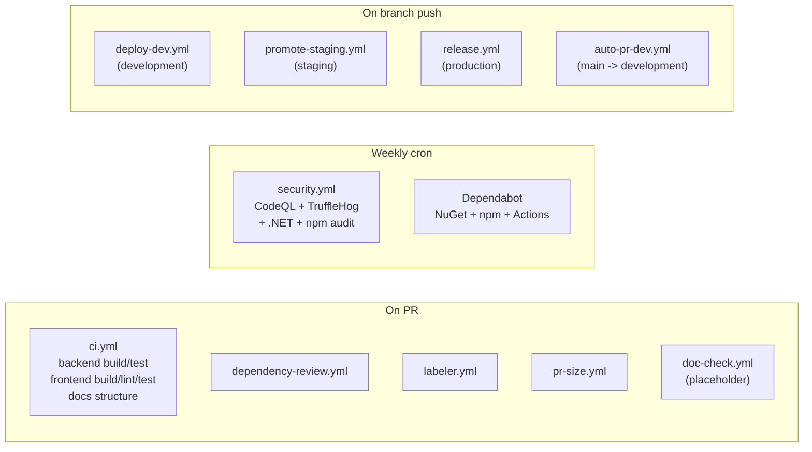

# HCS Case Evaluation Portal

Workers' compensation Independent Medical Examination (IME) scheduling
platform, maintained by Gesco.

[](https://github.com/gesco-healthcare-support/hcs-patient-portal/actions/workflows/ci.yml)
[](https://github.com/gesco-healthcare-support/hcs-patient-portal/actions/workflows/security.yml)
[](https://dotnet.microsoft.com/)
[](https://angular.dev/)
[](https://abp.io/)
[](https://nodejs.org/)
[](LICENSE)
[](#known-issues-and-roadmap)
[](#known-issues-and-roadmap)

> The SonarCloud and Codecov badges are placeholders. They will activate once
> the services are wired up -- see [Known Issues and Roadmap](#known-issues-and-roadmap).

Healthcare support staff use this portal to book patients with IME doctors at
specific locations and time slots, then track each appointment through a
13-state lifecycle from initial request through billing. The system is a
multi-tenant platform where each doctor practice operates as an isolated
tenant, while shared reference data (locations, appointment types, languages,
states, WCAB offices) is managed centrally by the host organisation.

---

## Table of Contents

- [Project Status](#project-status)
- [Tech Stack](#tech-stack)
- [Architecture](#architecture)
- [Domain Overview](#domain-overview)
- [Repository Structure](#repository-structure)
- [Quick Start](#quick-start)
- [Service Ports](#service-ports)
- [Development Workflow](#development-workflow)
- [Testing](#testing)
- [CI / CD](#ci--cd)
- [Docker and Deployment](#docker-and-deployment)
- [Security and HIPAA](#security-and-hipaa)
- [Documentation Map](#documentation-map)
- [Known Issues and Roadmap](#known-issues-and-roadmap)
- [Contributing](#contributing)
- [License](#license)
- [Maintainer](#maintainer)

---

## Project Status

This repository is in the **pre-production, foundation-complete** phase.
Documentation, CI/CD, hooks, and Docker scaffolding are in place; feature work
and external deployment are not yet underway.

| Aspect                  | Status                                                                                                                                |
| ----------------------- | ------------------------------------------------------------------------------------------------------------------------------------- |
| Stage                   | Pre-production, localhost / Docker only                                                                                               |
| Deployed environments   | None                                                                                                                                  |
| Tracked issues          | 29 across security, data integrity, bugs, incomplete features, architecture -- see [docs/issues/OVERVIEW.md](docs/issues/OVERVIEW.md) |
| Automated test coverage | 2 of 15 domain entities covered (Doctors, Books) -- see [docs/devops/TEST-CATALOG.md](docs/devops/TEST-CATALOG.md)                    |
| HIPAA readiness         | Safeguards in place, gaps documented -- see [docs/security/HIPAA-COMPLIANCE.md](docs/security/HIPAA-COMPLIANCE.md)                    |
| Maintainer              | Gesco (single developer at this time)                                                                                                 |
| Repository visibility   | Proprietary -- see [LICENSE](LICENSE)                                                                                                 |

For the full narrative read [docs/executive-summary.md](docs/executive-summary.md).

---

## Tech Stack

| Layer                  | Technology                                          | Version                           | Notes                                               |
| ---------------------- | --------------------------------------------------- | --------------------------------- | --------------------------------------------------- |
| Backend framework      | ASP.NET Core + [ABP Framework](https://abp.io/)     | .NET 10.0 / ABP Commercial 10.0.2 | Licence required -- see [Quick Start](#quick-start) |
| Language               | C#                                                  | `latest` LangVersion              |                                                     |
| Frontend framework     | [Angular](https://angular.dev/)                     | 20                                | Standalone components, esbuild application builder  |
| UI theme               | LeptonX (Side Menu)                                 | 5.0.2                             | Volo theme for ABP                                  |
| Database               | SQL Server                                          | LocalDB (dev) / 2022 (Docker)     | Code-first EF Core migrations                       |
| Auth                   | [OpenIddict](https://documentation.openiddict.com/) | --                                | OAuth 2.0 / OIDC                                    |
| Mapping                | [Riok.Mapperly](https://github.com/riok/mapperly)   | --                                | Compile-time source generation (not AutoMapper)     |
| Caching                | Redis                                               | 7 (Docker)                        | Optional; disabled by default locally               |
| Logging                | Serilog                                             | 9.x                               |                                                     |
| Test framework         | xUnit + [Shouldly](https://docs.shouldly.org/)      | --                                |                                                     |
| Test DB                | SQLite in-memory                                    | --                                | EF Core tests only                                  |
| Package manager (Node) | Yarn                                                | 1.x                               | `yarn.lock` committed                               |
| CI / CD                | GitHub Actions                                      | 10 workflows                      | See [CI / CD](#ci--cd)                              |
| Containerisation       | Docker Compose                                      | --                                | 6-service stack                                     |

---

## Architecture



Four runtime processes:

- **AuthServer** (`:44368`) -- OpenIddict OAuth 2.0 / OIDC, issues tokens and
  hosts login pages.
- **HttpApi.Host** (`:44327`) -- REST API, hosts Swagger, validates JWTs
  against the AuthServer.
- **Angular SPA** (`:4200`) -- calls both services; LeptonX shell for internal
  users, simplified layout for external users (Patient, Applicant Attorney).
- **DbMigrator** -- console app that applies EF Core migrations and runs data
  seed contributors.

Deep dives:
[docs/architecture/OVERVIEW.md](docs/architecture/OVERVIEW.md) (system design),
[docs/architecture/DDD-LAYERS.md](docs/architecture/DDD-LAYERS.md) (DDD layer
rules),
[docs/architecture/ABP-FRAMEWORK.md](docs/architecture/ABP-FRAMEWORK.md) (ABP
module system),
[docs/architecture/MULTI-TENANCY.md](docs/architecture/MULTI-TENANCY.md)
(doctor-per-tenant model).

---

## Domain Overview

Workers' compensation claimants in California are often referred to an
Independent Medical Examination (IME) -- a Qualified Medical Evaluator (QME)
assigned by the state Division of Workers' Compensation, or an Agreed Medical
Evaluator (AME) chosen by both parties. The IME report drives claim
decisions at the Workers' Compensation Appeals Board (WCAB). This portal
tracks those appointments end-to-end.

- **5 user roles**: Patient, Applicant Attorney, Defense Attorney, Claim
  Examiner, Admin. See
  [docs/business-domain/USER-ROLES-AND-ACTORS.md](docs/business-domain/USER-ROLES-AND-ACTORS.md).
- **13-state appointment lifecycle**: Pending -> Approved -> CheckedIn ->
  CheckedOut -> Billed, with alternate branches for reschedule, cancellation,
  and no-show. See
  [docs/business-domain/APPOINTMENT-LIFECYCLE.md](docs/business-domain/APPOINTMENT-LIFECYCLE.md).
- **15 domain features**, each with a `CLAUDE.md` in its Domain folder and a
  companion doc under [docs/features/](docs/features/).

Plain-language introduction:
[docs/business-domain/DOMAIN-OVERVIEW.md](docs/business-domain/DOMAIN-OVERVIEW.md).
Terminology: [docs/GLOSSARY.md](docs/GLOSSARY.md).

---

## Repository Structure

```text
hcs-case-evaluation-portal/
├── src/                                       10 .NET projects (DDD layers)
│   ├── HealthcareSupport.CaseEvaluation.Domain.Shared
│   ├── HealthcareSupport.CaseEvaluation.Domain
│   ├── HealthcareSupport.CaseEvaluation.Application.Contracts
│   ├── HealthcareSupport.CaseEvaluation.Application
│   ├── HealthcareSupport.CaseEvaluation.EntityFrameworkCore
│   ├── HealthcareSupport.CaseEvaluation.HttpApi
│   ├── HealthcareSupport.CaseEvaluation.HttpApi.Client
│   ├── HealthcareSupport.CaseEvaluation.HttpApi.Host  (:44327)
│   ├── HealthcareSupport.CaseEvaluation.AuthServer    (:44368)
│   └── HealthcareSupport.CaseEvaluation.DbMigrator
├── test/                                      4 test projects (xUnit)
├── angular/                                   Angular 20 SPA (:4200)
├── docs/                                      75+ markdown docs
├── etc/                                       Docker infra, Helm (local k8s)
├── scripts/                                   Setup helpers (NuGet.Config, etc.)
├── .github/                                   Workflows, CODEOWNERS, templates
├── docker-compose.yml                         6-service local stack
├── HealthcareSupport.CaseEvaluation.slnx      Solution file (.slnx format)
├── CONTRIBUTING.md                            Contribution workflow
├── SECURITY.md                                Security policy, HIPAA scope
├── CODE_OF_CONDUCT.md                         Contributor Covenant + HIPAA
├── CHANGELOG.md                               Keep a Changelog
└── LICENSE                                    Proprietary
```

File-level map: [docs/repo-map/map.md](docs/repo-map/map.md). Solution/csproj
commentary:
[docs/architecture/SOLUTION-STRUCTURE.md](docs/architecture/SOLUTION-STRUCTURE.md).

---

## Quick Start

Two paths. Pick one; both require an ABP Commercial licence and an ABP NuGet
API key. If you do not have these, stop and contact Gesco before continuing.

### Path A: Docker Compose (fastest)

Prerequisites: Docker Desktop, your ABP Commercial licence code, your ABP
NuGet API key.

```bash
git clone https://github.com/gesco-healthcare-support/hcs-patient-portal.git
cd hcs-patient-portal

# 1. Copy the env template and fill in secrets
cp .env.example .env
# Edit .env: ABP_NUGET_API_KEY, ABP_LICENSE_CODE, MSSQL_SA_PASSWORD,
#            STRING_ENCRYPTION_PASSPHRASE

# 2. Create docker/appsettings.secrets.json from its example
cp docker/appsettings.secrets.json.example docker/appsettings.secrets.json
# Edit docker/appsettings.secrets.json as needed

# 3. Build and start the stack
docker compose up -d

# 4. Verify (all three should return 200)
curl -sk -o /dev/null -w "%{http_code}\n" http://localhost:44368/.well-known/openid-configuration
curl -sk -o /dev/null -w "%{http_code}\n" http://localhost:44327/swagger/index.html
curl -s  -o /dev/null -w "%{http_code}\n" http://localhost:4200/
```

Reset the database (destroys all data):

```bash
docker compose down -v && docker compose up -d
```

Full runbook (troubleshooting, rebuild individual services, seeding details):
[docs/runbooks/DOCKER-DEV.md](docs/runbooks/DOCKER-DEV.md).

### Path B: Local (native)

Prerequisites: .NET 10 SDK, Node 20.x with Yarn, SQL Server (LocalDB or
containerised), Gitleaks on `PATH`, and the ABP Commercial artefacts above.

> **Windows path constraint.** SQL Server's native `SNI.dll` fails to load
> when the project path exceeds ~200 characters (260-char DLL limit). On
> Windows, map this repo to a short drive letter before running `dotnet`:
> `subst P: "C:\path\to\your\long\path\hcs-case-evaluation-portal"` and work
> from `P:\`. Not an issue on macOS or Linux.

```bash
git clone https://github.com/gesco-healthcare-support/hcs-patient-portal.git
cd hcs-patient-portal

# 1. Install NuGet feed credentials (sets up NuGet.Config from template)
./scripts/setup-nuget.sh                # macOS / Linux / WSL / Git Bash
# (on Windows PowerShell: see docs/onboarding/GETTING-STARTED.md)

# 2. Restore and install client libraries
dotnet restore HealthcareSupport.CaseEvaluation.slnx
cd angular && yarn install && cd ..

# 3. Create local secrets overrides from examples, then fill them in
cp src/HealthcareSupport.CaseEvaluation.AuthServer/appsettings.Local.json.example \
   src/HealthcareSupport.CaseEvaluation.AuthServer/appsettings.Local.json
cp src/HealthcareSupport.CaseEvaluation.HttpApi.Host/appsettings.Local.json.example \
   src/HealthcareSupport.CaseEvaluation.HttpApi.Host/appsettings.Local.json

# 4. Start SQL Server (LocalDB or Docker) before the next step

# 5. Apply migrations and seed reference data
dotnet run --project src/HealthcareSupport.CaseEvaluation.DbMigrator

# 6. Start services in order (three terminals)
# Terminal 1 -- AuthServer
dotnet run --project src/HealthcareSupport.CaseEvaluation.AuthServer

# Terminal 2 -- API Host
dotnet run --project src/HealthcareSupport.CaseEvaluation.HttpApi.Host

# Terminal 3 -- Angular (never use `ng serve` -- see warning below)
cd angular
npx ng build --configuration development
npx serve -s dist/CaseEvaluation/browser -p 4200
```

> **Never run `ng serve` or `yarn start`.** Angular 20's Vite pre-bundler
> splits `@abp/ng.core` across chunks, creating duplicate `InjectionToken`
> instances. Angular's DI uses reference identity, so `CORE_OPTIONS` injection
> fails at runtime with `NullInjectorError`. Always use `ng build` plus a
> static server. Context:
> [docs/decisions/005-no-ng-serve-vite-workaround.md](docs/decisions/005-no-ng-serve-vite-workaround.md).

Full walkthrough with every prerequisite and environment nuance:
[docs/onboarding/GETTING-STARTED.md](docs/onboarding/GETTING-STARTED.md).
Troubleshooting the top-five local failures:
[docs/runbooks/LOCAL-DEV.md](docs/runbooks/LOCAL-DEV.md).

---

## Service Ports

| Service                | URL                       | Notes                                                         |
| ---------------------- | ------------------------- | ------------------------------------------------------------- |
| AuthServer             | <https://localhost:44368> | Local HTTPS; container exposes HTTP on the same external port |
| HttpApi.Host (Swagger) | <https://localhost:44327> | Local HTTPS; container exposes HTTP                           |
| Angular SPA            | <http://localhost:4200>   | nginx in Docker, `npx serve` locally                          |
| SQL Server (Docker)    | `localhost:1434 -> 1433`  | Remapped to avoid collisions with host LocalDB / SQL Server   |
| Redis (Docker)         | `localhost:6379`          | Optional at runtime                                           |

Services must start in order: **AuthServer -> HttpApi.Host -> Angular**. The
API validates tokens against AuthServer; Angular calls both.

---

## Development Workflow

### Branch Model

```text
feature/* --> main --> development --> staging --> production
```

Features branch from `main`, merge back to `main` after review, and promote
forward via `auto-pr-dev.yml` (to `development`) and then manually through
`staging` and `production`. Promotion PRs between long-lived branches must
use **rebase**, never a merge commit.

### Branch Protection (Progressive Hardening)

| Branch        | Required checks                    | Approvals |
| ------------- | ---------------------------------- | --------- |
| `main`        | Backend Build, Frontend Build      | 1         |
| `development` | + Backend Test, Frontend Lint      | 1         |
| `staging`     | + Frontend Test, Dependency Review | 1         |
| `production`  | + Secret Detection                 | 2         |

### Commits

[Conventional Commits](https://www.conventionalcommits.org/), enforced by
commitlint on the `commit-msg` hook. Allowed types: `feat`, `fix`, `docs`,
`style`, `refactor`, `test`, `chore`, `ci`, `perf`, `build`, `revert`.

### Pre-commit and Pre-push Hooks

Husky hooks install automatically when you run `yarn install` inside
`angular/`:

| Event        | What runs                                                                                                                    |
| ------------ | ---------------------------------------------------------------------------------------------------------------------------- |
| `git commit` | Gitleaks staged scan, lint-staged (Prettier + ESLint), `dotnet format --verify-no-changes` on staged `.cs` files, commitlint |
| `git push`   | Full-repo Gitleaks scan, `dotnet build` in Debug                                                                             |

Gitleaks is installed separately (not via npm); see
[docs/onboarding/GETTING-STARTED.md](docs/onboarding/GETTING-STARTED.md) for
per-OS instructions and WSL / GUI git client handling. Missing local Gitleaks
does not block commits; CI scans server-side regardless.

The full contribution flow (PR template, HIPAA checklist, WSL caveats) lives
in [CONTRIBUTING.md](CONTRIBUTING.md).

---

## Testing

```bash
# Backend -- xUnit + Shouldly, all .NET projects
dotnet test HealthcareSupport.CaseEvaluation.slnx

# Run a single test method
dotnet test --filter "FullyQualifiedName~MethodName"

# Frontend -- Karma + Jasmine (skips cleanly if no *.spec.ts files exist)
cd angular && yarn test

# Frontend lint
cd angular && yarn lint
```

Current coverage: 13 backend test methods across the Doctors feature and the
ABP scaffold `Books` sample. All other domain features are untested -- see
[docs/devops/TEST-CATALOG.md](docs/devops/TEST-CATALOG.md) for the full
catalogue and [docs/devops/TESTING-STRATEGY.md](docs/devops/TESTING-STRATEGY.md)
for test patterns and the `CaseEvaluationTestBase<TModule>` chain.

EF Core tests use SQLite in-memory (`AbpEntityFrameworkCoreSqliteModule`) and
require `[Collection(CaseEvaluationTestConsts.CollectionDefinitionName)]`.

---

## CI / CD

Ten GitHub Actions workflows cover PR validation, security scanning, and
branch promotion.



- **PR validation** (`ci.yml`) -- six jobs: backend build, backend test,
  frontend build, frontend lint, frontend test, docs structure. Jobs run in
  parallel with a shared concurrency group that cancels superseded runs.
- **Security** (`security.yml`) -- weekly Monday 06:00 UTC cron + manual
  dispatch. .NET vulnerability audit, npm audit, TruffleHog secret scan,
  CodeQL for C# and JavaScript/TypeScript.
- **Dependabot** scans NuGet, npm, and GitHub Actions ecosystems weekly.
- **Promotion** -- pushes to `development` run `deploy-dev.yml` and open an
  auto-PR to `staging`; pushes to `staging` run `promote-staging.yml`; pushes
  to `production` run `release.yml` (semantic-release).
- **Housekeeping** -- `auto-pr-dev.yml` keeps `main` and `development` in
  sync; `pr-size.yml` and `labeler.yml` annotate every PR.

Sources in [.github/workflows/](.github/workflows/). Design rationale:
[docs/devops/CICD-DOCKER-MASTER-PLAN.md](docs/devops/CICD-DOCKER-MASTER-PLAN.md).

---

## Docker and Deployment

The Compose stack (`docker-compose.yml`) runs six services:

| Service       | Image / Build                                | Port            | Role                                         |
| ------------- | -------------------------------------------- | --------------- | -------------------------------------------- |
| `sql-server`  | `mcr.microsoft.com/mssql/server:2022-latest` | `1434 -> 1433`  | Primary database                             |
| `redis`       | `redis:7-alpine`                             | `6379`          | Cache                                        |
| `db-migrator` | local build                                  | --              | Runs once; applies migrations and seeds data |
| `authserver`  | local build                                  | `44368 -> 8080` | OpenIddict OAuth server                      |
| `api`         | local build                                  | `44327 -> 8080` | REST API                                     |
| `angular`     | local build                                  | `4200 -> 80`    | nginx-served production build                |

Rebuild a single service after code changes:

```bash
docker compose build api && docker compose up -d api
```

There is **no staging or production deployment** yet. The stack is intended
for local development and automated CI smoke tests only. See
[docs/runbooks/DOCKER-DEV.md](docs/runbooks/DOCKER-DEV.md) for operations and
troubleshooting, and [etc/docker/README.md](etc/docker/README.md) for the
infrastructure-only compose variant. Local Kubernetes charts live under
[etc/helm/README.md](etc/helm/README.md).

---

## Security and HIPAA

This application handles Protected Health Information (PHI) subject to HIPAA.
Core safeguards in place:

- **Authentication**: OAuth 2.0 / OIDC via OpenIddict; Authorisation Code +
  PKCE flow for the Angular client.
- **Authorisation**: ABP permission system with role-based access control
  (Admin, Doctor, Patient, Applicant Attorney, Claim Examiner).
- **Multi-tenant isolation**: ABP's automatic tenant filter; `IMultiTenant`
  entities filtered on every query by default.
- **Secret scanning**: Gitleaks on commit and push, TruffleHog in CI.
- **PHI scanner hook**: runs on every local development tool invocation to
  catch protected fields before they reach git.
- **PR template**: every pull request carries a HIPAA checklist.

Known gaps (documented, not yet remediated):

- Secrets were previously committed to source control; rotation is in
  progress.
- PII logging is enabled by default in places.
- One API endpoint exposes user data without an authorisation check.
- Password complexity policy is weaker than HIPAA-recommended defaults.

Full audit: [docs/issues/SECURITY.md](docs/issues/SECURITY.md). Threat model:
[docs/security/THREAT-MODEL.md](docs/security/THREAT-MODEL.md). Data flows:
[docs/security/DATA-FLOWS.md](docs/security/DATA-FLOWS.md). HIPAA technical
safeguards inventory:
[docs/security/HIPAA-COMPLIANCE.md](docs/security/HIPAA-COMPLIANCE.md). Secret
management: [docs/security/SECRETS-MANAGEMENT.md](docs/security/SECRETS-MANAGEMENT.md).

Security reports go to the channel documented in [SECURITY.md](SECURITY.md).
Do not file public issues for vulnerabilities.

---

## Documentation Map

This README is the landing page. The deep material lives in
[docs/](docs/). Start at [docs/INDEX.md](docs/INDEX.md) for the full map.

### I want to...

| Goal                                 | Start here                                                                         |
| ------------------------------------ | ---------------------------------------------------------------------------------- |
| Get the 30-second summary            | [docs/executive-summary.md](docs/executive-summary.md)                             |
| Get the app running locally          | [docs/onboarding/GETTING-STARTED.md](docs/onboarding/GETTING-STARTED.md)           |
| Troubleshoot local dev failures      | [docs/runbooks/LOCAL-DEV.md](docs/runbooks/LOCAL-DEV.md)                           |
| Run the app in Docker                | [docs/runbooks/DOCKER-DEV.md](docs/runbooks/DOCKER-DEV.md)                         |
| Understand the architecture          | [docs/architecture/OVERVIEW.md](docs/architecture/OVERVIEW.md)                     |
| Understand the business domain       | [docs/business-domain/DOMAIN-OVERVIEW.md](docs/business-domain/DOMAIN-OVERVIEW.md) |
| See all API endpoints                | [docs/api/ENDPOINTS-REFERENCE.md](docs/api/ENDPOINTS-REFERENCE.md)                 |
| Learn the database schema            | [docs/backend/ENTITY-RELATIONSHIPS.md](docs/backend/ENTITY-RELATIONSHIPS.md)       |
| Understand multi-tenancy             | [docs/architecture/MULTI-TENANCY.md](docs/architecture/MULTI-TENANCY.md)           |
| Add a new entity                     | [docs/onboarding/COMMON-TASKS.md](docs/onboarding/COMMON-TASKS.md)                 |
| Find PHI data flows and threat model | [docs/security/THREAT-MODEL.md](docs/security/THREAT-MODEL.md)                     |
| Respond to a security incident       | [docs/runbooks/INCIDENT-RESPONSE.md](docs/runbooks/INCIDENT-RESPONSE.md)           |
| See accepted architecture decisions  | [docs/decisions/README.md](docs/decisions/README.md)                               |
| Navigate the codebase                | [docs/repo-map/map.md](docs/repo-map/map.md)                                       |
| See every known bug and gap          | [docs/issues/OVERVIEW.md](docs/issues/OVERVIEW.md)                                 |
| Look up a term                       | [docs/GLOSSARY.md](docs/GLOSSARY.md)                                               |

### Entry points by role

- **New developer** -- [docs/onboarding/GETTING-STARTED.md](docs/onboarding/GETTING-STARTED.md),
  then [docs/onboarding/COMMON-TASKS.md](docs/onboarding/COMMON-TASKS.md).
- **Security reviewer** -- [docs/security/THREAT-MODEL.md](docs/security/THREAT-MODEL.md),
  [docs/security/HIPAA-COMPLIANCE.md](docs/security/HIPAA-COMPLIANCE.md),
  [docs/issues/SECURITY.md](docs/issues/SECURITY.md).
- **Product / manager** -- [docs/executive-summary.md](docs/executive-summary.md).
- **Feature work** -- the `CLAUDE.md` in the feature's Domain folder, plus
  [docs/features/](docs/features/).
- **Architecture discussion** -- [docs/architecture/OVERVIEW.md](docs/architecture/OVERVIEW.md)
  and [docs/decisions/README.md](docs/decisions/README.md).
- **Debugging local failures** --
  [docs/runbooks/LOCAL-DEV.md](docs/runbooks/LOCAL-DEV.md).

Sub-project READMEs: [angular/README.md](angular/README.md),
[etc/docker/README.md](etc/docker/README.md),
[etc/helm/README.md](etc/helm/README.md).

---

## Known Issues and Roadmap

Twenty-nine tracked issues across five categories: security, data integrity,
confirmed bugs, incomplete features, architecture. Start at
[docs/issues/OVERVIEW.md](docs/issues/OVERVIEW.md). The executive summary at
[docs/executive-summary.md](docs/executive-summary.md) groups issues by
severity.

Pre-deployment TODOs still open (summary):

- SonarCloud and Codecov wiring (the badges above are placeholders until
  these services are configured).
- Seven Angular XSS advisories blocked on ABP Commercial 10.3+ releases
  becoming available.
- Polish of the auto-PR workflow and expansion of the disabled
  `doc-check.yml` placeholder.
- First staging deployment.
- Coverage expansion beyond Doctors and Books.

Release history and forward-looking notes: [CHANGELOG.md](CHANGELOG.md).

---

## Contributing

Read [CONTRIBUTING.md](CONTRIBUTING.md) before opening a PR. Highlights:

- Branch from `main`, conventional-commit your work, open a PR back to `main`.
- Fill in the PR template, including the HIPAA checklist.
- Never include real patient data in code, commits, PRs, tests, logs, or docs
  -- see [CODE_OF_CONDUCT.md](CODE_OF_CONDUCT.md).

Report vulnerabilities privately per [SECURITY.md](SECURITY.md).

---

## License

Proprietary. Copyright (c) 2026 Gesco. All rights reserved. See
[LICENSE](LICENSE).

Building or running this project also requires a valid **ABP Commercial**
licence from [Volo Soft](https://abp.io/), obtained separately. Open-source
dependencies retain their own licences; see the package metadata under
`angular/node_modules/` and the NuGet restore output.

---

## Maintainer

Maintained by Gesco. Bugs and feature requests: open an issue on this
repository using the templates under
[.github/ISSUE_TEMPLATE/](.github/ISSUE_TEMPLATE/). Security reports:
[SECURITY.md](SECURITY.md).
