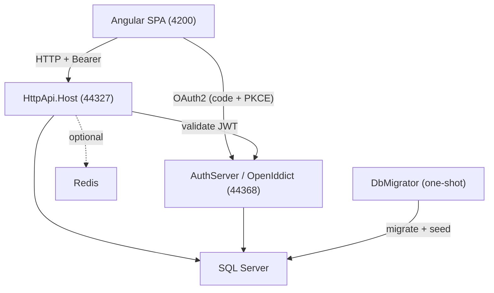

# HCS Patient Portal -- Documentation Index

> Purpose: map of the documentation tree. Audience: anyone onboarding to or navigating the repo. Last verified: 2026-06-01 vs main.

Workers' compensation Independent Medical Examination (IME) scheduling platform on .NET 10,
Angular 20, and ABP Commercial. Per-layer and per-feature guidance lives in `CLAUDE.md` files
(mapped from the repo-root `CLAUDE.md`); this index maps the longer-form `docs/` references.

| Layer | Technology | Version |
|-------|-----------|---------|
| Backend framework | ASP.NET Core / ABP Commercial | .NET 10 / ABP 10.0.2 |
| Frontend | Angular (standalone components) | 20 |
| Database | SQL Server (EF Core, code-first) | LocalDB / Docker |
| Auth | OpenIddict (OAuth 2.0 / OIDC) | -- |
| UI theme | LeptonX (side-menu layout) | 5.x |
| Object mapping | Riok.Mapperly | -- |
| Background jobs | Hangfire | -- |
| Logging | Serilog | -- |

---

## Start here

| Goal | Doc |
|------|-----|
| Run the app locally | [Getting Started](onboarding/GETTING-STARTED.md) |
| Common dev tasks (add an entity, field, migration, proxy) | [Common Tasks](onboarding/COMMON-TASKS.md) |
| Troubleshoot local dev | [Local Dev Runbook](runbooks/LOCAL-DEV.md) |
| Run in Docker | [Docker Dev Runbook](runbooks/DOCKER-DEV.md) |
| Understand the domain | [Business Domain Overview](business-domain/DOMAIN-OVERVIEW.md) |
| Look up a term | [Glossary](GLOSSARY.md) |
| See why a decision was made | [Architecture Decision Records](decisions/README.md) |
| Per-layer / per-feature coding rules | the nested `CLAUDE.md` files (see repo-root `CLAUDE.md` Map) |

---

## Architecture

- [System Overview](architecture/OVERVIEW.md) -- topology, projects, ports
- [ABP Framework Conventions](architecture/ABP-FRAMEWORK.md) -- module system, base classes, Mapperly
- [Multi-Tenancy Strategy](architecture/MULTI-TENANCY.md) -- dual DbContext, host vs tenant entity classification

## Backend

- [Application Services](backend/APPLICATION-SERVICES.md) -- AppService layer, DTO mapping, orchestration
- [Permissions](backend/PERMISSIONS.md) -- permission tree and role matrix
- [Enums & Constants](backend/ENUMS-AND-CONSTANTS.md) -- enums, max-length constants, template codes

## Database

- [EF Core Design](database/EF-CORE-DESIGN.md) -- dual-DbContext strategy, inline entity configuration
- [Schema Reference](database/SCHEMA-REFERENCE.md) -- table naming, SQL type conventions, ABP tables
- [Data Seeding](database/DATA-SEEDING.md) -- seed contributors and what they create
- [Migration Guide](database/MIGRATION-GUIDE.md) -- creating + running EF Core migrations (host + tenant)

## API

- [API Architecture](api/API-ARCHITECTURE.md) -- manual controllers, route namespaces, Swagger
- [Authentication Flow](api/AUTHENTICATION-FLOW.md) -- OpenIddict OAuth2 sequences
- [Middleware & Pipeline](api/MIDDLEWARE-AND-PIPELINE.md) -- request pipeline, Serilog, Redis, health checks

## Frontend

- [Angular Architecture](frontend/ANGULAR-ARCHITECTURE.md) -- standalone components, providers, LeptonX
- [Component Patterns](frontend/COMPONENT-PATTERNS.md) -- abstract/concrete ABP Suite pattern + custom components
- [Routing & Navigation](frontend/ROUTING-AND-NAVIGATION.md) -- route tree, guards, menu registration
- [Appointment Booking Flow](frontend/APPOINTMENT-BOOKING-FLOW.md) -- the multi-section booking form
- [Role-Based UI](frontend/ROLE-BASED-UI.md) -- external vs internal layout, role detection

## Business domain

- [Domain Overview](business-domain/DOMAIN-OVERVIEW.md) -- workers'-comp IME scheduling explained
- [Appointment Lifecycle](business-domain/APPOINTMENT-LIFECYCLE.md) -- status state machine
- [Doctor Availability](business-domain/DOCTOR-AVAILABILITY.md) -- slot generation + capacity booking
- [User Roles & Actors](business-domain/USER-ROLES-AND-ACTORS.md) -- all roles and capabilities

## Security

- [Threat Model](security/THREAT-MODEL.md) -- STRIDE analysis across tiers
- [PHI Data Flows](security/DATA-FLOWS.md) -- where PHI lives, how it moves, SSN reveal egress
- [Authorization](security/AUTHORIZATION.md) -- permissions, roles, endpoint mappings
- [Session & Tokens](security/SESSION-AND-TOKENS.md) -- cookie/token inventory, logout, renewal
- [Secrets Management](security/SECRETS-MANAGEMENT.md) -- secret locations, injection, gaps
- [HIPAA Compliance](security/HIPAA-COMPLIANCE.md) -- technical safeguards + readiness gaps

## Decisions (ADRs)

- [ADR Index](decisions/README.md) -- all architecture decision records (001-007) with the template

## Design

- [Design Index / Status](design/_status.md) -- per-feature design-doc tracker
- [Design Tokens](design/_design-tokens.md) -- brand colors/fonts for visual parity
- [Doc Template](design/_design-doc-template.md) -- skeleton for new design docs
- Per-feature design specs live in `design/*-design.md` (external-user flows, IT-admin config, clinic-staff ops)

## Operations

- [Local Dev](runbooks/LOCAL-DEV.md) -- common local failures + fixes
- [Docker Dev](runbooks/DOCKER-DEV.md) -- compose setup, operations, troubleshooting
- [Demo Logins](runbooks/DEMO-LOGINS.md) -- seeded demo accounts
- [Hardening Test Suite](runbooks/HARDENING-TEST-SUITE.md) -- security/regression checklist
- [Main-Worktree Userflow Testing](runbooks/MAIN-WORKTREE-USERFLOW-TESTING.md) -- manual userflow protocol
- [Engineering Roadmap](runbooks/ENGINEERING-ROADMAP.md) -- bug/observation backlog status
- Bug + observation findings: `runbooks/findings/bugs/` (tracked by BUG-/OBS-/SEED- id)
- [Testing Strategy](devops/TESTING-STRATEGY.md) and [Test Coverage Status](testing/coverage-status.md)

## Legacy parity

- [Parity-v2 Index](parity-v2/INDEX.md) -- gap analysis (10 areas) vs the legacy app
- [Parity Review Log](parity-review-log.csv) -- decision register for each gap
- [Intentional Deviation Flags](parity/_parity-flags.md) -- bug-vs-design flags awaiting test

## Reference + meta

- [Repository Map](repo-map/README.md) -- structural map (regenerate via the documented script)
- [Research Notes](research/proxy-regen-stringvalues-fix.md) -- open upstream-tooling issues
- Active plans live in `plans/` (e.g. docker lean images, SSN-at-rest encryption deferred)
