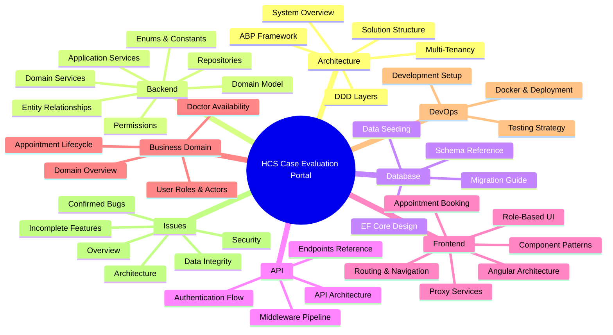
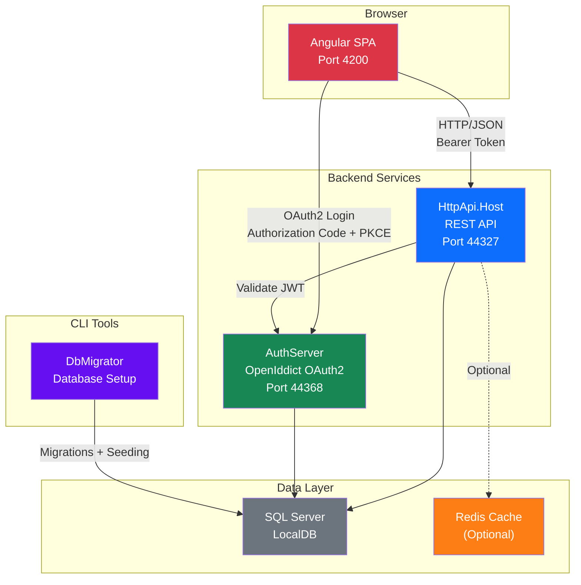

# HCS Case Evaluation Portal Documentation

> **Healthcare Support Case Evaluation Portal** -- A workers' compensation Independent Medical Examination (IME) scheduling platform built with .NET 10, Angular 20, and ABP Framework.

| Layer | Technology | Version |
|-------|-----------|---------|
| Backend Framework | ASP.NET Core / ABP Framework | .NET 10 / ABP 10.0.2 |
| Frontend | Angular (Standalone Components) | 20 |
| Database | SQL Server (EF Core) | LocalDB |
| Auth | OpenIddict (OAuth 2.0 / OIDC) | -- |
| UI Theme | LeptonX (Side Menu Layout) | 5.0.2 |
| Caching | Redis (optional) | -- |
| Object Mapping | Mapperly | -- |
| Logging | Serilog | 9.0 |

---

## Documentation Map

---

## Quick Navigation

### I want to...

| Goal | Start Here |
|------|-----------|
| **Get the 30-second summary (for managers)** | [Executive Summary](executive-summary.md) |
| **Get the app running locally** | [Getting Started](onboarding/GETTING-STARTED.md) |
| **Troubleshoot local dev failures** | [Local Dev Runbook](runbooks/LOCAL-DEV.md) |
| **Run the app in Docker** | [Docker Dev Runbook](runbooks/DOCKER-DEV.md) |
| **Find PHI data flows & threat model** | [Security Docs](security/THREAT-MODEL.md) |
| **See what decisions were made and why** | [Architecture Decision Records](decisions/README.md) |
| **Navigate the codebase structure** | [Repository Map](repo-map/README.md) |
| **Respond to a security incident** | [Incident Response](runbooks/INCIDENT-RESPONSE.md) |
| **See all known bugs and gaps** | [Issues Overview](issues/OVERVIEW.md) |
| **Understand what this app does** | [Business Domain Overview](business-domain/DOMAIN-OVERVIEW.md) |
| **Understand the architecture** | [System Architecture Overview](architecture/OVERVIEW.md) |
| **Learn about the database schema** | [Entity Relationships](backend/ENTITY-RELATIONSHIPS.md) |
| **See all API endpoints** | [Endpoints Reference](api/ENDPOINTS-REFERENCE.md) |
| **Understand the Angular frontend** | [Angular Architecture](frontend/ANGULAR-ARCHITECTURE.md) |
| **Add a new entity to the system** | [Common Tasks](onboarding/COMMON-TASKS.md) |
| **Understand multi-tenancy** | [Multi-Tenancy Strategy](architecture/MULTI-TENANCY.md) |
| **See the appointment booking flow** | [Appointment Booking Flow](frontend/APPOINTMENT-BOOKING-FLOW.md) |
| **Look up a term or concept** | [Glossary](GLOSSARY.md) |

---

## High-Level System Architecture

---

## Documentation by Section

### Getting Started
- [Executive Summary](executive-summary.md) -- Manager-friendly overview: purpose, stack, current state, risks
- [Getting Started](onboarding/GETTING-STARTED.md) -- From zero to running app with troubleshooting
- [Glossary](GLOSSARY.md) -- Domain and technical terminology

### Repository Map
- [Repository Map README](repo-map/README.md) -- How to read and regenerate the map
- [Repository Map Summary](repo-map/map.md) -- Top-ranked files, project dependency graph, stack detection
- [Repository Map Index (JSON)](repo-map/index.json) -- Machine-readable structural index

### Security
- [Threat Model](security/THREAT-MODEL.md) -- STRIDE analysis of Angular, API, AuthServer, SQL Server
- [PHI Data Flows](security/DATA-FLOWS.md) -- Where PHI lives, how it moves, cross-tenant risk
- [Authorization Matrix](security/AUTHORIZATION.md) -- Permissions, roles, endpoint mappings
- [Secrets Management](security/SECRETS-MANAGEMENT.md) -- How secrets are injected, gaps, rotation process
- [HIPAA Compliance Inventory](security/HIPAA-COMPLIANCE.md) -- Technical safeguards + HIPAA-readiness gaps

### Architecture Decisions
- [ADR Index](decisions/README.md) -- All architecture decision records with template

### Runbooks
- [Local Dev Troubleshooting](runbooks/LOCAL-DEV.md) -- Five most common local dev failures + fixes
- [Docker Dev Runbook](runbooks/DOCKER-DEV.md) -- Docker Compose setup, operations, troubleshooting
- [Incident Response](runbooks/INCIDENT-RESPONSE.md) -- PHI exposure playbook, investigation steps

### Verification
- [Documentation Baseline](verification/BASELINE.md) -- Structural + link check results and health score

### Architecture
- [System Architecture Overview](architecture/OVERVIEW.md) -- High-level system design, deployment topology, tech stack
- [DDD Layers](architecture/DDD-LAYERS.md) -- Domain-Driven Design layer responsibilities and dependency rules
- [ABP Framework Conventions](architecture/ABP-FRAMEWORK.md) -- ABP module system, base classes, and patterns
- [Multi-Tenancy Strategy](architecture/MULTI-TENANCY.md) -- Doctor-per-tenant design, host vs tenant data
- [Solution Structure](architecture/SOLUTION-STRUCTURE.md) -- All .csproj projects annotated

### Backend
- [Domain Model](backend/DOMAIN-MODEL.md) -- Entity index with links to per-feature CLAUDE.md details
- [Entity Relationships](backend/ENTITY-RELATIONSHIPS.md) -- Full ER diagram with foreign keys and cardinalities
- [Domain Services](backend/DOMAIN-SERVICES.md) -- Manager index with pattern and CLAUDE.md links
- [Application Services](backend/APPLICATION-SERVICES.md) -- AppService layer, DTO mapping, CRUD patterns
- [Repositories](backend/REPOSITORIES.md) -- Custom repository interfaces and EF Core implementations
- [Permissions](backend/PERMISSIONS.md) -- Complete permission tree and role-permission matrix
- [Enums & Constants](backend/ENUMS-AND-CONSTANTS.md) -- All enums with values, all max-length constants

### Database
- [EF Core Design](database/EF-CORE-DESIGN.md) -- Dual DbContext strategy, entity configuration
- [Schema Reference](database/SCHEMA-REFERENCE.md) -- Table naming, SQL type conventions, ABP system tables
- [Data Seeding](database/DATA-SEEDING.md) -- All seed contributors and what they create
- [Migration Guide](database/MIGRATION-GUIDE.md) -- Creating and running EF Core migrations

### API
- [API Architecture](api/API-ARCHITECTURE.md) -- Controller layer, Swagger, CORS, health checks
- [Endpoints Reference](api/ENDPOINTS-REFERENCE.md) -- All API endpoints grouped by entity
- [Authentication Flow](api/AUTHENTICATION-FLOW.md) -- OpenIddict OAuth2 sequence diagrams
- [Middleware & Pipeline](api/MIDDLEWARE-AND-PIPELINE.md) -- ASP.NET Core request pipeline, Serilog, Redis

### Frontend
- [Angular Architecture](frontend/ANGULAR-ARCHITECTURE.md) -- Standalone components, LeptonX theme, ABP packages
- [Component Patterns](frontend/COMPONENT-PATTERNS.md) -- Abstract/concrete pattern from ABP Suite
- [Routing & Navigation](frontend/ROUTING-AND-NAVIGATION.md) -- Route tree, guards, menu registration
- [Proxy Services](frontend/PROXY-SERVICES.md) -- Auto-generated API proxy layer
- [Appointment Booking Flow](frontend/APPOINTMENT-BOOKING-FLOW.md) -- Complex booking form deep-dive
- [Role-Based UI](frontend/ROLE-BASED-UI.md) -- External user experience, sidebar management

### Feature Documentation
- [Applicant Attorneys](features/applicant-attorneys/overview.md) -- Attorney firm/contact info, linked to IdentityUser accounts
- [Appointment Accessors](features/appointment-accessors/overview.md) -- View/Edit access grants per appointment
- [Appointment Applicant Attorneys](features/appointment-applicant-attorneys/overview.md) -- Join entity: Appointment ↔ Attorney ↔ User
- [Appointment Employer Details](features/appointment-employer-details/overview.md) -- Employer info per appointment
- [Appointment Languages](features/appointment-languages/overview.md) -- Host-scoped language lookup
- [Appointment Statuses](features/appointment-statuses/overview.md) -- Host-scoped status label lookup
- [Appointment Types](features/appointment-types/overview.md) -- Host-scoped IME type lookup, M2M with Doctor
- [Appointments](features/appointments/overview.md) -- IME scheduling, slot booking, 13-state lifecycle
- [Books](features/books/overview.md) -- Demo/sample entity from ABP scaffolding
- [Doctor Availabilities](features/doctor-availabilities/overview.md) -- Time slots, bulk generation, booking status tracking
- [Doctors](features/doctors/overview.md) -- IME physician profiles, M2M types/locations, tenant provisioning
- [Locations](features/locations/overview.md) -- Host-scoped exam locations, parking fees, doctor associations
- [Patients](features/patients/overview.md) -- Patient demographics, booking auto-creation, self-service profile
- [States](features/states/overview.md) -- Host-scoped US state lookup
- [WcabOffices](features/wcab-offices/overview.md) -- Host-scoped WCAB office lookup, Excel export

### Business Domain
- [Domain Overview](business-domain/DOMAIN-OVERVIEW.md) -- Workers' comp IME scheduling explained
- [Appointment Lifecycle](business-domain/APPOINTMENT-LIFECYCLE.md) -- 13-state status machine
- [Doctor Availability](business-domain/DOCTOR-AVAILABILITY.md) -- Slot generation and booking system
- [User Roles & Actors](business-domain/USER-ROLES-AND-ACTORS.md) -- All user roles and capabilities

### Onboarding
- [Getting Started](onboarding/GETTING-STARTED.md) -- From zero to running app: prerequisites, P: drive, database, startup, troubleshooting
- [Common Tasks](onboarding/COMMON-TASKS.md) -- Add entities, fields, migrations, tests, and Angular proxies with real code examples

### DevOps
- [Development Setup](devops/DEVELOPMENT-SETUP.md) -- Complete local development environment
- [Docker & Deployment](runbooks/DOCKER-DEV.md) -- Docker Compose setup, operations, troubleshooting
- [Testing Strategy](devops/TESTING-STRATEGY.md) -- Test projects, patterns, and infrastructure

### Issues & Technical Debt
- [Issues Overview](issues/OVERVIEW.md) -- Master index of all issues with severity ratings and open questions
- [Security Issues](issues/SECURITY.md) -- Committed secrets, PII logging, authorization gaps, CORS
- [Data Integrity Issues](issues/DATA-INTEGRITY.md) -- Race conditions, missing indexes, orphaned records, disconnected status model
- [Confirmed Bugs](issues/BUGS.md) -- Logic errors and broken behaviour with reproduction steps
- [Incomplete Features](issues/INCOMPLETE-FEATURES.md) -- Missing workflows, placeholder UI, no CI/CD, near-zero test coverage
- [Architecture & Code Quality](issues/ARCHITECTURE.md) -- Dead code, misplaced business logic, structural concerns
- [Test Evidence](issues/TEST-EVIDENCE.md) -- E2E test results mapping (258 tests, 2026-04-02)
- [Questions for Previous Developer](issues/QUESTIONS-FOR-PREVIOUS-DEVELOPER.md) -- 10 irreversible questions (legal, compliance, client identity, service accounts)
- [Technical Open Questions](issues/TECHNICAL-OPEN-QUESTIONS.md) -- 12 code-level unknowns resolvable from codebase or industry research
- [Test Catalog](devops/TEST-CATALOG.md) -- Complete test suite documentation (258 automated + 11 exploratory)
