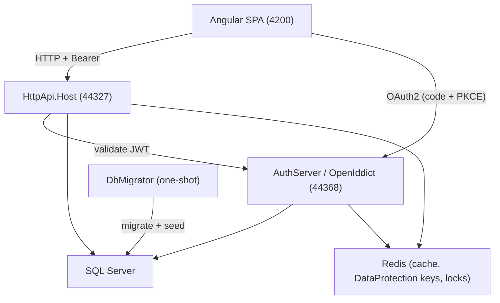

# Appointment Portal -- Documentation Index

> Purpose: map of the documentation tree. Audience: anyone onboarding to or navigating the repo.

Workers' compensation Independent Medical Examination (IME) scheduling platform on .NET 10,
Angular 20, and ABP Commercial. Per-layer and per-feature guidance lives in `CLAUDE.md` files
(mapped from the repo-root `CLAUDE.md`); this index maps the longer-form `docs/` references.

| Layer             | Technology                       | Version              |
| ----------------- | -------------------------------- | -------------------- |
| Backend framework | ASP.NET Core / ABP Commercial    | .NET 10 / ABP 10.0.2 |
| Frontend          | Angular (standalone components)  | 20                   |
| Database          | SQL Server (EF Core, code-first) | LocalDB / Docker     |
| Auth              | OpenIddict (OAuth 2.0 / OIDC)    | --                   |
| UI theme          | LeptonX (AuthServer pages; the SPA draws its own shell) | 5.x |
| Object mapping    | Riok.Mapperly                    | --                   |
| Background jobs   | Hangfire                         | --                   |
| Logging           | Serilog                          | --                   |

```mermaid
flowchart TB
    Angular["Angular SPA (4200)"] -->|"HTTP + Bearer"| API["HttpApi.Host (44327)"]
    Angular -->|"OAuth2 (code + PKCE)"| Auth["AuthServer / OpenIddict (44368)"]
    API -->|"validate JWT"| Auth
    API --> SQL["SQL Server"]
    API --> Redis["Redis (cache, DataProtection keys, locks)"]
    Auth --> SQL
    Auth --> Redis
    Migrator["DbMigrator (one-shot)"] -->|"migrate + seed"| SQL
```

---

## Start here

| Goal                                                      | Doc                                                            |
| --------------------------------------------------------- | -------------------------------------------------------------- |
| Run the app locally                                       | [Getting Started](onboarding/GETTING-STARTED.md)               |
| Common dev tasks (add an entity, field, migration, proxy) | [Common Tasks](onboarding/COMMON-TASKS.md)                     |
| Troubleshoot local dev                                    | [Local Dev Runbook](runbooks/LOCAL-DEV.md)                     |
| Run in Docker                                             | [Docker Dev Runbook](runbooks/DOCKER-DEV.md)                   |
| Understand the domain                                     | [Business Domain Overview](business-domain/DOMAIN-OVERVIEW.md) |
| Look up a term                                            | [Glossary](GLOSSARY.md)                                        |
| See why a decision was made                               | [Architecture Decision Records](decisions/README.md)           |
| Per-layer / per-feature coding rules                      | the nested `CLAUDE.md` files (see repo-root `CLAUDE.md` Map)   |

---

## Architecture

- [System Overview](architecture/OVERVIEW.md) -- topology, projects, ports
- [Tenancy and Isolation](architecture/TENANCY-AND-ISOLATION.md) -- **why** the boundary is built
  this way: why a caller cannot choose their own office, why the schema is declared twice, and why
  testing the control needs a decoy
- [Offices and Hosting](architecture/OFFICES-AND-HOSTING.md) -- **how** an office name becomes a
  slug, a database and a routed hostname; reserved slugs, the nginx routing table, and the two-file
  coupling a test guards
- [ABP Framework Conventions](architecture/ABP-FRAMEWORK.md) -- module system, base classes, Mapperly
- [Multi-Tenancy Strategy](architecture/MULTI-TENANCY.md) -- dual DbContext, host vs tenant entity classification

## Backend

- [Application Services](backend/APPLICATION-SERVICES.md) -- AppService layer, DTO mapping, orchestration
- [Permissions](backend/PERMISSIONS.md) -- permission tree and role matrix
- [Enums & Constants](backend/ENUMS-AND-CONSTANTS.md) -- enums, max-length constants, template codes

## Database

- [EF Core Design](database/EF-CORE-DESIGN.md) -- dual-DbContext strategy, inline entity configuration
- [Schema Reference](database/SCHEMA-REFERENCE.md) -- table naming, SQL type conventions, ABP tables
- [Data Seeding](database/DATA-SEEDING.md) -- seed contributors and what they create
- [Migration Guide](database/MIGRATION-GUIDE.md) -- creating + running EF Core migrations (host + tenant)

## API

- [API Architecture](api/API-ARCHITECTURE.md) -- manual controllers, route namespaces, Swagger
- [Authentication Flow](api/AUTHENTICATION-FLOW.md) -- OpenIddict OAuth2 sequences
- [Middleware & Pipeline](api/MIDDLEWARE-AND-PIPELINE.md) -- request pipeline, Serilog, Redis, health checks

## Frontend

- [Angular Architecture](frontend/ANGULAR-ARCHITECTURE.md) -- bootstrap, providers, feature directories
- [Component Patterns](frontend/COMPONENT-PATTERNS.md) -- custom standalone components, and the one remaining ABP Suite pair
- [Routing & Navigation](frontend/ROUTING-AND-NAVIGATION.md) -- route table, guards, the staff sidebar, and where a route's permission comes from
- [Appointment Booking Flow](frontend/APPOINTMENT-BOOKING-FLOW.md) -- the stepped booking wizard and its single submit call
- [Role-Based UI](frontend/ROLE-BASED-UI.md) -- how the router gives external users and staff different pages

## Business domain

- [Domain Overview](business-domain/DOMAIN-OVERVIEW.md) -- workers'-comp IME scheduling explained
- [Appointment Lifecycle](business-domain/APPOINTMENT-LIFECYCLE.md) -- status state machine
- [Doctor Availability](business-domain/DOCTOR-AVAILABILITY.md) -- slots, the capacity rule, bulk generation
- [User Roles & Actors](business-domain/USER-ROLES-AND-ACTORS.md) -- all roles and capabilities

## Security

- [Threat Model](security/THREAT-MODEL.md) -- STRIDE analysis across tiers
- [PHI Data Flows](security/DATA-FLOWS.md) -- where PHI lives, how it moves, SSN reveal egress
- [Authorization](security/AUTHORIZATION.md) -- permissions, roles, endpoint mappings
- [Session & Tokens](security/SESSION-AND-TOKENS.md) -- cookie/token inventory, logout, renewal
- [Session Key Encryption](security/SESSION-KEY-ENCRYPTION.md) -- DataProtection keys unencrypted at rest; open design work
- [Secrets Management](security/SECRETS-MANAGEMENT.md) -- secret locations, injection, gaps
- [HIPAA Compliance](security/HIPAA-COMPLIANCE.md) -- technical safeguards + readiness gaps

## Decisions (ADRs)

- [ADR Index](decisions/README.md) -- all architecture decision records (001-007) with the template

## Design

- [Design Index / Status](design/_status.md) -- per-feature design-doc tracker
- [Design Tokens](design/_design-tokens.md) -- brand colors/fonts for visual parity
- [Doc Template](design/_design-doc-template.md) -- skeleton for new design docs
- Per-feature design specs live in `design/*-design.md` (external-user flows, IT-admin config, clinic-staff ops)

## Operations

- [Backup and Restore](runbooks/hosting-backup-restore.md) -- **the one to find first in a
  disaster.** Was not linked from this index until 2026-09-28
- [Background Jobs](devops/BACKGROUND-JOBS.md) -- every recurring job, its schedule in PACIFIC
  time, the two switches that stop mail and integration, and both outboxes
- [Local Dev](runbooks/LOCAL-DEV.md) -- common local failures + fixes
- [Docker Dev](runbooks/DOCKER-DEV.md) -- compose setup, operations, troubleshooting
- [Hosting Local Verification](runbooks/hosting-local-verification.md) -- verifying a hosting
  change before it reaches the server
- [Database-per-Office Go-Live Isolation Gate](runbooks/database-per-office-go-live-isolation-gate.md)
  -- the isolation checks required before an office goes live
- [Demo Logins](runbooks/DEMO-LOGINS.md) -- seeded demo accounts. DEV ONLY; see the warning in
  the file itself before using any credential in it anywhere
- [Hardening Test Suite](runbooks/HARDENING-TEST-SUITE.md) -- security/regression checklist
- [Main-Worktree Userflow Testing](runbooks/MAIN-WORKTREE-USERFLOW-TESTING.md) -- manual userflow protocol
- [Case Tracker Feed Cutover](runbooks/case-tracker-feed-cutover.md) -- per-office switch from push to feed, and rollback
- **Open work is tracked in [GitHub Issues](https://github.com/gesco-healthcare-support/hcs-patient-portal/issues).** `findings/bugs/` keeps the
  reproduction and diagnosis for each finding and links its issue; it no longer records status.
- [Testing Strategy](devops/TESTING-STRATEGY.md) and [Test Coverage Status](testing/coverage-status.md)
  -- the latter names the commands that report test counts and coverage, and deliberately stores no
  figures of its own.

## Production readiness

Work aimed at making the portal safe to host publicly. Three research exercises feed one
remediation queue; the baselines below are the shared evidence they all draw on.

**Start at [Production Hardening](production-hardening/README.md)** -- the live execution record.
It carries the ordered phase queue, the current progress table, the triage log of findings ruled
out with evidence, and the reasoning behind the ordering. Anyone picking this work up should read
it before the research below.

- [System Architecture Baseline](architecture/SYSTEM-ARCHITECTURE-BASELINE.md) -- what the system
  is, measured rather than remembered
- [Runtime and Data Profile](devops/RUNTIME-AND-DATA-PROFILE.md) -- real sizes, volumes and
  runtime shape, measured on 2026-08-28 (a dated snapshot)
- [CI Tests and Checks](devops/CI-TESTS-AND-CHECKS.md) -- what the pipeline actually enforces
- [Code Standard Research](research/code-standard-2026-08-28/) -- exercise 1 (complete): gap
  analysis, [remediation plan](research/code-standard-2026-08-28/remediation-plan.md), and the
  [verification record](research/code-standard-2026-08-28/appendix-D-verification-record.md) of
  which findings survived being checked against this repo
- [System Design Research](research/system-design-2026-08-28/) -- exercise 2 (not yet run): the
  brief and deployment constraints for an independent architecture review

Exercise 3, platform selection, is deliberately deferred until exercise 2 produces vendor-neutral
requirements to score against.

## Legacy parity

- [Parity-v2 Index](parity-v2/INDEX.md) -- gap analysis (10 areas) vs the legacy app
- [Parity Review Log](parity-review-log.csv) -- decision register for each gap
- [Intentional Deviation Flags](parity/_parity-flags.md) -- bug-vs-design flags awaiting test

## Reference + meta

- [Repository Map](repo-map/README.md) -- structural map (regenerate via the documented script)
- Research notes live in `research/` -- dated investigations, including
  [proxy regen](research/proxy-regen-stringvalues-fix.md) (upstream tooling) and the two
  production-readiness exercises linked above
- [Engineering Roadmap](status-reports/ENGINEERING-ROADMAP.md) -- historical snapshot from
  2026-05-18, kept for the documents that cite it; not current status
- Plans are working files and are not committed: `plans/` is gitignored and holds only a `.gitkeep`
