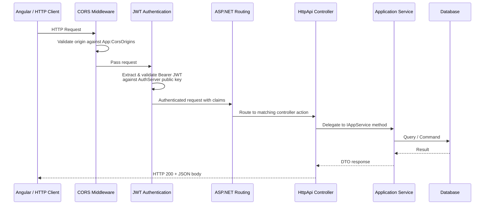
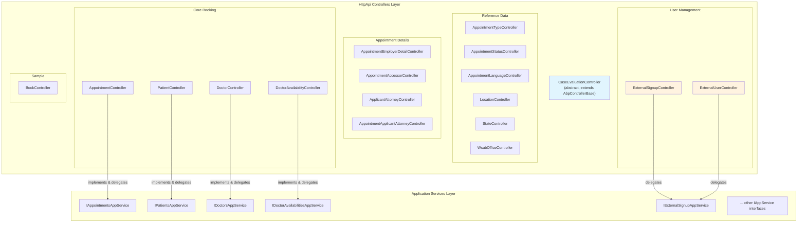

# API Architecture

[Home](../INDEX.md) > [API](./) > API Architecture

**Related:** [Endpoints Reference](ENDPOINTS-REFERENCE.md) | [Authentication Flow](AUTHENTICATION-FLOW.md) | [Middleware & Pipeline](MIDDLEWARE-AND-PIPELINE.md) | [Application Services](../backend/APPLICATION-SERVICES.md)

---

## Controller Pattern

Each controller in `src/HealthcareSupport.CaseEvaluation.HttpApi/Controllers/` is a thin pass-through that wraps the corresponding `IAppService` interface. Controllers contain no business logic; they delegate every call directly to the injected application service.

For example, `AppointmentController` implements `IAppointmentsAppService` and forwards every method:

```csharp
[RemoteService]
[Area("app")]
[ControllerName("Appointment")]
[Route("api/app/appointments")]
public class AppointmentController : AbpController, IAppointmentsAppService
{
    protected IAppointmentsAppService _appointmentsAppService;

    [HttpGet]
    public virtual Task<PagedResultDto<AppointmentWithNavigationPropertiesDto>> GetListAsync(GetAppointmentsInput input)
    {
        return _appointmentsAppService.GetListAsync(input);
    }
    // ... all other methods follow the same pattern
}
```

This pattern is consistent across all controllers in the project.

## Base Controller

`CaseEvaluationController` is the abstract base controller defined in `Controllers/CaseEvaluationController.cs`. It inherits from ABP's `AbpControllerBase` and sets the localization resource:

```csharp
public abstract class CaseEvaluationController : AbpControllerBase
{
    protected CaseEvaluationController()
    {
        LocalizationResource = typeof(CaseEvaluationResource);
    }
}
```

**Important distinction:** While `CaseEvaluationController` exists as the intended base, the actual feature controllers (AppointmentController, PatientController, etc.) inherit from `AbpController` directly and implement their respective `IAppService` interfaces. The `ExternalSignupController` also extends `AbpController`. This means `CaseEvaluationController` is available for custom controllers but is not used by the generated controllers.

## Standard Controller Attributes

Every feature controller uses these attributes:

| Attribute | Value | Purpose |
|-----------|-------|---------|
| `[RemoteService]` | _(default)_ | Marks controller as an ABP remote service endpoint |
| `[Area("app")]` | `"app"` | Groups all endpoints under the `app` API area |
| `[ControllerName("...")]` | Entity name | Used by ABP for route generation and service discovery |
| `[Route("api/app/...")]` | `"api/app/{kebab-case-name}"` | Explicit REST route prefix |

**Exception:** `ExternalSignupController` uses `[IgnoreAntiforgeryToken]` instead of `[RemoteService]` and routes under `api/public/external-signup` (not `api/app`).

## Swagger / OpenAPI

Swagger is configured in `CaseEvaluationHttpApiHostModule.ConfigureSwagger()` via `AbpSwashbuckleModule`:

- **Doc:** `v1` with title "CaseEvaluation API"
- **OIDC integration:** Uses `AddAbpSwaggerGenWithOidc` to enable OAuth2 authorization code flow in Swagger UI
- **Authority:** `AuthServer:Authority` (https://localhost:44368)
- **Scopes:** `["CaseEvaluation"]`
- **Swagger client:** `CaseEvaluation_Swagger` (configured via `AuthServer:SwaggerClientId` in appsettings.json)
- **Schema IDs:** Uses `type.FullName` for custom schema IDs to avoid naming collisions
- **Swagger UI endpoint:** `/swagger/v1/swagger.json`

## CORS

CORS is configured from `App:CorsOrigins` in `appsettings.json`:

```json
"CorsOrigins": "https://*.CaseEvaluation.com,http://localhost:4200,https://localhost:44368"
```

The configuration:
- Splits origins by comma
- Trims whitespace and trailing slashes
- Allows wildcard subdomains (`SetIsOriginAllowedToAllowWildcardSubdomains`)
- Allows any header and any HTTP method
- Allows credentials
- Exposes ABP-specific headers (`WithAbpExposedHeaders`)

In development, this permits the Angular app on `http://localhost:4200` and the AuthServer on `https://localhost:44368`.

## Health Checks

- **Endpoint:** `/health-status` (configured via `App:HealthCheckUrl`)
- **Health UI:** `/health-ui` with API at `/health-api`
- **Database check:** `CaseEvaluationDatabaseCheck` queries `IIdentityRoleRepository.GetListAsync(maxResultCount: 1)` to verify DB connectivity
- **Storage:** In-memory storage for health check UI data
- **Response format:** Uses `UIResponseWriter.WriteHealthCheckUIResponse` for structured JSON output

## API Conventions

ABP auto-generates endpoint routes from controller names and method names via conventional controllers:

```csharp
Configure<AbpAspNetCoreMvcOptions>(options =>
{
    options.ConventionalControllers.Create(typeof(CaseEvaluationApplicationModule).Assembly);
});
```

This means any `IAppService` implementation in the Application layer that is not explicitly wrapped by an HttpApi controller will still be exposed as an API endpoint automatically.

## Error Handling

ABP's exception handling middleware automatically converts exceptions to HTTP responses:

| Exception Type | HTTP Status | Description |
|---------------|-------------|-------------|
| `AbpAuthorizationException` | 403 Forbidden | User lacks required permission |
| `AbpValidationException` | 400 Bad Request | Input validation failed |
| `EntityNotFoundException` | 404 Not Found | Requested entity does not exist |
| `BusinessException` | 403 or custom | Domain-specific business rule violation |
| `AbpRemoteCallException` | 500 | Error calling remote service |
| Unhandled exceptions | 500 | Internal server error (details hidden in production) |

All error responses follow ABP's standard `RemoteServiceErrorResponse` JSON format with `error.code`, `error.message`, and `error.details` fields.

---

## Diagrams

### Request Flow Sequence



### Controller Layer Component Diagram



---

## Key Source Files

| File | Purpose |
|------|---------|
| `src/HealthcareSupport.CaseEvaluation.HttpApi/Controllers/CaseEvaluationController.cs` | Abstract base controller |
| `src/HealthcareSupport.CaseEvaluation.HttpApi/Controllers/Appointments/AppointmentController.cs` | Appointment endpoints |
| `src/HealthcareSupport.CaseEvaluation.HttpApi/Controllers/ExternalSignups/ExternalSignupController.cs` | Public registration endpoints |
| `src/HealthcareSupport.CaseEvaluation.HttpApi.Host/CaseEvaluationHttpApiHostModule.cs` | Host module (Swagger, CORS, auth config) |
| `src/HealthcareSupport.CaseEvaluation.HttpApi.Host/HealthChecks/CaseEvaluationDatabaseCheck.cs` | DB health check |
| `src/HealthcareSupport.CaseEvaluation.HttpApi.Host/HealthChecks/HealthChecksBuilderExtensions.cs` | Health check registration |
