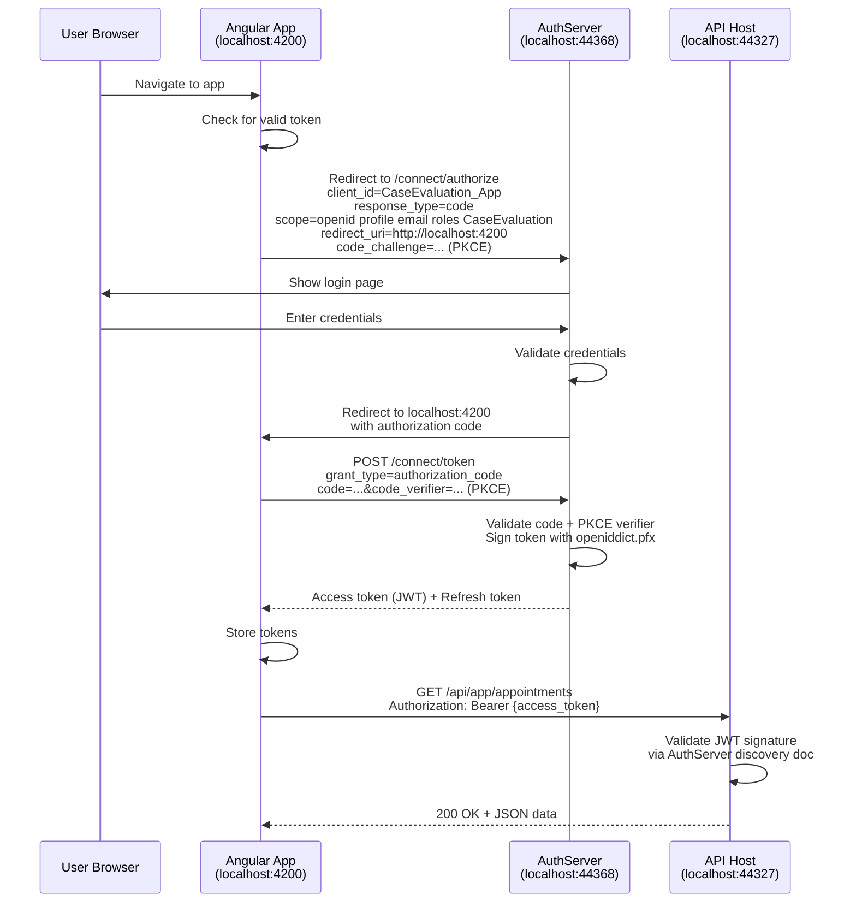
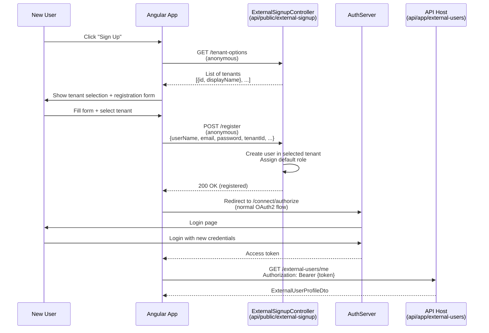
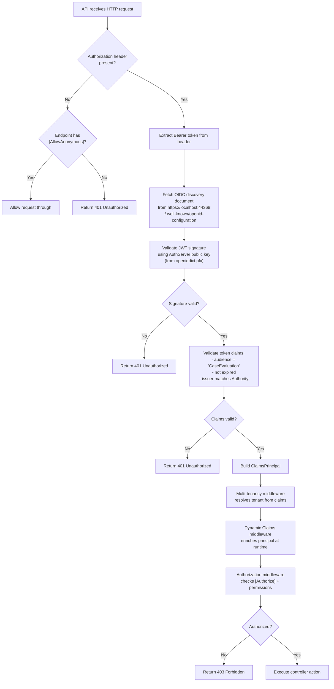

# Authentication Flow

[Home](../INDEX.md) > [API](./) > Authentication Flow

**Related:** [API Architecture](API-ARCHITECTURE.md) | [Middleware & Pipeline](MIDDLEWARE-AND-PIPELINE.md) | [Role-Based UI](../frontend/ROLE-BASED-UI.md) | [User Roles and Actors](../business-domain/USER-ROLES-AND-ACTORS.md)

---

## AuthServer

The authentication server is a separate ASP.NET Core MVC application running OpenIddict:

| Property | Value |
|----------|-------|
| **URL** | `https://localhost:44368` |
| **Framework** | OpenIddict (via ABP Commercial) |
| **Protocol** | OAuth 2.0 / OpenID Connect |
| **Certificate** | `openiddict.pfx` (passphrase in `AuthServer:CertificatePassPhrase`) |
| **Database** | Shared SQL Server database (`CaseEvaluation`) |

---

## Registered OAuth2 Clients

### CaseEvaluation_App (Angular SPA)

Configured in `OpenIddictDataSeedContributor.CreateApplicationsAsync()`:

| Property | Value |
|----------|-------|
| **Client ID** | `CaseEvaluation_App` (from config `OpenIddict:Applications:CaseEvaluation_App:ClientId`) |
| **Application Type** | Web |
| **Client Type** | Public (no secret) |
| **Consent Type** | Implicit (no consent screen) |
| **Display Name** | "Console Test / Angular Application" |
| **Grant Types** | `authorization_code`, `password`, `client_credentials`, `refresh_token`, `LinkLogin`, `Impersonation` |
| **Redirect URI** | `{RootUrl}` (typically `http://localhost:4200`) |
| **Post-Logout Redirect** | `{RootUrl}` |
| **Logo** | `/images/clients/angular.svg` |

### CaseEvaluation_Swagger (Swagger UI)

| Property | Value |
|----------|-------|
| **Client ID** | `CaseEvaluation_Swagger` (from config `OpenIddict:Applications:CaseEvaluation_Swagger:ClientId`) |
| **Application Type** | Web |
| **Client Type** | Public (no secret) |
| **Consent Type** | Implicit |
| **Display Name** | "Swagger Application" |
| **Grant Types** | `authorization_code` only |
| **Redirect URI** | `{RootUrl}/swagger/oauth2-redirect.html` (typically `https://localhost:44327/swagger/oauth2-redirect.html`) |
| **Client URI** | `{RootUrl}/swagger` |
| **Logo** | `/images/clients/swagger.svg` |

---

## Scopes

### API Scope

```
Name: CaseEvaluation
DisplayName: CaseEvaluation API
Resources: ["CaseEvaluation"]
```

### Common Scopes (shared by both clients)

| Scope | Source |
|-------|--------|
| `address` | OpenIddict standard |
| `email` | OpenIddict standard |
| `phone` | OpenIddict standard |
| `profile` | OpenIddict standard |
| `roles` | OpenIddict standard |
| `CaseEvaluation` | Custom API scope |

Additionally, the standard OIDC scopes `openid` and `offline_access` are available at the protocol level.

---

## Token Validation (API Host)

The API Host (`CaseEvaluationHttpApiHostModule`) validates incoming JWT tokens:

```csharp
context.Services.AddAuthentication(JwtBearerDefaults.AuthenticationScheme)
    .AddAbpJwtBearer(options =>
    {
        options.Authority = configuration["AuthServer:Authority"];  // https://localhost:44368
        options.RequireHttpsMetadata = true;
        options.Audience = "CaseEvaluation";
    });
```

- **Authority:** `https://localhost:44368` - the API host fetches the OIDC discovery document from `{Authority}/.well-known/openid-configuration`
- **Audience:** `CaseEvaluation` - tokens must contain this audience claim
- **HTTPS required:** `true` (enforced via `RequireHttpsMetadata`)
- **Dynamic claims:** Enabled via `AbpClaimsPrincipalFactoryOptions.IsDynamicClaimsEnabled = true` - allows runtime claim enrichment

---

## External User Registration

The `ExternalSignupController` provides anonymous endpoints for new user self-registration:

1. User calls `GET /api/public/external-signup/tenant-options` (anonymous) to list available tenants
2. User selects a tenant and submits `POST /api/public/external-signup/register` (anonymous) with `ExternalUserSignUpDto`
3. The service creates the user account with appropriate role under the selected tenant
4. User can then authenticate via the normal OAuth2 flow

After registration, the `GET /api/app/external-users/me` endpoint (authenticated) returns the user's profile.

---

## External Login Providers

The API Host configures dynamic external login providers:

| Provider | Configuration Properties |
|----------|------------------------|
| **Google** | `ClientId`, `ClientSecret` (secret) |
| **Microsoft** | `ClientId`, `ClientSecret` (secret) |
| **Twitter** | `ConsumerKey`, `ConsumerSecret` (secret) |

These are configured dynamically at runtime, allowing tenant-specific external login settings.

---

## Diagrams

### OAuth2 Authorization Code Flow (Angular SPA)



### External User Registration Sequence



### Token Validation Flow



---

## Key Source Files

| File | Purpose |
|------|---------|
| `src/HealthcareSupport.CaseEvaluation.Domain/OpenIddict/OpenIddictDataSeedContributor.cs` | Registers OAuth2 clients and scopes |
| `src/HealthcareSupport.CaseEvaluation.HttpApi.Host/CaseEvaluationHttpApiHostModule.cs` | JWT Bearer authentication config |
| `src/HealthcareSupport.CaseEvaluation.HttpApi.Host/appsettings.json` | AuthServer URL, SwaggerClientId |
| `src/HealthcareSupport.CaseEvaluation.AuthServer/appsettings.json` | AuthServer self-URL, certificate passphrase |
| `src/HealthcareSupport.CaseEvaluation.HttpApi/Controllers/ExternalSignups/ExternalSignupController.cs` | Anonymous registration endpoints |
| `src/HealthcareSupport.CaseEvaluation.HttpApi/Controllers/ExternalUsers/ExternalUserController.cs` | Authenticated external user profile |
