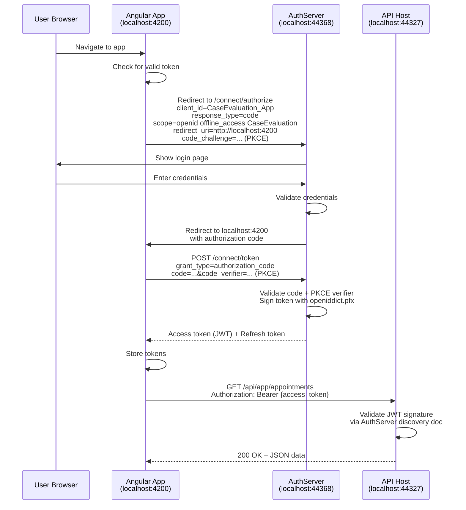
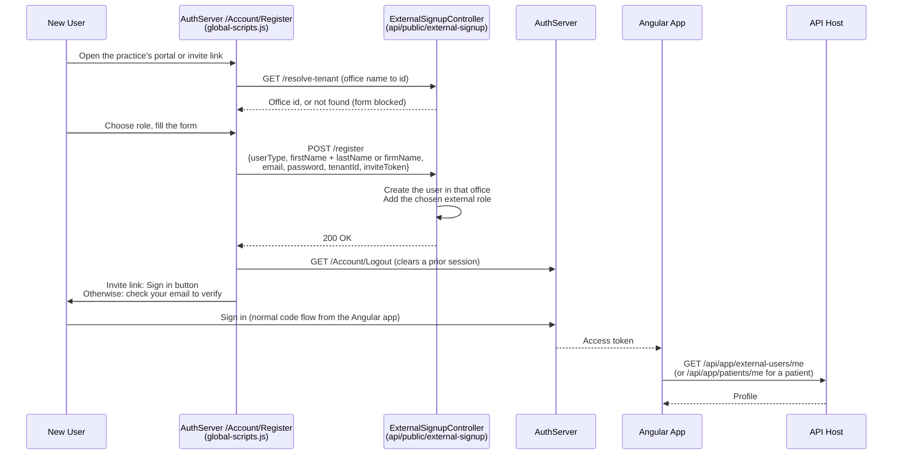
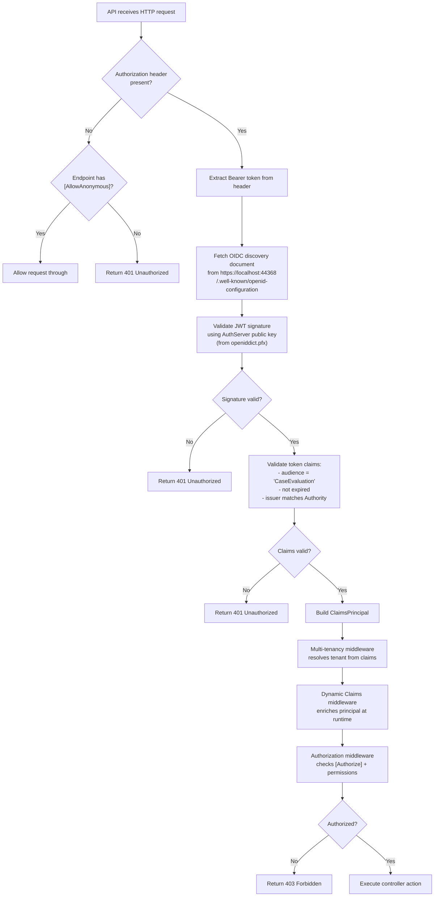

# Authentication Flow

> Purpose: Documents the OpenIddict OAuth2/OIDC authentication flow, registered clients, token validation, and external user registration. Audience: backend and frontend engineers.

[Home](../index.md) > [API](./) > Authentication Flow

**Related:** [API Architecture](API-ARCHITECTURE.md) | [Middleware & Pipeline](MIDDLEWARE-AND-PIPELINE.md) | [Role-Based UI](../frontend/ROLE-BASED-UI.md) | [User Roles and Actors](../business-domain/USER-ROLES-AND-ACTORS.md)

---

## AuthServer

The authentication server is a separate ASP.NET Core MVC application running OpenIddict:

| Property | Value |
|----------|-------|
| **URL** | `https://localhost:44368` |
| **Framework** | OpenIddict (via ABP Commercial) |
| **Protocol** | OAuth 2.0 / OpenID Connect |
| **Certificate** | `openiddict.pfx` (passphrase in `AuthServer:CertificatePassPhrase`) |
| **Database** | Shared SQL Server database (`CaseEvaluation`) |

---

## Registered OAuth2 Clients

### CaseEvaluation_App (Angular SPA)

Configured in `OpenIddictDataSeedContributor.CreateApplicationsAsync()`:

| Property | Value |
|----------|-------|
| **Client ID** | `CaseEvaluation_App` (from config `OpenIddict:Applications:CaseEvaluation_App:ClientId`) |
| **Application Type** | Web |
| **Client Type** | Public (no secret) |
| **Consent Type** | Implicit (no consent screen) |
| **Display Name** | "Console Test / Angular Application" |
| **Grant Types** | `authorization_code`, `client_credentials`, `refresh_token`, `LinkLogin`, `Impersonation` (the password grant was removed on 2026-05-19) |
| **Redirect URI** | `{RootUrl}` (typically `http://localhost:4200`) |
| **Post-Logout Redirect** | `{RootUrl}` |
| **Logo** | `/images/clients/angular.svg` |

### CaseEvaluation_Swagger (Swagger UI)

| Property | Value |
|----------|-------|
| **Client ID** | `CaseEvaluation_Swagger` (from config `OpenIddict:Applications:CaseEvaluation_Swagger:ClientId`) |
| **Application Type** | Web |
| **Client Type** | Public (no secret) |
| **Consent Type** | Implicit |
| **Display Name** | "Swagger Application" |
| **Grant Types** | `authorization_code` only |
| **Redirect URI** | `{RootUrl}/swagger/oauth2-redirect.html` (typically `https://localhost:44327/swagger/oauth2-redirect.html`) |
| **Client URI** | `{RootUrl}/swagger` |
| **Logo** | `/images/clients/swagger.svg` |

---

## Scopes

### API Scope

```text
Name: CaseEvaluation
DisplayName: CaseEvaluation API
Resources: ["CaseEvaluation"]
```

### Common Scopes (shared by both clients)

| Scope | Source |
|-------|--------|
| `address` | OpenIddict standard |
| `email` | OpenIddict standard |
| `phone` | OpenIddict standard |
| `profile` | OpenIddict standard |
| `roles` | OpenIddict standard |
| `CaseEvaluation` | Custom API scope |

Additionally, the standard OIDC scopes `openid` and `offline_access` are available at the protocol level.

---

## Token Validation (API Host)

The API Host (`CaseEvaluationHttpApiHostModule`) validates incoming JWT tokens:

```csharp
context.Services.AddAuthentication(JwtBearerDefaults.AuthenticationScheme)
    .AddAbpJwtBearer(options =>
    {
        options.Authority = configuration["AuthServer:Authority"];  // https://localhost:44368
        options.RequireHttpsMetadata = true;
        options.Audience = "CaseEvaluation";
    });
```

- **Authority:** `https://localhost:44368` - the API host fetches the OIDC discovery document from `{Authority}/.well-known/openid-configuration`
- **Audience:** `CaseEvaluation` - tokens must contain this audience claim
- **HTTPS required:** `true` (enforced via `RequireHttpsMetadata`)
- **Dynamic claims:** Enabled via `AbpClaimsPrincipalFactoryOptions.IsDynamicClaimsEnabled = true` - allows runtime claim enrichment

---

## External User Registration

The `ExternalSignupController` provides anonymous endpoints for new user self-registration:

1. User calls `GET /api/public/external-signup/tenant-options` (anonymous) to list available tenants
2. User selects a tenant and submits `POST /api/public/external-signup/register` (anonymous) with `ExternalUserSignUpDto`
3. The service creates the user account with appropriate role under the selected tenant
4. User can then authenticate via the normal OAuth2 flow

After registration, the `GET /api/app/external-users/me` endpoint (authenticated) returns the user's profile.

---

## External Login Providers

There are none. Google, Microsoft and Twitter sign-in were removed from the AuthServer, the only
login surface, on 2026-05-19: they were wired with per-office dynamic settings that were never
populated. The API host still registers dynamic options for them, but with no login surface they
are inert.

---

## Diagrams

### OAuth2 Authorization Code Flow (Angular SPA)


```mermaid
sequenceDiagram
    participant User as User Browser
    participant Angular as Angular App<br/>(localhost:4200)
    participant AuthServer as AuthServer<br/>(localhost:44368)
    participant API as API Host<br/>(localhost:44327)

    User->>Angular: Navigate to app
    Angular->>Angular: Check for valid token
    Angular->>AuthServer: Redirect to /connect/authorize<br/>client_id=CaseEvaluation_App<br/>response_type=code<br/>scope=openid offline_access CaseEvaluation<br/>redirect_uri=http://localhost:4200<br/>code_challenge=... (PKCE)
    AuthServer->>User: Show login page
    User->>AuthServer: Enter credentials
    AuthServer->>AuthServer: Validate credentials
    AuthServer->>Angular: Redirect to localhost:4200<br/>with authorization code
    Angular->>AuthServer: POST /connect/token<br/>grant_type=authorization_code<br/>code=...&code_verifier=... (PKCE)
    AuthServer->>AuthServer: Validate code + PKCE verifier<br/>Sign token with openiddict.pfx
    AuthServer-->>Angular: Access token (JWT) + Refresh token
    Angular->>Angular: Store tokens
    Angular->>API: GET /api/app/appointments<br/>Authorization: Bearer {access_token}
    API->>API: Validate JWT signature<br/>via AuthServer discovery doc
    API-->>Angular: 200 OK + JSON data
```

The scope shown is the local development one: `environment.ts` asks for `offline_access CaseEvaluation`, and
`angular-oauth2-oidc` adds `openid`. The Docker stack and the production image override it through
`dynamic-env.json` with `offline_access openid profile email phone CaseEvaluation`.

### External User Registration Sequence

Registration happens on the AuthServer's Razor `/Account/Register` page, not in the Angular app. The page's
script (`src/HealthcareSupport.CaseEvaluation.AuthServer/wwwroot/global-scripts.js`) adds the role and
name fields and posts to the API's anonymous sign-up endpoint. There is no office picker: the office comes
from the invite link's `?__tenant=` value, else the office subdomain, else the `__tenant` cookie, and the
form is blocked when none resolves.


```mermaid
sequenceDiagram
    participant User as New User
    participant Reg as AuthServer /Account/Register<br/>(global-scripts.js)
    participant Public as ExternalSignupController<br/>(api/public/external-signup)
    participant Auth as AuthServer
    participant App as Angular App
    participant API as API Host

    User->>Reg: Open the practice's portal or invite link
    Reg->>Public: GET /resolve-tenant (office name to id)
    Public-->>Reg: Office id, or not found (form blocked)
    User->>Reg: Choose role, fill the form
    Reg->>Public: POST /register<br/>{userType, firstName + lastName or firmName,<br/>email, password, tenantId, inviteToken}
    Public->>Public: Create the user in that office<br/>Add the chosen external role
    Public-->>Reg: 200 OK
    Reg->>Auth: GET /Account/Logout (clears a prior session)
    Reg->>User: Invite link: Sign in button<br/>Otherwise: check your email to verify
    User->>Auth: Sign in (normal code flow from the Angular app)
    Auth-->>App: Access token
    App->>API: GET /api/app/external-users/me<br/>(or /api/app/patients/me for a patient)
    API-->>App: Profile
```

An invite link's token confirms the email at registration, so that user can sign in at once; anyone else
must follow the verification link first (sign-in requires a confirmed email: `CaseEvaluationSettingDefinitionProvider` sets
`Abp.Identity.SignIn.RequireConfirmedEmail` to true).

### Token Validation Flow


```mermaid
flowchart TD
    A["API receives HTTP request"] --> B{"Authorization header<br/>present?"}
    B -->|No| C{"Endpoint has<br/>[AllowAnonymous]?"}
    C -->|Yes| D["Allow request through"]
    C -->|No| E["Return 401 Unauthorized"]
    
    B -->|Yes| F["Extract Bearer token from header"]
    F --> G["Fetch OIDC discovery document<br/>from https://localhost:44368<br/>/.well-known/openid-configuration"]
    G --> H["Validate JWT signature<br/>using AuthServer public key<br/>(from openiddict.pfx)"]
    H --> I{"Signature valid?"}
    I -->|No| J["Return 401 Unauthorized"]
    I -->|Yes| K["Validate token claims:<br/>- audience = 'CaseEvaluation'<br/>- not expired<br/>- issuer matches Authority"]
    K --> L{"Claims valid?"}
    L -->|No| M["Return 401 Unauthorized"]
    L -->|Yes| N["Build ClaimsPrincipal"]
    N --> O["Multi-tenancy middleware<br/>resolves tenant from claims"]
    O --> P["Dynamic Claims middleware<br/>enriches principal at runtime"]
    P --> Q["Authorization middleware<br/>checks [Authorize] + permissions"]
    Q --> R{"Authorized?"}
    R -->|No| S["Return 403 Forbidden"]
    R -->|Yes| T["Execute controller action"]
```

---

## Key Source Files

| File | Purpose |
|------|---------|
| `src/HealthcareSupport.CaseEvaluation.Domain/OpenIddict/OpenIddictDataSeedContributor.cs` | Registers OAuth2 clients and scopes |
| `src/HealthcareSupport.CaseEvaluation.HttpApi.Host/CaseEvaluationHttpApiHostModule.cs` | JWT Bearer authentication config |
| `src/HealthcareSupport.CaseEvaluation.HttpApi.Host/appsettings.json` | AuthServer URL, SwaggerClientId |
| `src/HealthcareSupport.CaseEvaluation.AuthServer/appsettings.json` | AuthServer self-URL, certificate passphrase |
| `src/HealthcareSupport.CaseEvaluation.HttpApi/Controllers/ExternalSignups/ExternalSignupController.cs` | Anonymous registration endpoints |
| `src/HealthcareSupport.CaseEvaluation.HttpApi/Controllers/ExternalUsers/ExternalUserController.cs` | Authenticated external user profile |
