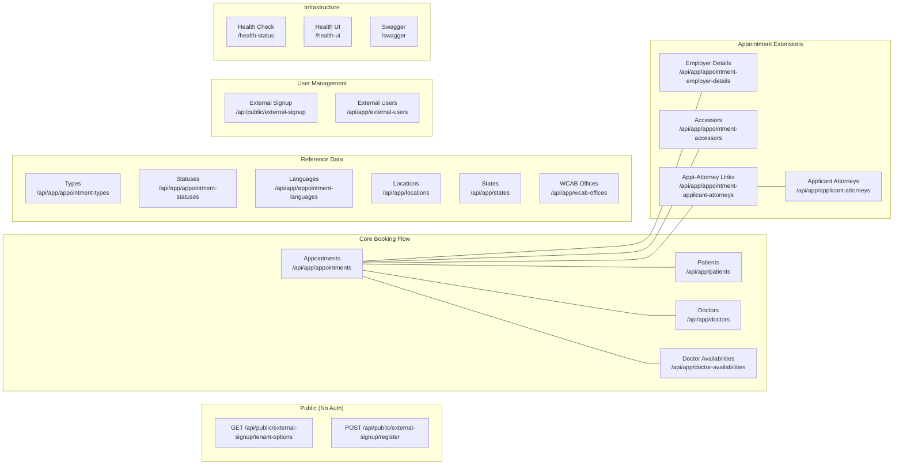

# Endpoints Reference

[Home](../INDEX.md) > [API](./) > Endpoints Reference

**Related:** [API Architecture](API-ARCHITECTURE.md) | [Application Services](../backend/APPLICATION-SERVICES.md) | [Proxy Services](../frontend/PROXY-SERVICES.md)

---

## Overview

All endpoints are derived from the actual controller source files in `src/HealthcareSupport.CaseEvaluation.HttpApi/Controllers/`. Unless noted otherwise, every endpoint requires Bearer authentication. The API host runs on `https://localhost:44327` in development.

---

## Appointments

**Route prefix:** `/api/app/appointments`
**Controller:** `AppointmentController` implements `IAppointmentsAppService`

| Method | Path | Description | Auth | Response Type |
|--------|------|-------------|------|---------------|
| GET | `/api/app/appointments` | List appointments (paged, filtered) | Bearer | `PagedResultDto<AppointmentWithNavigationPropertiesDto>` |
| GET | `/api/app/appointments/{id}` | Get single appointment | Bearer | `AppointmentDto` |
| GET | `/api/app/appointments/with-navigation-properties/{id}` | Get appointment with related entities | Bearer | `AppointmentWithNavigationPropertiesDto` |
| POST | `/api/app/appointments` | Create appointment | Bearer | `AppointmentDto` |
| PUT | `/api/app/appointments/{id}` | Update appointment | Bearer | `AppointmentDto` |
| DELETE | `/api/app/appointments/{id}` | Delete appointment | Bearer | _(void)_ |
| GET | `/api/app/appointments/patient-lookup` | Patient dropdown lookup | Bearer | `PagedResultDto<LookupDto<Guid>>` |
| GET | `/api/app/appointments/identity-user-lookup` | User dropdown lookup | Bearer | `PagedResultDto<LookupDto<Guid>>` |
| GET | `/api/app/appointments/appointment-type-lookup` | Appointment type dropdown | Bearer | `PagedResultDto<LookupDto<Guid>>` |
| GET | `/api/app/appointments/location-lookup` | Location dropdown | Bearer | `PagedResultDto<LookupDto<Guid>>` |
| GET | `/api/app/appointments/doctor-availability-lookup` | Availability slot dropdown | Bearer | `PagedResultDto<LookupDto<Guid>>` |
| GET | `/api/app/appointments/applicant-attorney-details-for-booking` | Get attorney details for booking | Bearer | `ApplicantAttorneyDetailsDto?` |
| GET | `/api/app/appointments/{appointmentId}/applicant-attorney` | Get linked attorney for appointment | Bearer | `ApplicantAttorneyDetailsDto?` |
| POST | `/api/app/appointments/{appointmentId}/applicant-attorney` | Create/update attorney link for appointment | Bearer | _(void)_ |

**Query parameters for GET list (`GetAppointmentsInput`):**
- `FilterText` (string) - text search
- `Sorting` (string) - e.g., "creationTime desc"
- `SkipCount` (int) - pagination offset
- `MaxResultCount` (int) - page size
- Entity-specific filters: date ranges, patient ID, doctor ID, status, type, location

**Query parameters for applicant-attorney-details-for-booking:**
- `identityUserId` (Guid?, optional)
- `email` (string?, optional)

---

## Patients

**Route prefix:** `/api/app/patients`
**Controller:** `PatientController` implements `IPatientsAppService`

| Method | Path | Description | Auth | Response Type |
|--------|------|-------------|------|---------------|
| GET | `/api/app/patients` | List patients (paged, filtered) | Bearer | `PagedResultDto<PatientWithNavigationPropertiesDto>` |
| GET | `/api/app/patients/{id}` | Get single patient | Bearer | `PatientDto` |
| GET | `/api/app/patients/with-navigation-properties/{id}` | Get patient with related entities | Bearer | `PatientWithNavigationPropertiesDto` |
| GET | `/api/app/patients/me` | Get current user's patient profile | Bearer | `PatientWithNavigationPropertiesDto` |
| PUT | `/api/app/patients/me` | Update current user's patient profile | Bearer | `PatientDto` |
| GET | `/api/app/patients/for-appointment-booking/{id}` | Get patient for appointment booking | Bearer | `PatientWithNavigationPropertiesDto` |
| GET | `/api/app/patients/for-appointment-booking/by-email` | Look up patient by email for booking | Bearer | `PatientWithNavigationPropertiesDto?` |
| POST | `/api/app/patients/for-appointment-booking/get-or-create` | Get or create patient for booking | Bearer | `PatientWithNavigationPropertiesDto` |
| PUT | `/api/app/patients/for-appointment-booking/{id}` | Update patient for booking | Bearer | `PatientDto` |
| POST | `/api/app/patients` | Create patient | Bearer | `PatientDto` |
| PUT | `/api/app/patients/{id}` | Update patient | Bearer | `PatientDto` |
| DELETE | `/api/app/patients/{id}` | Delete patient | Bearer | _(void)_ |
| GET | `/api/app/patients/state-lookup` | State dropdown | Bearer | `PagedResultDto<LookupDto<Guid>>` |
| GET | `/api/app/patients/appointment-language-lookup` | Language dropdown | Bearer | `PagedResultDto<LookupDto<Guid>>` |
| GET | `/api/app/patients/identity-user-lookup` | User dropdown | Bearer | `PagedResultDto<LookupDto<Guid>>` |
| GET | `/api/app/patients/tenant-lookup` | Tenant dropdown | Bearer | `PagedResultDto<LookupDto<Guid>>` |

**Query parameters for by-email:**
- `email` (string, required) - patient email address

---

## Doctors

**Route prefix:** `/api/app/doctors`
**Controller:** `DoctorController` implements `IDoctorsAppService`

| Method | Path | Description | Auth | Response Type |
|--------|------|-------------|------|---------------|
| GET | `/api/app/doctors` | List doctors (paged, filtered) | Bearer | `PagedResultDto<DoctorWithNavigationPropertiesDto>` |
| GET | `/api/app/doctors/{id}` | Get single doctor | Bearer | `DoctorDto` |
| GET | `/api/app/doctors/with-navigation-properties/{id}` | Get doctor with related entities | Bearer | `DoctorWithNavigationPropertiesDto` |
| POST | `/api/app/doctors` | Create doctor | Bearer | `DoctorDto` |
| PUT | `/api/app/doctors/{id}` | Update doctor | Bearer | `DoctorDto` |
| DELETE | `/api/app/doctors/{id}` | Delete doctor | Bearer | _(void)_ |
| GET | `/api/app/doctors/identity-user-lookup` | User dropdown | Bearer | `PagedResultDto<LookupDto<Guid>>` |
| GET | `/api/app/doctors/tenant-lookup` | Tenant dropdown | Bearer | `PagedResultDto<LookupDto<Guid>>` |
| GET | `/api/app/doctors/appointment-type-lookup` | Type dropdown | Bearer | `PagedResultDto<LookupDto<Guid>>` |
| GET | `/api/app/doctors/location-lookup` | Location dropdown | Bearer | `PagedResultDto<LookupDto<Guid>>` |

---

## Doctor Availabilities

**Route prefix:** `/api/app/doctor-availabilities`
**Controller:** `DoctorAvailabilityController` implements `IDoctorAvailabilitiesAppService`

| Method | Path | Description | Auth | Response Type |
|--------|------|-------------|------|---------------|
| GET | `/api/app/doctor-availabilities` | List availabilities (paged, filtered) | Bearer | `PagedResultDto<DoctorAvailabilityWithNavigationPropertiesDto>` |
| GET | `/api/app/doctor-availabilities/{id}` | Get single availability | Bearer | `DoctorAvailabilityDto` |
| GET | `/api/app/doctor-availabilities/with-navigation-properties/{id}` | Get with related entities | Bearer | `DoctorAvailabilityWithNavigationPropertiesDto` |
| POST | `/api/app/doctor-availabilities` | Create availability slot | Bearer | `DoctorAvailabilityDto` |
| PUT | `/api/app/doctor-availabilities/{id}` | Update availability slot | Bearer | `DoctorAvailabilityDto` |
| DELETE | `/api/app/doctor-availabilities/{id}` | Delete availability slot | Bearer | _(void)_ |
| DELETE | `/api/app/doctor-availabilities/by-slot` | Delete specific time slot | Bearer | _(void)_ |
| DELETE | `/api/app/doctor-availabilities/by-date` | Delete all slots for a date | Bearer | _(void)_ |
| POST | `/api/app/doctor-availabilities/preview` | Preview bulk slot generation | Bearer | `List<DoctorAvailabilitySlotsPreviewDto>` |
| GET | `/api/app/doctor-availabilities/location-lookup` | Location dropdown | Bearer | `PagedResultDto<LookupDto<Guid>>` |
| GET | `/api/app/doctor-availabilities/appointment-type-lookup` | Type dropdown | Bearer | `PagedResultDto<LookupDto<Guid>>` |

**Query parameters for DELETE by-slot (`DoctorAvailabilityDeleteBySlotInputDto`):**
- Passed via `[FromQuery]` - specific slot identification fields

**Query parameters for DELETE by-date (`DoctorAvailabilityDeleteByDateInputDto`):**
- Passed via `[FromQuery]` - date-based deletion fields

**Request body for POST preview:**
- `List<DoctorAvailabilityGenerateInputDto>` - bulk generation parameters

---

## External Signups (Public Registration)

**Route prefix:** `/api/public/external-signup`
**Controller:** `ExternalSignupController` (does NOT use `[RemoteService]`; uses `[IgnoreAntiforgeryToken]`)

| Method | Path | Description | Auth | Response Type |
|--------|------|-------------|------|---------------|
| GET | `/api/public/external-signup/tenant-options` | List available tenants | **AllowAnonymous** | `ListResultDto<LookupDto<Guid>>` |
| GET | `/api/public/external-signup/external-user-lookup` | Look up external users | Bearer | `ListResultDto<ExternalUserLookupDto>` |
| POST | `/api/public/external-signup/register` | Register new external user | **AllowAnonymous** | _(void)_ |

**Query parameters for tenant-options and external-user-lookup:**
- `filter` (string?, optional) - text filter

**Request body for POST register:**
- `ExternalUserSignUpDto` - user registration details

---

## External Users

**Route prefix:** `/api/app/external-users`
**Controller:** `ExternalUserController`

| Method | Path | Description | Auth | Response Type |
|--------|------|-------------|------|---------------|
| GET | `/api/app/external-users/me` | Get current external user profile | Bearer (`[Authorize]`) | `ExternalUserProfileDto` |

---

## Locations

**Route prefix:** `/api/app/locations`
**Controller:** `LocationController` implements `ILocationsAppService`

| Method | Path | Description | Auth | Response Type |
|--------|------|-------------|------|---------------|
| GET | `/api/app/locations` | List locations (paged, filtered) | Bearer | `PagedResultDto<LocationWithNavigationPropertiesDto>` |
| GET | `/api/app/locations/{id}` | Get single location | Bearer | `LocationDto` |
| GET | `/api/app/locations/with-navigation-properties/{id}` | Get with related entities | Bearer | `LocationWithNavigationPropertiesDto` |
| POST | `/api/app/locations` | Create location | Bearer | `LocationDto` |
| PUT | `/api/app/locations/{id}` | Update location | Bearer | `LocationDto` |
| DELETE | `/api/app/locations/{id}` | Delete single location | Bearer | _(void)_ |
| DELETE | `/api/app/locations` | Delete multiple by IDs | Bearer | _(void)_ |
| DELETE | `/api/app/locations/all` | Delete all matching filter | Bearer | _(void)_ |
| GET | `/api/app/locations/state-lookup` | State dropdown | Bearer | `PagedResultDto<LookupDto<Guid>>` |
| GET | `/api/app/locations/appointment-type-lookup` | Type dropdown | Bearer | `PagedResultDto<LookupDto<Guid>>` |

---

## States

**Route prefix:** `/api/app/states`
**Controller:** `StateController` implements `IStatesAppService`

| Method | Path | Description | Auth | Response Type |
|--------|------|-------------|------|---------------|
| GET | `/api/app/states` | List states (paged, filtered) | Bearer | `PagedResultDto<StateDto>` |
| GET | `/api/app/states/{id}` | Get single state | Bearer | `StateDto` |
| POST | `/api/app/states` | Create state | Bearer | `StateDto` |
| PUT | `/api/app/states/{id}` | Update state | Bearer | `StateDto` |
| DELETE | `/api/app/states/{id}` | Delete state | Bearer | _(void)_ |

---

## Appointment Types

**Route prefix:** `/api/app/appointment-types`
**Controller:** `AppointmentTypeController` implements `IAppointmentTypesAppService`

| Method | Path | Description | Auth | Response Type |
|--------|------|-------------|------|---------------|
| GET | `/api/app/appointment-types` | List types (paged, filtered) | Bearer | `PagedResultDto<AppointmentTypeDto>` |
| GET | `/api/app/appointment-types/{id}` | Get single type | Bearer | `AppointmentTypeDto` |
| POST | `/api/app/appointment-types` | Create type | Bearer | `AppointmentTypeDto` |
| PUT | `/api/app/appointment-types/{id}` | Update type | Bearer | `AppointmentTypeDto` |
| DELETE | `/api/app/appointment-types/{id}` | Delete type | Bearer | _(void)_ |

---

## Appointment Statuses

**Route prefix:** `/api/app/appointment-statuses`
**Controller:** `AppointmentStatusController` implements `IAppointmentStatusesAppService`

| Method | Path | Description | Auth | Response Type |
|--------|------|-------------|------|---------------|
| GET | `/api/app/appointment-statuses` | List statuses (paged, filtered) | Bearer | `PagedResultDto<AppointmentStatusDto>` |
| GET | `/api/app/appointment-statuses/{id}` | Get single status | Bearer | `AppointmentStatusDto` |
| POST | `/api/app/appointment-statuses` | Create status | Bearer | `AppointmentStatusDto` |
| PUT | `/api/app/appointment-statuses/{id}` | Update status | Bearer | `AppointmentStatusDto` |
| DELETE | `/api/app/appointment-statuses/{id}` | Delete single status | Bearer | _(void)_ |
| DELETE | `/api/app/appointment-statuses` | Delete multiple by IDs | Bearer | _(void)_ |
| DELETE | `/api/app/appointment-statuses/all` | Delete all matching filter | Bearer | _(void)_ |

---

## Appointment Languages

**Route prefix:** `/api/app/appointment-languages`
**Controller:** `AppointmentLanguageController` implements `IAppointmentLanguagesAppService`

| Method | Path | Description | Auth | Response Type |
|--------|------|-------------|------|---------------|
| GET | `/api/app/appointment-languages` | List languages (paged, filtered) | Bearer | `PagedResultDto<AppointmentLanguageDto>` |
| GET | `/api/app/appointment-languages/{id}` | Get single language | Bearer | `AppointmentLanguageDto` |
| POST | `/api/app/appointment-languages` | Create language | Bearer | `AppointmentLanguageDto` |
| PUT | `/api/app/appointment-languages/{id}` | Update language | Bearer | `AppointmentLanguageDto` |
| DELETE | `/api/app/appointment-languages/{id}` | Delete language | Bearer | _(void)_ |

---

## WCAB Offices

**Route prefix:** `/api/app/wcab-offices`
**Controller:** `WcabOfficeController` implements `IWcabOfficesAppService`

| Method | Path | Description | Auth | Response Type |
|--------|------|-------------|------|---------------|
| GET | `/api/app/wcab-offices` | List WCAB offices (paged, filtered) | Bearer | `PagedResultDto<WcabOfficeWithNavigationPropertiesDto>` |
| GET | `/api/app/wcab-offices/{id}` | Get single WCAB office | Bearer | `WcabOfficeDto` |
| GET | `/api/app/wcab-offices/with-navigation-properties/{id}` | Get with related entities | Bearer | `WcabOfficeWithNavigationPropertiesDto` |
| POST | `/api/app/wcab-offices` | Create WCAB office | Bearer | `WcabOfficeDto` |
| PUT | `/api/app/wcab-offices/{id}` | Update WCAB office | Bearer | `WcabOfficeDto` |
| DELETE | `/api/app/wcab-offices/{id}` | Delete single WCAB office | Bearer | _(void)_ |
| DELETE | `/api/app/wcab-offices` | Delete multiple by IDs | Bearer | _(void)_ |
| DELETE | `/api/app/wcab-offices/all` | Delete all matching filter | Bearer | _(void)_ |
| GET | `/api/app/wcab-offices/as-excel-file` | Export to Excel | Bearer | `IRemoteStreamContent` |
| GET | `/api/app/wcab-offices/download-token` | Get download token | Bearer | `DownloadTokenResultDto` |
| GET | `/api/app/wcab-offices/state-lookup` | State dropdown | Bearer | `PagedResultDto<LookupDto<Guid>>` |

---

## Appointment Employer Details

**Route prefix:** `/api/app/appointment-employer-details`
**Controller:** `AppointmentEmployerDetailController` implements `IAppointmentEmployerDetailsAppService`

| Method | Path | Description | Auth | Response Type |
|--------|------|-------------|------|---------------|
| GET | `/api/app/appointment-employer-details` | List employer details (paged) | Bearer | `PagedResultDto<AppointmentEmployerDetailWithNavigationPropertiesDto>` |
| GET | `/api/app/appointment-employer-details/{id}` | Get single | Bearer | `AppointmentEmployerDetailDto` |
| GET | `/api/app/appointment-employer-details/with-navigation-properties/{id}` | Get with relations | Bearer | `AppointmentEmployerDetailWithNavigationPropertiesDto` |
| POST | `/api/app/appointment-employer-details` | Create | Bearer | `AppointmentEmployerDetailDto` |
| PUT | `/api/app/appointment-employer-details/{id}` | Update | Bearer | `AppointmentEmployerDetailDto` |
| DELETE | `/api/app/appointment-employer-details/{id}` | Delete | Bearer | _(void)_ |
| GET | `/api/app/appointment-employer-details/appointment-lookup` | Appointment dropdown | Bearer | `PagedResultDto<LookupDto<Guid>>` |
| GET | `/api/app/appointment-employer-details/state-lookup` | State dropdown | Bearer | `PagedResultDto<LookupDto<Guid>>` |

---

## Appointment Accessors

**Route prefix:** `/api/app/appointment-accessors`
**Controller:** `AppointmentAccessorController` implements `IAppointmentAccessorsAppService`

| Method | Path | Description | Auth | Response Type |
|--------|------|-------------|------|---------------|
| GET | `/api/app/appointment-accessors` | List accessors (paged) | Bearer | `PagedResultDto<AppointmentAccessorWithNavigationPropertiesDto>` |
| GET | `/api/app/appointment-accessors/{id}` | Get single | Bearer | `AppointmentAccessorDto` |
| GET | `/api/app/appointment-accessors/with-navigation-properties/{id}` | Get with relations | Bearer | `AppointmentAccessorWithNavigationPropertiesDto` |
| POST | `/api/app/appointment-accessors` | Create | Bearer | `AppointmentAccessorDto` |
| PUT | `/api/app/appointment-accessors/{id}` | Update | Bearer | `AppointmentAccessorDto` |
| DELETE | `/api/app/appointment-accessors/{id}` | Delete | Bearer | _(void)_ |
| GET | `/api/app/appointment-accessors/identity-user-lookup` | User dropdown | Bearer | `PagedResultDto<LookupDto<Guid>>` |
| GET | `/api/app/appointment-accessors/appointment-lookup` | Appointment dropdown | Bearer | `PagedResultDto<LookupDto<Guid>>` |

---

## Applicant Attorneys

**Route prefix:** `/api/app/applicant-attorneys`
**Controller:** `ApplicantAttorneyController` implements `IApplicantAttorneysAppService`

| Method | Path | Description | Auth | Response Type |
|--------|------|-------------|------|---------------|
| GET | `/api/app/applicant-attorneys` | List attorneys (paged) | Bearer | `PagedResultDto<ApplicantAttorneyWithNavigationPropertiesDto>` |
| GET | `/api/app/applicant-attorneys/{id}` | Get single | Bearer | `ApplicantAttorneyDto` |
| GET | `/api/app/applicant-attorneys/with-navigation-properties/{id}` | Get with relations | Bearer | `ApplicantAttorneyWithNavigationPropertiesDto` |
| POST | `/api/app/applicant-attorneys` | Create | Bearer | `ApplicantAttorneyDto` |
| PUT | `/api/app/applicant-attorneys/{id}` | Update | Bearer | `ApplicantAttorneyDto` |
| DELETE | `/api/app/applicant-attorneys/{id}` | Delete | Bearer | _(void)_ |
| GET | `/api/app/applicant-attorneys/state-lookup` | State dropdown | Bearer | `PagedResultDto<LookupDto<Guid>>` |
| GET | `/api/app/applicant-attorneys/identity-user-lookup` | User dropdown | Bearer | `PagedResultDto<LookupDto<Guid>>` |

---

## Appointment Applicant Attorneys

**Route prefix:** `/api/app/appointment-applicant-attorneys`
**Controller:** `AppointmentApplicantAttorneyController` implements `IAppointmentApplicantAttorneysAppService`

| Method | Path | Description | Auth | Response Type |
|--------|------|-------------|------|---------------|
| GET | `/api/app/appointment-applicant-attorneys` | List links (paged) | Bearer | `PagedResultDto<AppointmentApplicantAttorneyWithNavigationPropertiesDto>` |
| GET | `/api/app/appointment-applicant-attorneys/{id}` | Get single | Bearer | `AppointmentApplicantAttorneyDto` |
| GET | `/api/app/appointment-applicant-attorneys/with-navigation-properties/{id}` | Get with relations | Bearer | `AppointmentApplicantAttorneyWithNavigationPropertiesDto` |
| POST | `/api/app/appointment-applicant-attorneys` | Create link | Bearer | `AppointmentApplicantAttorneyDto` |
| PUT | `/api/app/appointment-applicant-attorneys/{id}` | Update link | Bearer | `AppointmentApplicantAttorneyDto` |
| DELETE | `/api/app/appointment-applicant-attorneys/{id}` | Delete link | Bearer | _(void)_ |
| GET | `/api/app/appointment-applicant-attorneys/appointment-lookup` | Appointment dropdown | Bearer | `PagedResultDto<LookupDto<Guid>>` |
| GET | `/api/app/appointment-applicant-attorneys/applicant-attorney-lookup` | Attorney dropdown | Bearer | `PagedResultDto<LookupDto<Guid>>` |
| GET | `/api/app/appointment-applicant-attorneys/identity-user-lookup` | User dropdown | Bearer | `PagedResultDto<LookupDto<Guid>>` |

---

## Books (Sample/Demo)

**Route prefix:** `/api/app/book`
**Controller:** `BookController` implements `IBookAppService`

| Method | Path | Description | Auth | Response Type |
|--------|------|-------------|------|---------------|
| GET | `/api/app/book` | List books (paged, sorted) | Bearer | `PagedResultDto<BookDto>` |
| GET | `/api/app/book/{id}` | Get single book | Bearer | `BookDto` |
| POST | `/api/app/book` | Create book | Bearer | `BookDto` |
| PUT | `/api/app/book/{id}` | Update book | Bearer | `BookDto` |
| DELETE | `/api/app/book/{id}` | Delete book | Bearer | _(void)_ |

---

## Common Query Parameters

All list endpoints accept these standard ABP pagination parameters:

| Parameter | Type | Default | Description |
|-----------|------|---------|-------------|
| `FilterText` | string? | null | Free-text search across relevant fields |
| `Sorting` | string? | null | Sort expression, e.g., `"creationTime desc"` |
| `SkipCount` | int | 0 | Number of records to skip (pagination offset) |
| `MaxResultCount` | int | 10 | Page size (max typically 1000) |

Lookup endpoints accept `LookupRequestDto`:

| Parameter | Type | Description |
|-----------|------|-------------|
| `Filter` | string? | Text filter for dropdown search |
| `SkipCount` | int | Pagination offset |
| `MaxResultCount` | int | Page size |

---

## Endpoint Functional Area Map

---

## Key Source Files

| File | Purpose |
|------|---------|
| `src/HealthcareSupport.CaseEvaluation.HttpApi/Controllers/Appointments/AppointmentController.cs` | Appointment endpoints |
| `src/HealthcareSupport.CaseEvaluation.HttpApi/Controllers/Patients/PatientController.cs` | Patient endpoints |
| `src/HealthcareSupport.CaseEvaluation.HttpApi/Controllers/Doctors/DoctorController.cs` | Doctor endpoints |
| `src/HealthcareSupport.CaseEvaluation.HttpApi/Controllers/DoctorAvailabilities/DoctorAvailabilityController.cs` | Availability endpoints |
| `src/HealthcareSupport.CaseEvaluation.HttpApi/Controllers/ExternalSignups/ExternalSignupController.cs` | Public registration |
| `src/HealthcareSupport.CaseEvaluation.HttpApi/Controllers/ExternalUsers/ExternalUserController.cs` | External user profile |
| `src/HealthcareSupport.CaseEvaluation.HttpApi/Controllers/WcabOffices/WcabOfficeController.cs` | WCAB offices + Excel export |
