# Middleware & Pipeline

[Home](../INDEX.md) > [API](./) > Middleware & Pipeline

**Related:** [API Architecture](API-ARCHITECTURE.md) | [Authentication Flow](AUTHENTICATION-FLOW.md) | [Architecture Overview](../architecture/OVERVIEW.md)

---

## Middleware Pipeline Order

The middleware pipeline is configured in `CaseEvaluationHttpApiHostModule.OnApplicationInitialization()`. The order matters -- each middleware processes the request before passing it down and processes the response on the way back up.

```csharp
public override void OnApplicationInitialization(ApplicationInitializationContext context)
{
    var app = context.GetApplicationBuilder();
    var env = context.GetEnvironment();

    if (env.IsDevelopment())
    {
        app.UseDeveloperExceptionPage();          // 1
    }

    app.UseAbpRequestLocalization();               // 2
    app.UseRouting();                              // 3
    app.MapAbpStaticAssets();                      // 4
    app.UseAbpStudioLink();                        // 5
    app.UseAbpSecurityHeaders();                   // 6
    app.UseCors();                                 // 7
    app.UseAuthentication();                       // 8

    if (MultiTenancyConsts.IsEnabled)
    {
        app.UseMultiTenancy();                     // 9
    }

    app.UseUnitOfWork();                           // 10
    app.UseDynamicClaims();                        // 11
    app.UseAuthorization();                        // 12

    app.UseSwagger();                              // 13
    app.UseAbpSwaggerUI(options =>                 // 13
    {
        options.SwaggerEndpoint("/swagger/v1/swagger.json", "CaseEvaluation API");
        options.OAuthClientId(configuration["AuthServer:SwaggerClientId"]);
    });

    app.UseAuditing();                             // 14
    app.UseAbpSerilogEnrichers();                  // 15
    app.UseConfiguredEndpoints();                  // 16
}
```

### Pipeline Diagram

```mermaid
flowchart TD
    REQ["Incoming HTTP Request"] --> MW1

    MW1{"Development<br/>environment?"} -->|Yes| MW1a["1. Developer Exception Page<br/><i>Shows detailed error info with stack traces</i>"]
    MW1 -->|No| MW2
    MW1a --> MW2

    MW2["2. ABP Request Localization<br/><i>Sets culture from Accept-Language header,<br/>cookie, or query string</i>"]
    MW2 --> MW3

    MW3["3. Routing<br/><i>Matches request URL to endpoint routes</i>"]
    MW3 --> MW4

    MW4["4. ABP Static Assets<br/><i>Serves static files from virtual file system</i>"]
    MW4 --> MW5

    MW5["5. ABP Studio Link<br/><i>ABP Studio development tooling integration<br/>(disabled in production)</i>"]
    MW5 --> MW6

    MW6["6. ABP Security Headers<br/><i>Adds X-Content-Type-Options, X-XSS-Protection,<br/>X-Frame-Options headers</i>"]
    MW6 --> MW7

    MW7["7. CORS<br/><i>Validates Origin header against App:CorsOrigins<br/>Allows: localhost:4200, localhost:44368</i>"]
    MW7 --> MW8

    MW8["8. Authentication<br/><i>Validates JWT Bearer token from<br/>Authorization header via OpenIddict</i>"]
    MW8 --> MW9

    MW9{"Multi-tenancy<br/>enabled?"} -->|Yes| MW9a["9. Multi-Tenancy<br/><i>Resolves tenant from token claims,<br/>header, or query string</i>"]
    MW9 -->|No| MW10
    MW9a --> MW10

    MW10["10. Unit of Work<br/><i>Wraps request in DB transaction,<br/>auto-commits on success</i>"]
    MW10 --> MW11

    MW11["11. Dynamic Claims<br/><i>Enriches ClaimsPrincipal with runtime claims<br/>(permissions, roles) from DB</i>"]
    MW11 --> MW12

    MW12["12. Authorization<br/><i>Enforces [Authorize] attributes and<br/>ABP permission checks</i>"]
    MW12 --> MW13

    MW13["13. Swagger / Swagger UI<br/><i>Serves OpenAPI spec at /swagger/v1/swagger.json<br/>and UI at /swagger</i>"]
    MW13 --> MW14

    MW14["14. Auditing<br/><i>Records audit logs for API calls<br/>(who, when, what changed)</i>"]
    MW14 --> MW15

    MW15["15. Serilog Enrichers<br/><i>Enriches log entries with request context<br/>(user, tenant, correlation ID)</i>"]
    MW15 --> MW16

    MW16["16. Configured Endpoints<br/><i>Maps controller actions, health checks,<br/>and other registered endpoints</i>"]
    MW16 --> RESP["Response"]
```



---

## Serilog Configuration

Logging is configured in `Program.cs` with both a bootstrap logger and a full logger.

### Bootstrap Logger (before host starts)

```csharp
Log.Logger = new LoggerConfiguration()
    .WriteTo.Async(c => c.File("Logs/logs.txt"))
    .WriteTo.Async(c => c.Console())
    .CreateBootstrapLogger();
```

### Full Logger (after host configuration)

```csharp
builder.Host.UseSerilog((context, services, loggerConfiguration) =>
{
    loggerConfiguration
    #if DEBUG
        .MinimumLevel.Debug()
    #else
        .MinimumLevel.Information()
    #endif
        .MinimumLevel.Override("Microsoft", LogEventLevel.Information)
        .MinimumLevel.Override("Microsoft.EntityFrameworkCore", LogEventLevel.Warning)
        .Enrich.FromLogContext()
        .WriteTo.Async(c => c.File("Logs/logs.txt"))
        .WriteTo.Async(c => c.Console())
        .WriteTo.Async(c => c.AbpStudio(services));
});
```

| Setting | Value |
|---------|-------|
| **File output** | `Logs/logs.txt` (async) |
| **Console output** | Async |
| **ABP Studio sink** | Async (for ABP Studio live log viewer) |
| **Minimum level (Debug)** | `Debug` |
| **Minimum level (Release)** | `Information` |
| **Microsoft override** | `Information` (reduces framework noise) |
| **EF Core override** | `Warning` (suppresses SQL query logs unless warning+) |
| **Enrichment** | `FromLogContext` + ABP Serilog enrichers (user, tenant, correlation ID) |

---

## Redis Configuration

Redis is optional and disabled by default:

```json
"Redis": {
    "Configuration": "127.0.0.1",
    "IsEnabled": false
}
```

When enabled, Redis is used for:

| Feature | Implementation | Details |
|---------|---------------|---------|
| **Distributed Cache** | `AbpCachingStackExchangeRedisModule` | Key prefix: `CaseEvaluation:` |
| **Distributed Locking** | `Medallion.Threading.Redis` (`RedisDistributedSynchronizationProvider`) | Prevents concurrent operations |
| **Data Protection Keys** | `PersistKeysToStackExchangeRedis` | Key: `CaseEvaluation-Protection-Keys` (non-development only) |

In development without Redis, ABP falls back to in-memory caching and local data protection key storage.

---

## Health Checks

Configured in `HealthChecksBuilderExtensions.AddCaseEvaluationHealthChecks()`:

| Endpoint | Purpose |
|----------|---------|
| `/health-status` | Health check endpoint (JSON format via `UIResponseWriter`) |
| `/health-ui` | Health checks dashboard UI |
| `/health-api` | Health checks API for the UI |

### Database Check

`CaseEvaluationDatabaseCheck` implements `IHealthCheck`:

```csharp
public async Task<HealthCheckResult> CheckHealthAsync(...)
{
    await IdentityRoleRepository.GetListAsync(
        sorting: nameof(IdentityRole.Id),
        maxResultCount: 1,
        cancellationToken: cancellationToken);
    return HealthCheckResult.Healthy("Could connect to database and get record.");
}
```

- Queries `IIdentityRoleRepository` with `maxResultCount: 1` as a lightweight connectivity test
- Returns `Healthy` if the query succeeds, `Unhealthy` with exception details if it fails
- Tagged as `"database"` for filtering
- Health check UI data stored in-memory (`AddInMemoryStorage`)

---

## String Encryption

```json
"StringEncryption": {
    "DefaultPassPhrase": "REPLACE_ME_LOCALLY"
}
```

ABP uses this passphrase for encrypting sensitive configuration values stored in the database (e.g., external login provider secrets). The `IStringEncryptionService` uses AES encryption with this key.

---

## PII Logging

```json
"App": {
    "DisablePII": false
}
```

When `DisablePII` is `false` (the development default):
- `IdentityModelEventSource.ShowPII = true` -- shows personally identifiable information in authentication error messages
- `IdentityModelEventSource.LogCompleteSecurityArtifact = true` -- logs full tokens in error scenarios

This should be set to `true` in production environments.

---

## ABP Module Composition

`CaseEvaluationHttpApiHostModule` depends on these modules via `[DependsOn]`:

| Module | Purpose |
|--------|---------|
| `CaseEvaluationHttpApiModule` | Controller layer (the HttpApi project) |
| `CaseEvaluationApplicationModule` | Application services (business logic) |
| `CaseEvaluationEntityFrameworkCoreModule` | EF Core, DB context, repositories |
| `AbpAutofacModule` | Autofac dependency injection container |
| `AbpStudioClientAspNetCoreModule` | ABP Studio development integration |
| `AbpCachingStackExchangeRedisModule` | Redis-based distributed caching |
| `AbpDistributedLockingModule` | Distributed locking abstraction |
| `AbpAspNetCoreMvcUiMultiTenancyModule` | Multi-tenant UI support |
| `AbpIdentityAspNetCoreModule` | ASP.NET Core Identity integration |
| `AbpSwashbuckleModule` | Swagger/OpenAPI generation |
| `AbpAspNetCoreSerilogModule` | Serilog integration for ASP.NET Core |

### ConfigureServices Pipeline

The `ConfigureServices` method registers these features in order:

1. **PII logging** - Conditional based on `App:DisablePII`
2. **ABP Studio** - Link disabled in production
3. **URLs** - Angular app URLs for password reset and email confirmation
4. **Conventional controllers** - Auto-generates API from Application module
5. **Authentication** - JWT Bearer with OpenIddict
6. **Swagger** - OpenAPI with OIDC integration
7. **Cache** - Distributed cache with `CaseEvaluation:` key prefix
8. **Virtual file system** - Physical file overrides in development
9. **Data protection** - Redis key storage in non-development
10. **Distributed locking** - Redis-based via Medallion.Threading
11. **CORS** - Origins from `App:CorsOrigins`
12. **External providers** - Google, Microsoft, Twitter dynamic login
13. **Health checks** - Database connectivity check
14. **Permission management** - Dynamic permission store enabled

---

## Key Source Files

| File | Purpose |
|------|---------|
| `src/HealthcareSupport.CaseEvaluation.HttpApi.Host/CaseEvaluationHttpApiHostModule.cs` | Host module: middleware pipeline + service configuration |
| `src/HealthcareSupport.CaseEvaluation.HttpApi.Host/Program.cs` | Entry point, Serilog bootstrap and full logger setup |
| `src/HealthcareSupport.CaseEvaluation.HttpApi.Host/appsettings.json` | All configuration values |
| `src/HealthcareSupport.CaseEvaluation.HttpApi.Host/HealthChecks/CaseEvaluationDatabaseCheck.cs` | Database health check implementation |
| `src/HealthcareSupport.CaseEvaluation.HttpApi.Host/HealthChecks/HealthChecksBuilderExtensions.cs` | Health check registration and endpoint mapping |
