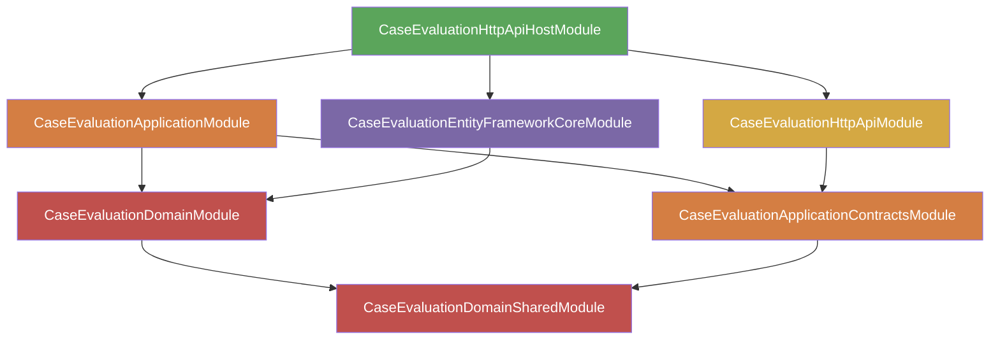
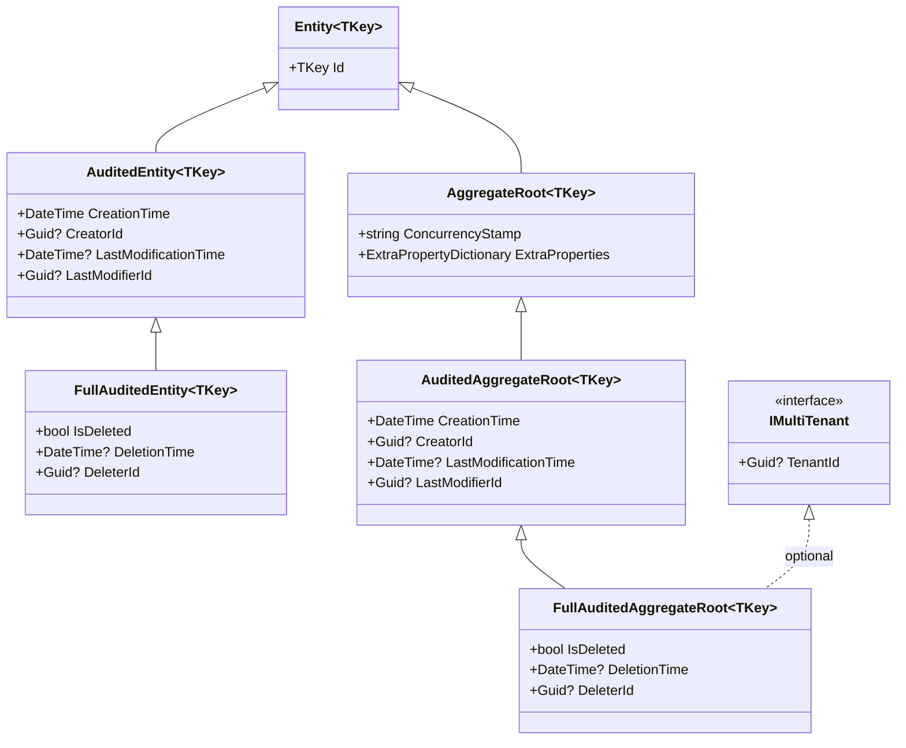
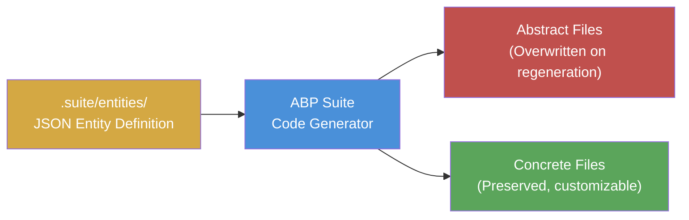

[Home](../INDEX.md) > [Architecture](./) > ABP Framework

# ABP Framework Conventions

ABP Framework (Volo.Abp) is a complete application framework built on top of ASP.NET Core. Note: ABP Framework is the successor to the older ASP.NET Boilerplate — they are different products. It provides a module system, multi-tenancy, permission management, audit logging, localization, identity management, and more. The HCS Case Evaluation Portal uses **ABP 10.0.2** with a **Commercial license**.

This document describes ABP conventions and patterns used throughout the codebase.

---

## Module System

Every project in the solution has a `*Module.cs` class that declares its dependencies via the `[DependsOn]` attribute. ABP uses this to build a dependency graph and initialize modules in the correct order.

### Module Dependency Chain



### Module Lifecycle Methods

Each module class provides two key methods:

| Method | Purpose |
|---|---|
| `ConfigureServices()` | Registers services, configures options, sets up DI bindings |
| `OnApplicationInitialization()` | Configures the middleware pipeline (routing, auth, CORS, etc.) |

ABP calls `ConfigureServices()` on all modules first (in dependency order), then calls `OnApplicationInitialization()` on all modules.

---

## Entity Base Class Hierarchy

ABP provides a layered hierarchy of entity base classes. Each level adds more infrastructure behavior.

### Class Diagram



### Which Entities Use Which Base Class

| Base Class | Entities |
|---|---|
| `FullAuditedAggregateRoot<Guid>` | Most entities (Appointment, Doctor, Location, Patient, etc.) |
| `FullAuditedEntity<Guid>` | AppointmentType, AppointmentStatus, AppointmentLanguage, AppointmentAccessor |
| `AuditedAggregateRoot<Guid>` | Book |
| `Entity` (no audit) | DoctorAppointmentType, DoctorLocation (junction tables) |

**Rule of thumb:** If it is an aggregate root with full lifecycle tracking, use `FullAuditedAggregateRoot<Guid>`. If it is a lookup entity owned by an aggregate, use `FullAuditedEntity<Guid>`. If it is a junction table, use plain `Entity`.

---

## IMultiTenant Interface

Adding the `IMultiTenant` interface to an entity causes ABP to:

1. Add a `Guid? TenantId` property to the entity.
2. Automatically apply a global EF Core query filter: `WHERE TenantId = @currentTenantId` on every query.
3. Automatically set `TenantId` to the current tenant when inserting new records.

This means tenant isolation is enforced at the framework level -- application code never needs to filter by tenant manually. See [Multi-Tenancy](MULTI-TENANCY.md) for the full tenant isolation strategy.

---

## Automatic Soft Delete

Entities that inherit from `FullAudited*` base classes implement the `ISoftDelete` interface. ABP handles soft delete automatically:

- **On delete:** ABP sets `IsDeleted = true`, `DeletionTime = now`, and `DeleterId = currentUserId`. The row is never physically removed from the database.
- **On query:** ABP applies a global EF Core filter: `WHERE IsDeleted = 0`. Deleted records are invisible to normal queries.
- **Disabling the filter:** In rare cases, `IDataFilter<ISoftDelete>` can be used to temporarily disable the filter and query deleted records.

---

## ConfigureByConvention()

When configuring entities in EF Core (`DbContext.OnModelCreating`), calling `builder.ConfigureByConvention()` on an entity automatically configures:

- **ID column** -- Primary key mapping
- **ConcurrencyStamp** -- Optimistic concurrency (for aggregate roots)
- **ExtraProperties** -- JSON column for extra data (for aggregate roots)
- **Audit columns** -- CreationTime, CreatorId, LastModificationTime, LastModifierId, IsDeleted, DeletionTime, DeleterId
- **TenantId** -- Multi-tenant discriminator column

No manual Fluent API configuration is needed for these columns. Custom Fluent API configuration is only needed for navigation properties, indexes, and domain-specific constraints.

---

## Repository Pattern

ABP provides a generic repository that works out of the box for basic CRUD. Custom repositories are created only when additional query methods are needed.

### Generic Repository

```csharp
// Injected automatically -- no registration needed
IRepository<Appointment, Guid>
```

Provides: `GetAsync`, `GetListAsync`, `InsertAsync`, `UpdateAsync`, `DeleteAsync`, `GetCountAsync`, `GetPagedListAsync`.

### Custom Repository

```csharp
// Interface (in Domain layer)
public interface IAppointmentRepository : IRepository<Appointment, Guid>
{
    Task<List<Appointment>> GetListWithDetailsAsync(...);
}

// Implementation (in EntityFrameworkCore layer)
public class EfCoreAppointmentRepository
    : EfCoreRepository<CaseEvaluationDbContext, Appointment, Guid>,
      IAppointmentRepository
{
    public async Task<List<Appointment>> GetListWithDetailsAsync(...)
    {
        // Custom EF Core query with .Include() etc.
    }
}
```

The interface lives in the Domain layer. The implementation lives in the EntityFrameworkCore (infrastructure) layer. ABP's DI conventions register the implementation automatically.

---

## Application Service Pattern

Application services are the primary API for use cases. They coordinate between the domain layer and infrastructure.

### Base Class

All application services inherit from `CaseEvaluationAppService`, which extends ABP's `ApplicationService`. This provides:

| Member | Purpose |
|---|---|
| `L["Key"]` | Localized string lookup |
| `CurrentUser` | Current authenticated user info |
| `CurrentTenant` | Current tenant info |
| `ObjectMapper` | DTO-to-entity mapping |
| `GuidGenerator` | Sequential GUID generation for database performance |

### Authorization

Permissions are enforced declaratively via attributes:

```csharp
[Authorize(CaseEvaluationPermissions.Appointments.Create)]
public async Task<AppointmentDto> CreateAsync(CreateAppointmentDto input)
{
    // Only users with the Appointments.Create permission can call this
}
```

---

## Mapperly DTO Mapping

Instead of ABP's default AutoMapper, this project uses **Mapperly** -- a compile-time source generator for object mapping.

Mappings are declared in `CaseEvaluationApplicationMappers.cs`:

```csharp
[Mapper]
public static partial class CaseEvaluationApplicationMappers
{
    public static partial AppointmentDto Map(Appointment source);

    static partial void AfterMap(Appointment source, AppointmentDto target)
    {
        // Set display names from navigation properties
        target.DoctorName = source.Doctor?.Name;
    }
}
```

**Key difference from AutoMapper:** Mapperly generates mapping code at compile time, so there is no reflection overhead at runtime. Unmapped properties produce compiler warnings, catching mapping issues early.

---

## Localization

ABP provides a localization system backed by JSON resource files.

### Backend

```csharp
L["AppointmentCreated"]  // Returns the localized string for the current culture
```

### Frontend (Angular)

```html
{{ '::AppointmentCreated' | abpLocalization }}
```

The `::` prefix tells ABP to look in the application's own localization resources (as opposed to a specific module's resources).

### Resource Files

Localization JSON files are located in:

```
Domain.Shared/Localization/CaseEvaluation/en.json
Domain.Shared/Localization/CaseEvaluation/es.json
```

---

## ABP Suite Code Generation

ABP Suite is a code generation tool that scaffolds full CRUD for a new entity. The project stores entity definitions as JSON files.

### Generation Flow



### Abstract / Concrete Pattern

Suite generates pairs of files using an abstract/concrete pattern:

| File Type | Regeneration Behavior | Example |
|---|---|---|
| **Abstract** (base class) | Overwritten every time Suite runs | `AppointmentsAppServiceBase.cs` |
| **Concrete** (derived class) | Created once, never overwritten | `AppointmentsAppService.cs` |

**Customization rule:** Always put custom logic in the concrete (derived) class. Never edit the abstract (base) class directly -- your changes will be lost on the next Suite regeneration.

This pattern applies to:
- Application services (AppService base + concrete)
- Angular components (abstract component + concrete component)
- Repository implementations
- DTOs

---

## Permission System

Permissions control access to every operation in the system.

### Definition

Permissions are defined as static string constants in `CaseEvaluationPermissions.cs`:

```csharp
public static class Appointments
{
    public const string Default = GroupName + ".Appointments";
    public const string Create = Default + ".Create";
    public const string Edit = Default + ".Edit";
    public const string Delete = Default + ".Delete";
}
```

### Registration

Permissions are registered in `CaseEvaluationPermissionDefinitionProvider.cs`, which defines the permission tree that appears in the ABP permission management UI.

### Enforcement

| Layer | Mechanism |
|---|---|
| Backend (C#) | `[Authorize(CaseEvaluationPermissions.Appointments.Create)]` attribute |
| Angular routes | `requiredPolicy: 'CaseEvaluation.Appointments'` on route data |
| Angular templates | `*abpPermission="'CaseEvaluation.Appointments.Create'"` structural directive |

---

## Data Seeding

ABP's data seeding system runs automatically when the DbMigrator executes.

### How It Works

1. Implement the `IDataSeedContributor` interface.
2. ABP discovers and registers the contributor automatically via dependency injection.
3. On startup, the DbMigrator calls all registered `IDataSeedContributor.SeedAsync()` methods.

Seed contributors are idempotent -- they check whether data already exists before inserting, so they are safe to run multiple times.

---

## Summary of ABP Automatic Behaviors

| Behavior | Trigger | What ABP Does |
|---|---|---|
| Tenant filtering | Entity implements `IMultiTenant` | Adds `WHERE TenantId = @current` to all queries |
| Soft delete filtering | Entity implements `ISoftDelete` | Adds `WHERE IsDeleted = 0` to all queries |
| Audit tracking | Entity inherits `Audited*` | Sets CreationTime, CreatorId, etc. automatically |
| Concurrency check | Entity inherits `AggregateRoot` | Checks ConcurrencyStamp on updates |
| Repository registration | `IRepository<T, TKey>` | Registers generic repository automatically |
| Permission check | `[Authorize(...)]` | Returns 403 if user lacks the permission |
| Localization | `L["Key"]` / `abpLocalization` pipe | Resolves string from JSON resource files |

---

## Related Documentation

- [DDD Layers](DDD-LAYERS.md)
- [Multi-Tenancy](MULTI-TENANCY.md)
- [Domain Model](../backend/DOMAIN-MODEL.md)
- [Application Services](../backend/APPLICATION-SERVICES.md)
- [Component Patterns](../frontend/COMPONENT-PATTERNS.md)
