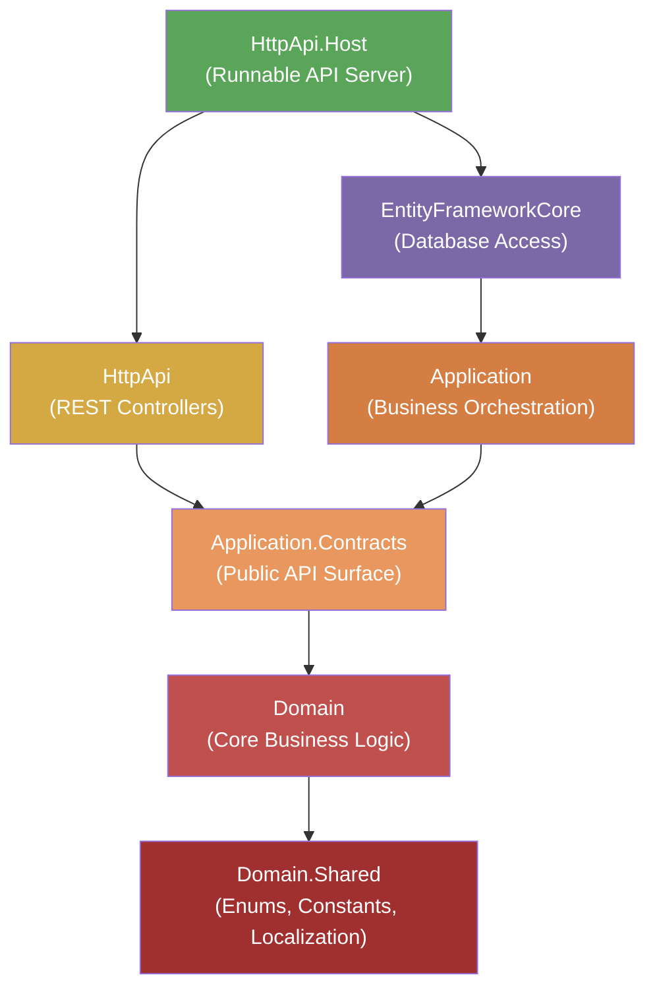
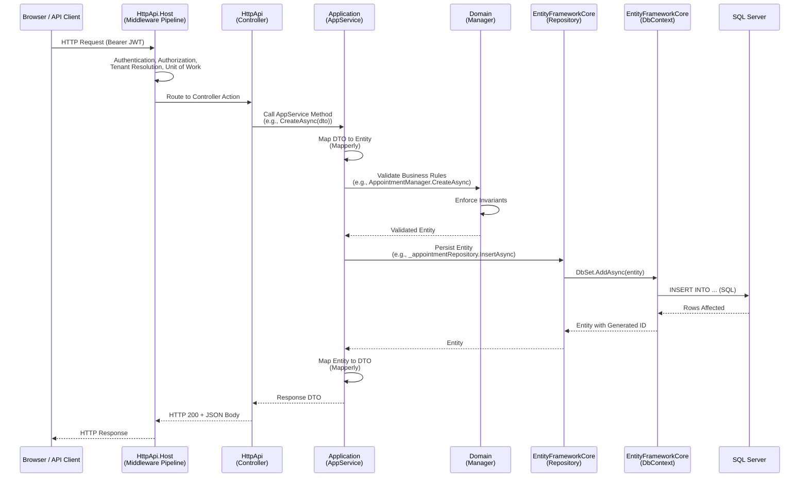
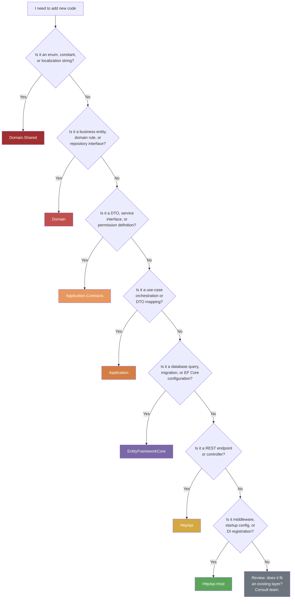

[Home](../INDEX.md) > [Architecture](./) > DDD Layers

# DDD Layers

The HCS Case Evaluation Portal follows a strict Domain-Driven Design (DDD) layered architecture enforced by project references. Each layer has a clearly defined responsibility, and dependencies flow in one direction only -- inner layers never reference outer layers.

---

## Layer Dependency Rule

**Strict inner-to-outer dependency flow. Inner layers never reference outer layers.**

```
Domain.Shared  <-  Domain  <-  Application.Contracts  <-  Application  <-  EntityFrameworkCore  <-  HttpApi  <-  HttpApi.Host
```

This means:

- `Domain.Shared` depends on nothing (innermost)
- `Domain` depends only on `Domain.Shared`
- `Application.Contracts` depends on `Domain.Shared` and `Domain`
- `Application` depends on `Application.Contracts` (and transitively, `Domain` and `Domain.Shared`)
- `EntityFrameworkCore` depends on `Domain` (implements repository interfaces defined in Domain)
- `HttpApi` depends on `Application.Contracts` (not `Application` directly -- it codes against interfaces)
- `HttpApi.Host` depends on all layers (it wires them together at startup)

---

## Layer Dependency Diagram



---

## Layer-by-Layer Breakdown

### 1. Domain.Shared (Innermost -- No Dependencies)

**Project:** `src/HealthcareSupport.CaseEvaluation.Domain.Shared/`

The foundation layer containing types shared across all other layers. It has zero project references and defines the vocabulary of the domain.

| Category | Contents |
|----------|----------|
| **Enums** | `Gender`, `BookingStatus`, `AppointmentStatusType`, `AccessType`, `PhoneNumberType`, `BookType` |
| **Constants** | `PatientConsts`, `DoctorConsts`, `AppointmentConsts`, `LocationConsts`, etc. (max string lengths for validation) |
| **Localization** | `CaseEvaluationResource` with JSON translation files for 24 languages |
| **Multi-Tenancy** | `MultiTenancyConsts.IsEnabled = true` |

**Rules:**
- No business logic
- No dependencies on any other project
- Only primitive types, enums, constants, and localization resources
- Everything here is safe to reference from any layer

---

### 2. Domain (Core Business Logic)

**Project:** `src/HealthcareSupport.CaseEvaluation.Domain/`

The heart of the application. Contains entities, domain managers that enforce business rules, repository interface definitions, and data seeders.

| Category | Contents |
|----------|----------|
| **Entities (15)** | `Appointment`, `Patient`, `Doctor`, `DoctorAvailability`, `Location`, `State`, `AppointmentType`, `AppointmentStatus`, `AppointmentLanguage`, `WcabOffice`, `ApplicantAttorney`, `AppointmentAccessor`, `AppointmentEmployerDetail`, `AppointmentApplicantAttorney`, `Book` |
| **Junction Entities** | `DoctorAppointmentType`, `DoctorLocation` |
| **Domain Managers** | `AppointmentManager`, `DoctorManager`, `PatientManager`, etc. -- business rule validation and invariant enforcement |
| **Repository Interfaces** | `IAppointmentRepository`, `IDoctorRepository`, `IPatientRepository`, etc. -- abstractions for data access |
| **Data Seeders** | `OpenIddictDataSeedContributor`, `ExternalUserRoleDataSeedContributor`, `BookStoreDataSeederContributor` |
| **Migration Service** | `CaseEvaluationDbMigrationService` -- orchestrates migrations and seeding |

**Rules:**
- Entities encapsulate business invariants (e.g., an appointment must have a valid patient and doctor)
- Domain Managers (`*Manager.cs`) contain cross-entity business logic that does not belong to a single entity
- Repository interfaces are defined here but implemented in `EntityFrameworkCore` (Dependency Inversion Principle)
- No references to EF Core, HTTP, or any infrastructure concern

---

### 3. Application.Contracts (Public API Surface)

**Project:** `src/HealthcareSupport.CaseEvaluation.Application.Contracts/`

Defines the public contract of the application layer -- DTOs, service interfaces, and permissions. This is what the `HttpApi` layer codes against.

| Category | Contents |
|----------|----------|
| **DTOs** | `*Dto`, `*CreateDto`, `*UpdateDto`, `*WithNavigationPropertiesDto` per entity |
| **Service Interfaces** | `IAppointmentsAppService`, `IPatientsAppService`, `IDoctorsAppService`, etc. |
| **Permissions** | `CaseEvaluationPermissions.cs` -- 15 entity groups x 4 CRUD permissions (Create, Read, Update, Delete) |
| **Permission Provider** | `CaseEvaluationPermissionDefinitionProvider.cs` -- registers permissions with ABP |

**Rules:**
- DTOs are plain data transfer objects with no behavior
- Service interfaces define the use-case signatures (what operations are available)
- No implementation logic -- only contracts
- Controllers in `HttpApi` and consumers depend on these interfaces, not on `Application` directly

---

### 4. Application (Business Orchestration)

**Project:** `src/HealthcareSupport.CaseEvaluation.Application/`

Implements the service interfaces defined in `Application.Contracts`. This layer orchestrates use cases by coordinating domain objects, repositories, and mapping between entities and DTOs.

| Category | Contents |
|----------|----------|
| **AppService Implementations** | `AppointmentsAppService` (454 lines, most complex), `PatientsAppService` (382 lines), `DoctorAvailabilitiesAppService` (312 lines), `ExternalSignupAppService` (267 lines), `DoctorTenantAppService` (147 lines), etc. |
| **Base Class** | `CaseEvaluationAppService` -- shared configuration for all AppServices |
| **Mapperly Mapper** | `CaseEvaluationApplicationMappers.cs` -- compile-time DTO-to-entity and entity-to-DTO mapping |

**Rules:**
- AppServices are the sole entry point for use cases -- controllers call these, nothing else
- Each public method on an AppService represents one use case (e.g., `CreateAsync`, `GetListAsync`, `UpdateAsync`)
- Calls Domain Managers for business rule validation before persistence
- Uses Mapperly for efficient, compile-time object mapping (no runtime reflection)
- Should not contain raw SQL or EF Core LINQ -- delegates data access to repositories

---

### 5. EntityFrameworkCore (Database Access)

**Project:** `src/HealthcareSupport.CaseEvaluation.EntityFrameworkCore/`

Implements the repository interfaces defined in the Domain layer using EF Core. Also defines the database schema via DbContext configuration and manages migrations.

| Category | Contents |
|----------|----------|
| **DbContexts** | `CaseEvaluationDbContext` (Host + Both scope), `CaseEvaluationTenantDbContext` (Tenant scope) -- dual DbContext strategy for multi-tenancy |
| **Repository Implementations** | `EfCore*Repository` classes with LINQ queries implementing `I*Repository` interfaces |
| **Migrations** | `Migrations/` (host) and `TenantMigrations/` (tenant) folders |
| **Entity Configuration** | Fluent API configuration in `OnModelCreating` (table names, column types, indexes, relationships) |

**Rules:**
- This is the only layer that knows about EF Core and SQL Server
- Repositories implement domain-defined interfaces (Dependency Inversion)
- All LINQ queries live here, not in AppServices
- Two separate migration streams: host migrations and tenant migrations

---

### 6. HttpApi (REST Controllers)

**Project:** `src/HealthcareSupport.CaseEvaluation.HttpApi/`

Thin REST controllers that translate HTTP requests into AppService calls and return responses. Controllers contain no business logic.

| Category | Contents |
|----------|----------|
| **Controllers** | `AppointmentController`, `PatientController`, `DoctorController`, etc. |
| **Special Controllers** | `ExternalSignupController` with `[AllowAnonymous]` for self-registration |
| **Base Class** | `CaseEvaluationController` -- shared controller configuration |
| **Route Prefix** | All endpoints under `/api/app/` |

**Rules:**
- Controllers are thin wrappers -- one line per action method (call AppService, return result)
- No business logic, validation, or data access in controllers
- References `Application.Contracts` (interfaces and DTOs), not `Application` (implementations)
- ABP's auto-API generation handles standard CRUD endpoints; custom controllers for special cases only

---

### 7. HttpApi.Host (Runnable API Server -- Outermost)

**Project:** `src/HealthcareSupport.CaseEvaluation.HttpApi.Host/`

The executable entry point that wires all layers together via dependency injection and configures the ASP.NET Core middleware pipeline.

| Category | Contents |
|----------|----------|
| **Module** | `CaseEvaluationHttpApiHostModule` -- configures auth, CORS, Swagger, Redis, health checks |
| **Entry Point** | `Program.cs` -- Serilog setup, Autofac DI container, host builder |
| **Middleware** | 16-step pipeline including authentication, authorization, multi-tenancy, error handling |

**Rules:**
- This is the composition root -- it references all other projects
- No business logic, no domain code
- Configuration only: wiring DI, middleware, and infrastructure concerns
- Environment-specific settings (connection strings, CORS origins, Redis endpoints) live here

---

## Request Lifecycle

A request flows through all layers from the outermost (HttpApi.Host) to the innermost (Domain) and back. The following diagram traces a typical request.



---

## What Belongs Where?

Use this decision flowchart when you need to decide which layer a new piece of code should go in.



---

## Quick Reference: Layer Cheat Sheet

| Layer | Project Suffix | Depends On | Contains | Does NOT Contain |
|-------|---------------|------------|----------|------------------|
| **Domain.Shared** | `.Domain.Shared` | Nothing | Enums, constants, localization | Any logic or behavior |
| **Domain** | `.Domain` | Domain.Shared | Entities, managers, repo interfaces, seeders | EF Core, HTTP, DTOs |
| **Application.Contracts** | `.Application.Contracts` | Domain, Domain.Shared | DTOs, service interfaces, permissions | Implementation logic |
| **Application** | `.Application` | Application.Contracts | AppServices, Mapperly mappers | Raw SQL, LINQ queries, HTTP |
| **EntityFrameworkCore** | `.EntityFrameworkCore` | Domain | DbContexts, EF repositories, migrations | Business rules, HTTP |
| **HttpApi** | `.HttpApi` | Application.Contracts | Controllers (thin wrappers) | Business logic, data access |
| **HttpApi.Host** | `.HttpApi.Host` | All layers | Startup config, middleware, DI wiring | Business logic, entities |

---

## Common Mistakes

| Mistake | Why It Is Wrong | Correct Approach |
|---------|-----------------|------------------|
| Putting LINQ queries in AppServices | Violates layer separation; AppServices should not know about EF Core | Move queries to repository implementations in `EntityFrameworkCore` |
| Adding business validation in Controllers | Controllers must be thin; business rules belong in the domain | Move validation to Domain Managers or AppServices |
| Referencing `Application` from `HttpApi` | Controllers should code against interfaces, not implementations | Reference `Application.Contracts` only |
| Defining DTOs in the `Domain` layer | DTOs are an application concern, not a domain concept | Define DTOs in `Application.Contracts` |
| Adding EF Core NuGet packages to `Domain` | The domain must not know about persistence technology | Keep EF Core references in `EntityFrameworkCore` only |
| Putting configuration/startup code in `Application` | Infrastructure wiring is a host concern | Move to `HttpApi.Host` module configuration |

---

## Related Documentation

- [Solution Structure](SOLUTION-STRUCTURE.md) -- All .csproj projects annotated with layer and responsibility
- [ABP Framework Conventions](ABP-FRAMEWORK.md) -- ABP module system, base classes, and patterns
- [Domain Model](../backend/DOMAIN-MODEL.md) -- All 15 entities with properties, types, and relationships
- [Application Services](../backend/APPLICATION-SERVICES.md) -- AppService layer, DTO mapping, CRUD patterns
- [Repositories](../backend/REPOSITORIES.md) -- Custom repository interfaces and EF Core implementations
