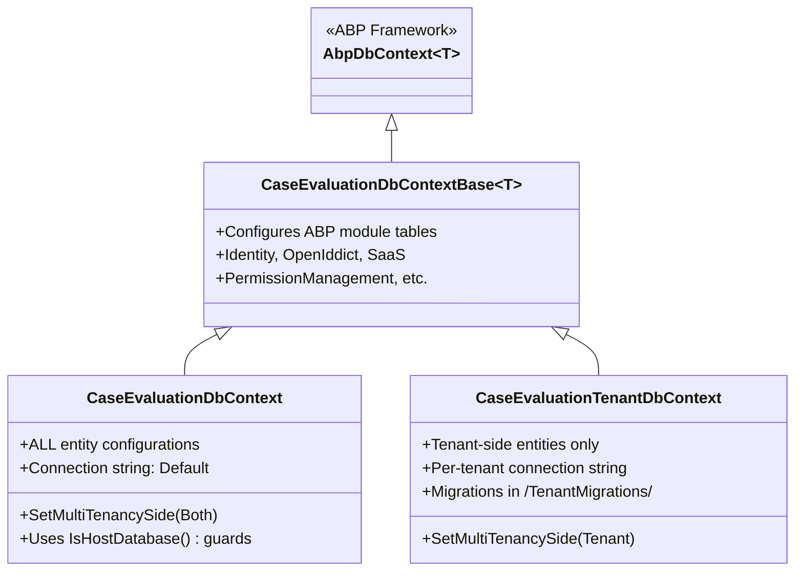
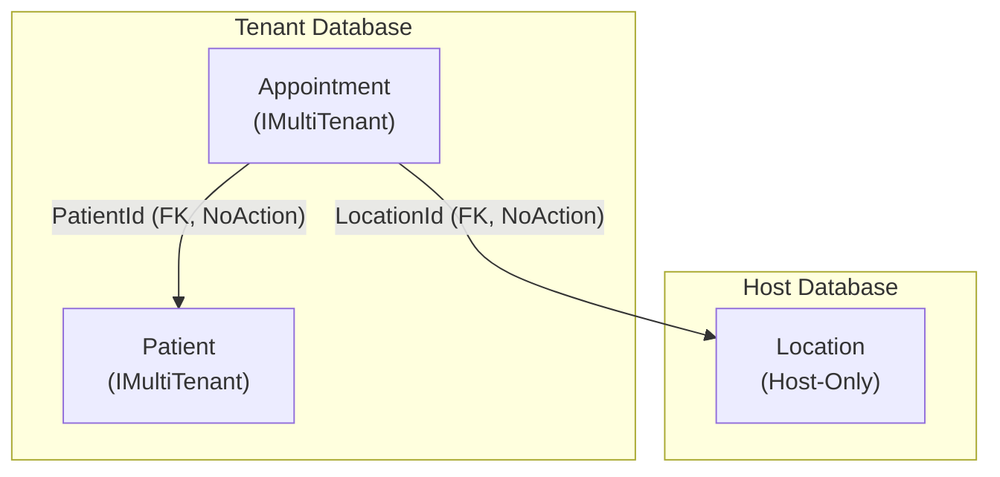
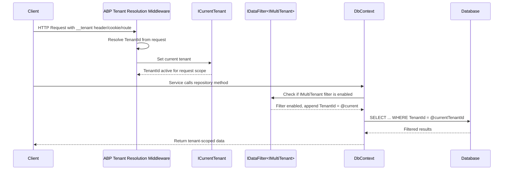

[Home](../INDEX.md) > [Architecture](./) > Multi-Tenancy

# Multi-Tenancy Strategy

> Purpose: Describes the doctor-per-tenant isolation model, dual-DbContext design, and entity classification. Audience: backend engineers. Last verified: 2026-06-01 vs main.

The HCS Case Evaluation Portal uses ABP Framework's multi-tenancy infrastructure with a **doctor-per-tenant** model. Each doctor in the system is their own ABP tenant (organization), providing full data isolation at the database level.

Multi-tenancy is enabled globally via `MultiTenancyConsts.IsEnabled = true` in `Domain.Shared`.

## Core Concept: Doctor-Per-Tenant

When `DoctorTenantAppService` creates a doctor, it performs the following steps in sequence:

1. Creates a new **ABP Tenant** (via the SaaS module)
2. Creates a **Doctor** entity linked to that tenant
3. Creates a **user account** within the new tenant
4. Assigns the appropriate **role** to the user

This means every doctor operates within their own isolated tenant context. Appointments, availability, and related records are scoped to that tenant.

### Tenant Resolution

ABP resolves the current tenant from the incoming request using its built-in resolution strategy:

- Request headers (`__tenant`)
- Cookies
- Route values

Once resolved, `ICurrentTenant` is set for the request lifetime, and ABP's global query filters automatically append `WHERE TenantId = @currentTenant` to all `IMultiTenant` entity queries.

## Entity Classification

Entities fall into two categories based on whether they implement `IMultiTenant`.

### Host-Only Entities

These entities have **no TenantId** and do **not** implement `IMultiTenant`. They live exclusively in the host database and are shared across all tenants.

| Entity | Purpose |
|---|---|
| **Location** | Physical office locations |
| **State** | US states reference data |
| **WcabOffice** | WCAB office locations |
| **AppointmentType** | Types of medical exams |
| **AppointmentStatus** | Display-name metadata for appointment statuses (not the state machine) |
| **AppointmentLanguage** | Language reference data |
| **NotificationTemplateType** | Lookup for notification channel (Email, SMS); two seeded rows; IT Admin-only |

### Multi-Tenant Entities

These entities implement `IMultiTenant` and carry a `TenantId` column. They are stored in per-tenant databases (or filtered by TenantId in a shared database).

| Entity | Purpose |
|---|---|
| **Doctor** | The tenant owner entity |
| **DoctorAvailability** | Time slots per doctor/tenant |
| **DoctorPreferredLocation** | M:N mapping of which Locations a Doctor accepts appointments at |
| **Appointment** | Bookings within a doctor's tenant |
| **AppointmentAccessor** | Who can view/edit appointments |
| **AppointmentEmployerDetail** | Employer info per appointment |
| **AppointmentInjuryDetail** | Injury detail record per appointment |
| **AppointmentBodyPart** | Body part description lines within an injury detail |
| **AppointmentClaimExaminer** | Claim examiner address/contact per injury detail |
| **AppointmentPrimaryInsurance** | Primary insurance address/contact per injury detail |
| **AppointmentDocument** | Uploaded files and queued package documents per appointment |
| **AppointmentPacket** | Generated PDF packets per (appointment, kind) tuple |
| **AppointmentChangeRequest** | User-initiated cancel or reschedule request on an Approved appointment |
| **ApplicantAttorney** | Attorney records within tenant |
| **AppointmentApplicantAttorney** | Attorney-appointment links |
| **DefenseAttorney** | Defense attorney records with firm and contact info |
| **AppointmentDefenseAttorney** | Defense attorney-appointment links |
| **AppointmentTypeFieldConfig** | Per-tenant field-level config (hidden/read-only/default) for appointment types |
| **SystemParameter** | Per-tenant singleton holding booking, cancel, and scheduling policy gates |
| **Document** | Master template catalog of blank PDFs managed by IT Admin |
| **PackageDetail** | Per-AppointmentType packet template defining required documents |
| **CustomField** | IT-Admin-defined intake fields rendered on the booking form |
| **CustomFieldValue** | Per-appointment values submitted for a CustomField |
| **NotificationTemplate** | Per-tenant editable email/SMS template catalog (59 seeded codes) |
| **Invitation** | Time-limited one-time invite tokens for external user self-registration |

```mermaid
flowchart LR
    subgraph HostOnly["Host-Only Entities"]
        Location
        State
        WcabOffice
        AppointmentType
        AppointmentStatus
        AppointmentLanguage
        NotificationTemplateType
    end

    subgraph MultiTenant["Multi-Tenant Entities (IMultiTenant)"]
        Doctor
        DoctorAvailability
        DoctorPreferredLocation
        Appointment
        AppointmentAccessor
        AppointmentEmployerDetail
        AppointmentInjuryDetail
        AppointmentBodyPart
        AppointmentClaimExaminer
        AppointmentPrimaryInsurance
        AppointmentDocument
        AppointmentPacket
        AppointmentChangeRequest
        ApplicantAttorney
        AppointmentApplicantAttorney
        DefenseAttorney
        AppointmentDefenseAttorney
        AppointmentTypeFieldConfig
        SystemParameter
        Document
        PackageDetail
        CustomField
        CustomFieldValue
        NotificationTemplate
        Invitation
        Patient
    end

    HostOnly --- |"Shared across all tenants"| HostDB[(Host Database)]
    MultiTenant --- |"Filtered by TenantId"| TenantDB[(Tenant Database)]
```

| **Patient** | Patient records; implements `IMultiTenant` since FEAT-09 (2026-05-05) -- ABP auto-filter scopes reads by CurrentTenant.Id; cross-tenant visibility for host/IT-Admin paths uses `IDataFilter<IMultiTenant>.Disable()` |

## Dual DbContext Strategy

The application uses two `DbContext` classes that both inherit from a common base. This allows host-only entities to be managed in one context while tenant-scoped entities live in another.

### Inheritance Hierarchy

### CaseEvaluationDbContext (Host)

- Configured with `SetMultiTenancySide(MultiTenancySides.Both)`
- Contains **all** entity configurations (host and tenant)
- Uses `builder.IsHostDatabase()` guards to conditionally configure host-only entities
- Connection string: `"Default"`

### CaseEvaluationTenantDbContext (Tenant)

- Configured with `SetMultiTenancySide(MultiTenancySides.Tenant)`
- Contains only **tenant-side** entity configurations (re-declares them)
- Each tenant can have its own connection string, or share the host database with TenantId filtering
- Migrations are stored in the `/TenantMigrations/` folder, separate from host migrations

## Cross-Tenant Data Access

Tenant entities frequently need to reference host-side data. For example, an `Appointment` (tenant-scoped) references a `Location` (host-side). `Patient` is also tenant-scoped (IMultiTenant since FEAT-09), so `Appointment -> Patient` is a same-side FK within the tenant database.

Key design decisions for cross-tenant references:

- **FK relationships** use `DeleteBehavior.NoAction` to prevent cross-database cascade issues. Since host and tenant data may live in different physical databases, cascade deletes cannot span that boundary.
- **`IDataFilter<IMultiTenant>`** can be used to temporarily disable tenant filtering when a service needs to read across tenants. For example, `DoctorsAppService` uses this to list all doctors from the host context regardless of the current tenant. Host/IT-Admin paths that need to read Patient records across tenants use the same pattern.

## Tenant Resolution Flow

The following sequence shows how an incoming request is resolved to a specific tenant and how data queries are automatically filtered.

## Tenant Data Seeding

Data seeding operates at two levels:

### Per-Tenant Seeding

- `ExternalUserRoleDataSeedContributor` creates roles within each tenant:
  - Patient
  - Claim Examiner
  - Applicant Attorney
  - Defense Attorney

### Migration and Seed Orchestration

- `CaseEvaluationDbMigrationService` iterates over all tenants and runs:
  1. Database migrations (using `CaseEvaluationTenantDbContext` and the `/TenantMigrations/` folder)
  2. Data seed contributors scoped to each tenant

This ensures every new tenant gets its schema and baseline data automatically upon creation.

## Related Documentation

- [Architecture Overview](OVERVIEW.md)
- [EF Core Design](../database/EF-CORE-DESIGN.md)
- [Domain Overview](../business-domain/DOMAIN-OVERVIEW.md)
