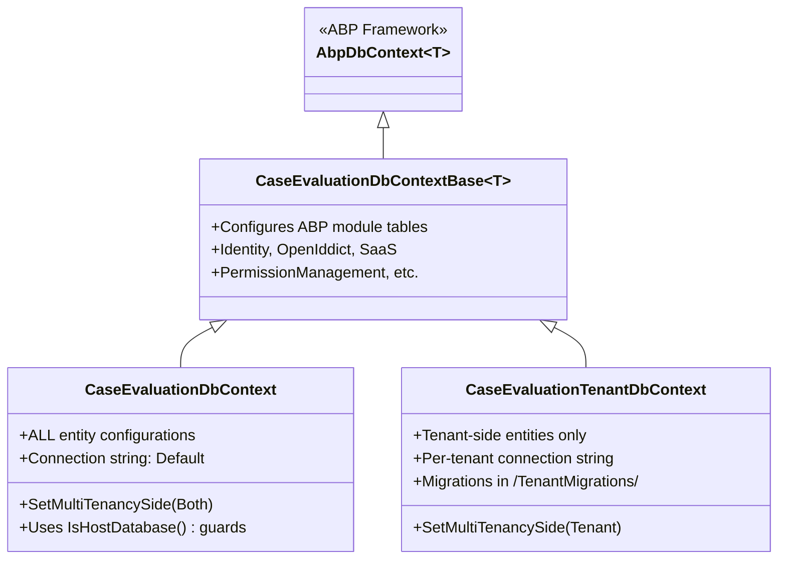
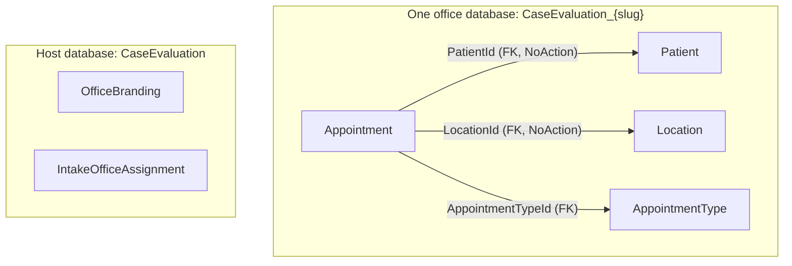
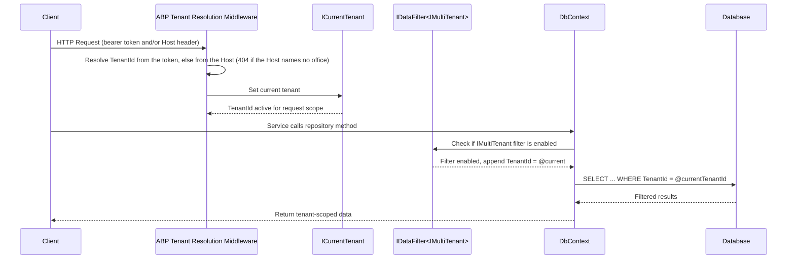

[Home](../INDEX.md) > [Architecture](./) > Multi-Tenancy

# Multi-Tenancy Strategy

> Purpose: Describes the doctor-per-tenant isolation model, dual-DbContext design, and entity classification. Audience: backend engineers.

The HCS Case Evaluation Portal uses ABP Framework's multi-tenancy infrastructure with a **doctor-per-tenant** model. Each doctor in the system is their own ABP tenant (organization), providing full data isolation at the database level.

Multi-tenancy is enabled globally via `MultiTenancyConsts.IsEnabled = true` in `Domain.Shared`.

## Core Concept: Doctor-Per-Tenant

When `DoctorTenantAppService` creates a doctor, it performs the following steps in sequence:

1. Creates a new **ABP Tenant** (via the SaaS module)
2. Creates a **Doctor** entity linked to that tenant
3. Creates a **user account** within the new tenant
4. Assigns the appropriate **role** to the user

This means every doctor operates within their own isolated tenant context. Appointments, availability, and related records are scoped to that tenant.

### Tenant Resolution

Both the API and the AuthServer clear ABP's default resolvers (which read `__tenant` from the query
string, a header, a cookie or the route) and register exactly two, in this order
(`ConfigureMultiTenancy` in each host module; pinned by `TenantResolverChainTests`):

1. `CurrentUserTenantResolveContributor` -- a signed-in caller's office comes from their token.
2. `HostAwareDomainTenantResolveContributor` -- an anonymous caller's office comes from the Host,
   against `App:TenantDomainFormat` (for example `{0}.api.<base>`; `{0}.localhost` in development):
   - a single office label resolves that office; ABP answers 404 if no such office exists;
   - the reserved `admin` label runs in host context;
   - the internal names `localhost` (health checks) and `authserver` (internal calls to the
     AuthServer by its container name) run in host context. OpenIddict's own metadata and key
     endpoints are answered before tenant resolution, so the API's metadata fetch works either way;
   - anything else -- an empty or dotted label, the bare or the other service's host, a foreign
     host, an IP, an empty Host -- is refused with a 404 (`Abp-Tenant-Resolve-Error: This host does
     not serve an office.`). Before 2026-09-25 these ran in host context.

Once resolved, `ICurrentTenant` is set for the request lifetime, and ABP's global query filters automatically append `WHERE TenantId = @currentTenant` to all `IMultiTenant` entity queries.

## Entity Classification

> **This section was inverted until 2026-09-28.** It listed Location, State, WcabOffice,
> AppointmentType, AppointmentStatus, AppointmentLanguage and NotificationTemplateType as
> "host-only, no TenantId, shared across all tenants". All seven implement `IMultiTenant` and
> are DbSets on the per-office context. If you remember this page saying reference data is
> shared, that is what you are remembering, and it was wrong. There is no shared catalogue:
> each office owns its own locations, states, appointment types and languages.

Almost everything is tenant-scoped. Of 53 entity classes in the Domain project, **45 implement
`IMultiTenant`**. Counting them is one command, which is better than trusting this page:

```bash
git grep -hoE '^public (sealed )?class [A-Za-z0-9_]+ : [A-Za-z0-9_<>, ]*(AggregateRoot|Entity)[A-Za-z0-9_<>, ]*' \
  -- 'src/HealthcareSupport.CaseEvaluation.Domain/*.cs' ':!*Migrations*' | sort -u
```

So the useful question is not "which entities are tenant-scoped" but **"which are not"**, and there
are only eight.

### The two genuinely host-only entities

These have no `TenantId`, live only in the host database, and are the only entity configurations
wrapped in `builder.IsHostDatabase()` in `CaseEvaluationDbContext`:

| Entity | Purpose |
|---|---|
| **OfficeBranding** | Per-office logo and display name, held host-side so the login surface can brand itself before an office is resolved |
| **IntakeOfficeAssignment** | Host-level grant of an intake staff member to an office |

Both are about offices rather than in an office, which is why they sit outside them.

### The six join entities

These are M2M join rows declared as plain `Entity` with a composite key. They carry no `TenantId`
of their own because both sides of the join are already tenant-scoped, so a row is only reachable
through rows already confined to one office:

`AppointmentAccessorAppointment`, `AppointmentDocumentTypeAppointmentType`,
`DoctorAppointmentType`, `DoctorLocation`, `DocumentPackage`, `LocationAppointmentType`.

### Everything else

The remaining 45 classes implement `IMultiTenant` and carry a `TenantId`. Under
database-per-office they live in that office's own database, so the `TenantId` column and ABP's
query filter are defence in depth rather than the primary boundary.

That includes the reference data people expect to be shared. **Each office has its own copy of the
50 US states, its own appointment types, its own languages and its own WCAB offices**, seeded per
office. The seed contributors say so in their method bodies: "Per-office (db-per-office): seed the
50 states into the active office DB; skip host scope".

The conversion to this model happened in two steps: `Patient` on 2026-05-05 (FEAT-09 / ADR-006 T4),
and `Location`, `State`, `AppointmentType`, `AppointmentLanguage` and `WcabOffice` on 2026-07-08
in the database-per-office epic. This page was not updated either time.

The list below names the tenant-scoped entities a maintainer meets first. It is **not complete**
and is not maintained as a complete list: there are 45, and the command above is the authority.

| Entity | Purpose |
|---|---|
| **Doctor** | The tenant owner entity |
| **DoctorAvailability** | Time slots per doctor/tenant |
| **DoctorPreferredLocation** | M:N mapping of which Locations a Doctor accepts appointments at |
| **Appointment** | Bookings within a doctor's tenant |
| **AppointmentAccessor** | Who can view/edit appointments |
| **AppointmentEmployerDetail** | Employer info per appointment |
| **AppointmentInjuryDetail** | Injury detail record per appointment |
| **AppointmentBodyPart** | Body part description lines within an injury detail |
| **AppointmentClaimExaminer** | Claim examiner address/contact per injury detail |
| **AppointmentPrimaryInsurance** | Primary insurance address/contact per injury detail |
| **AppointmentDocument** | Uploaded files and queued package documents per appointment |
| **AppointmentPacket** | Generated PDF packets per (appointment, kind) tuple |
| **AppointmentChangeRequest** | User-initiated cancel or reschedule request on an Approved appointment |
| **ApplicantAttorney** | Attorney records within tenant |
| **AppointmentApplicantAttorney** | Attorney-appointment links |
| **DefenseAttorney** | Defense attorney records with firm and contact info |
| **AppointmentDefenseAttorney** | Defense attorney-appointment links |
| **AppointmentTypeFieldConfig** | Per-tenant field-level config (hidden/read-only/default) for appointment types |
| **SystemParameter** | Per-tenant singleton holding booking, cancel, and scheduling policy gates |
| **Document** | Master template catalog of blank PDFs managed by IT Admin |
| **PackageDetail** | Per-AppointmentType packet template defining required documents |
| **CustomField** | IT-Admin-defined intake fields rendered on the booking form |
| **CustomFieldValue** | Per-appointment values submitted for a CustomField |
| **NotificationTemplate** | Per-tenant editable email/SMS template catalog (59 seeded codes) |
| **Invitation** | Time-limited one-time invite tokens for external user self-registration |
| **Patient** | Patient records; implements `IMultiTenant` since FEAT-09 (2026-05-05) -- ABP auto-filter scopes reads by CurrentTenant.Id; cross-tenant visibility for host/IT-Admin paths uses `IDataFilter<IMultiTenant>.Disable()` |


```mermaid
flowchart LR
    subgraph HostOnly["Host-only (the whole list)"]
        OfficeBranding
        IntakeOfficeAssignment
    end

    subgraph MultiTenant["Tenant-scoped: 45 of 53 entity classes (partial list)"]
        Location
        State
        WcabOffice
        AppointmentType
        AppointmentLanguage
        Doctor
        DoctorAvailability
        DoctorPreferredLocation
        Appointment
        AppointmentAccessor
        AppointmentEmployerDetail
        AppointmentInjuryDetail
        AppointmentBodyPart
        AppointmentClaimExaminer
        AppointmentPrimaryInsurance
        AppointmentDocument
        AppointmentPacket
        AppointmentChangeRequest
        ApplicantAttorney
        AppointmentApplicantAttorney
        DefenseAttorney
        AppointmentDefenseAttorney
        AppointmentTypeFieldConfig
        SystemParameter
        Document
        PackageDetail
        CustomField
        CustomFieldValue
        NotificationTemplate
        Invitation
        Patient
    end

    HostOnly --- |"Only in the host database"| HostDB[("Host database
CaseEvaluation")]
    MultiTenant --- |"In EACH office's own database"| TenantDB[("Office database
CaseEvaluation_{slug}")]
```

Read the arrow on the right carefully: under database-per-office the tenant-scoped entities are
not one filtered table, they are the same table existing separately in every office's database.

## Dual DbContext Strategy

The application uses two `DbContext` classes that both inherit from a common base.

The split is **not** "host entities here, tenant entities there" -- that reading follows from the
inverted classification this page used to carry. Nearly every entity is configured in BOTH
contexts, because nearly every entity exists in both the host database and each office database.
The two contexts differ in which connection they open and in a small number of configurations that
only make sense host-side.

### Inheritance Hierarchy


```mermaid
classDiagram
    class AbpDbContext~T~ {
        <<ABP Framework>>
    }
    class CaseEvaluationDbContextBase~T~ {
        +Configures ABP module tables
        +Identity, OpenIddict, SaaS
        +PermissionManagement, etc.
    }
    class CaseEvaluationDbContext {
        +SetMultiTenancySide(Both)
        +ALL entity configurations
        +Uses IsHostDatabase() guards
        +Connection string: Default
    }
    class CaseEvaluationTenantDbContext {
        +SetMultiTenancySide(Tenant)
        +Tenant-side entities only
        +Per-tenant connection string
        +Migrations in /TenantMigrations/
    }

    AbpDbContext~T~ <|-- CaseEvaluationDbContextBase~T~
    CaseEvaluationDbContextBase~T~ <|-- CaseEvaluationDbContext
    CaseEvaluationDbContextBase~T~ <|-- CaseEvaluationTenantDbContext
```

### CaseEvaluationDbContext (Host)

- Configured with `SetMultiTenancySide(MultiTenancySides.Both)`
- Contains **all** entity configurations (host and tenant)
- Uses ONE `builder.IsHostDatabase()` guard, and it wraps more than the two host-only entities.
  Inside it: `ConfigureDoctor()`, a `Doctor -> Tenant` FK, `ConfigureDoctorJoinEntities()`,
  `ConfigurePatient()`, a `Patient -> Tenant` FK, and the `IntakeOfficeAssignment` and
  `OfficeBranding` configurations.
- `Doctor` and `Patient` appear in that guard even though both are `IMultiTenant`. The guard is
  not about tenancy, it is about the **SaaS `Tenant` table**: it exists only in the host database,
  so a `Doctor -> Tenant` or `Patient -> Tenant` FK can only be declared there. An office database
  has no `SaasTenants` table to point at. `EfCorePatientRepository` notes the consequence: the
  `Tenant` navigation is left null per office, and the office's identity is the office context.
- Connection string: `"Default"`

### CaseEvaluationTenantDbContext (Tenant)

- Configured with `SetMultiTenancySide(MultiTenancySides.Tenant)`
- Contains only **tenant-side** entity configurations (re-declares them)
- Each tenant can have its own connection string, or share the host database with TenantId filtering
- Migrations are stored in the `/TenantMigrations/` folder, separate from host migrations

## There is no cross-database FK

> **This section previously described a cross-database reference** -- an `Appointment`
> (tenant-scoped) pointing at a `Location` (host-side) -- and used it as the worked example of
> how the two databases relate. That example does not exist. `Location` is tenant-scoped and is
> a DbSet on the office context, so `Appointment -> Location` is an ordinary FK between two
> tables in the same office database.

Under database-per-office, an office's data is self-contained. `Appointment` references
`Patient`, `Location`, `AppointmentType` and `DoctorAvailability`, and every one of those rows
lives in the same database on the same connection. There is no foreign key that crosses a
database boundary, because there is nothing on the other side of the boundary to point at except
`OfficeBranding` and `IntakeOfficeAssignment`, which nothing references.

That is the property worth understanding: a query that forgets its tenant scope cannot return
another office's rows, because those rows are not reachable on that connection at all. The
isolation is physical rather than conditional.


```mermaid
flowchart TD
    subgraph OfficeDB["One office database: CaseEvaluation_{slug}"]
        Appointment["Appointment"]
        Patient["Patient"]
        Location["Location"]
        AppointmentType["AppointmentType"]
    end

    subgraph HostDB["Host database: CaseEvaluation"]
        OfficeBranding["OfficeBranding"]
        IntakeOfficeAssignment["IntakeOfficeAssignment"]
    end

    Appointment -- "PatientId (FK, NoAction)" --> Patient
    Appointment -- "LocationId (FK, NoAction)" --> Location
    Appointment -- "AppointmentTypeId (FK)" --> AppointmentType
```

Key design decisions for cross-tenant references:

- **FK relationships** use `DeleteBehavior.NoAction` to prevent cross-database cascade issues. Since host and tenant data may live in different physical databases, cascade deletes cannot span that boundary.
- **`IDataFilter<IMultiTenant>`** can be used to temporarily disable tenant filtering when a service needs to read across tenants. For example, `DoctorsAppService` uses this to list all doctors from the host context regardless of the current tenant. Host/IT-Admin paths that need to read Patient records across tenants use the same pattern.

## Tenant Resolution Flow

The following sequence shows how an incoming request is resolved to a specific tenant and how data queries are automatically filtered.


```mermaid
sequenceDiagram
    participant Client
    participant Middleware as ABP Tenant Resolution Middleware
    participant ICurrentTenant
    participant DataFilter as IDataFilter<IMultiTenant>
    participant DbContext
    participant Database

    Client->>Middleware: HTTP Request (bearer token and/or Host header)
    Middleware->>Middleware: Resolve TenantId from the token, else from the Host (404 if the Host names no office)
    Middleware->>ICurrentTenant: Set current tenant
    ICurrentTenant-->>Middleware: TenantId active for request scope

    Client->>DbContext: Service calls repository method
    DbContext->>DataFilter: Check if IMultiTenant filter is enabled
    DataFilter-->>DbContext: Filter enabled, append TenantId = @current
    DbContext->>Database: SELECT ... WHERE TenantId = @currentTenantId
    Database-->>DbContext: Filtered results
    DbContext-->>Client: Return tenant-scoped data
```

## Tenant Data Seeding

Data seeding operates at two levels:

### Per-Tenant Seeding

- `ExternalUserRoleDataSeedContributor` creates roles within each tenant:
  - Patient
  - Claim Examiner
  - Applicant Attorney
  - Defense Attorney

### Migration and Seed Orchestration

- `CaseEvaluationDbMigrationService` iterates over all tenants and runs:
  1. Database migrations (using `CaseEvaluationTenantDbContext` and the `/TenantMigrations/` folder)
  2. Data seed contributors scoped to each tenant

This ensures every new tenant gets its schema and baseline data automatically upon creation.

## Related Documentation

- [Architecture Overview](OVERVIEW.md)
- [EF Core Design](../database/EF-CORE-DESIGN.md)
- [Domain Overview](../business-domain/DOMAIN-OVERVIEW.md)
