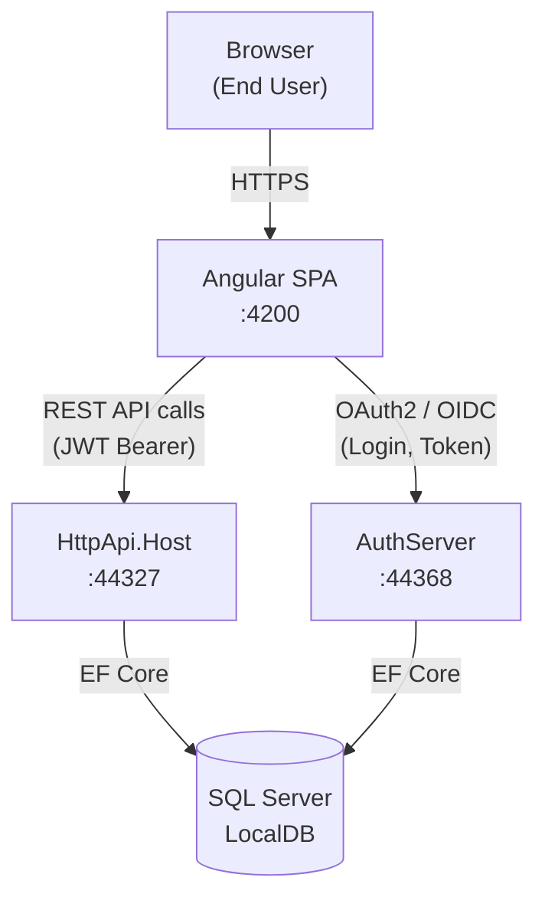
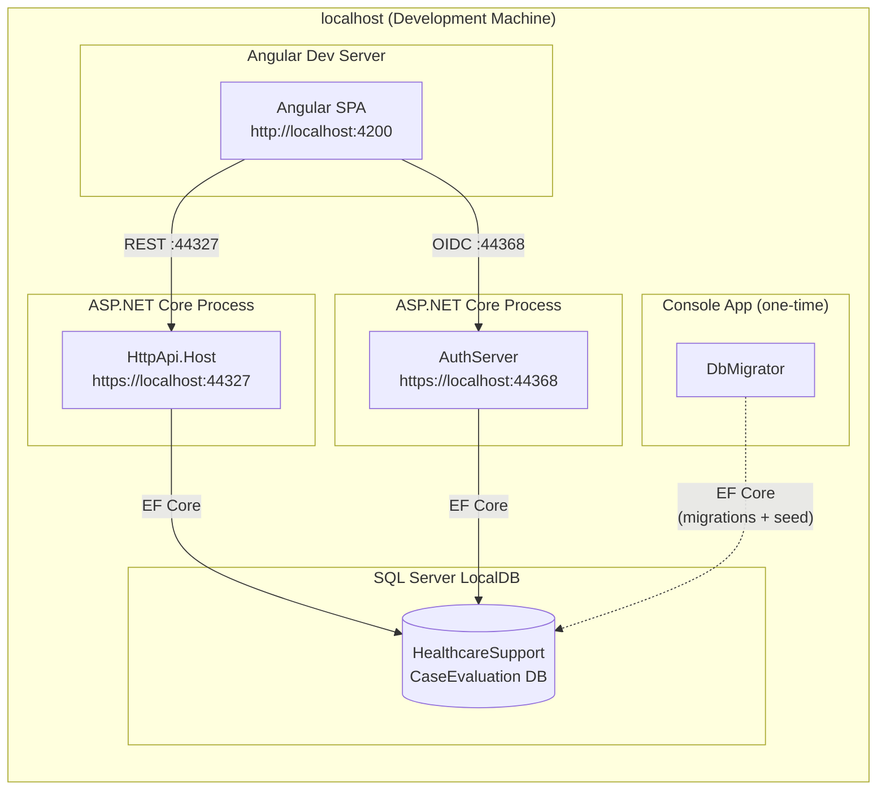
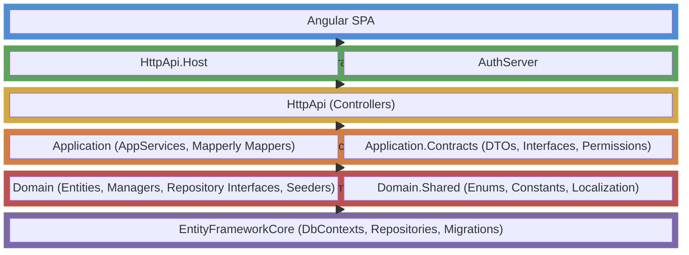

[Home](../INDEX.md) > [Architecture](./) > System Overview

# System Overview

The HCS Case Evaluation Portal is a workers' compensation Independent Medical Examination (IME) scheduling application. It follows a DDD layered monolith architecture with multi-tenancy support, where each doctor operates within an isolated tenant.

## Technology Stack

| Layer | Technology | Version |
|---|---|---|
| Backend Framework | .NET | 10 |
| Application Framework | ABP Framework | 10.0.2 |
| ORM | Entity Framework Core | - |
| Database | SQL Server LocalDB | - |
| Authentication | OpenIddict (OAuth 2.0 / OIDC) | - |
| Frontend | Angular (standalone components) | 20 |
| UI Theme | LeptonX | 5.0.2 |
| Caching | Redis (optional, disabled by default) | - |
| Logging | Serilog (file + console) | - |
| Object Mapping | Mapperly (compile-time) | - |
| Excel Export | MiniExcel | 1.41.4 |
| DI Container | Autofac | - |
| Distributed Locking | Medallion.Threading (Redis-based) | - |

## System Components

The application consists of four running processes during local development:

| # | Process | Description |
|---|---|---|
| 1 | **AuthServer** (port 44368) | OpenIddict OAuth2 login and token issuer. Razor Pages UI with LeptonX theme for login, consent, and account management. |
| 2 | **HttpApi.Host** (port 44327) | REST API host with JWT Bearer token validation. Exposes Swagger/OpenAPI documentation. |
| 3 | **Angular SPA** (port 4200) | Browser-based UI built with Angular standalone components and ABP Angular packages. |
| 4 | **DbMigrator** | One-time console application for database migrations and initial data seeding. Not a long-running process. |

## C4 Context Diagram

## Deployment Diagram

## Layer Stack Diagram

## Solution Projects

The solution contains 10 source projects and 4 test projects:

| Project | Layer | Responsibility |
|---|---|---|
| `Domain.Shared` | Domain | Enums, constants, localization resources |
| `Domain` | Domain | Entities, domain managers, repository interfaces, data seeders |
| `Application.Contracts` | Application | DTOs, application service interfaces, permission definitions |
| `Application` | Application | Application service implementations, Mapperly mappers |
| `EntityFrameworkCore` | Infrastructure | DbContexts (Host + Tenant), EF Core repositories, migrations |
| `HttpApi` | API | REST controllers |
| `HttpApi.Host` | Host | ASP.NET Core host with middleware pipeline configuration |
| `HttpApi.Client` | Client | Server-to-server proxy (not used at runtime) |
| `AuthServer` | Host | OpenIddict login server |
| `DbMigrator` | Tool | Migration console application |

## Design Principles

### Domain-Driven Design (DDD)

The solution strictly follows DDD layering. Domain entities encapsulate business logic and invariants. Application services orchestrate use cases. Infrastructure concerns (persistence, external services) are isolated behind abstractions defined in the domain layer.

### Multi-Tenant Isolation

Each doctor operates within an isolated tenant. ABP's multi-tenancy infrastructure ensures data isolation at the database level, with tenant resolution handled automatically by the framework. Tenant-specific data is stored in a shared database using discriminator-based filtering.

### ABP Modularity

The application leverages ABP Framework's module system. Each project is an ABP module with explicit dependency declarations. This enforces clean boundaries between layers and enables consistent patterns for features like localization, permissions, and settings.

### Soft-Delete Auditing

Entities implement ABP's `ISoftDelete` interface, ensuring that records are never physically removed from the database. All deletions are logical, preserving full audit trails. ABP's auditing infrastructure automatically tracks creation, modification, and deletion metadata.

### Permission-Based Access

Access control is enforced through ABP's permission system. Permissions are defined in `Application.Contracts`, checked declaratively via attributes on application services and controllers, and evaluated against the current user's grants at runtime.

## Port Reference Table

| Service | Port | Protocol | URL |
|---|---|---|---|
| AuthServer | 44368 | HTTPS | `https://localhost:44368` |
| HttpApi.Host | 44327 | HTTPS | `https://localhost:44327` |
| Angular SPA | 4200 | HTTP | `http://localhost:4200` |
| SQL Server LocalDB | - | Named Pipe | `(localdb)\MSSQLLocalDB` |

## Related Documentation

- [DDD Layers](DDD-LAYERS.md)
- [Multi-Tenancy](MULTI-TENANCY.md)
- [Solution Structure](SOLUTION-STRUCTURE.md)
- [ABP Framework](ABP-FRAMEWORK.md)
- [API Architecture](../api/API-ARCHITECTURE.md)
