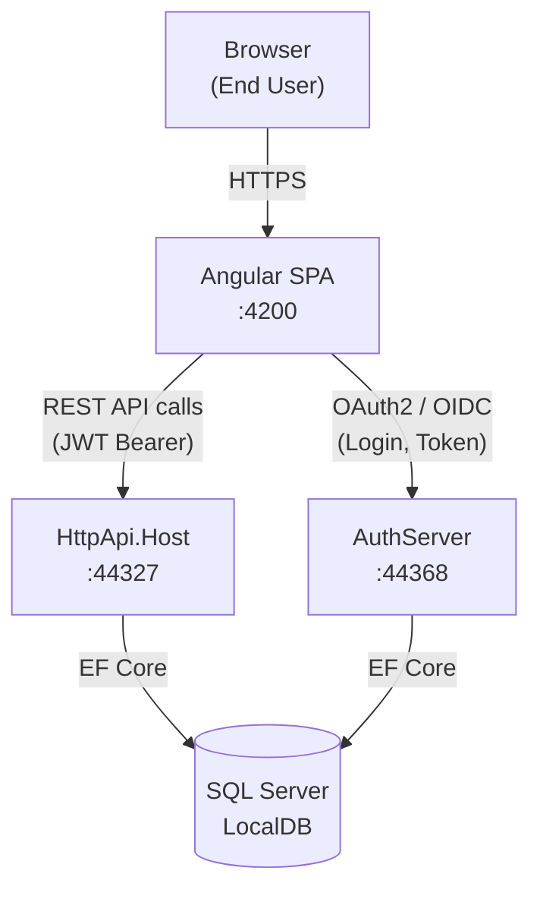
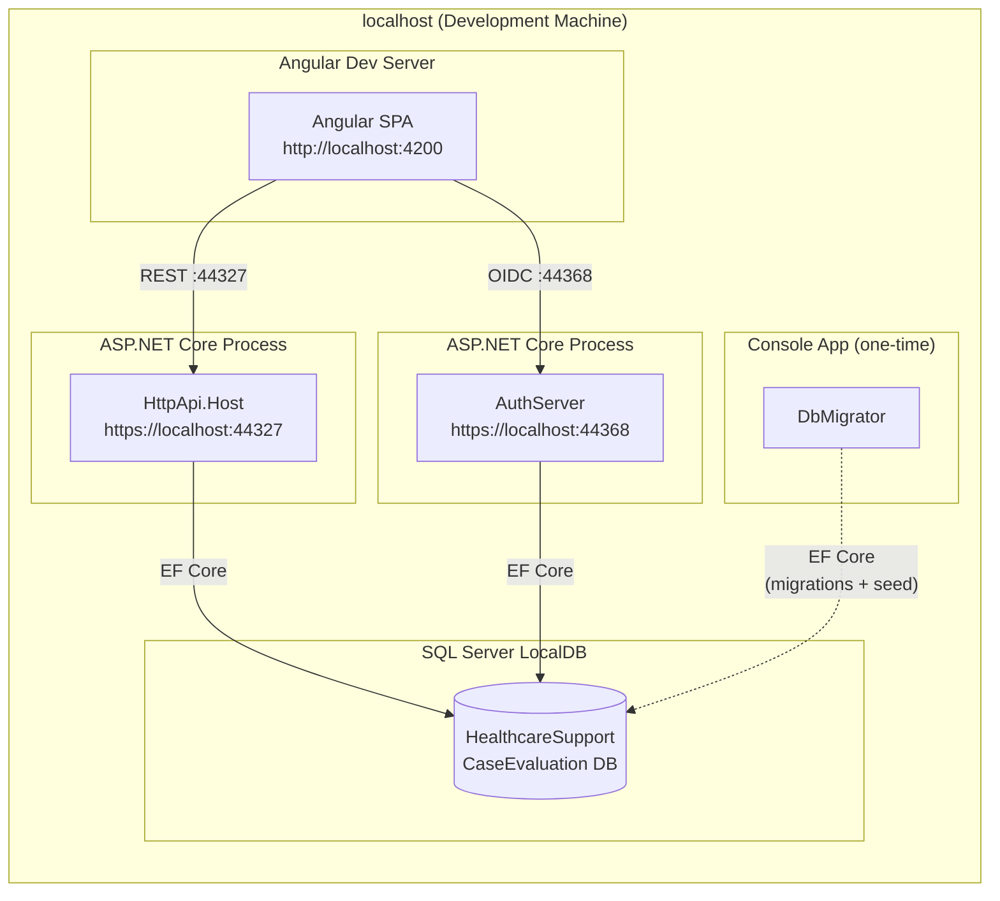
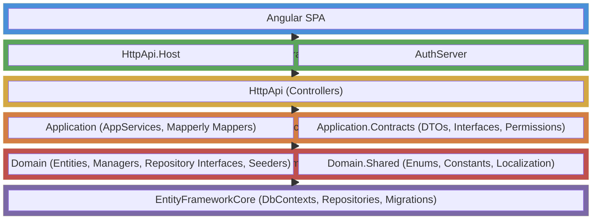

[Home](../INDEX.md) > [Architecture](./) > System Overview

# System Overview

> Purpose: High-level architecture reference for the HCS Case Evaluation Portal. Audience: developers.

The HCS Case Evaluation Portal is a workers' compensation Independent Medical Examination (IME) scheduling application. It follows a DDD layered monolith architecture with multi-tenancy support, where each doctor operates within an isolated tenant.

## Technology Stack

| Layer | Technology | Version |
|---|---|---|
| Backend Framework | .NET | 10 |
| Application Framework | ABP Framework | 10.0.2 |
| ORM | Entity Framework Core | - |
| Database | SQL Server LocalDB | - |
| Authentication | OpenIddict (OAuth 2.0 / OIDC) | - |
| Frontend | Angular (standalone components) | 20 |
| UI Theme | LeptonX | 5.0.2 |
| Caching + DataProtection | Redis. **Not optional as shipped** -- see the note below the table | - |
| Logging | Serilog (file + console) | - |
| Object Mapping | Mapperly (compile-time) | - |
| Excel Export | MiniExcel | 1.41.4 |
| DI Container | Autofac | - |
| Distributed Locking | Medallion.Threading (Redis-based) | - |

> **`Redis:IsEnabled: false` does not disable Redis.** `ConfigureDataProtection` reads
> `Redis:Configuration` only, and `appsettings.json` ships it as `127.0.0.1`, so the API calls
> `ConnectionMultiplexer.Connect` at startup regardless of the `IsEnabled` flag. Nothing in the
> solution reads `Redis:IsEnabled` except DbMigrator, which only writes it. If you want the API up
> without Redis, blank `Redis:Configuration`; turning `IsEnabled` off will not do it.
>
> Redis is also not just a cache here: it holds the DataProtection key ring shared by the API and
> the AuthServer, and the distributed lock database. Losing it invalidates protected payloads
> across both services.

## System Components

> **This section said "four running processes" and the diagrams showed SQL Server as the single
> data store.** There is a fifth process and there are three data stores. Corrected 2026-09-28.

**Five processes**, not four: the four below plus **`packet-renderer`**, the WeasyPrint sidecar on
port 3001 that renders appointment packets to PDF. It is not optional infrastructure -- the API is
configured with `PacketRenderer__Url` and declares `depends_on: packet-renderer`.

**Three data stores**, not one:

| Store | Holds |
|---|---|
| SQL Server | The host database and every per-office database |
| MinIO | Eight blob containers: uploaded appointment documents, generated packets, user signatures, office logos |
| Redis | The shared DataProtection key ring and the distributed lock database |

The four application processes during local development:

| # | Process | Description |
|---|---|---|
| 1 | **AuthServer** (port 44368) | OpenIddict OAuth2 login and token issuer. Razor Pages UI with LeptonX theme for login, consent, and account management. |
| 2 | **HttpApi.Host** (port 44327) | REST API host with JWT Bearer token validation. Exposes Swagger/OpenAPI documentation. |
| 3 | **Angular SPA** (port 4200) | Browser-based UI built with Angular standalone components and ABP Angular packages. |
| 4 | **DbMigrator** | One-time console application for database migrations and initial data seeding. Not a long-running process. |

## C4 Context Diagram

```mermaid
flowchart TB
    Browser["Browser\n(End User)"]
    Angular["Angular SPA\n:4200"]
    API["HttpApi.Host\n:44327"]
    Auth["AuthServer\n:44368"]
    DB[("SQL Server\nLocalDB")]

    Browser -->|"HTTPS"| Angular
    Angular -->|"REST API calls\n(JWT Bearer)"| API
    Angular -->|"OAuth2 / OIDC\n(Login, Token)"| Auth
    API -->|"EF Core"| DB
    Auth -->|"EF Core"| DB
```

## Deployment Diagram

```mermaid
flowchart LR
    subgraph localhost["localhost (Development Machine)"]
        subgraph angular_proc["Angular Dev Server"]
            Angular["Angular SPA\nhttp://localhost:4200"]
        end

        subgraph api_proc["ASP.NET Core Process"]
            API["HttpApi.Host\nhttps://localhost:44327"]
        end

        subgraph auth_proc["ASP.NET Core Process"]
            Auth["AuthServer\nhttps://localhost:44368"]
        end

        subgraph db_proc["SQL Server LocalDB"]
            DB[("HealthcareSupport\nCaseEvaluation DB")]
        end

        subgraph migrator_proc["Console App (one-time)"]
            Migrator["DbMigrator"]
        end
    end

    Angular -- "REST :44327" --> API
    Angular -- "OIDC :44368" --> Auth
    API -- "EF Core" --> DB
    Auth -- "EF Core" --> DB
    Migrator -. "EF Core\n(migrations + seed)" .-> DB
```

## Layer Stack Diagram

```mermaid
block-beta
    columns 1
    block:outer["Presentation"]
        Angular["Angular SPA"]
    end
    block:host["Host / Infrastructure"]
        HttpApiHost["HttpApi.Host"]
        AuthServer["AuthServer"]
    end
    block:api["API"]
        HttpApi["HttpApi (Controllers)"]
    end
    block:app["Application"]
        Application["Application (AppServices, Mapperly Mappers)"]
        AppContracts["Application.Contracts (DTOs, Interfaces, Permissions)"]
    end
    block:domain["Domain"]
        DomainCore["Domain (Entities, Managers, Repository Interfaces, Seeders)"]
        DomainShared["Domain.Shared (Enums, Constants, Localization)"]
    end
    block:infra["Infrastructure"]
        EFCore["EntityFrameworkCore (DbContexts, Repositories, Migrations)"]
    end

    outer --> host
    host --> api
    api --> app
    app --> domain
    infra --> domain

    style outer fill:#4A90D9,color:#fff
    style host fill:#5BA55B,color:#fff
    style api fill:#D4A843,color:#fff
    style app fill:#D47E43,color:#fff
    style domain fill:#C0504D,color:#fff
    style infra fill:#7B68A6,color:#fff
```

## Solution Projects

The solution contains 10 source projects and 4 test projects:

| Project | Layer | Responsibility |
|---|---|---|
| `Domain.Shared` | Domain | Enums, constants, localization resources |
| `Domain` | Domain | Entities, domain managers, repository interfaces, data seeders |
| `Application.Contracts` | Application | DTOs, application service interfaces, permission definitions |
| `Application` | Application | Application service implementations, Mapperly mappers |
| `EntityFrameworkCore` | Infrastructure | DbContexts (Host + Tenant), EF Core repositories, migrations |
| `HttpApi` | API | REST controllers |
| `HttpApi.Host` | Host | ASP.NET Core host with middleware pipeline configuration |
| `HttpApi.Client` | Client | Server-to-server proxy (not used at runtime) |
| `AuthServer` | Host | OpenIddict login server |
| `DbMigrator` | Tool | Migration console application |

## Design Principles

### Domain-Driven Design (DDD)

The solution strictly follows DDD layering. Domain entities encapsulate business logic and invariants. Application services orchestrate use cases. Infrastructure concerns (persistence, external services) are isolated behind abstractions defined in the domain layer.

### Multi-Tenant Isolation

> **This section described a different system until 2026-09-28.** It said tenant data sits in a
> shared database with discriminator filtering, that resolution is handled automatically by the
> framework, and that the tenant is a doctor. All three were wrong.

**The tenant is an OFFICE, a practice, not a doctor.** `Doctor` is an ordinary tenant-scoped
aggregate living inside an office's database, so one office holds many doctors. Creating a tenant
is an office-creation flow keyed on an office subdomain slug.

**Isolation is physical, not a filter.** Each office gets its own SQL Server database named
`CaseEvaluation_{slug}`, derived from the host `Default` connection string by swapping the catalog
and stored on the tenant record. A query on an office connection cannot reach another office's
rows at all, because they are not in that database. The `IMultiTenant` filter still applies and is
defence in depth on top of that.

**Resolution is deliberately NOT the framework default.** Both host processes call
`TenantResolvers.Clear()` and register exactly two contributors: the authenticated user's token,
then the Host header. Clearing removes ABP's QueryString, Cookie, Header and Route contributors,
which is what stops a caller selecting an office with a `__tenant` value. Under
database-per-office that would not be a permission bug a later check might catch; it would be a
different connection string, and the permission check would pass.

See [MULTI-TENANCY.md](MULTI-TENANCY.md), [TENANCY-AND-ISOLATION.md](TENANCY-AND-ISOLATION.md) and
[OFFICES-AND-HOSTING.md](OFFICES-AND-HOSTING.md).

### ABP Modularity

The application leverages ABP Framework's module system. Each project is an ABP module with explicit dependency declarations. This enforces clean boundaries between layers and enables consistent patterns for features like localization, permissions, and settings.

### Soft-Delete Auditing

Most aggregates derive from `FullAuditedAggregateRoot` or `FullAuditedEntity` and so implement
`ISoftDelete`: a delete sets `IsDeleted` and the row stays, which is why nearly every unique index
in this schema carries an `[IsDeleted] = 0` filter. ABP's auditing tracks creation, modification
and deletion metadata.

> **But do not read that as "records are never physically removed", which is what this section
> used to say.** `ExternalSignupAppService` calls `repository.HardDeleteAsync` to genuinely remove
> Patient, ApplicantAttorney, DefenseAttorney and ClaimExaminer rows
> (`ExternalSignups/ExternalSignupAppService.cs:355`). Not every entity is a soft-delete aggregate
> either: the M2M join entities derive from plain `Entity`. Treat soft delete as the default, not
> as a guarantee.

### Permission-Based Access

Permissions are defined in `Application.Contracts`, checked declaratively via attributes, and
evaluated against the current user's grants at runtime.

> **That is only half of the access model, and relying on the half described here is the most
> common mistake made against this codebase.** Holding a permission does not grant access to a
> specific appointment. Per-appointment access is decided by `AppointmentReadAccessGuard` composed
> over `AppointmentAccessRules`: seven pathways, first match wins, plus a row-level rule matching
> the caller's email against the appointment's party-email columns AND requiring the caller to
> hold that column's role.
>
> All four external roles receive a byte-identical permission set, so permissions cannot be what
> distinguishes them. See
> [USER-ROLES-AND-ACTORS.md](../business-domain/USER-ROLES-AND-ACTORS.md).

## Port Reference Table

| Service | Port | Protocol | URL |
|---|---|---|---|
| AuthServer | 44368 | HTTPS | `https://localhost:44368` |
| HttpApi.Host | 44327 | HTTPS | `https://localhost:44327` |
| Angular SPA | 4200 | HTTP | `http://localhost:4200` |
| SQL Server LocalDB | - | Named Pipe | `(localdb)\MSSQLLocalDB` |

## Related Documentation

- [DDD Layers](OVERVIEW.md#layer-stack-diagram)
- [Multi-Tenancy](MULTI-TENANCY.md)
- [Solution Structure](OVERVIEW.md#solution-projects)
- [ABP Framework](ABP-FRAMEWORK.md)
- [API Architecture](../api/API-ARCHITECTURE.md)
