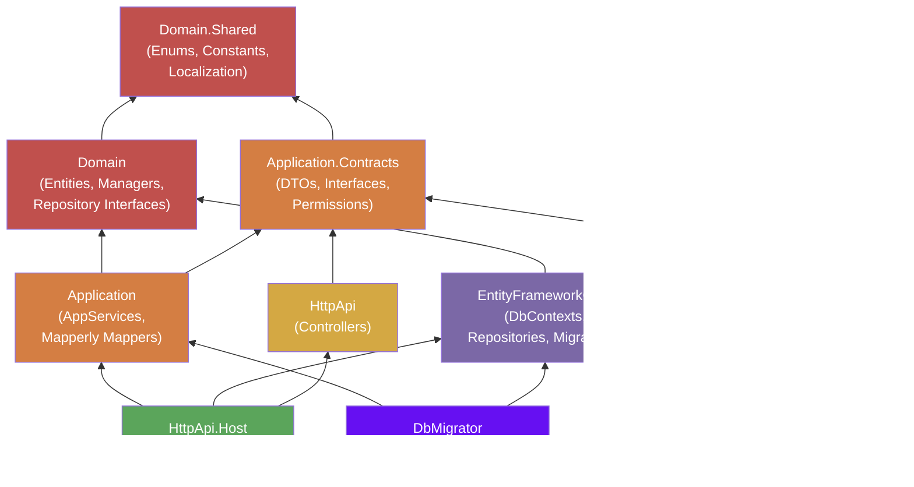

[Home](../INDEX.md) > [Architecture](./) > Solution Structure

# Solution Structure

The solution file `HealthcareSupport.CaseEvaluation.slnx` contains 10 source projects arranged across DDD layers, plus 4 test projects. This document catalogs every project with its purpose, dependencies, and key contents.

## Directory Layout

```
hcs-case-evaluation-portal/
├── src/
│   ├── HealthcareSupport.CaseEvaluation.Domain.Shared/
│   ├── HealthcareSupport.CaseEvaluation.Domain/
│   ├── HealthcareSupport.CaseEvaluation.Application.Contracts/
│   ├── HealthcareSupport.CaseEvaluation.Application/
│   ├── HealthcareSupport.CaseEvaluation.EntityFrameworkCore/
│   ├── HealthcareSupport.CaseEvaluation.HttpApi/
│   ├── HealthcareSupport.CaseEvaluation.HttpApi.Host/
│   ├── HealthcareSupport.CaseEvaluation.HttpApi.Client/
│   ├── HealthcareSupport.CaseEvaluation.AuthServer/
│   └── HealthcareSupport.CaseEvaluation.DbMigrator/
├── test/
│   ├── HealthcareSupport.CaseEvaluation.TestBase/
│   ├── HealthcareSupport.CaseEvaluation.Domain.Tests/
│   ├── HealthcareSupport.CaseEvaluation.Application.Tests/
│   └── HealthcareSupport.CaseEvaluation.EntityFrameworkCore.Tests/
├── angular/                     # Angular 20 frontend source
├── etc/
│   ├── docker-compose/          # Docker Compose files
│   ├── helm/caseevaluation/     # Helm charts (angular, authserver, httpapihost, dbmigrator, redis, sqlserver)
│   ├── docker/                  # Container definitions (redis.yml)
│   ├── scripts/                 # Infrastructure scripts (initialize-solution.ps1, migrate-database.ps1, run-docker.ps1, stop-docker.ps1, build-images-locally.ps1)
│   └── abp-studio/             # ABP Studio profiles (Default.abprun.json, k8s-profiles/)
├── .suite/entities/             # ABP Suite entity definition JSON files (code generation)
├── docs/                        # This documentation tree
└── HealthcareSupport.CaseEvaluation.slnx
```

## Project Dependency Graph



**Legend:** Red = Domain layer | Orange = Application layer | Purple = Infrastructure layer | Yellow = API layer | Green = Host layer | Blue = Client

---

## Source Projects (10)

### 1. HealthcareSupport.CaseEvaluation.Domain.Shared

| | |
|---|---|
| **Path** | `src/HealthcareSupport.CaseEvaluation.Domain.Shared/` |
| **Layer** | Domain |
| **Purpose** | Shared enums, constants, localization resources, and multi-tenancy configuration. This is the lowest-level project and is referenced by nearly every other project in the solution. |
| **Dependencies** | ABP core packages only (no project references) |

**Key contents:**

- `Enums/` -- Domain enumerations: `Gender`, `BookingStatus`, `AppointmentStatusType`, `AccessType`, `PhoneNumberType`
- `*Consts.cs` files -- Max-length and validation constants for each entity (e.g., `PatientConsts`, `DoctorConsts`)
- `Localization/` -- JSON resource files for ABP's localization system
- `MultiTenancy/MultiTenancyConsts.cs` -- Multi-tenancy enabled flag and configuration

---

### 2. HealthcareSupport.CaseEvaluation.Domain

| | |
|---|---|
| **Path** | `src/HealthcareSupport.CaseEvaluation.Domain/` |
| **Layer** | Domain |
| **Purpose** | Entity definitions, domain services (Manager classes), repository interfaces, and data seeders. Contains all business logic and domain rules. |
| **Dependencies** | Domain.Shared |

**Key folders (each containing Entity.cs, *Manager.cs, I*Repository.cs):**

- `Appointments/` -- Core appointment entity and scheduling logic
- `Patients/` -- Patient records
- `Doctors/` -- Doctor entities
- `DoctorAvailabilities/` -- Availability slot definitions
- `Locations/` -- Physical location records
- `States/` -- US state reference data
- `AppointmentTypes/` -- Examination type categorization
- `AppointmentStatuses/` -- Status tracking for the 13-state lifecycle
- `AppointmentLanguages/` -- Language preferences
- `WcabOffices/` -- Workers' Compensation Appeals Board offices
- `ApplicantAttorneys/` -- Attorney records
- `AppointmentAccessors/` -- Users granted access to appointments
- `AppointmentEmployerDetails/` -- Employer information linked to appointments
- `AppointmentApplicantAttorneys/` -- Many-to-many link between appointments and attorneys

**Special folders:**

- `Data/` -- Database migration service interface and implementation
- `OpenIddict/` -- OAuth application seeder (registers Angular and API clients)
- `Identity/` -- Role seeder (creates default roles)
- `Books/` -- Sample/template entity from ABP project generation

---

### 3. HealthcareSupport.CaseEvaluation.Application.Contracts

| | |
|---|---|
| **Path** | `src/HealthcareSupport.CaseEvaluation.Application.Contracts/` |
| **Layer** | Application |
| **Purpose** | DTOs (Data Transfer Objects), application service interfaces, and permission definitions. Defines the public API contract consumed by the HttpApi and HttpApi.Client projects. |
| **Dependencies** | Domain.Shared |

**Key contents:**

- `Permissions/CaseEvaluationPermissions.cs` -- Complete permission tree for the application
- Per-entity folders containing:
  - `*Dto.cs` -- Read DTOs
  - `*CreateDto.cs` -- Creation DTOs
  - `*UpdateDto.cs` -- Update DTOs
  - `I*AppService.cs` -- Application service interfaces

---

### 4. HealthcareSupport.CaseEvaluation.Application

| | |
|---|---|
| **Path** | `src/HealthcareSupport.CaseEvaluation.Application/` |
| **Layer** | Application |
| **Purpose** | Application service implementations and DTO mapping. Orchestrates domain operations, enforces permissions, and maps between entities and DTOs. |
| **Dependencies** | Domain, Application.Contracts |

**Key contents:**

- `CaseEvaluationApplicationMappers.cs` -- Mapperly-based compile-time object mapping definitions
- `CaseEvaluationAppService.cs` -- Abstract base class for all application services
- Per-entity `*AppService.cs` files implementing `I*AppService` interfaces

**Special services:**

- `ExternalSignups/ExternalSignupAppService.cs` -- Handles external user registration flow
- `Doctors/DoctorTenantAppService.cs` -- Tenant-scoped doctor operations
- `Users/UserExtendedAppService.cs` -- Extended user management beyond ABP defaults

---

### 5. HealthcareSupport.CaseEvaluation.EntityFrameworkCore

| | |
|---|---|
| **Path** | `src/HealthcareSupport.CaseEvaluation.EntityFrameworkCore/` |
| **Layer** | Infrastructure |
| **Purpose** | EF Core DbContext definitions, repository implementations, and database migrations. Implements the repository interfaces defined in the Domain layer. |
| **Dependencies** | Domain |

**Key contents:**

- `EntityFrameworkCore/CaseEvaluationDbContextBase.cs` -- Shared base DbContext with entity configuration
- `EntityFrameworkCore/CaseEvaluationDbContext.cs` -- Host database context
- `EntityFrameworkCore/CaseEvaluationTenantDbContext.cs` -- Per-tenant database context
- `Migrations/` -- EF Core migrations for the host database
- `TenantMigrations/` -- EF Core migrations for tenant databases

---

### 6. HealthcareSupport.CaseEvaluation.HttpApi

| | |
|---|---|
| **Path** | `src/HealthcareSupport.CaseEvaluation.HttpApi/` |
| **Layer** | API |
| **Purpose** | REST API controllers that expose application services as HTTP endpoints. Thin controller layer that delegates to Application.Contracts interfaces. |
| **Dependencies** | Application.Contracts |

**Key contents:**

- `Controllers/` -- One controller per entity, each inheriting from `CaseEvaluationController` base class

---

### 7. HealthcareSupport.CaseEvaluation.HttpApi.Host

| | |
|---|---|
| **Path** | `src/HealthcareSupport.CaseEvaluation.HttpApi.Host/` |
| **Layer** | Host |
| **Purpose** | Runnable ASP.NET Core host process for the REST API. Configures the middleware pipeline, authentication, Swagger, CORS, health checks, and all ABP module dependencies. |
| **Dependencies** | Application, EntityFrameworkCore, HttpApi |

**Key contents:**

- `CaseEvaluationHttpApiHostModule.cs` -- ABP module class with full middleware and service configuration
- `Program.cs` -- Application entry point
- `appsettings.json` -- Connection strings, CORS origins, AuthServer URL
- `HealthChecks/` -- Endpoint health check implementations

---

### 8. HealthcareSupport.CaseEvaluation.HttpApi.Client

| | |
|---|---|
| **Path** | `src/HealthcareSupport.CaseEvaluation.HttpApi.Client/` |
| **Layer** | Client |
| **Purpose** | Client-side proxy for server-to-server API calls using ABP's dynamic client proxy system. Not used at runtime in typical single-deployment scenarios. |
| **Dependencies** | Application.Contracts |

---

### 9. HealthcareSupport.CaseEvaluation.AuthServer

| | |
|---|---|
| **Path** | `src/HealthcareSupport.CaseEvaluation.AuthServer/` |
| **Layer** | Host |
| **Purpose** | OpenIddict-based OAuth2/OIDC authorization server. Provides login UI (Razor Pages with LeptonX theme), token issuance, and consent management. |
| **Dependencies** | EntityFrameworkCore |

**Key contents:**

- `CaseEvaluationAuthServerModule.cs` -- ABP module class with OpenIddict and identity configuration
- `appsettings.json` -- Connection strings, client registrations, signing certificate path
- `openiddict.pfx` -- Token signing certificate for development

---

### 10. HealthcareSupport.CaseEvaluation.DbMigrator

| | |
|---|---|
| **Path** | `src/HealthcareSupport.CaseEvaluation.DbMigrator/` |
| **Layer** | Tool |
| **Purpose** | Console application for running EF Core migrations and seeding initial data (admin user, default roles, OpenIddict applications, reference data). Run once during setup and again when new migrations are added. |
| **Dependencies** | Application, EntityFrameworkCore |

**Key contents:**

- `CaseEvaluationDbMigratorModule.cs` -- ABP module class that orchestrates migration and seeding
- `appsettings.json` -- Connection strings (must match AuthServer and HttpApi.Host)

---

## Test Projects (4)

| Project | Path | Purpose |
|---|---|---|
| **TestBase** | `test/HealthcareSupport.CaseEvaluation.TestBase/` | Shared test infrastructure, base classes, and utilities used by all other test projects |
| **Domain.Tests** | `test/HealthcareSupport.CaseEvaluation.Domain.Tests/` | Unit tests for domain entities, managers, and business rules |
| **Application.Tests** | `test/HealthcareSupport.CaseEvaluation.Application.Tests/` | Integration tests for application services (uses in-memory database) |
| **EntityFrameworkCore.Tests** | `test/HealthcareSupport.CaseEvaluation.EntityFrameworkCore.Tests/` | Tests for EF Core repositories and database-layer concerns |

---

## Other Directories

| Directory | Purpose |
|---|---|
| `angular/` | Angular 20 frontend source with standalone components, ABP Angular packages, and LeptonX theme |
| `etc/docker-compose/` | Docker Compose files for containerized deployments |
| `etc/helm/caseevaluation/` | Helm charts with sub-charts: `angular`, `authserver`, `httpapihost`, `dbmigrator`, `redis`, `sqlserver` |
| `etc/docker/` | Container definitions (e.g., `redis.yml`) |
| `etc/scripts/` | Infrastructure scripts: `initialize-solution.ps1`, `migrate-database.ps1`, `run-docker.ps1`, `stop-docker.ps1`, `build-images-locally.ps1` |
| `etc/abp-studio/` | ABP Studio run profiles (`Default.abprun.json`) and Kubernetes profiles (`k8s-profiles/`) |
| `.suite/entities/` | ABP Suite entity definition JSON files used for scaffolding/code generation |

---

## Related Documentation

- [DDD Layers](DDD-LAYERS.md) -- Layer responsibilities and dependency rules
- [System Overview](OVERVIEW.md) -- High-level architecture, deployment topology, and tech stack
- [Development Setup](../devops/DEVELOPMENT-SETUP.md) -- Local development environment configuration
- [Docker & Deployment](../devops/DOCKER-AND-DEPLOYMENT.md) -- Containerized deployment with Docker Compose and Helm
