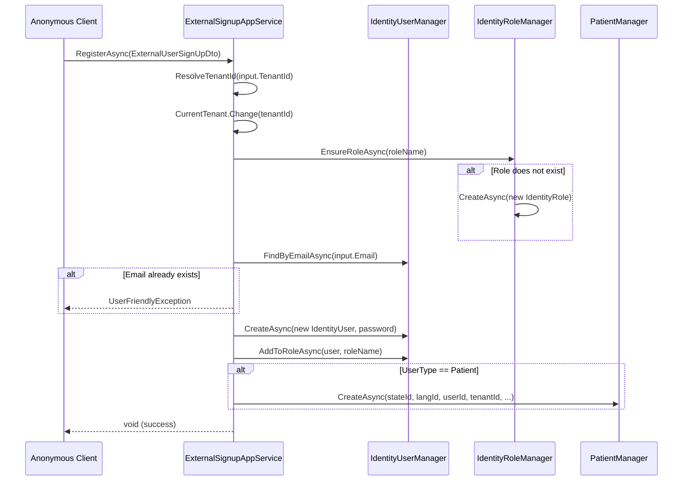
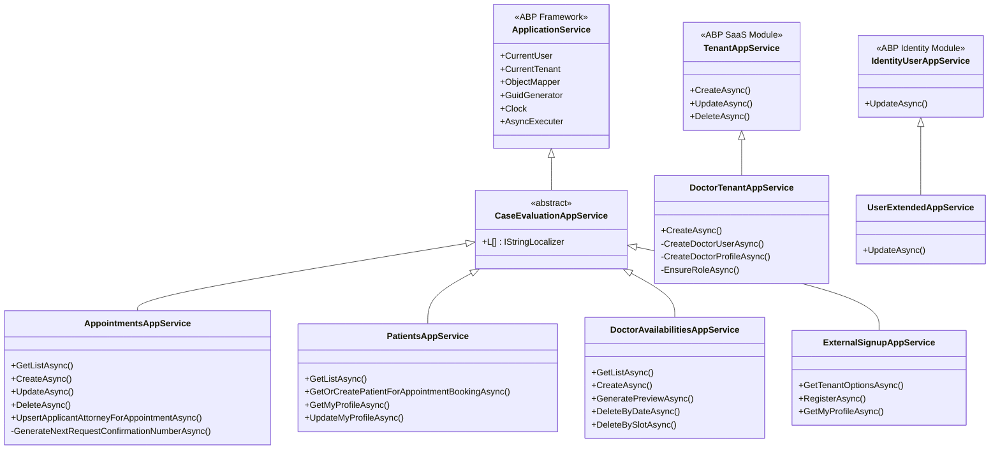

[Home](../INDEX.md) > [Backend](./) > Application Services

# Application Services

> Purpose: Reference for the Application Service layer -- base class, DTO mapping, and per-service inventory. Audience: backend developer. Last verified: 2026-06-01 vs main.

The Application Service layer orchestrates use cases by coordinating domain services, repositories, and infrastructure concerns. All custom application services inherit from a shared base class and follow ABP Framework conventions.

---

## Base Class

```
CaseEvaluationAppService : ApplicationService
```

**File:** `src/HealthcareSupport.CaseEvaluation.Application/CaseEvaluationAppService.cs`

`CaseEvaluationAppService` is an abstract class extending ABP's `ApplicationService`. It sets `LocalizationResource` to `CaseEvaluationResource` in its constructor, giving every derived service access to:

| Member | Description |
|---|---|
| `L[...]` | Localized string accessor (`IStringLocalizer`) |
| `CurrentUser` | Authenticated user info (Id, Roles, TenantId) |
| `CurrentTenant` | Multi-tenant context (Id, Name, `Change()`) |
| `ObjectMapper` | Mapperly-based DTO mapping |
| `GuidGenerator` | Sequential GUID generation |
| `Clock` | Timezone-aware clock abstraction |
| `AsyncExecuter` | Safe async LINQ execution for EF Core |
| `CurrentUnitOfWork` | Access to the ambient Unit of Work |

---

## DTO Mapping with Mapperly

**File:** `src/HealthcareSupport.CaseEvaluation.Application/CaseEvaluationApplicationMappers.cs`

The project uses [Mapperly](https://mapperly.riok.app/) -- a compile-time source generator -- instead of AutoMapper. Each mapper is a `partial class` extending `MapperBase<TSource, TDestination>` and declares two mapping methods:

```csharp
[Mapper]
public partial class AppointmentToAppointmentDtoMappers : MapperBase<Appointment, AppointmentDto>
{
    public override partial AppointmentDto Map(Appointment source);
    public override partial void Map(Appointment source, AppointmentDto destination);
}
```

**AfterMap hooks** resolve display names for lookup DTOs. For example:

| Mapper | AfterMap Logic |
|---|---|
| `IdentityUserToLookupDtoGuidMapper` | `destination.DisplayName = source.Email` |
| `PatientToLookupDtoGuidMapper` | `destination.DisplayName = source.Email` |
| `AppointmentToLookupDtoGuidMapper` | `destination.DisplayName = source.RequestConfirmationNumber` |
| `ApplicantAttorneyToLookupDtoGuidMapper` | `destination.DisplayName = source.FirmName` |
| `StateToLookupDtoGuidMapper` | `destination.DisplayName = source.Name` |
| `LocationToLookupDtoGuidMapper` | `destination.DisplayName = source.Name` |
| `TenantToLookupDtoGuidMapper` | `destination.DisplayName = source.Name` |
| `AppointmentTypeToLookupDtoGuidMapper` | `destination.DisplayName = source.Name` |
| `AppointmentStatusToLookupDtoGuidMapper` | `destination.DisplayName = source.Name` |
| `AppointmentLanguageToLookupDtoGuidMapper` | `destination.DisplayName = source.Name` |

WithNavigationProperties mappers also exist (e.g., `AppointmentWithNavigationPropertiesToAppointmentWithNavigationPropertiesDtoMapper`) to handle the composite DTO pattern described below.

---

## AppService Inventory

The Application project contains **38 feature folders** (Application CLAUDE.md). This document covers the five most complex services in depth. The remaining services follow the standard CRUD pattern described in the [Standard CRUD Services](#standard-crud-services) section below.

**Major services (covered in depth below):**
- `AppointmentsAppService` -- most complex; 24 injected dependencies, multi-step booking pipeline
- `PatientsAppService` -- patient lifecycle, self-service profile, SSN masking, SSN reveal endpoint
- `DoctorAvailabilitiesAppService` -- slot CRUD, bulk generation, slot preview
- `ExternalSignupAppService` -- anonymous self-registration for Patient / Attorney / CE roles
- `DoctorTenantAppService` -- doctor-as-tenant provisioning (extends ABP SaaS `TenantAppService`)
- `UserExtendedAppService` -- syncs Doctor entity when admin edits an IdentityUser
- `AppointmentChangeRequestsAppService` -- change request submission and approval workflow
- `AppointmentDocumentsAppService` -- document upload, acceptance/rejection, packet generation
- `InternalUsersAppService` -- internal staff user management
- `NotificationTemplatesAppService` -- email template CRUD and rendering

---

## AppointmentsAppService

**File:** `src/HealthcareSupport.CaseEvaluation.Application/Appointments/AppointmentsAppService.cs`
**Implements:** `IAppointmentsAppService`
**Authorization:** `[Authorize]` on class, permission-specific attributes on individual methods

This is the most complex service in the application. It coordinates appointment creation with confirmation number generation, capacity-aware slot validation, attorney linkage, and SSN masking on all patient DTO exits.

### Dependencies

The constructor injects **24 dependencies** (verified against the constructor signature):

| Dependency | Purpose |
|---|---|
| `IAppointmentRepository` | Custom repository with navigation property queries |
| `AppointmentManager` | Domain service for appointment create/update logic |
| `IRepository<Patient, Guid>` | Patient entity access |
| `IRepository<IdentityUser, Guid>` | ABP identity user access |
| `IRepository<AppointmentType, Guid>` | Appointment type lookup |
| `IRepository<Location, Guid>` | Location lookup |
| `IRepository<DoctorAvailability, Guid>` | Availability slot access (loaded with M2M `AppointmentTypes`) |
| `IRepository<Doctor, Guid>` | Doctor entity (for filtered lookups) |
| `IRepository<ApplicantAttorney, Guid>` | Applicant attorney entity access |
| `IAppointmentApplicantAttorneyRepository` | Appointment-attorney link repository |
| `ApplicantAttorneyManager` | Domain service for applicant attorney create/update |
| `AppointmentApplicantAttorneyManager` | Domain service for applicant attorney link |
| `IRepository<DefenseAttorney, Guid>` | Defense attorney entity access |
| `IAppointmentDefenseAttorneyRepository` | Appointment-defense-attorney link repository |
| `DefenseAttorneyManager` | Domain service for defense attorney create/update |
| `AppointmentDefenseAttorneyManager` | Domain service for defense attorney link |
| `IRepository<AppointmentInjuryDetail, Guid>` | Injury detail rows (CE visibility filter) |
| `IRepository<AppointmentClaimExaminer, Guid>` | Claim examiner rows (CE visibility filter) |
| `ILocalEventBus` | Publishes `AppointmentStatusChangedEto` + `AppointmentSubmittedEto` |
| `BookingPolicyValidator` | Lead-time and per-type max-time gate |
| `IRepository<AppointmentAccessor, Guid>` | Accessor rows for read-access policy |
| `IRepository<CustomFieldValue, Guid>` | Per-appointment custom-field answers |
| `AppointmentReadAccessGuard` | Shared read-gate (used by documents service too) |
| `IStringLocalizer<CaseEvaluationResource>` | Typed localizer for static helper methods |

### Methods

| Method | Auth | Description |
|---|---|---|
| `GetListAsync(GetAppointmentsInput)` | `[Authorize]` | Paginated list with navigation properties. Applies SSN masking via `SsnVisibility.MaskToLast4` on every returned `PatientDto`. External-role callers see only appointments they are involved on. |
| `GetWithNavigationPropertiesAsync(Guid)` | `[Authorize]` | Single appointment with all navigation properties. Applies read-access guard and SSN masking. |
| `GetByConfirmationNumberAsync(string)` | `[Authorize]` | Lookup by confirmation number. Applies same access guard and SSN masking. |
| `GetAsync(Guid)` | `Appointments.Default` | Single appointment entity (without navigation properties). |
| `CreateAsync(AppointmentCreateDto)` | `Appointments.Create` | Creates appointment. Validates required fields, entity existence, and slot availability (capacity probe + type match + location/date/time checks). Generates confirmation number. Does NOT mutate `DoctorAvailability.BookingStatusId`; slot fullness is determined by active-appointment-count vs `Capacity` at booking time. Publishes `AppointmentStatusChangedEto` + `AppointmentSubmittedEto`. |
| `ReSubmitAsync(string, AppointmentCreateDto)` | `Appointments.Create` | Re-submit against a prior appointment: reuses the source confirmation number. |
| `CreateRevalAsync(string, AppointmentCreateDto)` | `Appointments.Create` | Reval booking: generates a fresh confirmation number, links to source. |
| `UpdateAsync(Guid, AppointmentUpdateDto)` | `[Authorize]` | Updates appointment via `AppointmentManager.UpdateAsync`. On slot change, publishes `AppointmentStatusChangedEto` with old + new slot IDs. |
| `DeleteAsync(Guid)` | `Appointments.Delete` | Publishes `AppointmentStatusChangedEto` (ToStatus = null) then deletes. |
| `GetPendingCountAsync()` | `Appointments.Edit` | Returns count of Pending appointments in the tenant (sidebar badge). |
| `GetApplicantAttorneyDetailsForBookingAsync(Guid?, string?)` | `[Authorize]` | Resolves attorney by IdentityUserId or email. Returns `ApplicantAttorneyDetailsDto` or null. |
| `GetAppointmentApplicantAttorneyAsync(Guid)` | `[Authorize]` | Gets the applicant attorney linked to a specific appointment. |
| `UpsertApplicantAttorneyForAppointmentAsync(Guid, ApplicantAttorneyDetailsDto)` | `[Authorize]` | Creates or updates an `ApplicantAttorney` and its `AppointmentApplicantAttorney` link row. |
| `GetPatientLookupAsync(LookupRequestDto)` | `[Authorize]` | Dropdown lookup for patients (filtered by email; narrowed by role for AA/DA callers). |
| `GetIdentityUserLookupAsync(LookupRequestDto)` | `Appointments.Default` | Dropdown lookup for identity users (filtered by email; narrowed for AA/DA callers). |
| `GetAppointmentTypeLookupAsync(LookupRequestDto)` | `[Authorize]` | Dropdown lookup for appointment types (tenant-scoped; IMultiTenant filter applied). |
| `GetLocationLookupAsync(LookupRequestDto)` | `[Authorize]` | Dropdown lookup for locations (tenant-scoped; IMultiTenant filter applied). |
| `GetDoctorAvailabilityLookupAsync(LookupRequestDto)` | None explicit | Dropdown lookup for doctor availability slots. |

### Confirmation Number Generation

The private method `GenerateNextRequestConfirmationNumberAsync()` produces sequential confirmation numbers:

1. Queries all existing `RequestConfirmationNumber` values matching the pattern `A` + 5 digits (total length 6)
2. Orders descending and takes the first (highest)
3. Parses the numeric portion, increments by 1
4. Formats as `"A" + nextValue.ToString("D5")` -- e.g., `A00001`, `A00002`, ... `A99999`
5. Throws `UserFriendlyException` if the 5-digit limit is exceeded

### CreateAsync Validation Chain

Before creating an appointment, `CreateAsync` validates:

1. Required GUID checks (PatientId, IdentityUserId, AppointmentTypeId, LocationId, DoctorAvailabilityId -- all must be non-empty)
2. Entity existence checks (patient, identity user, appointment type, location, availability slot)
3. AME appointment type requires an attorney caller (Applicant Attorney or Defense Attorney) for external users
4. Slot is not manually closed (`BookingStatus.Reserved` blocks with `AppointmentBookingSlotClosed`)
5. Active-appointment-count for the slot is less than `DoctorAvailability.Capacity` (default 3); fullness throws `AppointmentBookingSlotFull`. `BookingStatus.Booked` is treated as Available -- the count probe is authoritative.
6. If the slot's `AppointmentTypes` collection is non-empty, the requested type must be a member (empty set = any type accepted)
7. Slot's `LocationId` matches the input `LocationId`
8. Slot's `AvailableDate` must match the input `AppointmentDate`
9. Selected time must fall within the slot's `[FromTime, ToTime)` range
10. Lead-time and per-type max-time gates via `BookingPolicyValidator`

After validation passes, the method:
- Generates the next confirmation number (wrapped in `ConfirmationNumberRetryPolicy` to handle concurrent bookings)
- Calls `AppointmentManager.CreateAsync(...)` (domain service) -- status is `Approved` for internal callers, `Pending` for external
- Does **not** mutate `DoctorAvailability.BookingStatusId`; slot capacity is tracked by active-appointment-count
- Publishes `AppointmentStatusChangedEto` (slot sync notification) and `AppointmentSubmittedEto` (email triggers)

### SlotCascadeHandler (log-only stub)

**File:** `src/HealthcareSupport.CaseEvaluation.Domain/Appointments/Handlers/SlotCascadeHandler.cs`

`SlotCascadeHandler` subscribes to `AppointmentStatusChangedEto` but performs **no slot mutations**. After the 2026-05-15 slot rework, `DoctorAvailability.BookingStatusId` is a manual-close override only; the previous 14-state appointment-status to slot-status mapping was removed. The handler logs the transition at `Debug` level and returns. It remains wired so future plans can add side effects without re-wiring ABP's local event bus; downstream notification and audit handlers receive the event unmodified.

---

## PatientsAppService

**File:** `src/HealthcareSupport.CaseEvaluation.Application/Patients/PatientsAppService.cs`
**Implements:** `IPatientsAppService`
**Class-level:** `[RemoteService(IsEnabled = false)]` (not auto-exposed as API -- controller wraps it)

**SSN masking rule:** Every method that returns a `PatientDto` or `PatientWithNavigationPropertiesDto` calls `SsnVisibility.MaskToLast4(dto)` before returning. The SSN is always masked to `***-**-NNNN` on standard payloads. The only exception is `GetFullSsnAsync` (see below).

### Dependencies

| Dependency | Purpose |
|---|---|
| `IPatientRepository` | Custom repository with navigation property queries |
| `PatientManager` | Domain service for patient create/update |
| `IdentityUserManager` | ABP identity user management |
| `IdentityRoleManager` | ABP identity role management |
| `IRepository<State, Guid>` | State lookup |
| `IRepository<AppointmentLanguage, Guid>` | Language lookup |
| `IRepository<IdentityUser, Guid>` | Identity user access |
| `IRepository<Tenant, Guid>` | Tenant lookup |

### Methods

| Method | Auth | Description |
|---|---|---|
| `GetListAsync(GetPatientsInput)` | `Patients.Default` | Paginated list with navigation properties. Supports extensive filtering (name, email, gender, DOB, SSN, phone, etc.). |
| `GetWithNavigationPropertiesAsync(Guid)` | `Patients.Default` | Single patient with navigation properties. |
| `GetPatientForAppointmentBookingAsync(Guid)` | `[Authorize]` | Same as above but with lower permission requirement (any authenticated user). |
| `GetPatientByEmailForAppointmentBookingAsync(string)` | `[Authorize]` | Finds patient by email, returns with navigation properties or null. |
| `GetOrCreatePatientForAppointmentBookingAsync(input)` | `[Authorize]` | If a patient with the given email exists, returns it. Otherwise creates an IdentityUser (with default password), assigns "Patient" role, creates Patient entity, and returns. |
| `GetMyProfileAsync()` | `[Authorize]` | Returns the patient record linked to `CurrentUser.Id`. |
| `UpdateMyProfileAsync(PatientUpdateDto)` | `[Authorize]` | Self-service profile update for the current patient. |
| `GetAsync(Guid)` | `Patients.Default` | Single patient entity. |
| `CreateAsync(PatientCreateDto)` | `Patients.Create` | Admin patient creation via `PatientManager`. |
| `UpdateAsync(Guid, PatientUpdateDto)` | `Patients.Edit` | Admin patient update via `PatientManager`. |
| `UpdatePatientForAppointmentBookingAsync(Guid, PatientUpdateDto)` | `[Authorize]` | Partial update during booking flow -- preserves fields not provided in the input by falling back to current values. |
| `DeleteAsync(Guid)` | `Patients.Delete` | Deletes patient. |
| `GetFullSsnAsync(Guid)` | `Patients.RevealSsn` | Returns the full unmasked SSN in `SsnRevealDto`. Gated by `Patients.RevealSsn` permission AND `SsnRevealAccess.CanReveal` (internal callers OR record owner only). ABP HTTP audit log records each call. This is the ONLY endpoint that returns the full SSN. |
| `GetStateLookupAsync(LookupRequestDto)` | `[Authorize]` | State dropdown lookup. |
| `GetAppointmentLanguageLookupAsync(LookupRequestDto)` | `[Authorize]` | Language dropdown lookup. |
| `GetIdentityUserLookupAsync(LookupRequestDto)` | `Patients.Default` | Identity user dropdown lookup. |
| `GetTenantLookupAsync(LookupRequestDto)` | `Patients.Default` | Tenant dropdown lookup. |

### GetOrCreatePatientForAppointmentBookingAsync Flow

This method supports the attorney-books-on-behalf-of-patient workflow:

1. Search for existing patient by email
2. If found, return immediately
3. If not found, look up or create an `IdentityUser` with the patient's email as username
4. Ensure the "Patient" role exists (create if missing), assign to user
5. Create `Patient` entity via `PatientManager.CreateAsync`
6. Force `SaveChangesAsync` on the current Unit of Work
7. Re-fetch with navigation properties and return

---

## DoctorAvailabilitiesAppService (312 lines)

**File:** `src/HealthcareSupport.CaseEvaluation.Application/DoctorAvailabilities/DoctorAvailabilitiesAppService.cs`
**Implements:** `IDoctorAvailabilitiesAppService`
**Authorization:** `[Authorize]` on class

### Dependencies

| Dependency | Purpose |
|---|---|
| `IDoctorAvailabilityRepository` | Custom repository with navigation property queries |
| `DoctorAvailabilityManager` | Domain service for availability create/update |
| `IRepository<Location, Guid>` | Location lookup and name resolution |
| `IRepository<AppointmentType, Guid>` | Appointment type lookup |

### Methods

| Method | Auth | Description |
|---|---|---|
| `GetListAsync(GetDoctorAvailabilitiesInput)` | `[Authorize]` | Paginated list with navigation properties. Filters by date range, time range, booking status, location, appointment type. |
| `GetWithNavigationPropertiesAsync(Guid)` | `DoctorAvailabilities.Default` | Single slot with navigation properties. |
| `GetAsync(Guid)` | `DoctorAvailabilities.Default` | Single slot entity. |
| `CreateAsync(DoctorAvailabilityCreateDto)` | `DoctorAvailabilities.Create` | Creates a single availability slot via `DoctorAvailabilityManager`. |
| `UpdateAsync(Guid, DoctorAvailabilityUpdateDto)` | `DoctorAvailabilities.Edit` | Updates a single slot via `DoctorAvailabilityManager`. |
| `DeleteAsync(Guid)` | `DoctorAvailabilities.Delete` | Deletes a single slot. |
| `DeleteBySlotAsync(DoctorAvailabilityDeleteBySlotInputDto)` | `DoctorAvailabilities.Delete` | Bulk delete: removes all slots matching a specific location + date + time range. |
| `DeleteByDateAsync(DoctorAvailabilityDeleteByDateInputDto)` | `DoctorAvailabilities.Delete` | Bulk delete: removes all slots for a given location + date. |
| `GeneratePreviewAsync(List<DoctorAvailabilityGenerateInputDto>)` | `DoctorAvailabilities.Default` | Preview slot generation without saving. |
| `GetLocationLookupAsync(LookupRequestDto)` | `DoctorAvailabilities.Default` | Location dropdown lookup. |
| `GetAppointmentTypeLookupAsync(LookupRequestDto)` | `DoctorAvailabilities.Default` | Appointment type dropdown lookup. |

### Bulk Slot Generation (GeneratePreviewAsync)

`GeneratePreviewAsync` accepts a list of generation inputs, each specifying:
- `FromDate` / `ToDate` -- date range
- `FromTime` / `ToTime` -- time window within each day
- `AppointmentDurationMinutes` -- slot length
- `LocationId`, `AppointmentTypeId`, `BookingStatusId`

**Algorithm:**
1. Validates all inputs (duration > 0, date range valid, time range valid, location required)
2. Queries existing availability slots in the date range
3. Iterates each day in the range, slicing the time window into individual slots of the specified duration
4. Groups generated slots by date
5. Detects conflicts with existing slots:
   - **Same location overlap** or **Available status overlap** -- marks as conflict
   - **Booked/Reserved overlap** -- marks as conflict with a different validation message
6. Returns `List<DoctorAvailabilitySlotsPreviewDto>` with conflict flags for UI display

---

## ExternalSignupAppService (267 lines)

**File:** `src/HealthcareSupport.CaseEvaluation.Application/ExternalSignups/ExternalSignupAppService.cs`
**Implements:** `IExternalSignupAppService`
**No class-level authorization** -- individual methods specify their own

This service handles self-registration for external users (patients, attorneys).

### Methods

| Method | Auth | Description |
|---|---|---|
| `GetTenantOptionsAsync(string?)` | `[AllowAnonymous]` | Returns list of tenants (doctors) for signup selection. Only returns results when no tenant context is active. |
| `GetExternalUserLookupAsync(string?)` | Implicit (authenticated) | Lists users in "Patient", "Applicant Attorney", or "Defense Attorney" roles, excluding current user. |
| `GetMyProfileAsync()` | `[Authorize]` | Returns the current user's basic profile and role. |
| `RegisterAsync(ExternalUserSignUpDto)` | `[AllowAnonymous]` | Full registration flow (see below). |

### RegisterAsync Flow

1. Resolve tenant: use `CurrentTenant.Id` if present, otherwise require `input.TenantId`
2. Switch tenant context via `CurrentTenant.Change(tenantId)`
3. Ensure the target role exists (create if missing)
4. Check for duplicate email -- throw if already registered
5. Create `IdentityUser` with email as username, provided password
6. Assign role based on `ExternalUserType`:
   - `Patient` -> "Patient" role + creates `Patient` entity via `PatientManager`
   - `ClaimExaminer` -> "Claim Examiner" role
   - `ApplicantAttorney` -> "Applicant Attorney" role
   - `DefenseAttorney` -> "Defense Attorney" role
7. Only `Patient` type creates an additional domain entity; other types only get an IdentityUser + role

---

## DoctorTenantAppService (147 lines)

**File:** `src/HealthcareSupport.CaseEvaluation.Application/Doctors/DoctorTenantAppService.cs`
**Extends:** `TenantAppService` (ABP SaaS module)

This service manages the doctor-as-tenant lifecycle. When a new doctor is created through the admin panel, it provisions a full tenant with user and doctor profile.

### Dependencies

| Dependency | Purpose |
|---|---|
| `IdentityUserManager` | Create/update doctor's admin user |
| `IdentityRoleManager` | Ensure "Doctor" role exists in tenant |
| `IRepository<Doctor, Guid>` | Doctor entity CRUD |
| `IUnitOfWorkManager` | Explicit UoW for tenant creation |

### Overridden Method: CreateAsync

```
override CreateAsync(SaasTenantCreateDto input) -> SaasTenantDto
```

1. Validates input (Name, AdminPassword, AdminEmailAddress required)
2. Creates ABP Tenant via `base.CreateAsync(input)` inside a new non-transactional Unit of Work
3. Switches to the new tenant context
4. Creates or updates the admin `IdentityUser` for the tenant
5. Creates or updates the `Doctor` entity linked to that user
6. Ensures the "Doctor" role exists in the tenant

### Private Methods

| Method | Description |
|---|---|
| `CreateDoctorUserAsync(input)` | Finds existing user by email or creates new one with provided password |
| `CreateDoctorProfileAsync(user, input)` | Finds existing Doctor by `IdentityUserId` or creates a new Doctor entity |
| `EnsureRoleAsync(roleName)` | Creates the role if it does not already exist |

---

## UserExtendedAppService (54 lines)

**File:** `src/HealthcareSupport.CaseEvaluation.Application/Users/UserExtendedAppService.cs`
**Extends:** `IdentityUserAppService` (ABP Identity module)

This service extends ABP's built-in user management to keep `Doctor` entities in sync when an admin edits a user.

### Overridden Method: UpdateAsync

```
override UpdateAsync(Guid id, IdentityUserUpdateDto input) -> IdentityUserDto
```

1. Calls `base.UpdateAsync(id, input)` to update the IdentityUser
2. Looks up a `Doctor` entity by `IdentityUserId`
3. If a Doctor exists, syncs `FirstName` (from `input.Name`), `LastName` (from `input.Surname`), and `Email` (from `input.Email`)
4. Saves the Doctor entity with `autoSave: true`

---

## Standard CRUD Services

The following services follow a consistent pattern with `GetListAsync`, `GetAsync`, `CreateAsync`, `UpdateAsync`, `DeleteAsync`, and lookup methods for dropdowns:

| Service | Entity | Notable Features |
|---|---|---|
| `LocationsAppService` | Location | WithNavigationProperties (State) |
| `StatesAppService` | State | Excel export support |
| `AppointmentTypesAppService` | AppointmentType | Excel export support |
| `AppointmentStatusesAppService` | AppointmentStatus | Simple name/description |
| `AppointmentLanguagesAppService` | AppointmentLanguage | Simple name |
| `WcabOfficesAppService` | WcabOffice | WithNavigationProperties (State) |
| `AppointmentEmployerDetailsAppService` | AppointmentEmployerDetail | WithNavigationProperties (Appointment) |
| `AppointmentAccessorsAppService` | AppointmentAccessor | WithNavigationProperties (Appointment, IdentityUser) |
| `ApplicantAttorneysAppService` | ApplicantAttorney | WithNavigationProperties (State, IdentityUser) |
| `AppointmentApplicantAttorneysAppService` | AppointmentApplicantAttorney | WithNavigationProperties (Appointment, ApplicantAttorney, IdentityUser) |

Each service:
- Inherits from `CaseEvaluationAppService`
- Uses `[RemoteService(IsEnabled = false)]` (controllers wrap them)
- Delegates create/update to the corresponding domain Manager
- Uses `ObjectMapper` (Mapperly) for entity-to-DTO mapping
- Provides lookup endpoints returning `PagedResultDto<LookupDto<Guid>>` for related entity dropdowns

---

## WithNavigationProperties Pattern

Services frequently return `*WithNavigationPropertiesDto` types that bundle an entity with its related entities in a single response. This avoids N+1 queries.

**How it works:**

1. The custom repository (e.g., `IAppointmentRepository`) defines `GetListWithNavigationPropertiesAsync` which executes a single query with joins
2. The repository returns a domain-level container (e.g., `AppointmentWithNavigationProperties`) containing the root entity plus its related entities
3. A Mapperly mapper converts the container to a DTO (e.g., `AppointmentWithNavigationPropertiesDto`)

**Example flow:**

```
AppService.GetListAsync(input)
  -> Repository.GetListWithNavigationPropertiesAsync(...)    // Single SQL query with JOINs
  -> returns List<AppointmentWithNavigationProperties>       // Domain container
  -> ObjectMapper.Map<..., ...>(items)                       // Mapperly compile-time mapping
  -> returns List<AppointmentWithNavigationPropertiesDto>    // DTO for client
```

---

## Diagrams

### Appointment Creation Sequence

```mermaid
sequenceDiagram
    participant Client
    participant AppService as AppointmentsAppService
    participant Manager as AppointmentManager
    participant Repo as AppointmentRepository
    participant AvailRepo as DoctorAvailabilityRepository
    participant Bus as ILocalEventBus

    Client->>AppService: CreateAsync(AppointmentCreateDto)
    AppService->>AppService: ValidateCreateGuids (5 Guid.Empty checks)
    AppService->>Repo: Verify Patient, User, Type, Location exist
    AppService->>AvailRepo: WithDetailsAsync(AppointmentTypes) for slot
    AppService->>AppService: ValidateDoctorAvailabilityForBookingAsync
    Note right of AppService: Reserved=closed; active-count>=Capacity=full; type membership; location/date/time
    AppService->>AppService: BookingPolicyValidator (lead-time + max-time)
    AppService->>Repo: Query max RequestConfirmationNumber
    AppService->>AppService: GenerateNextRequestConfirmationNumberAsync()
    Note right of AppService: e.g., "A00001" -> "A00002" (retried up to 5x on collision)
    AppService->>Manager: CreateAsync(patientId, userId, typeId, locationId, slotId, date, confirmationNumber, initialStatus, ...)
    Manager->>Repo: InsertAsync(appointment)
    Manager-->>AppService: Appointment entity
    Note right of AppService: Slot BookingStatusId is NOT mutated; capacity tracked by active-count
    AppService->>Bus: PublishAsync(AppointmentStatusChangedEto)
    AppService->>Bus: PublishAsync(AppointmentSubmittedEto)
    AppService->>AppService: ObjectMapper.Map -> AppointmentDto
    AppService-->>Client: AppointmentDto
```

### External Signup Sequence



### Application Service Class Hierarchy



---

## Related Documentation

- [Permissions](PERMISSIONS.md) -- Permission constants referenced in `[Authorize]` attributes
- [API Architecture](../api/API-ARCHITECTURE.md) -- HTTP controller layer and routing conventions
- [Angular Architecture](../frontend/ANGULAR-ARCHITECTURE.md) -- Angular project structure and proxy generation
- [Enums and Constants](ENUMS-AND-CONSTANTS.md) -- `AppointmentStatusType`, `BookingStatus`, and other shared enums
