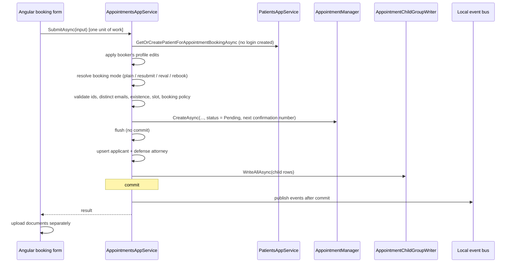
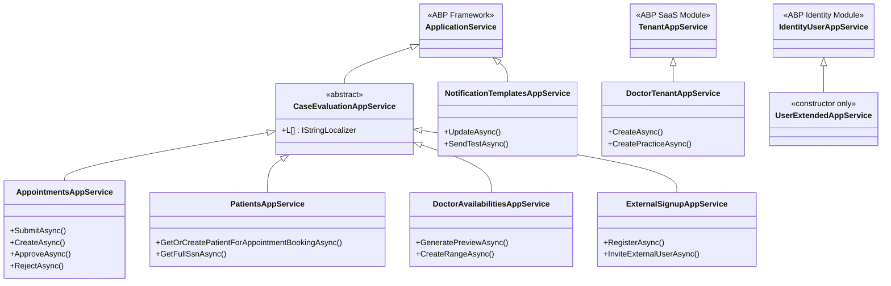

[Home](../INDEX.md) > [Backend](./) > Application Services

# Application Services

> Purpose: what the Application layer's main services do and how their flows work. Audience: backend developer.

The Application layer orchestrates use cases: it coordinates domain managers, repositories and infrastructure, and hands
DTOs to the HTTP layer.

---

## How to use this page

This page explains **flows and intent**, the things code does not say by itself. For facts that code states exactly, go
to the code or to a generated artefact instead, because a hand-copied list goes stale on the next change:

- **What guards a method.** Read the generated snapshot
  `test/HealthcareSupport.CaseEvaluation.Application.Tests/Authorization/authorization-surface.approved.txt`. It lists
  every public application-service method with its class and method guard, and a test fails when it drifts. See
  [AUTHORIZATION.md](../security/AUTHORIZATION.md) for how to read it. A permission is not access to a particular record:
  per-record access is decided in code, by guards such as `AppointmentReadAccessGuard`.
- **What a service depends on.** Read its constructor.
- **How big a service is.** Run `wc -l` on it.

The method tables below give each public method's purpose, not its guard.

---

## Base class

```text
CaseEvaluationAppService : ApplicationService
```

**File:** `src/HealthcareSupport.CaseEvaluation.Application/CaseEvaluationAppService.cs`

`CaseEvaluationAppService` is an abstract class extending ABP's `ApplicationService`. It sets `LocalizationResource` to
`CaseEvaluationResource`, giving every derived service access to:

| Member | Description |
|---|---|
| `L[...]` | Localized string accessor (`IStringLocalizer`) |
| `CurrentUser` | Authenticated user info (Id, Roles, TenantId) |
| `CurrentTenant` | Multi-tenant context (Id, Name, `Change()`) |
| `ObjectMapper` | Mapperly-based DTO mapping |
| `GuidGenerator` | Sequential GUID generation |
| `Clock` | Timezone-aware clock abstraction |
| `AsyncExecuter` | Safe async LINQ execution for EF Core |
| `CurrentUnitOfWork` | Access to the ambient Unit of Work |

Not every service derives from it:

- `NotificationTemplatesAppService` and `SystemParametersAppService` extend `ApplicationService` directly;
- `DoctorTenantAppService` extends ABP SaaS's `TenantAppService`;
- `UserExtendedAppService` extends ABP Identity's `IdentityUserAppService`.

---

## DTO mapping with Mapperly

**Files:** `src/HealthcareSupport.CaseEvaluation.Application/CaseEvaluationApplicationMappers.cs`, plus five partial files
beside it:

- `CaseEvaluationApplicationMappers.AppointmentChangeRequests.cs`;
- `.CustomFields.cs`;
- `.DoctorPreferredLocations.cs`;
- `.NotificationTemplates.cs`;
- `.PackageDetails.cs`.

The project uses [Mapperly](https://mapperly.riok.app/), a compile-time source generator, through `Volo.Abp.Mapperly`.
AutoMapper is not used. Each mapper is a `partial class` extending `MapperBase<TSource, TDestination>`:

```csharp
[Mapper]
public partial class AppointmentToAppointmentDtoMappers : MapperBase<Appointment, AppointmentDto>
{
    public override partial AppointmentDto Map(Appointment source);
    public override partial void Map(Appointment source, AppointmentDto destination);
}
```

`ObjectMapper.Map<,>()` is the intended call path for services; it dispatches to these generated mappers.

The WithNavigationProperties mappers use `[Mapper(RequiredMappingStrategy = RequiredMappingStrategy.None)]`. That way a
DTO property with no source member does not fail the build.

**AfterMap hooks** set the display name on lookup DTOs:

| Mapper | AfterMap logic |
|---|---|
| `IdentityUserToLookupDtoGuidMapper` | `destination.DisplayName = source.Email` |
| `PatientToLookupDtoGuidMapper` | `destination.DisplayName = source.Email` |
| `AppointmentToLookupDtoGuidMapper` | `destination.DisplayName = source.RequestConfirmationNumber` |
| `ApplicantAttorneyToLookupDtoGuidMapper` | `destination.DisplayName = source.FirmName ?? string.Empty` |
| `StateToLookupDtoGuidMapper` | `destination.DisplayName = source.Name` |
| `LocationToLookupDtoGuidMapper` | `destination.DisplayName = source.Name` |
| `TenantToLookupDtoGuidMapper` | `destination.DisplayName = source.Name` |
| `AppointmentTypeToLookupDtoGuidMapper` | `destination.DisplayName = source.Name` |
| `AppointmentStatusToLookupDtoGuidMapper` | `destination.DisplayName = source.Name` |
| `AppointmentLanguageToLookupDtoGuidMapper` | `destination.DisplayName = source.Name` |

---

## How services reach HTTP

The HTTP API host registers conventional controllers for the whole Application assembly. So an application service is
exposed automatically, at `api/app/{name}`, unless it opts out.

- **The convention.** A service carries `[RemoteService(IsEnabled = false)]`, and a hand-written controller in
  `src/HealthcareSupport.CaseEvaluation.HttpApi/Controllers/` wraps it.
- **The exceptions.** Some services have no such attribute and are served by the conventional controller. One example
  is `DoctorTenantAppService`, at `/api/app/doctor-tenant`. Others, like `ExternalSignupAppService`, lack the attribute
  but also have a hand-written controller. To list them:

```bash
git grep -L "RemoteService(IsEnabled = false)" -- 'src/HealthcareSupport.CaseEvaluation.Application/*AppService.cs'
```

A method-level `[RemoteService(IsEnabled = false)]` takes one method off the HTTP surface. So an entry in the
authorization snapshot is not, by itself, proof of a reachable endpoint.

---

## Services covered on this page

| Service | What it owns |
|---|---|
| `AppointmentsAppService` | Booking (single transaction), reading and updating appointments, approve / reject |
| `PatientsAppService` | Patient records, the booking-time patient lookup and create, the self-service profile, SSN reveal |
| `DoctorAvailabilitiesAppService` | Availability slots: CRUD, bulk generation preview and save, schedule views |
| `ExternalSignupAppService` | External self-registration and the external-user invitation lifecycle |
| `DoctorTenantAppService` | Creating an office: the tenant, its own database, and its branding |
| `UserExtendedAppService` | A seam over ABP's identity user service; it adds no behaviour |
| `AppointmentChangeRequestsAppService` and siblings | Cancellation and reschedule requests, their approval, and two-sided consent |
| `AppointmentDocumentsAppService` and `AppointmentPacketsAppService` | Document upload and review, and the generated packets |
| `InternalUsersAppService` | Creating and listing internal staff, and staff password resets |
| `NotificationTemplatesAppService` | Editing notification templates, test sends, and the variable catalogue |

The remaining services follow the [standard CRUD pattern](#standard-crud-services).

---

## AppointmentsAppService

**File:** `src/HealthcareSupport.CaseEvaluation.Application/Appointments/AppointmentsAppService.cs`
**Class attributes:** `[RemoteService(IsEnabled = false)]`, `[Authorize]`

It books appointments, reads them with SSN masking and per-row access checks, updates them, and moves them out of
Pending.

### Methods

| Method | Purpose |
|---|---|
| `GetListAsync` | Paged list with navigation properties. Every returned patient is SSN-masked; external callers see only appointments they may see. |
| `GetStatusCountsAsync` | Appointment counts by status. |
| `GetWithNavigationPropertiesAsync` | One appointment with navigation properties, behind the read-access guard, SSN-masked. |
| `GetAppointmentCustomFieldValuesAsync` | The custom-field answers recorded for an appointment. |
| `GetAsync` | One appointment entity, without navigation properties. |
| `GetByConfirmationNumberAsync` | Look up an appointment by its confirmation number, with the same guard and masking. |
| `SubmitAsync` | **The booking entry point the SPA uses.** One transaction; see [Booking](#booking-submitasync). |
| `CreateAsync` | Create one appointment from a create DTO, for API callers. Runs the same validation as `SubmitAsync`. |
| `ReSubmitAsync` | Book again against a prior appointment, identified by its confirmation number (resubmit flow). |
| `CreateRevalAsync` | Book a re-evaluation against a prior appointment. |
| `CreateReBookAsync` | Rebook against a prior appointment. |
| `UpdateAsync` | Update an appointment through `AppointmentManager.UpdateAsync`. |
| `DeleteAsync` | Delete an appointment. |
| `ApproveAsync` | Approve a Pending appointment. |
| `RejectAsync` | Reject a Pending appointment. |
| `GetPendingCountAsync` | Number of Pending appointments in the current office. |
| `GetApplicantAttorneyDetailsForBookingAsync` | Resolve applicant-attorney details for the booking form. |
| `GetAppointmentApplicantAttorneyAsync` | The applicant attorney linked to an appointment. |
| `UpsertApplicantAttorneyForAppointmentAsync` | Create or update the applicant attorney and its link row. |
| `GetDefenseAttorneyDetailsForBookingAsync` | Resolve defense-attorney details for the booking form. |
| `GetAppointmentDefenseAttorneyAsync` | The defense attorney linked to an appointment. |
| `UpsertDefenseAttorneyForAppointmentAsync` | Create or update the defense attorney and its link row. |
| `GetPatientLookupAsync` | Patient dropdown lookup. |
| `GetIdentityUserLookupAsync` | Identity-user dropdown lookup. |
| `GetAppointmentTypeLookupAsync` | Appointment-type dropdown lookup. |
| `GetLocationLookupAsync` | Location dropdown lookup. |
| `GetDoctorAvailabilityLookupAsync` | Availability-slot dropdown lookup. |

### Booking (`SubmitAsync`)

`SubmitAsync` carries `[UnitOfWork]`, so a throw anywhere rolls back the patient, the appointment and every child row
together. In order:

1. **Resolve the patient** (`ResolvePatientForSubmitAsync`). It uses the supplied patient id, or
   `PatientsAppService.GetOrCreatePatientForAppointmentBookingAsync`
   (see [PatientsAppService](#getorcreatepatientforappointmentbookingasync)).
2. **Apply the booker's edits** to that patient's profile (`ApplyPatientUpdateForSubmitAsync`).
3. **Resolve the booking mode** (`ResolveSubmitLifecycleAsync`): a plain booking, a resubmit, a re-evaluation or a
   rebook. Every mode but plain needs a source confirmation number, and an unmapped mode throws.
4. **Create the appointment** (`CreateAppointmentInternalAsync`), then flush without committing.
5. **Upsert the applicant and defense attorneys**, then write the child rows (`AppointmentChildGroupWriter.WriteAllAsync`).
6. **Publish events only after the commit.** Handlers run inline at publish, so they are deferred to the unit of work's
   completion.
7. **Map failures.** A concurrency conflict, or a failure that already carries an error code, becomes a coded
   `BusinessException`.

Documents are uploaded after `SubmitAsync` returns, because a blob upload cannot join a database transaction.

### Validation before create

`CreateAppointmentInternalAsync` checks, in this order:

1. **Required ids:** PatientId, AppointmentTypeId, LocationId and DoctorAvailabilityId. `IdentityUserId` is optional,
   because a booking can be for a patient with no login; it is rejected only if explicitly empty.
2. **Distinct emails:** the patient, applicant-attorney and defense-attorney emails must differ, so notifications reach
   the right party.
3. **Existence:** the patient, the identity user when given, the appointment type, the location and the slot.
4. **The slot**:
   - a slot in `BookingStatus.Reserved` is manually closed;
   - an active-appointment count at or above the slot's `Capacity` means full;
   - if the slot names appointment types, the requested type must be one of them;
   - the slot's location and date must match;
   - the time must fall in `[FromTime, ToTime)`.
5. **Booking policy:** the lead-time and per-type maximum-horizon gates (`BookingPolicyValidator`). Internal bookers
   have their own horizon.

A booking does **not** change the slot's `BookingStatusId`. Capacity is the active-appointment count.

### Initial status

**Every booking starts `Pending`**, whoever books it. The earlier internal create-as-Approved path was removed: it fired
approval side effects before the attorney and child rows existed, and it bypassed the injury and claim-examiner approval
gates. `ApproveAsync` and `RejectAsync` are this service's transitions out of Pending. After approval the appointment goes
to the Case Tracker, which owns what happens next.

### Confirmation numbers

Numbers look like `A00042`: an `A` plus five digits, allocated per office by `RequestConfirmationNumberGenerator`
(`Appointments/RequestConfirmationNumberGenerator.cs`). Booking and reschedule finalize both use it.

- It reads the current maximum with the soft-delete filter off. A deleted appointment's number is never reused, so the
  sequence has gaps; that is correct.
- It is not collision-proof by itself. Every caller goes through `ConfirmationNumberRetryPolicy`, which retries on a
  unique-index violation, up to five attempts.
- It throws a `UserFriendlyException` if the five digits are exhausted.

### SlotCascadeHandler (log-only)

**File:** `src/HealthcareSupport.CaseEvaluation.Domain/Appointments/Handlers/SlotCascadeHandler.cs`

`SlotCascadeHandler` subscribes to `AppointmentStatusChangedEto`, but performs **no slot changes**. Since the 2026-05-15
slot rework, `DoctorAvailability.BookingStatusId` is only a manual-close override. The handler logs the transition at
`Debug` and returns. It stays wired so later work can add side effects without re-wiring the event bus.

---

## PatientsAppService

**File:** `src/HealthcareSupport.CaseEvaluation.Application/Patients/PatientsAppService.cs`
**Class attributes:** `[RemoteService(IsEnabled = false)]`; a hand-written controller wraps it.

**SSN masking.** Every method returning a `PatientDto` or `PatientWithNavigationPropertiesDto` calls
`SsnVisibility.MaskToLast4`. `GetFullSsnAsync` is the only method that returns the full SSN.

**Host-context reads.** `Patient` is multi-tenant. In host context (`CurrentTenant.Id == null`), ABP's filter would
exclude every office's rows. So reads wrap the query in `IDataFilter<IMultiTenant>.Disable()` when no office is current,
which is how host and IT Admin paths see patients. Inside an office, the filter applies as normal.

### Methods

| Method | Purpose |
|---|---|
| `GetListAsync` | Paged, filterable patient list with navigation properties. |
| `GetWithNavigationPropertiesAsync` | One patient with navigation properties. |
| `GetAsync` | One patient entity. |
| `GetPatientForAppointmentBookingAsync` | One patient for the booking form. |
| `GetPatientByEmailForAppointmentBookingAsync` | Find a patient by email for the booking form, or null. |
| `GetOrCreatePatientForAppointmentBookingAsync` | Find or create the booking's patient record; see below. |
| `UpdatePatientForAppointmentBookingAsync` | Partial update during booking: fields the input omits keep their current values. |
| `GetMyProfileAsync` | The patient record linked to the current user. |
| `UpdateMyProfileAsync` | Self-service update of the current user's patient record. |
| `CreateAsync` | Create a patient through `PatientManager`. |
| `UpdateAsync` | Update a patient through `PatientManager`. |
| `DeleteAsync` | Delete a patient. Refused with `PatientInUse` while any appointment references it. |
| `GetFullSsnAsync` | The unmasked SSN. It also requires `SsnRevealAccess.CanReveal`: an internal caller, or the record's owner. |
| `GetStateLookupAsync` | State dropdown lookup. |
| `GetAppointmentLanguageLookupAsync` | Language dropdown lookup. |
| `GetIdentityUserLookupAsync` | Identity-user dropdown lookup. |
| `GetTenantLookupAsync` | Office dropdown lookup. |

### GetOrCreatePatientForAppointmentBookingAsync

Booking creates a patient **record**, never a login. It mints no IdentityUser, grants no role and sets no password. The
patient claims a login later, through the registration link in the appointment email;
`ExternalSignupAppService.RegisterAsync` then links the record by email and grants the Patient role.

1. **Email fast path.** If the email matches an existing patient, return it. The email is optional; a blank email skips
   this step.
2. **Three-of-six duplicate check.** Fetch candidates that match on any of last name, date of birth, phone, email or
   SSN, and return one that matches on at least three fields. This catches a returning patient under a different email.
3. **Create or find.** Otherwise call `PatientManager.FindOrCreateAsync` with no identity user. It runs its own
   three-of-six match as a safety net, and inserts a new record only if that also finds nothing.

---

## DoctorAvailabilitiesAppService

**File:** `src/HealthcareSupport.CaseEvaluation.Application/DoctorAvailabilities/DoctorAvailabilitiesAppService.cs`
**Class attributes:** `[RemoteService(IsEnabled = false)]`, `[Authorize]`

### Methods

| Method | Purpose |
|---|---|
| `GetListAsync` | Paged slot list with navigation properties; filters on date, time, status, location and type. |
| `GetWithNavigationPropertiesAsync` | One slot with navigation properties. |
| `GetAsync` | One slot entity. |
| `CreateAsync` | Create one slot through `DoctorAvailabilityManager`. |
| `UpdateAsync` | Update one slot through `DoctorAvailabilityManager`. |
| `DeleteAsync` | Delete one slot. |
| `DeleteBySlotAsync` | Delete the slots matching a location, date and time range. |
| `DeleteByDateAsync` | Delete the slots for a location and date. |
| `GeneratePreviewAsync` | Preview bulk slot generation without saving; see below. |
| `CreateRangeAsync` | Save a generated range, all-or-nothing, in one unit of work. |
| `GetDoctorAvailabilityLookupAsync` | Slot lookup for pickers. |
| `GetSlotPatientNamesAsync` | Patient names for a set of slots. |
| `GetScheduleAsync` | Schedule view of slots. |
| `GetLocationLookupAsync` | Location dropdown lookup. |
| `GetAppointmentTypeLookupAsync` | Appointment-type dropdown lookup. |

### Bulk generation

`GeneratePreviewAsync` takes **one** `DoctorAvailabilityGenerateInputDto`, and `CreateRangeAsync` saves what it
produces. The input carries:

- `FromDate` / `ToDate`, the date range, optionally narrowed by `SelectedDays` (weekdays);
- `SelectedDates`, explicit dates, which override the date range when present;
- `TimeRanges`, a list of `FromTime` / `ToTime` windows, each with an optional per-range slot length;
- `AppointmentDurationMinutes`, the default slot length (15);
- `LocationId`, `BookingStatusId` and `Capacity` (default 3);
- `AppointmentTypeIds`, where an empty list means any type.

**Conflicts.** Existing slots are read for the input's location only, so the location is a precondition, not a
condition. An overlap with a `Reserved` slot is reported as `DoctorAvailability:GenerationConflictReserved`; an overlap
with a slot in any other status, `Booked` included, is reported as `DoctorAvailability:GenerationConflictExists`.

---

## ExternalSignupAppService

**File:** `src/HealthcareSupport.CaseEvaluation.Application/ExternalSignups/ExternalSignupAppService.cs`
**Class attributes:** none. Each method declares its own guard. The hand-written controller serves it at
`api/public/external-signup`.

### Methods

| Method | Purpose |
|---|---|
| `RegisterAsync` | Self-registration for Patient, Applicant Attorney, Defense Attorney or Claim Examiner; see below. |
| `GetTenantOptionsAsync` | The office picker for staff inviting an external user: every office at host scope, nothing inside an office. |
| `ResolveTenantByNameAsync` | Resolve an office name to its id, for invite links that carry the name. |
| `GetExternalUserLookupAsync` | Search external users; see the rules below. |
| `GetMyProfileAsync` | The current external user's basic profile and role. |
| `InviteExternalUserAsync` | Invite an external user to register in an office. |
| `GetInvitesAsync` | Paged list of invitations. |
| `ResendInviteAsync` | Re-send an invitation. |
| `RevokeInviteAsync` | Revoke an invitation. |
| `ValidateInviteAsync` | Check an invitation token before the registration form uses it. |
| `GetActiveInvitedEmailsAsync` | Which of a set of emails hold an open, unexpired invitation. |
| `SendPortalLinkAsync` | Email an existing account holder a link to their office's portal. |
| `MarkEmailConfirmedAsync` | Development only: mark an email as confirmed. Throws outside Development. |
| `DeleteTestUsersAsync` | Development only: delete test users and their dependent records. Throws outside Development. |

### RegisterAsync

1. **Invitation first.** When an invite token is present, it is validated first. The office, email and user type then
   come from the invitation, not from the form, so a tampered form cannot register a different identity.
2. **The office.** The current office if one is resolved; otherwise the office the form supplies.
3. **The user.** Inside that office, ensure the role exists, refuse an email that is already registered (with a generic
   message), and create the `IdentityUser`.
4. **The master record** for the chosen type:
   - Patient claims the unclaimed patient record with that email, left by an earlier booking, or creates one;
   - Applicant Attorney, Defense Attorney and Claim Examiner each create a master record, or adopt an existing one with
     that email. Without this, a second registration would duplicate the master and hit its unique email index.
5. **Link past appointments.** `AutoLinkAppointmentsForUserAsync` links appointments that already name this email under
   this role.
6. **Accept the invitation.** An invited registration accepts the invitation and is email-confirmed at once, because
   the token already proved the address.

### External user lookup

- A blank filter returns an empty list.
- An external-only caller is routed to a co-party lookup, which returns only people on appointments the caller can
  already see.
- Internal staff search the four external roles: Patient, Applicant Attorney, Defense Attorney and Claim Examiner.

---

## DoctorTenantAppService

**File:** `src/HealthcareSupport.CaseEvaluation.Application/Doctors/DoctorTenantAppService.cs`
**Extends:** `TenantAppService` (ABP SaaS)

It creates an office. Under database-per-office, that means three things: the SaaS tenant, the office's own database,
and its host-side branding. The service is served at `/api/app/doctor-tenant`.

### Entry points

| Method | Route | Purpose |
|---|---|---|
| `CreatePracticeAsync` | `POST /api/app/doctor-tenant/practice` | The New Practice form. Creates the tenant, its database with the owner doctor, and the office display name. |
| `CreateAsync` (override) | `POST /api/app/doctor-tenant` | Creates the tenant and its database, with no doctor details. |

The other tenant operations (update, delete, connection strings) are inherited from `TenantAppService`.

### How an office is created

1. **Derive the slug.** The office name is its subdomain and its database-name token, so it must be one DNS-safe label.
   The reserved name `admin` is refused.
2. **Build and check the connection string.** Build the office's connection string and check that its server is
   reachable before creating anything.
3. **Create the tenant.** In one host transaction, create the tenant and store its connection string. A failure rolls
   back the tenant, and no database is provisioned.
4. **Provision the database.** Call `IOfficeDatabaseProvisioner.ProvisionAsync` outside that transaction, because a
   separate database cannot share it. It creates the office database and seeds it, including the admin user and, for New
   Practice, the owner doctor. If provisioning fails, the tenant row remains, and a retry completes it, because the
   seeders are idempotent.
5. **Brand the office (New Practice only).** Create or update the host-side `OfficeBranding` display name. This runs in
   host scope, because branding is read by subdomain before sign-in.

---

## UserExtendedAppService

**File:** `src/HealthcareSupport.CaseEvaluation.Application/Users/UserExtendedAppService.cs`

A constructor-only subclass of ABP Identity's `IdentityUserAppService`. It overrides nothing. It is kept as a seam for
future identity hooks, and editing a user through it touches no `Doctor` row.

---

## Change requests (cancel and reschedule)

Three services, in `src/HealthcareSupport.CaseEvaluation.Application/AppointmentChangeRequests/`:

| Class | File | Role |
|---|---|---|
| `AppointmentChangeRequestsAppService` | `AppointmentChangeRequestsAppService.cs` | Submitting requests |
| `AppointmentChangeRequestsApprovalAppService` | `AppointmentChangeRequestsAppService.Approval.cs` | Staff decisions, at `api/app/appointment-change-request-approvals` |
| `PublicChangeRequestConsentAppService` | `PublicChangeRequestConsentAppService.cs` | The emailed consent link, at `api/public/change-request-consent` |

The first two carry `[RemoteService(IsEnabled = false)]` and `[Authorize]`.

### Methods

| Method | Purpose |
|---|---|
| `RequestCancellationAsync` | Ask to cancel an appointment. |
| `RequestRescheduleAsync` | Ask to reschedule an appointment, with or without a proposed slot. |
| `GetActiveForAppointmentAsync` | The appointment's latest Pending request with its per-side consent, or null. |
| `ApproveCancellationAsync` | Approve a cancellation request. |
| `RejectCancellationAsync` | Reject a cancellation request. |
| `ConfirmRescheduleDateAsync` | Staff commit to a date for a reschedule request, and ask both sides to consent to it. |
| `ResendConsentRequestAsync` | Ask again the sides that have not answered the current consent round. |
| `ApproveRescheduleAsync` | Finalize a reschedule; see below. |
| `RejectRescheduleAsync` | Reject a reschedule request. |
| `GetPendingChangeRequestsAsync` | The staff queue of Pending requests. |
| `GetConsentInfoAsync` | Read-only consent details for an emailed token. |
| `SubmitDecisionAsync` | Record a side's yes or no for an emailed token. |

### Submitting

- The caller must be allowed to edit the appointment: internal staff, or an external user who created it or holds an
  Edit accessor grant. View accessors are refused.
- **Cancellation.** Internal staff may request cancellation of a Pending appointment; external users only of an
  Approved one.
- **Reschedule.** The slot is optional: an external requester can send only a reason, and staff choose the date. When a
  slot is proposed, the booking-policy gates run against it, with the same lead-time and horizon rules as booking.

### Consent and approval

A staff-chosen date needs both sides' agreement.

- `ConfirmRescheduleDateAsync` runs the booking-policy gates when staff commit, not at finalize.
- It opens a new **consent round**, one row per proposed date, so the record of who declined which date survives.
- Confirming the same date again is a resend, not a new round.
- Each side gets a single-use emailed token. Only its SHA-256 hash is stored, so a resend issues a fresh token, and the
  earlier link stops working.

`ApproveRescheduleAsync` uses the **split model** (`RescheduleSplitPolicy`):

- it creates a **new** appointment in the new slot, with a new confirmation number, inheriting the source's status, so
  no re-approval is needed;
- it closes the old appointment through `AppointmentManager.CloseForRescheduleAsync`, with the outcome the request
  records.

`RescheduleSplitPolicy` replaced the earlier in-place design.

---

## AppointmentDocumentsAppService and AppointmentPacketsAppService

**Files:** `src/HealthcareSupport.CaseEvaluation.Application/AppointmentDocuments/AppointmentDocumentsAppService.cs` and
`AppointmentPacketsAppService.cs`
**Class attributes:** both carry `[RemoteService(IsEnabled = false)]` and `[Authorize]`.

### Methods

| Method | Purpose |
|---|---|
| `GetListByAppointmentAsync` | The documents on an appointment. |
| `GetCombinedForAppointmentAsync` | The appointment's documents and packets in one view. |
| `GetDocumentTypeOptionsAsync` | Document-type options for the picker, scoped to the appointment's type; the reserved generated-packet type is excluded. |
| `GetDocumentTypeOptionsByAppointmentTypeAsync` | The same options for the booking form, keyed by appointment type, before an appointment exists. |
| `GetMissingRequiredDocumentsAsync` | Required documents not yet accepted, each with its current state. |
| `UploadStreamAsync` | Upload a document. |
| `UploadPackageDocumentAsync` | Upload the file for a package document that is waiting for it. |
| `UploadJointDeclarationAsync` | Upload the AME Joint Declaration Form. |
| `UploadByVerificationCodeAsync` | Upload through the per-document verification link emailed to the patient; needs no sign-in. |
| `DownloadAsync` | Download a document. |
| `DeleteAsync` | Delete a document. |
| `ApproveAsync` | Accept a document. |
| `RejectAsync` | Reject a document. |
| `RegeneratePacketAsync` | Rebuild an appointment's generated packet. |
| `GetByAppointmentAsync` (packets) | The appointment's packet. |
| `GetListByAppointmentAsync` (packets) | All of the appointment's packets. |
| `DownloadAsync` (packets) | Download the appointment's packet. |
| `DownloadByKindAsync` (packets) | Download one packet kind: Patient, Doctor, or Attorney / Claim Examiner. |

**Uploads** are `[UnitOfWork]`, and each checks the per-document size limit before storing. Validation is disabled on
the stream parameter, so ABP does not try to reflect over it.

---

## InternalUsersAppService

**File:** `src/HealthcareSupport.CaseEvaluation.Application/InternalUsers/InternalUsersAppService.cs`
**Class attributes:** `[Authorize(CaseEvaluationPermissions.InternalUsers.Default)]`, `[RemoteService(IsEnabled = false)]`

### Methods

| Method | Purpose |
|---|---|
| `CreateAsync` | Create an internal staff user with an allowed role. |
| `GetInternalUsersAsync` | Paged staff list, drawn from the three internal roles. A user holding two of them appears once, under the higher role. |
| `SendPasswordResetEmailAsync` | Send a staff user a password-reset email. |
| `GetTenantOptionsAsync` | The office list for the create form. |

**Internal operators are host logins.** Staff Supervisor and Intake Staff accounts are created in host context: one
account that switches into offices, not an account inside an office. Any office id on the input is ignored. An Intake
operator's office access is granted afterwards, on the assignment screen. The role must be in the allowed list, checked
again on the server whatever the form sent.

---

## NotificationTemplatesAppService

**File:** `src/HealthcareSupport.CaseEvaluation.Application/NotificationTemplates/NotificationTemplatesAppService.cs`
**Class attributes:** `[RemoteService(IsEnabled = false)]`, `[Authorize(CaseEvaluationPermissions.NotificationTemplates.Default)]`.
It extends `ApplicationService` directly.

### Methods

| Method | Purpose |
|---|---|
| `GetListAsync` | The office's templates. |
| `GetAsync` | One template by id. |
| `GetByCodeAsync` | One template by its code. |
| `GetTypeLookupAsync` | Template-type dropdown lookup. |
| `UpdateAsync` | Edit a template. |
| `SendTestAsync` | Email the template to the current user, rendered with sample values. |
| `GetVariablesAsync` | The `##Var##` tokens a template code accepts, for the editor. |

- **Updates.** The HTML email body is sanitized before it is saved (`IEmailBodySanitizer`), because stored bodies are
  rendered verbatim. The SMS body is plain text and is not sanitized. A concurrency stamp from the read is honoured when
  supplied.
- **Test sends.** A test goes through the real notification pipeline, so the preview is what recipients would receive.
  It is email-only, so a test never sends an SMS.
- **Variables.** `GetVariablesAsync` is a pure lookup: it validates the code against the seeded set and returns that
  code's catalogue tokens.

---

## Standard CRUD services

These follow one pattern: `GetListAsync`, `GetAsync`, `CreateAsync`, `UpdateAsync` and `DeleteAsync`. All ten carry
`[RemoteService(IsEnabled = false)]` and have a hand-written controller.

| Service | Entity | Notes |
|---|---|---|
| `LocationsAppService` | Location | Lookups for related dropdowns |
| `StatesAppService` | State | CRUD only; no lookup, no export |
| `AppointmentTypesAppService` | AppointmentType | CRUD only; no lookup, no export |
| `AppointmentStatusesAppService` | AppointmentStatus | CRUD only |
| `AppointmentLanguagesAppService` | AppointmentLanguage | CRUD only |
| `WcabOfficesAppService` | WcabOffice | Lookup, and **Excel export**, the only service with one |
| `AppointmentEmployerDetailsAppService` | AppointmentEmployerDetail | Lookups; checks party access to the parent appointment through `AppointmentChildOwnershipGuard` |
| `AppointmentAccessorsAppService` | AppointmentAccessor | Lookups; accessor changes also pass `AppointmentReadAccessGuard.EnsureCanManageAccessorsAsync` |
| `ApplicantAttorneysAppService` | ApplicantAttorney | Lookups |
| `AppointmentApplicantAttorneysAppService` | AppointmentApplicantAttorney | Lookups; checks party access through `AppointmentChildOwnershipGuard` |

---

## WithNavigationProperties pattern

Services often return `*WithNavigationPropertiesDto` types, which bundle an entity with its related entities in one
response, avoiding N+1 queries:

1. The custom repository (for example `IAppointmentRepository`) defines `GetListWithNavigationPropertiesAsync`, which
   runs one query with joins.
2. It returns a domain-level container (for example `AppointmentWithNavigationProperties`): the root entity plus its
   related entities.
3. A Mapperly mapper converts the container to its DTO.

```text
AppService.GetListAsync(input)
  -> Repository.GetListWithNavigationPropertiesAsync(...)    // one SQL query with joins
  -> returns List<AppointmentWithNavigationProperties>       // domain container
  -> ObjectMapper.Map<..., ...>(items)                       // Mapperly compile-time mapping
  -> returns List<AppointmentWithNavigationPropertiesDto>    // DTO for the client
```

---

## Diagrams

### Booking sequence (`SubmitAsync`)


```mermaid
sequenceDiagram
    participant SPA as Angular booking form
    participant Svc as AppointmentsAppService
    participant Pat as PatientsAppService
    participant Mgr as AppointmentManager
    participant Kids as AppointmentChildGroupWriter
    participant Bus as Local event bus

    SPA->>Svc: SubmitAsync(input)  [one unit of work]
    Svc->>Pat: GetOrCreatePatientForAppointmentBookingAsync (no login created)
    Svc->>Svc: apply booker's profile edits
    Svc->>Svc: resolve booking mode (plain / resubmit / reval / rebook)
    Svc->>Svc: validate ids, distinct emails, existence, slot, booking policy
    Svc->>Mgr: CreateAsync(..., status = Pending, next confirmation number)
    Svc->>Svc: flush (no commit)
    Svc->>Svc: upsert applicant + defense attorney
    Svc->>Kids: WriteAllAsync(child rows)
    Note over Svc: commit
    Svc->>Bus: publish events after commit
    Svc-->>SPA: result
    SPA->>SPA: upload documents separately
```

### External registration sequence (`RegisterAsync`)

```mermaid
sequenceDiagram
    participant Client as Registration form
    participant Svc as ExternalSignupAppService
    participant Inv as InvitationManager
    participant Users as IdentityUserManager

    Client->>Svc: RegisterAsync(input)
    opt invite token present
        Svc->>Inv: ValidateAsync(token)
        Note over Svc: office, email and user type come from the invitation
    end
    Svc->>Svc: resolve office (current, else supplied)
    Svc->>Svc: ensure role exists in the office
    Svc->>Users: refuse an existing email; create IdentityUser
    Svc->>Svc: claim or create the master record for the type
    Svc->>Svc: AutoLinkAppointmentsForUserAsync
    opt invited
        Svc->>Inv: AcceptAsync(token)
        Note over Svc: email confirmed at once
    end
    Svc-->>Client: success
```

### Application service class hierarchy


```mermaid
classDiagram
    class ApplicationService {
        <<ABP Framework>>
    }
    class CaseEvaluationAppService {
        <<abstract>>
        +L[] : IStringLocalizer
    }
    class AppointmentsAppService {
        +SubmitAsync()
        +CreateAsync()
        +ApproveAsync()
        +RejectAsync()
    }
    class PatientsAppService {
        +GetOrCreatePatientForAppointmentBookingAsync()
        +GetFullSsnAsync()
    }
    class DoctorAvailabilitiesAppService {
        +GeneratePreviewAsync()
        +CreateRangeAsync()
    }
    class ExternalSignupAppService {
        +RegisterAsync()
        +InviteExternalUserAsync()
    }
    class NotificationTemplatesAppService {
        +UpdateAsync()
        +SendTestAsync()
    }
    class TenantAppService {
        <<ABP SaaS Module>>
    }
    class DoctorTenantAppService {
        +CreateAsync()
        +CreatePracticeAsync()
    }
    class IdentityUserAppService {
        <<ABP Identity Module>>
    }
    class UserExtendedAppService {
        <<constructor only>>
    }

    ApplicationService <|-- CaseEvaluationAppService
    ApplicationService <|-- NotificationTemplatesAppService
    CaseEvaluationAppService <|-- AppointmentsAppService
    CaseEvaluationAppService <|-- PatientsAppService
    CaseEvaluationAppService <|-- DoctorAvailabilitiesAppService
    CaseEvaluationAppService <|-- ExternalSignupAppService
    TenantAppService <|-- DoctorTenantAppService
    IdentityUserAppService <|-- UserExtendedAppService
```

---

## Related documentation

- [Authorization](../security/AUTHORIZATION.md): how guards and the generated authorization snapshot work
- [Permissions](PERMISSIONS.md): permission constants
- [API Architecture](../api/API-ARCHITECTURE.md): the HTTP controller layer and routing conventions
- [Angular Architecture](../frontend/ANGULAR-ARCHITECTURE.md): the Angular structure and proxy generation
- [Enums and Constants](ENUMS-AND-CONSTANTS.md): `AppointmentStatusType`, `BookingStatus` and other shared enums
