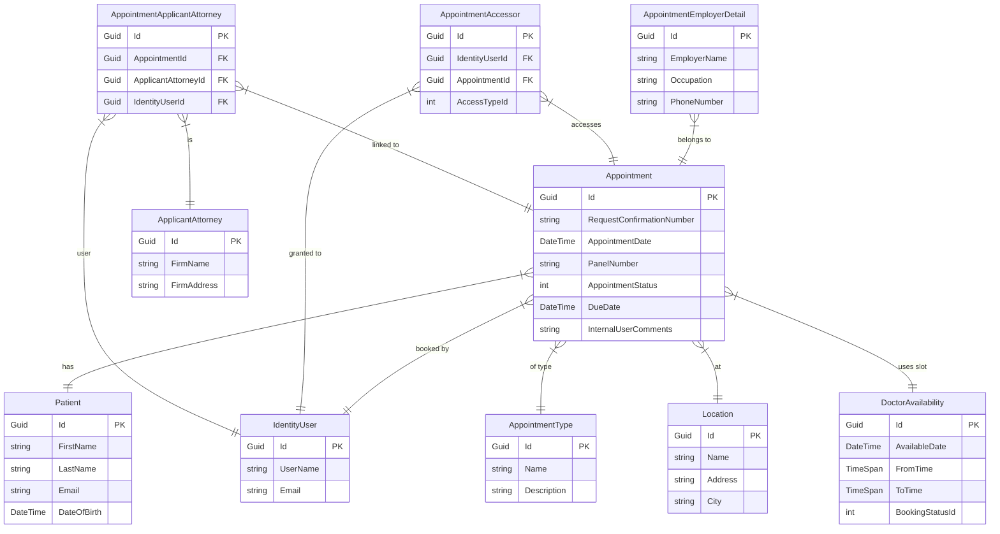
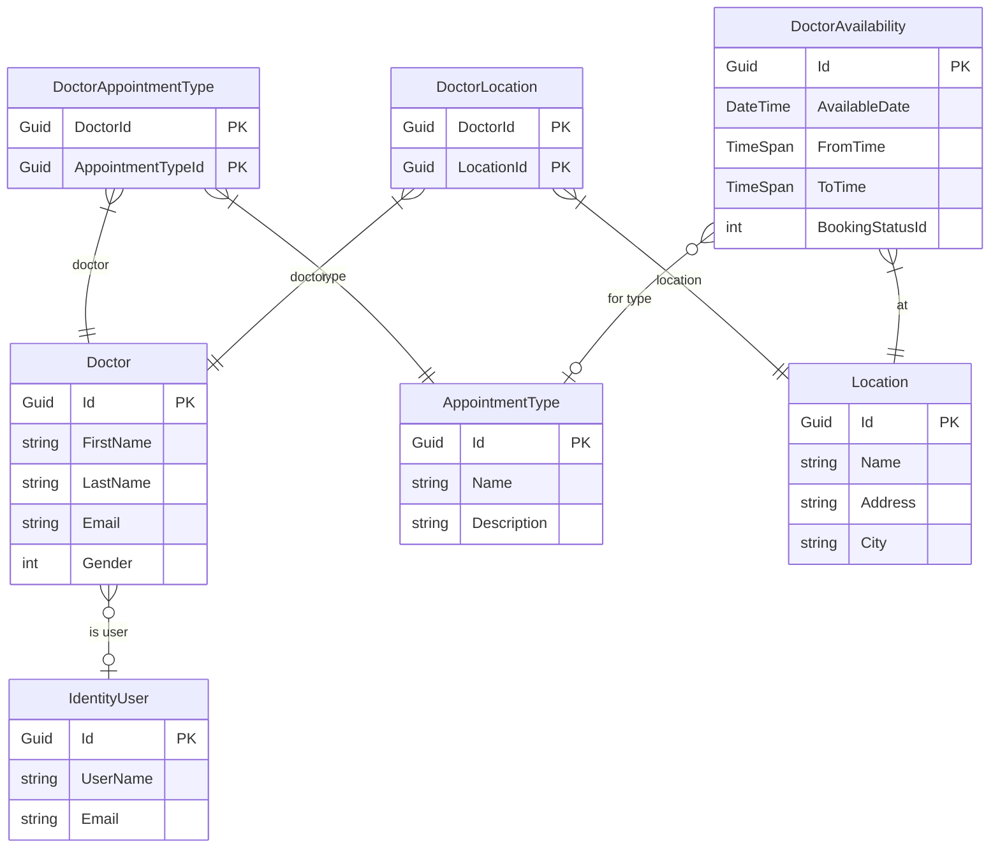

[Home](../INDEX.md) > [Backend](./) > Entity Relationships

# Entity Relationships

Complete entity-relationship reference for the HCS Case Evaluation Portal, derived from the EF Core `CaseEvaluationDbContext` Fluent API configuration.

---

## 1. Full ER Diagram

All domain entities and their relationships. Entity names are annotated with their multi-tenancy scope:

| Annotation | Meaning |
|---|---|
| **(host)** | Host-scoped — shared reference data, configured inside `IsHostDatabase()` guard |
| **(tenant)** | Tenant-scoped — implements `IMultiTenant`, automatic tenant filtering applies |
| **(both)** | Has `TenantId` property but does NOT implement `IMultiTenant` — no automatic tenant filtering |

```mermaid
erDiagram
    Appointment-tenant {
        Guid Id PK
        string RequestConfirmationNumber
        DateTime AppointmentDate
        string PanelNumber
        int AppointmentStatus
        DateTime DueDate
    }
    Patient-both {
        Guid Id PK
        string FirstName
        string LastName
        string Email
        DateTime DateOfBirth
        string SocialSecurityNumber
    }
    IdentityUser {
        Guid Id PK
        string UserName
        string Email
        string PhoneNumber
    }
    AppointmentType-host {
        Guid Id PK
        string Name
        string Description
    }
    AppointmentStatus-host {
        Guid Id PK
        string Name
    }
    Location-host {
        Guid Id PK
        string Name
        string Address
        string City
        bool IsActive
    }
    DoctorAvailability-tenant {
        Guid Id PK
        DateTime AvailableDate
        TimeSpan FromTime
        TimeSpan ToTime
        int BookingStatusId
    }
    AppointmentEmployerDetail-tenant {
        Guid Id PK
        string EmployerName
        string Occupation
        string PhoneNumber
        string City
    }
    AppointmentAccessor-tenant {
        Guid Id PK
        Guid IdentityUserId FK
        Guid AppointmentId FK
        int AccessTypeId
    }
    AppointmentApplicantAttorney-tenant {
        Guid Id PK
        Guid AppointmentId FK
        Guid ApplicantAttorneyId FK
        Guid IdentityUserId FK
    }
    ApplicantAttorney-tenant {
        Guid Id PK
        string FirmName
        string FirmAddress
        string PhoneNumber
        string WebAddress
    }
    Doctor-tenant {
        Guid Id PK
        string FirstName
        string LastName
        string Email
        int Gender
    }
    DoctorAppointmentType {
        Guid DoctorId PK
        Guid AppointmentTypeId PK
    }
    DoctorLocation {
        Guid DoctorId PK
        Guid LocationId PK
    }
    State-host {
        Guid Id PK
        string Name
    }
    AppointmentLanguage-host {
        Guid Id PK
        string Name
    }
    WcabOffice-host {
        Guid Id PK
        string Name
        string Abbreviation
        string Address
        string City
    }

    Appointment-tenant }|--|| Patient-both : "PatientId (NoAction)"
    Appointment-tenant }|--|| IdentityUser : "IdentityUserId (NoAction)"
    Appointment-tenant }|--|| AppointmentType-host : "AppointmentTypeId (NoAction)"
    Appointment-tenant }|--|| Location-host : "LocationId (NoAction)"
    Appointment-tenant }|--|| DoctorAvailability-tenant : "DoctorAvailabilityId (NoAction)"
    AppointmentEmployerDetail-tenant }|--|| Appointment-tenant : "AppointmentId (NoAction)"
    AppointmentEmployerDetail-tenant }o--o| State-host : "StateId (SetNull)"
    AppointmentAccessor-tenant }|--|| Appointment-tenant : "AppointmentId (NoAction)"
    AppointmentAccessor-tenant }|--|| IdentityUser : "IdentityUserId (NoAction)"
    AppointmentApplicantAttorney-tenant }|--|| Appointment-tenant : "AppointmentId (NoAction)"
    AppointmentApplicantAttorney-tenant }|--|| ApplicantAttorney-tenant : "ApplicantAttorneyId (NoAction)"
    AppointmentApplicantAttorney-tenant }|--|| IdentityUser : "IdentityUserId (NoAction)"
    ApplicantAttorney-tenant }|--|| IdentityUser : "IdentityUserId (NoAction)"
    ApplicantAttorney-tenant }o--o| State-host : "StateId (SetNull)"
    Patient-both }o--o| State-host : "StateId (SetNull)"
    Patient-both }o--o| AppointmentLanguage-host : "AppointmentLanguageId (SetNull)"
    Patient-both }|--|| IdentityUser : "IdentityUserId (NoAction)"
    DoctorAvailability-tenant }|--|| Location-host : "LocationId (NoAction)"
    DoctorAvailability-tenant }o--o| AppointmentType-host : "AppointmentTypeId (SetNull)"
    Doctor-tenant }o--o| IdentityUser : "IdentityUserId (SetNull)"
    Doctor-tenant }o--o{ AppointmentType-host : "via DoctorAppointmentType (Cascade)"
    Doctor-tenant }o--o{ Location-host : "via DoctorLocation (Cascade)"
    DoctorAppointmentType }|--|| Doctor-tenant : "DoctorId (Cascade)"
    DoctorAppointmentType }|--|| AppointmentType-host : "AppointmentTypeId (Cascade)"
    DoctorLocation }|--|| Doctor-tenant : "DoctorId (Cascade)"
    DoctorLocation }|--|| Location-host : "LocationId (Cascade)"
    Location-host }o--o| State-host : "StateId (SetNull)"
    Location-host }o--o| AppointmentType-host : "AppointmentTypeId (SetNull)"
    WcabOffice-host }o--o| State-host : "StateId (SetNull)"
```

---

## 2. Appointment Cluster (Focused)

Appointment and its direct relationships only.

---

## 3. Doctor Cluster (Focused)

Doctor and its relationships including junction tables and availability.

---

## FK Reference Table

All foreign key relationships as configured in `CaseEvaluationDbContext.OnModelCreating`.

| Source Entity | FK Property | Target Entity | Required? | Delete Behavior |
|---|---|---|---|---|
| Appointment | PatientId | Patient | Required | NoAction |
| Appointment | IdentityUserId | IdentityUser | Required | NoAction |
| Appointment | AppointmentTypeId | AppointmentType | Required | NoAction |
| Appointment | LocationId | Location | Required | NoAction |
| Appointment | DoctorAvailabilityId | DoctorAvailability | Required | NoAction |
| AppointmentEmployerDetail | AppointmentId | Appointment | Required | NoAction |
| AppointmentEmployerDetail | StateId | State | Optional | SetNull |
| AppointmentAccessor | IdentityUserId | IdentityUser | Required | NoAction |
| AppointmentAccessor | AppointmentId | Appointment | Required | NoAction |
| ApplicantAttorney | StateId | State | Optional | SetNull |
| ApplicantAttorney | IdentityUserId | IdentityUser | Required | NoAction |
| AppointmentApplicantAttorney | AppointmentId | Appointment | Required | NoAction |
| AppointmentApplicantAttorney | ApplicantAttorneyId | ApplicantAttorney | Required | NoAction |
| AppointmentApplicantAttorney | IdentityUserId | IdentityUser | Required | NoAction |
| Patient | StateId | State | Optional | SetNull |
| Patient | AppointmentLanguageId | AppointmentLanguage | Optional | SetNull |
| Patient | IdentityUserId | IdentityUser | Required | NoAction |
| Patient | TenantId | Tenant | Optional | SetNull |
| DoctorAvailability | LocationId | Location | Required | NoAction |
| DoctorAvailability | AppointmentTypeId | AppointmentType | Optional | SetNull |
| Doctor | IdentityUserId | IdentityUser | Optional | SetNull |
| Doctor | TenantId | Tenant | Optional | SetNull |
| DoctorAppointmentType | DoctorId | Doctor | Required | Cascade |
| DoctorAppointmentType | AppointmentTypeId | AppointmentType | Required | Cascade |
| DoctorLocation | DoctorId | Doctor | Required | Cascade |
| DoctorLocation | LocationId | Location | Required | Cascade |
| Location | StateId | State | Optional | SetNull |
| Location | AppointmentTypeId | AppointmentType | Optional | SetNull |
| WcabOffice | StateId | State | Optional | SetNull |

---

## Many-to-Many Relationships

Two many-to-many relationships are modeled explicitly through junction tables with composite primary keys.

### Doctor <-> AppointmentType via `DoctorAppointmentType`

- **Composite PK:** `(DoctorId, AppointmentTypeId)`
- **Delete Behavior:** Cascade on both sides -- deleting a Doctor or an AppointmentType removes the corresponding junction rows.
- **Table:** `AppDoctorAppointmentType`

### Doctor <-> Location via `DoctorLocation`

- **Composite PK:** `(DoctorId, LocationId)`
- **Delete Behavior:** Cascade on both sides -- deleting a Doctor or a Location removes the corresponding junction rows.
- **Table:** `AppDoctorLocation`

---

## Design Notes

- **NoAction delete behavior** is used on most required FKs. This prevents cascade-delete chains that could cross tenant boundaries or unintentionally remove dependent records. The application layer is responsible for handling deletions in the correct order.

- **SetNull on optional FKs** preserves referential integrity when reference data (State, AppointmentLanguage, AppointmentType, Tenant) is deleted. The dependent row survives with a null FK rather than being cascade-deleted or causing an error.

- **Cascade only on junction tables** (`DoctorAppointmentType`, `DoctorLocation`). These tables are owned by the Doctor aggregate -- their rows have no independent meaning outside the Doctor-to-X relationship, so cascade deletion is safe and expected.

- **Multi-tenancy side is set to `Both`** (`builder.SetMultiTenancySide(MultiTenancySides.Both)`), meaning the schema supports both host and tenant data. Reference entities (State, AppointmentType, Location, Doctor, Patient, etc.) are configured under `IsHostDatabase()` guards, while transactional entities (Appointment, AppointmentEmployerDetail, AppointmentAccessor, etc.) are registered outside those guards and thus available to all tenants.

---

## Related Documentation

- [Domain Model](DOMAIN-MODEL.md) -- entity definitions, value objects, and domain rules
- [Schema Reference](../database/SCHEMA-REFERENCE.md) -- physical database schema and column details
- [EF Core Design](../database/EF-CORE-DESIGN.md) -- DbContext patterns, query strategies, and migration workflow
- [Multi-Tenancy](../architecture/MULTI-TENANCY.md) -- tenant isolation model and host vs. tenant data separation
