# Permissions

> Purpose: Reference for all permission constants, group structure, and role assignments. Audience: Backend and frontend developers. Last verified: 2026-06-01 vs main.

[Home](../INDEX.md) > [Backend](./) > Permissions

---

## Permission Group

All permissions belong to the `"CaseEvaluation"` group, defined in:

- **Constants:** `src/HealthcareSupport.CaseEvaluation.Application.Contracts/Permissions/CaseEvaluationPermissions.cs`
- **Registration:** `src/HealthcareSupport.CaseEvaluation.Application.Contracts/Permissions/CaseEvaluationPermissionDefinitionProvider.cs`

---

## Complete Permission Tree

```mermaid
mindmap
  root((CaseEvaluation))
    Dashboard
      Dashboard.Host
      Dashboard.Tenant
    Books
      Books.Create
      Books.Edit
      Books.Delete
    States
      States.Create
      States.Edit
      States.Delete
    AppointmentTypes
      AppointmentTypes.Create
      AppointmentTypes.Edit
      AppointmentTypes.Delete
    AppointmentStatuses
      AppointmentStatuses.Create
      AppointmentStatuses.Edit
      AppointmentStatuses.Delete
    AppointmentLanguages
      AppointmentLanguages.Create
      AppointmentLanguages.Edit
      AppointmentLanguages.Delete
    Locations
      Locations.Create
      Locations.Edit
      Locations.Delete
    WcabOffices
      WcabOffices.Create
      WcabOffices.Edit
      WcabOffices.Delete
    Doctors
      Doctors.Create
      Doctors.Edit
      Doctors.Delete
    DoctorAvailabilities
      DoctorAvailabilities.Create
      DoctorAvailabilities.Edit
      DoctorAvailabilities.Delete
    DoctorPreferredLocations
      DoctorPreferredLocations.Toggle
    Patients
      Patients.Create
      Patients.Edit
      Patients.Delete
      Patients.RevealSsn
    Appointments
      Appointments.Create
      Appointments.Edit
      Appointments.Delete
      Appointments.Approve
      Appointments.Reject
      Appointments.RequestCancellation
      Appointments.RequestReschedule
    AppointmentEmployerDetails
      AppointmentEmployerDetails.Create
      AppointmentEmployerDetails.Edit
      AppointmentEmployerDetails.Delete
    AppointmentAccessors
      AppointmentAccessors.Create
      AppointmentAccessors.Edit
      AppointmentAccessors.Delete
    AppointmentInjuryDetails
      AppointmentInjuryDetails.Create
      AppointmentInjuryDetails.Edit
      AppointmentInjuryDetails.Delete
    AppointmentBodyParts
      AppointmentBodyParts.Create
      AppointmentBodyParts.Edit
      AppointmentBodyParts.Delete
    AppointmentClaimExaminers
      AppointmentClaimExaminers.Create
      AppointmentClaimExaminers.Edit
      AppointmentClaimExaminers.Delete
    AppointmentPrimaryInsurances
      AppointmentPrimaryInsurances.Create
      AppointmentPrimaryInsurances.Edit
      AppointmentPrimaryInsurances.Delete
    AppointmentChangeRequests
      AppointmentChangeRequests.Approve
      AppointmentChangeRequests.Reject
    AppointmentChangeLogs
    AppointmentDocuments
      AppointmentDocuments.Create
      AppointmentDocuments.Edit
      AppointmentDocuments.Delete
      AppointmentDocuments.Approve
    AppointmentPackets
      AppointmentPackets.Regenerate
    ApplicantAttorneys
      ApplicantAttorneys.Create
      ApplicantAttorneys.Edit
      ApplicantAttorneys.Delete
    AppointmentApplicantAttorneys
      AppointmentApplicantAttorneys.Create
      AppointmentApplicantAttorneys.Edit
      AppointmentApplicantAttorneys.Delete
    DefenseAttorneys
      DefenseAttorneys.Create
      DefenseAttorneys.Edit
      DefenseAttorneys.Delete
    AppointmentDefenseAttorneys
      AppointmentDefenseAttorneys.Create
      AppointmentDefenseAttorneys.Edit
      AppointmentDefenseAttorneys.Delete
    CustomFields
      CustomFields.Create
      CustomFields.Edit
      CustomFields.Delete
    SystemParameters
      SystemParameters.Edit
    NotificationTemplates
      NotificationTemplates.Edit
    Documents
      Documents.Create
      Documents.Edit
      Documents.Delete
    PackageDetails
      PackageDetails.Create
      PackageDetails.Edit
      PackageDetails.Delete
      PackageDetails.ManageDocuments
    UserManagement
      UserManagement.InviteExternalUser
    InternalUsers
      InternalUsers.Create
    UserSignatures
      UserSignatures.ManageOwn
```



### Permission String Details

Each entity group (except Dashboard and AppointmentChangeLogs) follows a parent-child hierarchy where the **Default** permission is the parent and CRUD or action permissions are children. A user must have the parent permission to access any child.

**Atypical groups -- read the notes column:**

| Entity Group | Default (Parent) | Children | Notes |
|---|---|---|---|
| Dashboard | _none_ | `CaseEvaluation.Dashboard.Host`, `CaseEvaluation.Dashboard.Tenant` | No Default parent. Host and Tenant are registered directly on the permission group with `MultiTenancySides.Host` / `.Tenant`. |
| AppointmentChangeLogs | `CaseEvaluation.AppointmentChangeLogs` | _none_ | Read-only audit history. Rows are immutable so no Create/Edit/Delete children exist. |
| AppointmentPackets | `CaseEvaluation.AppointmentPackets` | `...Regenerate` | No CRUD children; only the `Regenerate` action child. |
| DoctorPreferredLocations | `CaseEvaluation.DoctorPreferredLocations` | `...Toggle` | No CRUD children; only the `Toggle` action child. |
| SystemParameters | `CaseEvaluation.SystemParameters` | `...Edit` | Read is gated by Default; only Edit is a child (no Create/Delete). |
| NotificationTemplates | `CaseEvaluation.NotificationTemplates` | `...Edit` | Templates are seeded; no Create/Delete children. |
| UserManagement | `CaseEvaluation.UserManagement` | `...InviteExternalUser` | Action child for staff-issued external-user invitations. |
| InternalUsers | `CaseEvaluation.InternalUsers` | `...Create` | IT Admin only. No Edit/Delete children (accounts are managed elsewhere). |
| UserSignatures | `CaseEvaluation.UserSignatures` | `...ManageOwn` | Scoped to the caller's own signature; no per-target gate. |
| AppointmentChangeRequests | `CaseEvaluation.AppointmentChangeRequests` | `...Approve`, `...Reject` | Supervisor approval surface; no Create/Delete. |
| AppointmentDocuments | `CaseEvaluation.AppointmentDocuments` | `...Create`, `...Edit`, `...Delete`, `...Approve` | Approve child gates document acceptance/rejection (W2-11). |
| PackageDetails | `CaseEvaluation.PackageDetails` | `...Create`, `...Edit`, `...Delete`, `...ManageDocuments` | ManageDocuments gates Link/Unlink endpoints separately from the package CRUD. |

**Standard groups (Default + Create/Edit/Delete):**

| Entity Group | Default (Parent) | Create | Edit | Delete |
|---|---|---|---|---|
| Books | `CaseEvaluation.Books` | `...Create` | `...Edit` | `...Delete` |
| States | `CaseEvaluation.States` | `...Create` | `...Edit` | `...Delete` |
| AppointmentTypes | `CaseEvaluation.AppointmentTypes` | `...Create` | `...Edit` | `...Delete` |
| AppointmentStatuses | `CaseEvaluation.AppointmentStatuses` | `...Create` | `...Edit` | `...Delete` |
| AppointmentLanguages | `CaseEvaluation.AppointmentLanguages` | `...Create` | `...Edit` | `...Delete` |
| Locations | `CaseEvaluation.Locations` | `...Create` | `...Edit` | `...Delete` |
| WcabOffices | `CaseEvaluation.WcabOffices` | `...Create` | `...Edit` | `...Delete` |
| Doctors | `CaseEvaluation.Doctors` | `...Create` | `...Edit` | `...Delete` |
| DoctorAvailabilities | `CaseEvaluation.DoctorAvailabilities` | `...Create` | `...Edit` | `...Delete` |
| Patients | `CaseEvaluation.Patients` | `...Create` | `...Edit` | `...Delete` |
| Appointments | `CaseEvaluation.Appointments` | `...Create` | `...Edit` | `...Delete` |
| AppointmentEmployerDetails | `CaseEvaluation.AppointmentEmployerDetails` | `...Create` | `...Edit` | `...Delete` |
| AppointmentAccessors | `CaseEvaluation.AppointmentAccessors` | `...Create` | `...Edit` | `...Delete` |
| AppointmentInjuryDetails | `CaseEvaluation.AppointmentInjuryDetails` | `...Create` | `...Edit` | `...Delete` |
| AppointmentBodyParts | `CaseEvaluation.AppointmentBodyParts` | `...Create` | `...Edit` | `...Delete` |
| AppointmentClaimExaminers | `CaseEvaluation.AppointmentClaimExaminers` | `...Create` | `...Edit` | `...Delete` |
| AppointmentPrimaryInsurances | `CaseEvaluation.AppointmentPrimaryInsurances` | `...Create` | `...Edit` | `...Delete` |
| ApplicantAttorneys | `CaseEvaluation.ApplicantAttorneys` | `...Create` | `...Edit` | `...Delete` |
| AppointmentApplicantAttorneys | `CaseEvaluation.AppointmentApplicantAttorneys` | `...Create` | `...Edit` | `...Delete` |
| DefenseAttorneys | `CaseEvaluation.DefenseAttorneys` | `...Create` | `...Edit` | `...Delete` |
| AppointmentDefenseAttorneys | `CaseEvaluation.AppointmentDefenseAttorneys` | `...Create` | `...Edit` | `...Delete` |
| CustomFields | `CaseEvaluation.CustomFields` | `...Create` | `...Edit` | `...Delete` |
| Documents | `CaseEvaluation.Documents` | `...Create` | `...Edit` | `...Delete` |

**Extra action children on standard groups:**

| Entity Group | Extra Children | Notes |
|---|---|---|
| Patients | `Patients.RevealSsn` | Gates `GetFullSsnAsync`; standard payloads carry only the masked last-4. Requires internal-or-owner check in addition to this permission. |
| Appointments | `Appointments.Approve`, `Appointments.Reject`, `Appointments.RequestCancellation`, `Appointments.RequestReschedule` | Phase 2.5 per-action gates for the clinic-staff approval and external-user change-request flows. |

### Permission String Format

```
CaseEvaluation.{Entity}.{Action}
```

Examples:
- `CaseEvaluation.Appointments` -- Default/read permission for appointments
- `CaseEvaluation.Appointments.Create` -- Create new appointments
- `CaseEvaluation.Appointments.Approve` -- Approve a pending appointment
- `CaseEvaluation.Patients.RevealSsn` -- Retrieve the full, unmasked SSN
- `CaseEvaluation.PackageDetails.ManageDocuments` -- Link/Unlink documents in a package

---

## Where Permissions Are Used

### Backend: Application Service Authorization

Permissions are enforced on AppService methods using the `[Authorize]` attribute:

```csharp
[Authorize(CaseEvaluationPermissions.Appointments.Default)]
public class AppointmentsAppService : ApplicationService
{
    [Authorize(CaseEvaluationPermissions.Appointments.Create)]
    public virtual async Task<AppointmentDto> CreateAsync(AppointmentCreateDto input) { ... }

    [Authorize(CaseEvaluationPermissions.Appointments.Edit)]
    public virtual async Task<AppointmentDto> UpdateAsync(Guid id, AppointmentUpdateDto input) { ... }

    [Authorize(CaseEvaluationPermissions.Appointments.Delete)]
    public virtual async Task DeleteAsync(Guid id) { ... }
}
```

The `Default` permission is applied at the class level; `Create`, `Edit`, and `Delete` are applied at the method level.

### Frontend: Angular Route Guards

Routes use ABP's `requiredPolicy` to gate access:

```typescript
{
    path: 'appointments',
    requiredPolicy: 'CaseEvaluation.Appointments',
    // ...
}
```

### Frontend: Angular Template Directives

UI elements (buttons, menus) are conditionally shown using the `*abpPermission` structural directive:

```html
<button *abpPermission="'CaseEvaluation.Appointments.Create'">
    New Appointment
</button>
<button *abpPermission="'CaseEvaluation.Appointments.Edit'">Edit</button>
<button *abpPermission="'CaseEvaluation.Appointments.Delete'">Delete</button>
```

---

## Seeded Roles

Roles are created by two mechanisms:

### 1. Built-in ABP Role

| Role | Source | Description |
|---|---|---|
| **admin** | ABP framework default | Full access to all permissions. Created during initial data seed. |

### 2. Custom External Roles

Created by `ExternalUserRoleDataSeedContributor` (`src/HealthcareSupport.CaseEvaluation.Domain/Identity/ExternalUserRoleDataSeedContributor.cs`):

| Role | Description |
|---|---|
| **Patient** | End users who are patients in the system |
| **Claim Examiner** | Insurance claim examiners who manage case evaluations |
| **Applicant Attorney** | Attorneys representing the applicant/patient |
| **Defense Attorney** | Attorneys representing the defense side |

The seed contributor uses `EnsureRoleAsync` to create roles idempotently -- it checks if the role already exists before creating it, and is tenant-aware.

---

## Role-Permission Matrix

> **Note:** The admin role receives all permissions by default through ABP's permission management. The external roles (Patient, Claim Examiner, Applicant Attorney, Defense Attorney) are seeded as empty roles -- their specific permissions are assigned at runtime through the ABP Permission Management UI by an administrator.

| Permission | admin | Patient | Claim Examiner | Applicant Attorney | Defense Attorney |
|---|:---:|:---:|:---:|:---:|:---:|
| Dashboard.Host | Y | - | - | - | - |
| Dashboard.Tenant | Y | - | - | - | - |
| Appointments (CRUD) | Y | Configured at runtime | Configured at runtime | Configured at runtime | Configured at runtime |
| Appointments.Approve / Reject | Y | - | Configured at runtime | - | - |
| Appointments.RequestCancellation / RequestReschedule | Y | Configured at runtime | Configured at runtime | Configured at runtime | Configured at runtime |
| Patients (CRUD) | Y | Configured at runtime | Configured at runtime | Configured at runtime | Configured at runtime |
| Patients.RevealSsn | Y | Configured at runtime | - | - | - |
| Doctors (CRUD) | Y | - | Configured at runtime | - | - |
| DoctorAvailabilities (CRUD) | Y | - | Configured at runtime | - | - |
| DoctorPreferredLocations | Y | - | Configured at runtime | - | - |
| Locations (CRUD) | Y | - | Configured at runtime | - | - |
| WcabOffices (CRUD) | Y | - | Configured at runtime | - | - |
| AppointmentTypes (CRUD) | Y | - | Configured at runtime | - | - |
| AppointmentStatuses (CRUD) | Y | - | Configured at runtime | - | - |
| AppointmentLanguages (CRUD) | Y | - | Configured at runtime | - | - |
| States (CRUD) | Y | - | Configured at runtime | - | - |
| ApplicantAttorneys (CRUD) | Y | - | Configured at runtime | Configured at runtime | - |
| AppointmentApplicantAttorneys (CRUD) | Y | - | Configured at runtime | Configured at runtime | - |
| DefenseAttorneys (CRUD) | Y | - | - | - | Configured at runtime |
| AppointmentDefenseAttorneys (CRUD) | Y | - | - | - | Configured at runtime |
| AppointmentAccessors (CRUD) | Y | - | Configured at runtime | - | Configured at runtime |
| AppointmentEmployerDetails (CRUD) | Y | - | Configured at runtime | - | - |
| AppointmentInjuryDetails (CRUD) | Y | - | Configured at runtime | - | - |
| AppointmentBodyParts (CRUD) | Y | - | Configured at runtime | - | - |
| AppointmentClaimExaminers (CRUD) | Y | - | Configured at runtime | - | - |
| AppointmentPrimaryInsurances (CRUD) | Y | - | Configured at runtime | - | - |
| AppointmentChangeRequests | Y | - | Configured at runtime | - | - |
| AppointmentChangeLogs | Y | - | Configured at runtime | - | - |
| AppointmentDocuments (CRUD + Approve) | Y | Configured at runtime | Configured at runtime | Configured at runtime | Configured at runtime |
| AppointmentPackets | Y | - | Configured at runtime | - | - |
| CustomFields (CRUD) | Y | - | - | - | - |
| SystemParameters | Y | - | - | - | - |
| NotificationTemplates | Y | - | - | - | - |
| Documents (CRUD) | Y | - | - | - | - |
| PackageDetails (CRUD + ManageDocuments) | Y | - | - | - | - |
| UserManagement.InviteExternalUser | Y | - | - | - | - |
| InternalUsers.Create | Y | - | - | - | - |
| UserSignatures.ManageOwn | Y | - | - | - | - |
| Books (CRUD) | Y | - | - | - | - |

**Legend:** Y = granted by default | - = not granted | Configured at runtime = assigned by admin through Permission Management UI

---

## Source Files

| File | Purpose |
|---|---|
| `src/.../Application.Contracts/Permissions/CaseEvaluationPermissions.cs` | Permission string constants (35 permission groups) |
| `src/.../Application.Contracts/Permissions/CaseEvaluationPermissionDefinitionProvider.cs` | Registers permissions with ABP's permission system |
| `src/.../Domain/Identity/ExternalUserRoleDataSeedContributor.cs` | Seeds custom roles (Patient, Claim Examiner, Applicant Attorney, Defense Attorney) |

---

## Related Documentation

- [Application Services](APPLICATION-SERVICES.md)
- [Routing and Navigation](../frontend/ROUTING-AND-NAVIGATION.md)
- [Role-Based UI](../frontend/ROLE-BASED-UI.md)
- [User Roles and Actors](../business-domain/USER-ROLES-AND-ACTORS.md)
