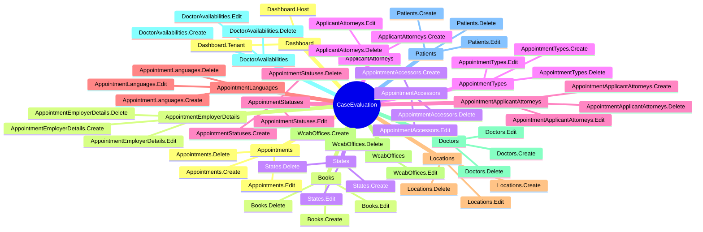

# Permissions

[Home](../INDEX.md) > [Backend](./) > Permissions

---

## Permission Group

All permissions belong to the `"CaseEvaluation"` group, defined in:

- **Constants:** `src/HealthcareSupport.CaseEvaluation.Application.Contracts/Permissions/CaseEvaluationPermissions.cs`
- **Registration:** `src/HealthcareSupport.CaseEvaluation.Application.Contracts/Permissions/CaseEvaluationPermissionDefinitionProvider.cs`

---

## Complete Permission Tree



### Permission String Details

Each entity group (except Dashboard) follows a parent-child hierarchy where the **Default** permission is the parent and CRUD actions are children. A user must have the parent permission to access any child.

| Entity Group | Default (Parent) | Create | Edit | Delete |
|---|---|---|---|---|
| Dashboard | _N/A (Host/Tenant are top-level)_ | `CaseEvaluation.Dashboard.Host` | `CaseEvaluation.Dashboard.Tenant` | - |
| Books | `CaseEvaluation.Books` | `CaseEvaluation.Books.Create` | `CaseEvaluation.Books.Edit` | `CaseEvaluation.Books.Delete` |
| States | `CaseEvaluation.States` | `CaseEvaluation.States.Create` | `CaseEvaluation.States.Edit` | `CaseEvaluation.States.Delete` |
| AppointmentTypes | `CaseEvaluation.AppointmentTypes` | `CaseEvaluation.AppointmentTypes.Create` | `CaseEvaluation.AppointmentTypes.Edit` | `CaseEvaluation.AppointmentTypes.Delete` |
| AppointmentStatuses | `CaseEvaluation.AppointmentStatuses` | `CaseEvaluation.AppointmentStatuses.Create` | `CaseEvaluation.AppointmentStatuses.Edit` | `CaseEvaluation.AppointmentStatuses.Delete` |
| AppointmentLanguages | `CaseEvaluation.AppointmentLanguages` | `CaseEvaluation.AppointmentLanguages.Create` | `CaseEvaluation.AppointmentLanguages.Edit` | `CaseEvaluation.AppointmentLanguages.Delete` |
| Locations | `CaseEvaluation.Locations` | `CaseEvaluation.Locations.Create` | `CaseEvaluation.Locations.Edit` | `CaseEvaluation.Locations.Delete` |
| WcabOffices | `CaseEvaluation.WcabOffices` | `CaseEvaluation.WcabOffices.Create` | `CaseEvaluation.WcabOffices.Edit` | `CaseEvaluation.WcabOffices.Delete` |
| Doctors | `CaseEvaluation.Doctors` | `CaseEvaluation.Doctors.Create` | `CaseEvaluation.Doctors.Edit` | `CaseEvaluation.Doctors.Delete` |
| DoctorAvailabilities | `CaseEvaluation.DoctorAvailabilities` | `CaseEvaluation.DoctorAvailabilities.Create` | `CaseEvaluation.DoctorAvailabilities.Edit` | `CaseEvaluation.DoctorAvailabilities.Delete` |
| Patients | `CaseEvaluation.Patients` | `CaseEvaluation.Patients.Create` | `CaseEvaluation.Patients.Edit` | `CaseEvaluation.Patients.Delete` |
| Appointments | `CaseEvaluation.Appointments` | `CaseEvaluation.Appointments.Create` | `CaseEvaluation.Appointments.Edit` | `CaseEvaluation.Appointments.Delete` |
| AppointmentEmployerDetails | `CaseEvaluation.AppointmentEmployerDetails` | `CaseEvaluation.AppointmentEmployerDetails.Create` | `CaseEvaluation.AppointmentEmployerDetails.Edit` | `CaseEvaluation.AppointmentEmployerDetails.Delete` |
| AppointmentAccessors | `CaseEvaluation.AppointmentAccessors` | `CaseEvaluation.AppointmentAccessors.Create` | `CaseEvaluation.AppointmentAccessors.Edit` | `CaseEvaluation.AppointmentAccessors.Delete` |
| ApplicantAttorneys | `CaseEvaluation.ApplicantAttorneys` | `CaseEvaluation.ApplicantAttorneys.Create` | `CaseEvaluation.ApplicantAttorneys.Edit` | `CaseEvaluation.ApplicantAttorneys.Delete` |
| AppointmentApplicantAttorneys | `CaseEvaluation.AppointmentApplicantAttorneys` | `CaseEvaluation.AppointmentApplicantAttorneys.Create` | `CaseEvaluation.AppointmentApplicantAttorneys.Edit` | `CaseEvaluation.AppointmentApplicantAttorneys.Delete` |

### Permission String Format

```
CaseEvaluation.{Entity}.{Action}
```

Examples:
- `CaseEvaluation.Appointments` -- Default/read permission for appointments
- `CaseEvaluation.Appointments.Create` -- Create new appointments
- `CaseEvaluation.Patients.Edit` -- Edit existing patients
- `CaseEvaluation.Doctors.Delete` -- Delete doctors

---

## Where Permissions Are Used

### Backend: Application Service Authorization

Permissions are enforced on AppService methods using the `[Authorize]` attribute:

```csharp
[Authorize(CaseEvaluationPermissions.Appointments.Default)]
public class AppointmentsAppService : ApplicationService
{
    [Authorize(CaseEvaluationPermissions.Appointments.Create)]
    public virtual async Task<AppointmentDto> CreateAsync(AppointmentCreateDto input) { ... }

    [Authorize(CaseEvaluationPermissions.Appointments.Edit)]
    public virtual async Task<AppointmentDto> UpdateAsync(Guid id, AppointmentUpdateDto input) { ... }

    [Authorize(CaseEvaluationPermissions.Appointments.Delete)]
    public virtual async Task DeleteAsync(Guid id) { ... }
}
```

The `Default` permission is applied at the class level; `Create`, `Edit`, and `Delete` are applied at the method level.

### Frontend: Angular Route Guards

Routes use ABP's `requiredPolicy` to gate access:

```typescript
{
    path: 'appointments',
    requiredPolicy: 'CaseEvaluation.Appointments',
    // ...
}
```

### Frontend: Angular Template Directives

UI elements (buttons, menus) are conditionally shown using the `*abpPermission` structural directive:

```html
<button *abpPermission="'CaseEvaluation.Appointments.Create'">
    New Appointment
</button>
<button *abpPermission="'CaseEvaluation.Appointments.Edit'">Edit</button>
<button *abpPermission="'CaseEvaluation.Appointments.Delete'">Delete</button>
```

---

## Seeded Roles

Roles are created by two mechanisms:

### 1. Built-in ABP Role

| Role | Source | Description |
|---|---|---|
| **admin** | ABP framework default | Full access to all permissions. Created during initial data seed. |

### 2. Custom External Roles

Created by `ExternalUserRoleDataSeedContributor` (`src/HealthcareSupport.CaseEvaluation.Domain/Identity/ExternalUserRoleDataSeedContributor.cs`):

| Role | Description |
|---|---|
| **Patient** | End users who are patients in the system |
| **Claim Examiner** | Insurance claim examiners who manage case evaluations |
| **Applicant Attorney** | Attorneys representing the applicant/patient |
| **Defense Attorney** | Attorneys representing the defense side |

The seed contributor uses `EnsureRoleAsync` to create roles idempotently -- it checks if the role already exists before creating it, and is tenant-aware.

---

## Role-Permission Matrix

> **Note:** The admin role receives all permissions by default through ABP's permission management. The external roles (Patient, Claim Examiner, Applicant Attorney, Defense Attorney) are seeded as empty roles -- their specific permissions are assigned at runtime through the ABP Permission Management UI by an administrator.

| Permission | admin | Patient | Claim Examiner | Applicant Attorney | Defense Attorney |
|---|:---:|:---:|:---:|:---:|:---:|
| Dashboard.Host | Y | - | - | - | - |
| Dashboard.Tenant | Y | - | - | - | - |
| Appointments (CRUD) | Y | Configured at runtime | Configured at runtime | Configured at runtime | Configured at runtime |
| Patients (CRUD) | Y | Configured at runtime | Configured at runtime | Configured at runtime | Configured at runtime |
| Doctors (CRUD) | Y | - | Configured at runtime | - | - |
| DoctorAvailabilities (CRUD) | Y | - | Configured at runtime | - | - |
| Locations (CRUD) | Y | - | Configured at runtime | - | - |
| WcabOffices (CRUD) | Y | - | Configured at runtime | - | - |
| AppointmentTypes (CRUD) | Y | - | Configured at runtime | - | - |
| AppointmentStatuses (CRUD) | Y | - | Configured at runtime | - | - |
| AppointmentLanguages (CRUD) | Y | - | Configured at runtime | - | - |
| States (CRUD) | Y | - | Configured at runtime | - | - |
| ApplicantAttorneys (CRUD) | Y | - | Configured at runtime | Configured at runtime | - |
| AppointmentApplicantAttorneys (CRUD) | Y | - | Configured at runtime | Configured at runtime | - |
| AppointmentAccessors (CRUD) | Y | - | Configured at runtime | - | Configured at runtime |
| AppointmentEmployerDetails (CRUD) | Y | - | Configured at runtime | - | - |
| Books (CRUD) | Y | - | - | - | - |

**Legend:** Y = granted by default | - = not granted | Configured at runtime = assigned by admin through Permission Management UI

---

## Source Files

| File | Purpose |
|---|---|
| `src/.../Application.Contracts/Permissions/CaseEvaluationPermissions.cs` | Permission string constants (16 entity groups) |
| `src/.../Application.Contracts/Permissions/CaseEvaluationPermissionDefinitionProvider.cs` | Registers permissions with ABP's permission system |
| `src/.../Domain/Identity/ExternalUserRoleDataSeedContributor.cs` | Seeds custom roles (Patient, Claim Examiner, Applicant Attorney, Defense Attorney) |

---

## Related Documentation

- [Application Services](APPLICATION-SERVICES.md)
- [Routing and Navigation](../frontend/ROUTING-AND-NAVIGATION.md)
- [Role-Based UI](../frontend/ROLE-BASED-UI.md)
- [User Roles and Actors](../business-domain/USER-ROLES-AND-ACTORS.md)
