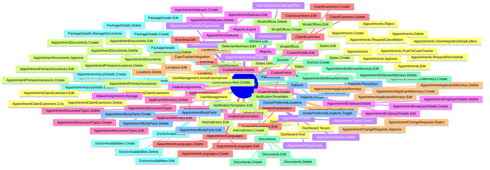

# Permissions

> Purpose: Reference for all permission constants, group structure, and role assignments. Audience: Backend and frontend developers.

[Home](../INDEX.md) > [Backend](./) > Permissions

---

## Permission Group

All permissions belong to the `"CaseEvaluation"` group, defined in:

- **Constants:** `src/HealthcareSupport.CaseEvaluation.Application.Contracts/Permissions/CaseEvaluationPermissions.cs`
- **Registration:** `src/HealthcareSupport.CaseEvaluation.Application.Contracts/Permissions/CaseEvaluationPermissionDefinitionProvider.cs`

---

## Complete Permission Tree

Generated from `CaseEvaluationPermissions.cs` on 2026-09-28. The constants file is the authority;
when it changes, regenerate this tree rather than editing it by hand.


```mermaid
mindmap
  root((CaseEvaluation))
    Dashboard
      Dashboard.Host
      Dashboard.Tenant
    States
      States.Edit
      States.Create
      States.Delete
    AppointmentTypes
      AppointmentTypes.Edit
      AppointmentTypes.Create
      AppointmentTypes.Delete
    AppointmentStatuses
      AppointmentStatuses.Edit
      AppointmentStatuses.Create
      AppointmentStatuses.Delete
    AppointmentDocumentTypes
      AppointmentDocumentTypes.Edit
      AppointmentDocumentTypes.Create
      AppointmentDocumentTypes.Delete
    AppointmentLanguages
      AppointmentLanguages.Edit
      AppointmentLanguages.Create
      AppointmentLanguages.Delete
    Locations
      Locations.Edit
      Locations.Create
      Locations.Delete
    WcabOffices
      WcabOffices.Edit
      WcabOffices.Create
      WcabOffices.Delete
    Doctors
      Doctors.Edit
      Doctors.Create
      Doctors.Delete
    DoctorAvailabilities
      DoctorAvailabilities.Edit
      DoctorAvailabilities.Create
      DoctorAvailabilities.Delete
    Patients
      Patients.Edit
      Patients.Create
      Patients.Delete
      Patients.RevealSsn
    Appointments
      Appointments.Edit
      Appointments.Create
      Appointments.Delete
      Appointments.Approve
      Appointments.Reject
      Appointments.RequestCancellation
      Appointments.RequestReschedule
      Appointments.PushToCaseTracker
      Appointments.ViewIntegrationDeadLetters
    AppointmentDocuments
      AppointmentDocuments.Create
      AppointmentDocuments.Edit
      AppointmentDocuments.Delete
      AppointmentDocuments.Approve
    AppointmentPackets
      AppointmentPackets.Regenerate
    AppointmentEmployerDetails
      AppointmentEmployerDetails.Edit
      AppointmentEmployerDetails.Create
      AppointmentEmployerDetails.Delete
    ApplicantAttorneys
      ApplicantAttorneys.Edit
      ApplicantAttorneys.Create
      ApplicantAttorneys.Delete
    ClaimExaminers
      ClaimExaminers.Edit
      ClaimExaminers.Create
      ClaimExaminers.Delete
    AppointmentApplicantAttorneys
      AppointmentApplicantAttorneys.Edit
      AppointmentApplicantAttorneys.Create
      AppointmentApplicantAttorneys.Delete
    DefenseAttorneys
      DefenseAttorneys.Edit
      DefenseAttorneys.Create
      DefenseAttorneys.Delete
    AppointmentDefenseAttorneys
      AppointmentDefenseAttorneys.Edit
      AppointmentDefenseAttorneys.Create
      AppointmentDefenseAttorneys.Delete
    AppointmentInjuryDetails
      AppointmentInjuryDetails.Edit
      AppointmentInjuryDetails.Create
      AppointmentInjuryDetails.Delete
    AppointmentBodyParts
      AppointmentBodyParts.Edit
      AppointmentBodyParts.Create
      AppointmentBodyParts.Delete
    AppointmentClaimExaminers
      AppointmentClaimExaminers.Edit
      AppointmentClaimExaminers.Create
      AppointmentClaimExaminers.Delete
    AppointmentPrimaryInsurances
      AppointmentPrimaryInsurances.Edit
      AppointmentPrimaryInsurances.Create
      AppointmentPrimaryInsurances.Delete
    AppointmentChangeLogs
    Reports
      Reports.Export
    CustomFields
      CustomFields.Create
      CustomFields.Edit
      CustomFields.Delete
    SystemParameters
      SystemParameters.Edit
    AppointmentChangeRequests
      AppointmentChangeRequests.Approve
      AppointmentChangeRequests.Reject
    NotificationTemplates
      NotificationTemplates.Edit
    Documents
      Documents.Create
      Documents.Edit
      Documents.Delete
    PackageDetails
      PackageDetails.Create
      PackageDetails.Edit
      PackageDetails.Delete
      PackageDetails.ManageDocuments
    DoctorPreferredLocations
      DoctorPreferredLocations.Toggle
    UserManagement
      UserManagement.InviteExternalUser
    InternalUsers
      InternalUsers.Create
      InternalUsers.Edit
    UserSignatures
      UserSignatures.ManageOwn
    IntakeAssignments
      IntakeAssignments.Manage
    IntakeImpersonation
    Branding
      Branding.Edit
    CaseTrackerIntegration
```

### Permission String Details

Each entity group (except Dashboard and AppointmentChangeLogs) follows a parent-child hierarchy where the **Default** permission is the parent and CRUD or action permissions are children. A user must have the parent permission to access any child.

**Atypical groups -- read the notes column:**

| Entity Group | Default (Parent) | Children | Notes |
|---|---|---|---|
| Dashboard | _none_ | `CaseEvaluation.Dashboard.Host`, `CaseEvaluation.Dashboard.Tenant` | No Default parent. Host and Tenant are registered directly on the permission group with `MultiTenancySides.Host` / `.Tenant`. |
| AppointmentChangeLogs | `CaseEvaluation.AppointmentChangeLogs` | _none_ | Read-only audit history. Rows are immutable so no Create/Edit/Delete children exist. |
| AppointmentPackets | `CaseEvaluation.AppointmentPackets` | `...Regenerate` | No CRUD children; only the `Regenerate` action child. |
| DoctorPreferredLocations | `CaseEvaluation.DoctorPreferredLocations` | `...Toggle` | No CRUD children; only the `Toggle` action child. |
| SystemParameters | `CaseEvaluation.SystemParameters` | `...Edit` | Read is gated by Default; only Edit is a child (no Create/Delete). |
| NotificationTemplates | `CaseEvaluation.NotificationTemplates` | `...Edit` | Templates are seeded; no Create/Delete children. |
| UserManagement | `CaseEvaluation.UserManagement` | `...InviteExternalUser` | Action child for staff-issued external-user invitations. |
| InternalUsers | `CaseEvaluation.InternalUsers` | `...Create`, `...Edit` | Internal staff accounts. No Delete child. |
| Reports | `CaseEvaluation.Reports` | `...Export` | Report export only. |
| IntakeAssignments | `CaseEvaluation.IntakeAssignments` | `...Manage` | Assigning Intake operators to offices. |
| IntakeImpersonation | `CaseEvaluation.IntakeImpersonation` | _none_ | Single permission, no children. |
| Branding | `CaseEvaluation.Branding` | `...Edit` | Per-office display name and logo. |
| CaseTrackerIntegration | `CaseEvaluation.CaseTrackerIntegration` | _none_ | Single permission, no children. |
| UserSignatures | `CaseEvaluation.UserSignatures` | `...ManageOwn` | Scoped to the caller's own signature; no per-target gate. |
| AppointmentChangeRequests | `CaseEvaluation.AppointmentChangeRequests` | `...Approve`, `...Reject` | Supervisor approval surface; no Create/Delete. |
| AppointmentDocuments | `CaseEvaluation.AppointmentDocuments` | `...Create`, `...Edit`, `...Delete`, `...Approve` | Approve child gates document acceptance/rejection (W2-11). |
| PackageDetails | `CaseEvaluation.PackageDetails` | `...Create`, `...Edit`, `...Delete`, `...ManageDocuments` | ManageDocuments gates Link/Unlink endpoints separately from the package CRUD. |

**Standard groups (Default + Create/Edit/Delete):**

| Entity Group | Default (Parent) | Create | Edit | Delete |
|---|---|---|---|---|
| States | `CaseEvaluation.States` | `...Create` | `...Edit` | `...Delete` |
| AppointmentTypes | `CaseEvaluation.AppointmentTypes` | `...Create` | `...Edit` | `...Delete` |
| AppointmentDocumentTypes | `CaseEvaluation.AppointmentDocumentTypes` | `...Create` | `...Edit` | `...Delete` |
| AppointmentStatuses | `CaseEvaluation.AppointmentStatuses` | `...Create` | `...Edit` | `...Delete` |
| AppointmentLanguages | `CaseEvaluation.AppointmentLanguages` | `...Create` | `...Edit` | `...Delete` |
| Locations | `CaseEvaluation.Locations` | `...Create` | `...Edit` | `...Delete` |
| WcabOffices | `CaseEvaluation.WcabOffices` | `...Create` | `...Edit` | `...Delete` |
| Doctors | `CaseEvaluation.Doctors` | `...Create` | `...Edit` | `...Delete` |
| DoctorAvailabilities | `CaseEvaluation.DoctorAvailabilities` | `...Create` | `...Edit` | `...Delete` |
| Patients | `CaseEvaluation.Patients` | `...Create` | `...Edit` | `...Delete` |
| Appointments | `CaseEvaluation.Appointments` | `...Create` | `...Edit` | `...Delete` |
| AppointmentEmployerDetails | `CaseEvaluation.AppointmentEmployerDetails` | `...Create` | `...Edit` | `...Delete` |
| AppointmentInjuryDetails | `CaseEvaluation.AppointmentInjuryDetails` | `...Create` | `...Edit` | `...Delete` |
| AppointmentBodyParts | `CaseEvaluation.AppointmentBodyParts` | `...Create` | `...Edit` | `...Delete` |
| AppointmentClaimExaminers | `CaseEvaluation.AppointmentClaimExaminers` | `...Create` | `...Edit` | `...Delete` |
| AppointmentPrimaryInsurances | `CaseEvaluation.AppointmentPrimaryInsurances` | `...Create` | `...Edit` | `...Delete` |
| ApplicantAttorneys | `CaseEvaluation.ApplicantAttorneys` | `...Create` | `...Edit` | `...Delete` |
| ClaimExaminers | `CaseEvaluation.ClaimExaminers` | `...Create` | `...Edit` | `...Delete` |
| AppointmentApplicantAttorneys | `CaseEvaluation.AppointmentApplicantAttorneys` | `...Create` | `...Edit` | `...Delete` |
| DefenseAttorneys | `CaseEvaluation.DefenseAttorneys` | `...Create` | `...Edit` | `...Delete` |
| AppointmentDefenseAttorneys | `CaseEvaluation.AppointmentDefenseAttorneys` | `...Create` | `...Edit` | `...Delete` |
| CustomFields | `CaseEvaluation.CustomFields` | `...Create` | `...Edit` | `...Delete` |
| Documents | `CaseEvaluation.Documents` | `...Create` | `...Edit` | `...Delete` |

**Extra action children on standard groups:**

| Entity Group | Extra Children | Notes |
|---|---|---|
| Patients | `Patients.RevealSsn` | Gates `GetFullSsnAsync`; standard payloads carry only the masked last-4. Requires internal-or-owner check in addition to this permission. |
| Appointments | `Appointments.Approve`, `Appointments.Reject`, `Appointments.RequestCancellation`, `Appointments.RequestReschedule`, `Appointments.PushToCaseTracker`, `Appointments.ViewIntegrationDeadLetters` | Phase 2.5 per-action gates for the clinic-staff approval and external-user change-request flows. |

### Permission String Format

```text
CaseEvaluation.{Entity}.{Action}
```

Examples:

- `CaseEvaluation.Appointments` -- Default/read permission for appointments
- `CaseEvaluation.Appointments.Create` -- Create new appointments
- `CaseEvaluation.Appointments.Approve` -- Approve a pending appointment
- `CaseEvaluation.Patients.RevealSsn` -- Retrieve the full, unmasked SSN
- `CaseEvaluation.PackageDetails.ManageDocuments` -- Link/Unlink documents in a package

---

## Where Permissions Are Used

### Backend: Application Service Authorization

Permissions are enforced on AppService methods using the `[Authorize]` attribute:

```csharp
[Authorize(CaseEvaluationPermissions.Appointments.Default)]
public class AppointmentsAppService : ApplicationService
{
    [Authorize(CaseEvaluationPermissions.Appointments.Create)]
    public virtual async Task<AppointmentDto> CreateAsync(AppointmentCreateDto input) { ... }

    [Authorize(CaseEvaluationPermissions.Appointments.Edit)]
    public virtual async Task<AppointmentDto> UpdateAsync(Guid id, AppointmentUpdateDto input) { ... }

    [Authorize(CaseEvaluationPermissions.Appointments.Delete)]
    public virtual async Task DeleteAsync(Guid id) { ... }
}
```

The `Default` permission is applied at the class level; `Create`, `Edit`, and `Delete` are applied at the method level.

### Frontend: Angular Route Guards

Routes use ABP's `requiredPolicy` to gate access:

```typescript
{
    path: 'appointments',
    requiredPolicy: 'CaseEvaluation.Appointments',
    // ...
}
```

### Frontend: Angular Template Directives

UI elements (buttons, menus) are conditionally shown using the `*abpPermission` structural directive:

```html
<button *abpPermission="'CaseEvaluation.Appointments.Create'">
    New Appointment
</button>
<button *abpPermission="'CaseEvaluation.Appointments.Edit'">Edit</button>
<button *abpPermission="'CaseEvaluation.Appointments.Delete'">Delete</button>
```

---

## Seeded Roles

There are seven named roles plus ABP's built-in `admin`. They are created in code by two seed
contributors, and their default grants are seeded there too -- not configured by hand.

| Role | Kind | Seeded by |
|---|---|---|
| **IT Admin** | Internal (host) | `InternalUserRoleDataSeedContributor` |
| **Staff Supervisor** | Internal | `InternalUserRoleDataSeedContributor` |
| **Intake Staff** | Internal | `InternalUserRoleDataSeedContributor` |
| **Patient** | External | `ExternalUserRoleDataSeedContributor` |
| **Applicant Attorney** | External | `ExternalUserRoleDataSeedContributor` |
| **Defense Attorney** | External | `ExternalUserRoleDataSeedContributor` |
| **Claim Examiner** | External | `ExternalUserRoleDataSeedContributor` |
| **admin** | ABP built-in | ABP's identity seed; holds every permission |

**All four external roles receive the same permission set** (`BookingBaselineGrants()` in
`ExternalUserRoleDataSeedContributor`). The only difference is `Patients.RevealSsn`, which only
Patient holds.

---

## What each role can do

This page deliberately carries no role-permission matrix; a hand-kept one here went wrong. See
[Authorization](../security/AUTHORIZATION.md) and
[User Roles and Actors](../business-domain/USER-ROLES-AND-ACTORS.md), which were corrected against
the seed contributors.

Remember that a permission is not access to a particular record: per-appointment access is
decided in code by `AppointmentReadAccessGuard`.

---

## Source Files

| File | Purpose |
|---|---|
| `src/.../Application.Contracts/Permissions/CaseEvaluationPermissions.cs` | Permission string constants |
| `src/.../Application.Contracts/Permissions/CaseEvaluationPermissionDefinitionProvider.cs` | Registers permissions with ABP's permission system |
| `src/.../Domain/Identity/ExternalUserRoleDataSeedContributor.cs` | Seeds the four external roles and their shared grants |
| `src/.../Domain/Identity/InternalUserRoleDataSeedContributor.cs` | Seeds the three internal roles and their grants |

---

## Related Documentation

- [Application Services](APPLICATION-SERVICES.md)
- [Routing and Navigation](../frontend/ROUTING-AND-NAVIGATION.md)
- [Role-Based UI](../frontend/ROLE-BASED-UI.md)
- [User Roles and Actors](../business-domain/USER-ROLES-AND-ACTORS.md)
