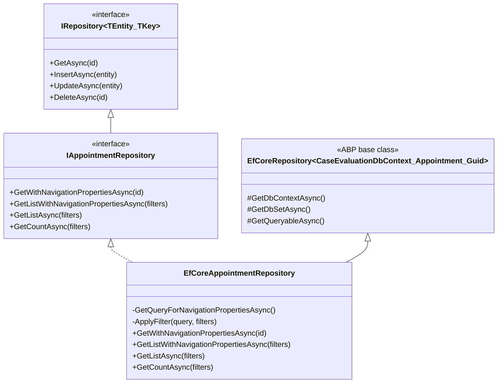

# Repository Layer

[Home](../INDEX.md) > [Backend](./) > Repositories

---

## Pattern Overview

ABP's generic `IRepository<TEntity, TKey>` handles basic CRUD operations (Get, Insert, Update, Delete) for all entities out of the box. Custom repository interfaces extend this with:

- **Filtered listing** with optional parameters (`.WhereIf()`)
- **Navigation property loading** via LINQ joins (returning `*WithNavigationProperties` POCOs)
- **Count queries** matching the same filter signature for server-side pagination
- **Bulk delete** on select entities (`DeleteAllAsync`)

---

## Architecture Diagram



---

## Custom Repository Interfaces (Domain Layer)

All custom interfaces live under `src/HealthcareSupport.CaseEvaluation.Domain/{Entity}/` and extend `IRepository<TEntity, Guid>`.

### Full Navigation Property Repositories

These entities have complex relationships and provide `GetWithNavigationPropertiesAsync`, `GetListWithNavigationPropertiesAsync`, and `GetCountAsync` with FK-based filter parameters:

| Interface | Namespace | Key Methods |
|---|---|---|
| `IAppointmentRepository` | `Appointments` | `GetWithNavigationPropertiesAsync(id)`, `GetListWithNavigationPropertiesAsync(filterText, panelNumber, appointmentDateMin/Max, identityUserId, accessorIdentityUserId, appointmentTypeId, locationId, ...)`, `GetListAsync(filters)`, `GetCountAsync(filters)` |
| `IDoctorRepository` | `Doctors` | `GetWithNavigationPropertiesAsync(id)`, `GetListWithNavigationPropertiesAsync(filterText, firstName, lastName, email, identityUserId, appointmentTypeId, locationId, ...)`, `GetListAsync(filters)`, `GetCountAsync(filters)` |
| `IPatientRepository` | `Patients` | `GetWithNavigationPropertiesAsync(id)`, `GetListWithNavigationPropertiesAsync(filterText, firstName, lastName, middleName, email, genderId, dateOfBirthMin/Max, phoneNumber, socialSecurityNumber, stateId, appointmentLanguageId, identityUserId, ...)`, `GetListAsync(filters)`, `GetCountAsync(filters)` |
| `IDoctorAvailabilityRepository` | `DoctorAvailabilities` | `GetWithNavigationPropertiesAsync(id)`, `GetListWithNavigationPropertiesAsync(filterText, availableDateMin/Max, fromTimeMin/Max, toTimeMin/Max, bookingStatusId, locationId, appointmentTypeId, ...)`, `GetListAsync(filters)`, `GetCountAsync(filters)` |
| `ILocationRepository` | `Locations` | `DeleteAllAsync(filters)`, `GetWithNavigationPropertiesAsync(id)`, `GetListWithNavigationPropertiesAsync(filterText, name, city, zipCode, parkingFeeMin/Max, isActive, stateId, appointmentTypeId, ...)`, `GetListAsync(filters)`, `GetCountAsync(filters)` |
| `IWcabOfficeRepository` | `WcabOffices` | `DeleteAllAsync(filters)`, `GetWithNavigationPropertiesAsync(id)`, `GetListWithNavigationPropertiesAsync(filterText, name, abbreviation, address, city, zipCode, isActive, stateId, ...)`, `GetListAsync(filters)`, `GetCountAsync(filters)` |
| `IApplicantAttorneyRepository` | `ApplicantAttorneys` | `GetWithNavigationPropertiesAsync(id)`, `GetListWithNavigationPropertiesAsync(filterText, firmName, phoneNumber, city, stateId, identityUserId, ...)`, `GetListAsync(filters)`, `GetCountAsync(filters)` |
| `IAppointmentAccessorRepository` | `AppointmentAccessors` | `GetWithNavigationPropertiesAsync(id)`, `GetListWithNavigationPropertiesAsync(filterText, accessTypeId, identityUserId, appointmentId, ...)`, `GetListAsync(filters)`, `GetCountAsync(filters)` |
| `IAppointmentEmployerDetailRepository` | `AppointmentEmployerDetails` | `GetWithNavigationPropertiesAsync(id)`, `GetListWithNavigationPropertiesAsync(filterText, employerName, phoneNumber, street, city, appointmentId, stateId, ...)`, `GetListAsync(filters)`, `GetCountAsync(filters)` |
| `IAppointmentApplicantAttorneyRepository` | `AppointmentApplicantAttorneys` | `GetWithNavigationPropertiesAsync(id)`, `GetListWithNavigationPropertiesAsync(filterText, appointmentId, applicantAttorneyId, identityUserId, ...)`, `GetListAsync(filters)`, `GetCountAsync(filters)` |

### Simple List/Count Repositories

These entities have no foreign keys and provide only `GetListAsync` and `GetCountAsync` (no navigation property methods):

| Interface | Namespace | Key Methods |
|---|---|---|
| `IAppointmentTypeRepository` | `AppointmentTypes` | `GetListAsync(filterText, name, ...)`, `GetCountAsync(filterText, name)` |
| `IAppointmentStatusRepository` | `AppointmentStatuses` | `DeleteAllAsync(filterText)`, `GetListAsync(filterText, ...)`, `GetCountAsync(filterText)` |
| `IAppointmentLanguageRepository` | `AppointmentLanguages` | `GetListAsync(filterText, ...)`, `GetCountAsync(filterText)` |
| `IStateRepository` | `States` | `GetListAsync(filterText, name, ...)`, `GetCountAsync(filterText, name)` |

---

## EF Core Implementations (EntityFrameworkCore Layer)

Each implementation lives under `src/HealthcareSupport.CaseEvaluation.EntityFrameworkCore/{Entity}/` and:

1. **Extends** `EfCoreRepository<CaseEvaluationDbContext, TEntity, Guid>` (ABP's EF Core base)
2. **Implements** the corresponding custom interface (e.g., `IAppointmentRepository`)

### Key Implementation Patterns

**LINQ Joins for Navigation Properties:**

Rather than using EF Core `.Include()`, the repositories use explicit LINQ `join ... into ... from ... DefaultIfEmpty()` to build `*WithNavigationProperties` projections. This enables left outer joins and avoids loading unnecessary data:

```csharp
from appointment in (await GetDbSetAsync())
join patient in dbContext.Set<Patient>() on appointment.PatientId equals patient.Id into patients
from patient in patients.DefaultIfEmpty()
join appointmentType in dbContext.Set<AppointmentType>() on appointment.AppointmentTypeId equals appointmentType.Id into appointmentTypes
from appointmentType in appointmentTypes.DefaultIfEmpty()
select new AppointmentWithNavigationProperties
{
    Appointment = appointment,
    Patient = patient,
    AppointmentType = appointmentType,
    // ...
};
```

**Optional Filtering via `.WhereIf()`:**

ABP's `WhereIf` extension conditionally applies predicates only when the parameter has a value:

```csharp
query
    .WhereIf(!string.IsNullOrWhiteSpace(filterText), e => e.Appointment.PanelNumber!.Contains(filterText!))
    .WhereIf(appointmentDateMin.HasValue, e => e.Appointment.AppointmentDate >= appointmentDateMin!.Value)
    .WhereIf(appointmentTypeId != null && appointmentTypeId != Guid.Empty, e => e.AppointmentType.Id == appointmentTypeId);
```

**Pagination:**

Uses ABP's `.PageBy(skipCount, maxResultCount)` extension (equivalent to `.Skip(skipCount).Take(maxResultCount)`):

```csharp
return await query.PageBy(skipCount, maxResultCount).ToListAsync(cancellationToken);
```

**Dynamic Sorting:**

Uses `System.Linq.Dynamic.Core` for string-based sorting with entity-specific defaults:

```csharp
query = query.OrderBy(string.IsNullOrWhiteSpace(sorting) ? AppointmentConsts.GetDefaultSorting(true) : sorting);
```

---

## WithNavigationProperties Pattern

Repository methods return POCO classes (not entities) that bundle the main entity with its related entities. These are defined in the Domain layer alongside the entity:

```csharp
public class AppointmentWithNavigationProperties
{
    public Appointment Appointment { get; set; }
    public Patient Patient { get; set; }
    public IdentityUser IdentityUser { get; set; }
    public AppointmentType AppointmentType { get; set; }
    public Location Location { get; set; }
    public DoctorAvailability DoctorAvailability { get; set; }
    public AppointmentApplicantAttorneyWithNavigationProperties? AppointmentApplicantAttorney { get; set; }
}
```

The Application Service layer maps these POCOs to DTOs using `ObjectMapper` before returning them to the API layer.

---

## Repository Registration

All custom repositories are registered in `CaseEvaluationEntityFrameworkCoreModule.ConfigureServices`:

```csharp
context.Services.AddAbpDbContext<CaseEvaluationDbContext>(options =>
{
    options.AddDefaultRepositories(includeAllEntities: true);
    options.AddRepository<State, States.EfCoreStateRepository>();
    options.AddRepository<AppointmentType, AppointmentTypes.EfCoreAppointmentTypeRepository>();
    options.AddRepository<AppointmentStatus, AppointmentStatuses.EfCoreAppointmentStatusRepository>();
    options.AddRepository<AppointmentLanguage, AppointmentLanguages.EfCoreAppointmentLanguageRepository>();
    options.AddRepository<Location, Locations.EfCoreLocationRepository>();
    options.AddRepository<WcabOffice, WcabOffices.EfCoreWcabOfficeRepository>();
    options.AddRepository<Doctor, Doctors.EfCoreDoctorRepository>();
    options.AddRepository<DoctorAvailability, DoctorAvailabilities.EfCoreDoctorAvailabilityRepository>();
    options.AddRepository<Patient, Patients.EfCorePatientRepository>();
    options.AddRepository<Appointment, Appointments.EfCoreAppointmentRepository>();
    options.AddRepository<AppointmentEmployerDetail, AppointmentEmployerDetails.EfCoreAppointmentEmployerDetailRepository>();
    options.AddRepository<AppointmentAccessor, AppointmentAccessors.EfCoreAppointmentAccessorRepository>();
    options.AddRepository<ApplicantAttorney, ApplicantAttorneys.EfCoreApplicantAttorneyRepository>();
    options.AddRepository<AppointmentApplicantAttorney, AppointmentApplicantAttorneys.EfCoreAppointmentApplicantAttorneyRepository>();
});
```

`AddDefaultRepositories(includeAllEntities: true)` creates default `IRepository<T, TKey>` implementations for all entities. The `AddRepository` calls override these defaults with the custom implementations that provide navigation property loading and advanced filtering.

---

## Source File Locations

| Layer | Path Pattern |
|---|---|
| Custom interfaces (Domain) | `src/HealthcareSupport.CaseEvaluation.Domain/{Entity}/I{Entity}Repository.cs` |
| WithNavigationProperties POCOs | `src/HealthcareSupport.CaseEvaluation.Domain/{Entity}/{Entity}WithNavigationProperties.cs` |
| EF Core implementations | `src/HealthcareSupport.CaseEvaluation.EntityFrameworkCore/{Entity}/EfCore{Entity}Repository.cs` |
| Module registration | `src/HealthcareSupport.CaseEvaluation.EntityFrameworkCore/EntityFrameworkCore/CaseEvaluationEntityFrameworkCoreModule.cs` |

---

## Related Documentation

- [Domain Model](DOMAIN-MODEL.md)
- [Application Services](APPLICATION-SERVICES.md)
- [EF Core Design](../database/EF-CORE-DESIGN.md)
