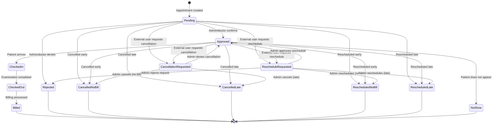
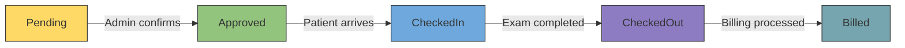
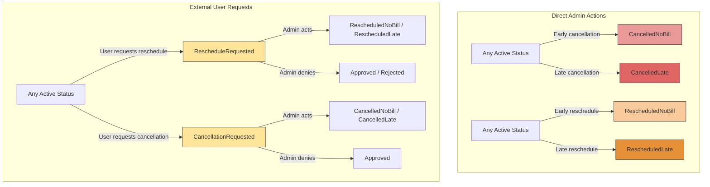

# Appointment Lifecycle

[Home](../INDEX.md) > [Business Domain](./) > Appointment Lifecycle

## Overview

Every appointment in the HCS Case Evaluation Portal moves through a defined set of statuses. The `AppointmentStatusType` enum (defined in `src/HealthcareSupport.CaseEvaluation.Domain.Shared/Enums/AppointmentStatusType.cs`) contains **13 statuses**, each representing a distinct phase in the appointment lifecycle.

---

## Appointment Statuses

| Value | Status                  | Description                                                                 |
|-------|-------------------------|-----------------------------------------------------------------------------|
| 1     | **Pending**             | Initial state when an appointment is created or requested                   |
| 2     | **Approved**            | Appointment confirmed by admin or doctor                                    |
| 3     | **Rejected**            | Appointment denied                                                          |
| 4     | **NoShow**              | Patient did not appear for the scheduled examination                        |
| 5     | **CancelledNoBill**     | Cancelled with sufficient notice; no billing applies                        |
| 6     | **CancelledLate**       | Cancelled late; may incur a late-cancellation fee                           |
| 7     | **RescheduledNoBill**   | Rescheduled with sufficient notice; no billing for the original slot        |
| 8     | **RescheduledLate**     | Rescheduled late; may incur billing for the original slot                   |
| 9     | **CheckedIn**           | Patient has arrived and checked in at the office                            |
| 10    | **CheckedOut**          | Examination completed; patient has left                                     |
| 11    | **Billed**              | Final state; examination report and billing have been processed             |
| 12    | **RescheduleRequested** | An external user requested a reschedule (awaiting admin action)             |
| 13    | **CancellationRequested** | An external user requested cancellation (awaiting admin action)           |

---

## Full State Machine Diagram

This is the **centerpiece** diagram showing all 13 states and their valid transitions.



---

## Happy Path

The ideal appointment flow from creation to billing.



**Sequence:** `Pending (1)` -> `Approved (2)` -> `CheckedIn (9)` -> `CheckedOut (10)` -> `Billed (11)`

---

## Cancellation and Reschedule Paths



### External User Request Flow

When an external user (Patient, Attorney, etc.) wants to cancel or reschedule, they do not directly change the appointment status. Instead:

1. The appointment moves to **RescheduleRequested (12)** or **CancellationRequested (13)** -- these are "pending admin action" states.
2. An admin reviews the request and transitions to the appropriate terminal status.

---

## Terminal States

These statuses represent the end of an appointment's lifecycle. No further transitions occur from these states.

| Status              | Description                                         |
|---------------------|-----------------------------------------------------|
| **Billed (11)**           | Successfully completed and billed                 |
| **Rejected (3)**          | Denied before it could proceed                    |
| **CancelledNoBill (5)**   | Cancelled early, no charge                        |
| **CancelledLate (6)**     | Cancelled late, possible fee                      |
| **RescheduledNoBill (7)** | Rescheduled early, no charge for original         |
| **RescheduledLate (8)**   | Rescheduled late, possible fee for original       |
| **NoShow (4)**            | Patient failed to appear                          |

---

## Billing Implications

| Variant            | Billing Impact                                                   |
|--------------------|------------------------------------------------------------------|
| **NoBill** variants (CancelledNoBill, RescheduledNoBill) | No charge for the cancelled/rescheduled appointment |
| **Late** variants (CancelledLate, RescheduledLate)       | Possible late-cancellation or late-reschedule fee   |
| **Billed**         | Full examination billing has been processed                      |
| **NoShow**         | May incur a no-show fee depending on business rules              |

---

## Source Reference

- **Enum definition:** `src/HealthcareSupport.CaseEvaluation.Domain.Shared/Enums/AppointmentStatusType.cs`

```csharp
public enum AppointmentStatusType
{
    Pending = 1,
    Approved = 2,
    Rejected = 3,
    NoShow = 4,
    CancelledNoBill = 5,
    CancelledLate = 6,
    RescheduledNoBill = 7,
    RescheduledLate = 8,
    CheckedIn = 9,
    CheckedOut = 10,
    Billed = 11,
    RescheduleRequested = 12,
    CancellationRequested = 13,
}
```

---

## Related Documentation

- [Domain Overview](DOMAIN-OVERVIEW.md)
- [Doctor Availability](DOCTOR-AVAILABILITY.md)
- [Enums and Constants](../backend/ENUMS-AND-CONSTANTS.md)
- [Application Services](../backend/APPLICATION-SERVICES.md)
