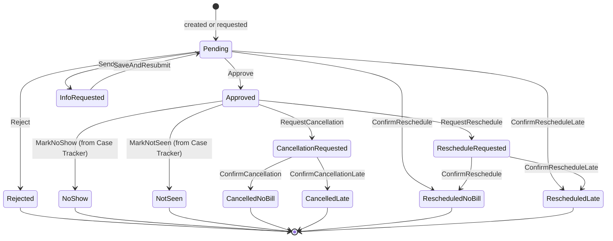

# Appointment Lifecycle

> Purpose: reference for the appointment status set and the transitions between them.
> Audience: backend and frontend developers.
> Authority: `AppointmentManager.BuildMachine` is the only place transitions are declared.
> Read it if this page and the code disagree, and then fix this page.

[Home](../INDEX.md) > [Business Domain](./) > Appointment Lifecycle

## How to read this page

The status set lives in
`src/HealthcareSupport.CaseEvaluation.Domain.Shared/Enums/AppointmentStatusType.cs`, and the
transitions live in one `Stateless` state machine built by
`AppointmentManager.BuildMachine` (`src/.../Domain/Appointments/AppointmentManager.cs`).
**Nothing else declares a transition.** No enum member is reproduced here as source, because a
copied enum goes stale: an earlier version of this page inlined one that was missing two
members for months.

**Three of the fifteen statuses are unreachable.** That is not a documentation caveat, it is
the single most important fact on this page, so it comes before the tables.

## Where this portal's responsibility ends

**The Appointment Portal owns the request and the decision. The Case Tracker owns what happens
afterwards.** Confirmed by the product owner on 2026-09-28.

Concretely, this portal handles exactly five things: an appointment is **requested**, then
**approved** or **rejected**, and thereafter **rescheduled** or **cancelled**. Once an
appointment is approved it is handed to the Case Tracker, and the rest of the process -- the
day of the exam, the outcome, and billing -- is the Case Tracker's responsibility.

**This portal does not do billing, and is not going to.** Billing is handled elsewhere today and
will move either to the Case Tracker or to a new application, but not here. Do not build it in.

That boundary is the reason for the next section.

## The three dead statuses

`CheckedIn` (9), `CheckedOut` (10) and `Billed` (11) **cannot be reached.** Their transitions
are configured in `BuildMachine`, but nothing anywhere triggers `CheckIn`, `CheckOut` or
`Bill`: no application-service method, no endpoint, no UI control, no background job. Verified
2026-09-16 and re-verified 2026-09-27.

They are the legacy app's front-desk, day-of-exam flow. They were planned for this portal, and
then that responsibility moved to the Case Tracker, which is where it now lives. So they are not
unfinished work and not a gap: **they are three states this application is not supposed to have.**

**This is a settled product decision, not an open question.** An earlier version of this page
said they were retained "pending a product decision"; the product owner settled it on 2026-09-28.
They are removal candidates. Removing them is a schema and data-compatibility exercise rather
than a behaviour change, since no row can be in one of these states, and it should be planned
rather than done casually: the enum values are persisted as integers, and
`AppointmentStatusType` warns that renumbering would silently relabel stored rows.

Until they are removed, treat any code that references them as dead. Tracked as PF-005 in
`docs/parity/_parity-flags.md`.

Consequences a maintainer will otherwise trip over:

- **The portal does not do billing.** `DashboardAppService` hardcodes `BilledThisMonth = 0`,
  so the dashboard's billed counter is permanently zero rather than merely empty.
- The email templates `PatientAppointmentCheckedIn` and `PatientAppointmentCheckedOut` exist in
  the catalogue and never fire.
- `appointment-status.util.ts` maps all three to a status pill that no appointment can display.

Do not build on them, and do not make them reachable without a product decision.

## The status set

| Value | Status | Reachable | Meaning |
| --- | --- | --- | --- |
| 1 | **Pending** | yes | Created or requested, awaiting staff decision |
| 2 | **Approved** | yes | Confirmed by staff. The only source of an attendance outcome |
| 3 | **Rejected** | yes | Denied. Terminal; re-submitting creates a NEW appointment |
| 4 | **NoShow** | yes, inbound only | Patient never arrived. Authored in the Case Tracker |
| 5 | **CancelledNoBill** | yes | Cancelled with enough notice; no charge |
| 6 | **CancelledLate** | yes | Cancelled inside the window; may incur a fee |
| 7 | **RescheduledNoBill** | yes | Rescheduled with enough notice; no charge for the original slot |
| 8 | **RescheduledLate** | yes | Rescheduled inside the window; may incur a fee for the original slot |
| 9 | **CheckedIn** | **NO** | Dead. See above |
| 10 | **CheckedOut** | **NO** | Dead. See above |
| 11 | **Billed** | **NO** | Dead. See above |
| 12 | **RescheduleRequested** | yes | A reschedule request is open, awaiting staff action |
| 13 | **CancellationRequested** | yes | A cancellation request is open, awaiting staff action |
| 14 | **InfoRequested** | yes | Staff sent the request back for more information. Transient, not terminal |
| 15 | **NotSeen** | yes, inbound only | Patient arrived but was not evaluated. Authored in the Case Tracker |

`NoShow` and `NotSeen` are **inbound only**: the portal never originates them. Intake staff
record them in the Case Tracker and they are pushed to the portal, so they do reach and persist
here. `AppointmentLifecycleValidators.IsAttendanceOutcome` is the single definition of that
pair; ask it rather than restating the two.

Values are persisted as integers, so **renumbering would silently relabel stored rows.**

## The transitions, exactly as configured

Every transition in the system. Anything not in this table is not permitted and will throw.

| From | Trigger | To |
| --- | --- | --- |
| Pending | Approve | Approved |
| Pending | Reject | Rejected |
| Pending | SendBack | InfoRequested |
| Pending | ConfirmReschedule | RescheduledNoBill |
| Pending | ConfirmRescheduleLate | RescheduledLate |
| InfoRequested | SaveAndResubmit | Pending |
| Approved | RequestCancellation | CancellationRequested |
| Approved | RequestReschedule | RescheduleRequested |
| Approved | MarkNoShow | NoShow |
| Approved | MarkNotSeen | NotSeen |
| Approved | CheckIn | CheckedIn (**dead**) |
| CancellationRequested | ConfirmCancellation | CancelledNoBill |
| CancellationRequested | ConfirmCancellationLate | CancelledLate |
| RescheduleRequested | ConfirmReschedule | RescheduledNoBill |
| RescheduleRequested | ConfirmRescheduleLate | RescheduledLate |
| CheckedIn | CheckOut | CheckedOut (**dead**) |
| CheckedOut | Bill | Billed (**dead**) |

```mermaid
stateDiagram-v2
    [*] --> Pending : created or requested

    Pending --> Approved : Approve
    Pending --> Rejected : Reject
    Pending --> InfoRequested : SendBack
    Pending --> RescheduledNoBill : ConfirmReschedule
    Pending --> RescheduledLate : ConfirmRescheduleLate

    InfoRequested --> Pending : SaveAndResubmit

    Approved --> CancellationRequested : RequestCancellation
    Approved --> RescheduleRequested : RequestReschedule
    Approved --> NoShow : MarkNoShow (from Case Tracker)
    Approved --> NotSeen : MarkNotSeen (from Case Tracker)

    CancellationRequested --> CancelledNoBill : ConfirmCancellation
    CancellationRequested --> CancelledLate : ConfirmCancellationLate

    RescheduleRequested --> RescheduledNoBill : ConfirmReschedule
    RescheduleRequested --> RescheduledLate : ConfirmRescheduleLate

    Rejected --> [*]
    NoShow --> [*]
    NotSeen --> [*]
    CancelledNoBill --> [*]
    CancelledLate --> [*]
    RescheduledNoBill --> [*]
    RescheduledLate --> [*]
```

The dead `Approved -> CheckedIn -> CheckedOut -> Billed` chain is deliberately omitted from the
diagram so it cannot be mistaken for a path an appointment travels. It is in the table above,
marked, and in the code.

## Things the table does not tell you

- **`Approved` is the ONLY source for both attendance outcomes**, and deliberately so. Filing a
  change request against an Approved appointment moves it to `RescheduleRequested` or
  `CancellationRequested`, so an appointment that can still take a terminal attendance outcome
  never has an open request the outcome could strand.
- **`InfoRequested` is transient, not terminal.** The slot stays `Reserved` throughout, so a
  request sent back for information does not release its slot.
- **`Pending` can reach a Rescheduled outcome directly.** Added in Phase 4d (2026-08-05),
  because internal staff may file a reschedule against a not-yet-approved appointment;
  `SubmitRescheduleAsync` skips the `Approved -> RescheduleRequested` step for such a source,
  so it arrives at finalisation still `Pending`. Without those two transitions the whole
  Pending-source path throws.
- **Nothing transitions out of `Rejected`.** Re-submitting a rejected request creates a new
  appointment rather than reviving the old one.

## Re-booking: three separate flows

None of these is a transition. Each creates a NEW appointment from a source, and each has its
own eligibility gate in `AppointmentLifecycleValidators`.

| Flow | Source must be | Notes |
| --- | --- | --- |
| **ReSubmit** | `Rejected` | The rejected request never became an appointment |
| **Reval** | `Approved`, or an attendance outcome where the source was itself a re-evaluation | A first evaluation that no-showed may NOT be re-evalled: nothing has established the need yet |
| **ReBook** | `CancelledNoBill`, `CancelledLate`, `NoShow` or `NotSeen` | The appointment did not happen. Deliberately not `Approved`, which would strand a live appointment |

**All three mint a FRESH confirmation number.** ReSubmit used to carry the source's number
forward for legacy parity and could not: the unique index on
`(TenantId, RequestConfirmationNumber)` filtered on `IsDeleted = 0` is still satisfied by the
rejected source row, so every re-submit failed on that constraint. Changed 2026-08-22. The link
back to the source is carried on `RescheduledFromAppointmentId`.

An IT Admin override exists on Reval but is **not** a free pass: it changes the error message,
not the outcome.

## Billing semantics of the outcome pairs

The `NoBill` and `Late` suffixes record whether the cancellation or reschedule fell inside the
office's notice window, which is configurable per office via `SystemParameter`
(`Scheduling.CancelWindowMinutes`).

| Variant | Billing impact |
| --- | --- |
| `CancelledNoBill`, `RescheduledNoBill` | No charge for the affected appointment |
| `CancelledLate`, `RescheduledLate` | May incur a late fee |
| `NoShow`, `NotSeen` | Billed the same as each other. Neither produces a replacement appointment |
| `Billed` | Unreachable, and deliberately so. See the responsibility boundary above |

**These names record a billing consequence; they do not perform one.** The portal stores which
side of the notice window an outcome fell, and something else acts on it. `NoShow` and `NotSeen`
are billed identically, so the distinction between them is not a billing distinction: it exists
for **reporting and for the conversation with the client**, because "the patient never arrived"
and "the patient arrived and was not evaluated" are different facts about the same non-outcome.

Neither attendance outcome produces a replacement appointment automatically: a client who still
wants one submits a new request, or staff use ReBook.

## Source reference

- Status set: `src/HealthcareSupport.CaseEvaluation.Domain.Shared/Enums/AppointmentStatusType.cs`
  -- read it for the per-member commentary, which is more detailed than this page
- Transitions: `src/.../Domain/Appointments/AppointmentManager.cs`, `BuildMachine`
- Re-booking gates: `src/.../Domain/Appointments/AppointmentLifecycleValidators.cs`
- Attendance outcomes arriving from the Case Tracker:
  `src/.../Domain/Integration/CaseTracker/CaseTrackerAttendanceService.cs`

## Related documentation

- [Domain Overview](DOMAIN-OVERVIEW.md)
- [Doctor Availability](DOCTOR-AVAILABILITY.md)
- [Enums and Constants](../backend/ENUMS-AND-CONSTANTS.md)
- [Application Services](../backend/APPLICATION-SERVICES.md)
