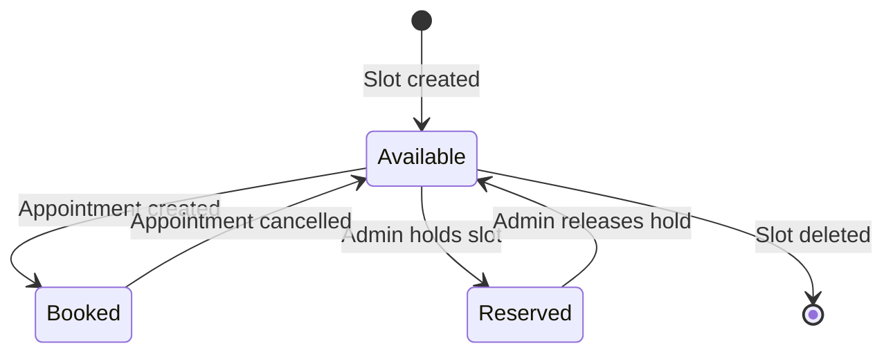
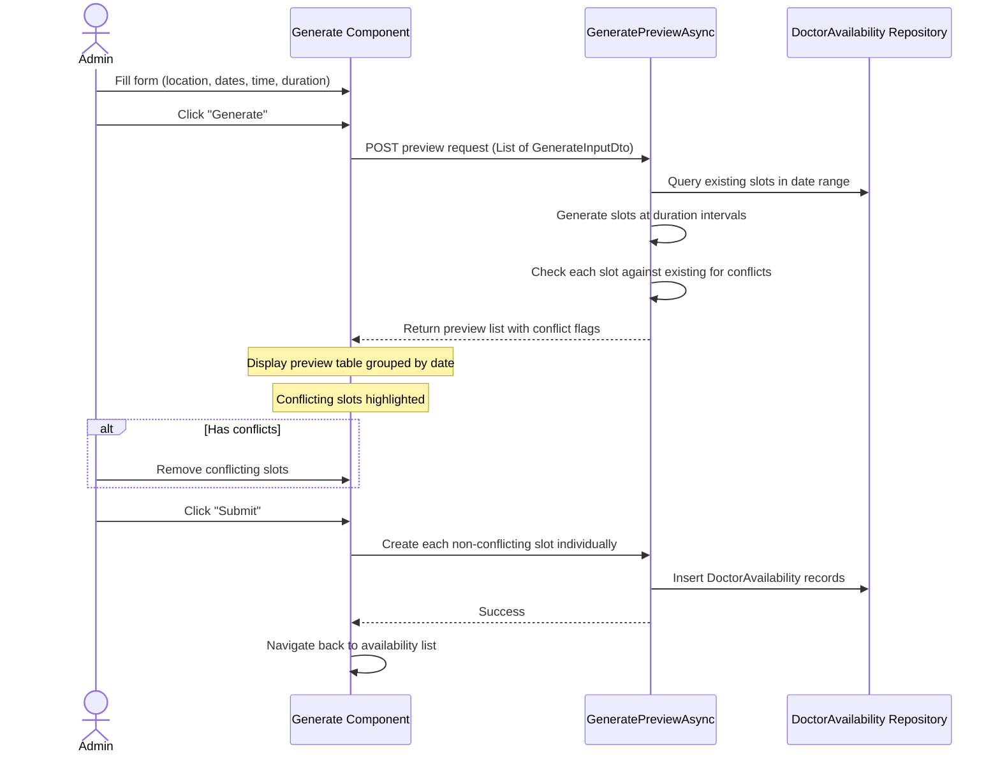

# Doctor Availability

[Home](../INDEX.md) > [Business Domain](./) > Doctor Availability

## Overview

Doctor availability is the scheduling backbone of the portal. Each `DoctorAvailability` record represents a single bookable time slot for a doctor at a specific location. Admins create availability in bulk, and patients (or their representatives) book appointments against available slots.

---

## Availability Slot Model

Each `DoctorAvailability` entity contains the following key properties:

| Property            | Type           | Description                                              |
|---------------------|----------------|----------------------------------------------------------|
| `AvailableDate`     | `DateTime`     | The calendar date of the slot                            |
| `FromTime`          | `TimeOnly`     | Start time of the slot                                   |
| `ToTime`            | `TimeOnly`     | End time of the slot                                     |
| `BookingStatusId`   | `BookingStatus` | Current booking state (Available, Booked, Reserved)     |
| `LocationId`        | `Guid`         | FK to the Location where the appointment takes place     |
| `AppointmentTypeId` | `Guid?`        | FK to the AppointmentType (e.g., QME, AME)              |

Slots are **tenant-scoped** -- each doctor's availability lives within their own tenant.

---

## BookingStatus Lifecycle

The `BookingStatus` enum (defined in `src/HealthcareSupport.CaseEvaluation.Domain.Shared/Enums/BookingStatus.cs`) has three values:

| Value | Status       | Description                                          |
|-------|--------------|------------------------------------------------------|
| 8     | **Available** | Slot is open and bookable by patients               |
| 9     | **Booked**    | Slot has been taken by an appointment               |
| 10    | **Reserved**  | Slot is held/reserved by admin (not bookable)       |

### State Transitions

**Key rules:**
- When an appointment is created against a slot, the slot transitions from `Available (8)` to `Booked (9)`.
- When an appointment is cancelled, the slot reverts from `Booked (9)` back to `Available (8)`.
- Admins can reserve slots to block them from patient booking, then release them later.

---

## Bulk Generation Feature

Admins can generate many availability slots at once through the **DoctorAvailabilityGenerateComponent** (`angular/src/app/doctor-availabilities/doctor-availability/components/doctor-availability-generate.component.ts`).

### Two Generation Modes

#### 1. Date Range Mode (`slotMode: 'dates'`)

Specify explicit from/to dates with a time window and duration.

- **From Date / To Date:** The calendar range to generate slots for
- **From Time / To Time:** The daily time window (e.g., 9:00 AM to 5:00 PM)
- **Duration (minutes):** Slot length (default: 15 min). E.g., 30-minute duration with 9:00-11:00 creates: 9:00-9:30, 9:30-10:00, 10:00-10:30, 10:30-11:00
- **Location:** Required -- which office
- **Appointment Type:** Optional
- **Booking Status:** Initial status for generated slots (typically Available)

#### 2. Weekday Mode (`slotMode: 'weekdays'`)

Specify a month and a weekday range to generate slots only on matching days.

- **Month:** Current month by default, or select a specific month
- **From Day / To Day:** Weekday range filter (Sunday=0 through Saturday=6). Supports wrap-around (e.g., Friday to Monday).
- **Time and duration settings:** Same as date range mode

### Generation Workflow

### Conflict Detection

The `GeneratePreviewAsync` method in `DoctorAvailabilitiesAppService` performs conflict detection:

1. Queries all existing `DoctorAvailability` records in the date range
2. For each generated slot, checks for **time overlap** with existing slots:
   - `existingSlot.FromTime < generatedSlot.ToTime AND existingSlot.ToTime > generatedSlot.FromTime`
3. A slot is marked as a conflict if:
   - It overlaps with an existing slot at the **same location**, OR
   - It overlaps with any slot that is **Booked** or **Reserved**
4. Validation messages are set:
   - _"TimeSlot Already Exist in the System for different location"_ -- when overlap exists at same location or with available slots
   - _"The selected time slot is already booked by user for different location"_ -- when overlap is with booked/reserved slots

### Conflict Resolution

- Conflicting slots are displayed to the admin in the preview
- The admin can **remove** individual conflicting slots before submitting
- The "Submit" button is **disabled** while any conflicts remain (`canSubmit` = false when `hasConflicts` = true)
- Only non-conflicting slots are submitted via individual `create` API calls

---

## Relationship to Appointments

- Each **Appointment** references exactly one `DoctorAvailability` slot
- When an appointment is created, the referenced slot's `BookingStatusId` changes to `Booked (9)`
- When an appointment is cancelled, the slot reverts to `Available (8)`
- This ensures **no double-booking** -- a slot can only be linked to one active appointment

---

## Calendar Integration (Frontend)

The appointment booking UI uses availability data to guide date and time selection:

1. **Date Picker:** Queries available dates for the selected Location + AppointmentType. Only dates with at least one `Available` slot are highlighted and selectable.
2. **Time Dropdown:** After selecting a date, shows only `Available` time slots for that specific date at the chosen location.
3. This ensures patients can only book appointments where a doctor has open availability.

---

## Sample Week Timeline

```mermaid
gantt
    title Doctor Availability - Sample Week
    dateFormat HH:mm
    axisFormat %H:%M

    section Monday
    Slot 1 (Available)    :active, mon1, 09:00, 30min
    Slot 2 (Booked)       :crit, mon2, 09:30, 30min
    Slot 3 (Available)    :active, mon3, 10:00, 30min
    Slot 4 (Reserved)     :mon4, 10:30, 30min

    section Tuesday
    Slot 1 (Available)    :active, tue1, 09:00, 30min
    Slot 2 (Available)    :active, tue2, 09:30, 30min
    Slot 3 (Booked)       :crit, tue3, 10:00, 30min

    section Wednesday
    Slot 1 (Booked)       :crit, wed1, 09:00, 30min
    Slot 2 (Booked)       :crit, wed2, 09:30, 30min
    Slot 3 (Available)    :active, wed3, 10:00, 30min

    section Thursday
    No slots scheduled    :done, thu1, 09:00, 0min

    section Friday
    Slot 1 (Available)    :active, fri1, 09:00, 30min
    Slot 2 (Available)    :active, fri2, 09:30, 30min
```

---

## Source References

- **Domain entity:** `src/HealthcareSupport.CaseEvaluation.Domain/DoctorAvailabilities/DoctorAvailability.cs`
- **BookingStatus enum:** `src/HealthcareSupport.CaseEvaluation.Domain.Shared/Enums/BookingStatus.cs`
- **App service:** `src/HealthcareSupport.CaseEvaluation.Application/DoctorAvailabilities/DoctorAvailabilitiesAppService.cs`
- **Generate component:** `angular/src/app/doctor-availabilities/doctor-availability/components/doctor-availability-generate.component.ts`
- **Frontend enum:** `angular/src/app/proxy/enums/booking-status.enum.ts`

---

## Related Documentation

- [Appointment Lifecycle](APPOINTMENT-LIFECYCLE.md)
- [Domain Overview](DOMAIN-OVERVIEW.md)
- [Application Services](../backend/APPLICATION-SERVICES.md)
- [Appointment Booking Flow](../frontend/APPOINTMENT-BOOKING-FLOW.md)
