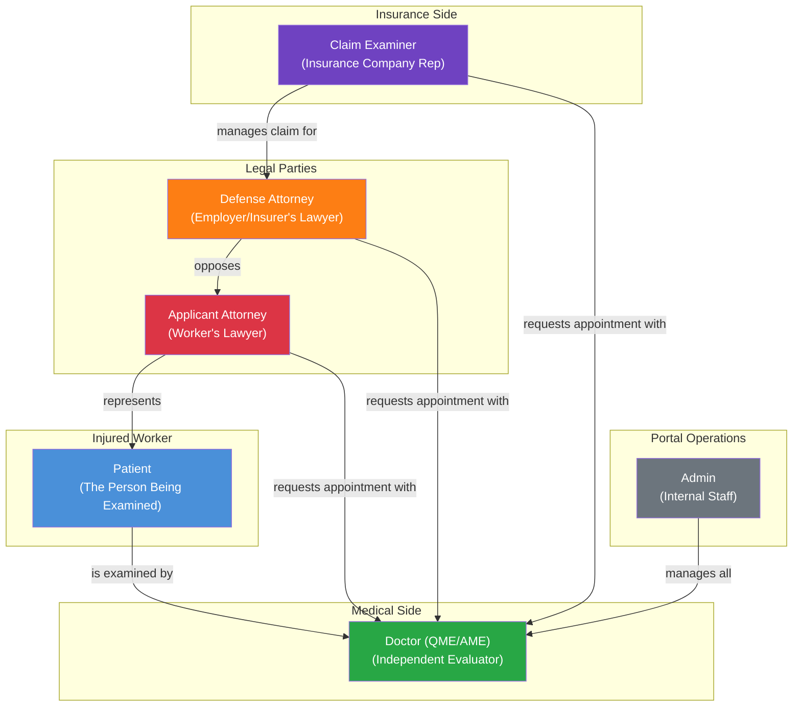
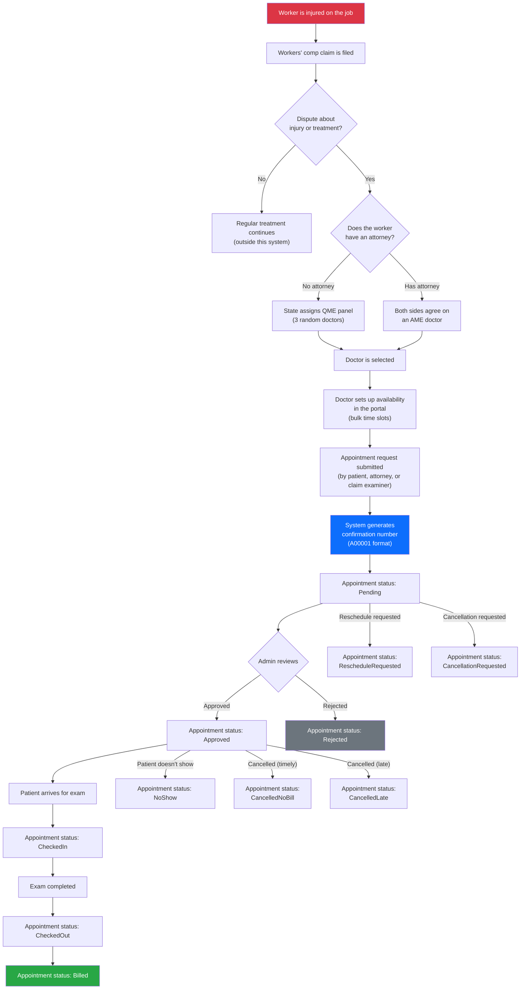

[Home](../INDEX.md) > [Business Domain](./) > Domain Overview

# Business Domain Overview: California Workers' Compensation IME Scheduling

This document explains what the HCS Case Evaluation Portal does in plain language. No prior knowledge of workers' compensation, healthcare, or California law is assumed.

---

## The Problem This Application Solves

When a worker is injured on the job in California, the state's **workers' compensation** system pays for their medical treatment. This is not regular health insurance -- it is a separate, employer-funded insurance program mandated by California law. The injured worker (called the "applicant" in legal proceedings) receives medical care, wage replacement, and other benefits through this system.

Sometimes a dispute arises. The worker might say, "My back injury is worse than the insurance company thinks." The insurance company might respond, "We believe the worker has recovered and does not need further treatment." When neither side can agree on the medical facts -- the severity of the injury, what treatment is needed, or whether the worker can return to work -- the case requires an **Independent Medical Examination (IME)**.

An IME is a medical exam conducted by a neutral doctor who has no prior relationship with the patient. This doctor reviews the medical records, examines the worker, and produces a report that carries significant legal weight in resolving the dispute.

**This portal manages the entire process of scheduling these IME appointments** -- from the doctor setting their availability, to the appointment request being submitted, to the patient showing up for their exam, all the way through to billing.

---

## Key Regulatory Concepts

### Types of Evaluating Doctors

California law defines two types of doctors who can perform these independent evaluations:

| Type | Full Name | When Used | How Selected |
|------|-----------|-----------|-------------|
| **QME** | Qualified Medical Evaluator | When the injured worker does **not** have an attorney | The state (DWC) assigns a random panel of three QME doctors; the parties strike names and the remaining doctor performs the exam |
| **AME** | Agreed Medical Evaluator | When the injured worker **has** an attorney | Both sides (applicant attorney and defense attorney) agree on a specific doctor |

Both QMEs and AMEs must be licensed physicians certified by California's Division of Workers' Compensation (DWC). The distinction matters because it determines the scheduling workflow and which parties are involved in the process.

### WCAB (Workers' Compensation Appeals Board)

The **WCAB** is the California state body that oversees workers' compensation disputes. It operates regional offices throughout California (stored as reference data in this system as `WcabOffice` entities). When a dispute cannot be resolved, it goes before a WCAB judge. The IME report produced from the appointment scheduled through this portal often becomes a central piece of evidence in those proceedings.

### Panel Number

A **Panel Number** is the identifier assigned by the state to a specific QME panel or case. It ties the appointment back to the legal proceeding. This is an optional field on appointments since AME cases may not always use the same panel structure.

---

## The Key Actors

Six types of people interact with this system, each with a different perspective and set of needs:

| Actor | Role in the Real World | Role in This System |
|-------|----------------------|---------------------|
| **Patient** (Injured Worker) | The person who was hurt on the job and needs to be examined | Can request appointments, view their own appointment details |
| **Doctor** (QME/AME) | The independent medical evaluator who will examine the patient | Each doctor is a "tenant" -- they manage availability, view appointments in their practice |
| **Applicant Attorney** | The lawyer representing the injured worker | Can request/view appointments for their clients, linked to appointments via `ApplicantAttorney` |
| **Defense Attorney** | The lawyer representing the employer or insurance company | Can request/view appointments, often the opposing party to the applicant attorney |
| **Claim Examiner** | The insurance company representative managing the workers' comp claim | Can request appointments, manages the administrative side for the insurer |
| **Admin** | Internal portal staff | Full system access, manages doctors, locations, reference data, and appointment lifecycle |

---

## The Core Process: From Injury to Examination

Here is the real-world process that this portal supports, from the moment an injury happens to the completion of the medical evaluation:

### Appointment Lifecycle at a Glance

Every appointment moves through a status machine with **13 possible states**:

| Status | Value | Meaning |
|--------|-------|---------|
| `Pending` | 1 | Appointment requested, awaiting admin review |
| `Approved` | 2 | Confirmed and scheduled |
| `Rejected` | 3 | Request denied by admin |
| `NoShow` | 4 | Patient did not appear for the exam |
| `CancelledNoBill` | 5 | Cancelled with sufficient notice (no charge) |
| `CancelledLate` | 6 | Cancelled too late (late cancellation fee applies) |
| `RescheduledNoBill` | 7 | Rescheduled with sufficient notice (no charge) |
| `RescheduledLate` | 8 | Rescheduled too late (late reschedule fee applies) |
| `CheckedIn` | 9 | Patient has arrived at the office |
| `CheckedOut` | 10 | Exam is complete, patient has left |
| `Billed` | 11 | Invoice has been generated |
| `RescheduleRequested` | 12 | Someone has asked to move the appointment |
| `CancellationRequested` | 13 | Someone has asked to cancel the appointment |

The happy path is: **Pending -> Approved -> CheckedIn -> CheckedOut -> Billed**

---

## Key Business Concepts

### Confirmation Number

Every appointment receives an auto-generated **Request Confirmation Number** in the format `A` followed by 5 digits (e.g., `A00001`, `A00042`). This is the primary human-readable identifier used in all communications about an appointment. It is stored in the `RequestConfirmationNumber` field on the `Appointment` entity.

### Appointment Types

Different kinds of medical specialties that a doctor may evaluate. Examples include Orthopedic, Psychiatric, Internal Medicine, and so on. In the system, these are stored as `AppointmentType` entities with a name and optional description. Doctors are linked to the appointment types they perform via a many-to-many relationship (`DoctorAppointmentType`).

### Locations

Physical office locations where examinations take place. Each location has an address, city, state, zip code, and a **parking fee** (a real cost that gets communicated to patients). Locations are global (shared across all doctors) but doctors are linked to the specific locations where they practice via a many-to-many relationship (`DoctorLocation`).

### Doctor Availability

Before appointments can be booked, a doctor's available time slots must be set up. Each `DoctorAvailability` record represents a single time slot on a specific date, at a specific location, for a specific appointment type. Time slots have a booking status:

| Booking Status | Value | Meaning |
|---------------|-------|---------|
| `Available` | 8 | Open for booking |
| `Booked` | 9 | An appointment has been scheduled in this slot |
| `Reserved` | 10 | Held/blocked (not available for general booking) |

Availability is generated in bulk -- an admin might create slots for "every Tuesday and Thursday from 9 AM to 5 PM for the next 3 months."

### Authorized Users / Accessors

Beyond the primary parties on an appointment, additional users can be granted access. The `AppointmentAccessor` entity links a user to a specific appointment with a defined access level:

| Access Type | Value | Meaning |
|------------|-------|---------|
| `View` | 23 | Can see appointment details (read-only) |
| `Edit` | 24 | Can modify appointment details |

This allows, for example, a second attorney at the same firm to view a colleague's appointment, or a supervisor at the insurance company to review a claim examiner's appointments.

### Employer Details

Each appointment can have associated **employer details** (`AppointmentEmployerDetail`) that capture information about the worker's employer at the time of injury -- employer name, the worker's occupation, and the employer's address. This is important context for the evaluating doctor.

### Applicant Attorneys

Applicant attorneys (the worker's lawyers) are tracked as their own entity (`ApplicantAttorney`) with firm name, firm address, phone, fax, and web address. They are linked to specific appointments via the `AppointmentApplicantAttorney` join entity, which connects an attorney to an appointment along with the identity user who created the link.

---

## How Multi-Tenancy Maps to the Business

The system uses a **doctor-per-tenant** multi-tenancy model. Here is what that means in practical terms:

- Each evaluating doctor operates as an independent medical practice
- In the system, each doctor is represented as a separate **tenant** (think of it as a completely separate workspace)
- When you "book with Dr. Smith," you are operating within Dr. Smith's tenant
- The doctor's appointments, availability slots, and attorney links are all isolated within their tenant

### What is Global vs. Tenant-Scoped

```mermaid
flowchart LR
    subgraph Global["Global Data (Host)\nShared across all doctors"]
        direction TB
        G1["Patients\n(Injured workers)"]
        G2["Locations\n(Office addresses)"]
        G3["States\n(CA, NY, etc.)"]
        G4["Appointment Types\n(Orthopedic, Psychiatric, etc.)"]
        G5["Appointment Statuses\n(Reference list)"]
        G6["Appointment Languages\n(English, Spanish, etc.)"]
        G7["WCAB Offices\n(California board locations)"]
        G8["Doctors\n(Master doctor records)"]
    end

    subgraph Tenant["Tenant-Scoped Data\nIsolated per doctor"]
        direction TB
        T1["Appointments\n(Scheduled exams)"]
        T2["Doctor Availability\n(Time slots)"]
        T3["Appointment Accessors\n(Who can view/edit)"]
        T4["Appointment Employer Details\n(Worker's employer info)"]
        T5["Applicant Attorneys\n(Worker's lawyer records)"]
        T6["Appointment-Attorney Links\n(Which attorney is on which case)"]
    end

    Global ---|"Referenced by"| Tenant

    style Global fill:#e7f3ff,stroke:#0d6efd,color:#000
    style Tenant fill:#fff3e0,stroke:#fd7e14,color:#000
```

**Why this design?** A patient (injured worker) might need to see multiple different evaluating doctors over the course of their case, or across different cases. Their personal record should not be duplicated for each doctor. Similarly, office locations and exam types are shared resources. But a doctor's schedule (availability) and their specific appointments are private to their practice.

The entities that implement `IMultiTenant` (have a `TenantId` property) are filtered automatically by the ABP Framework -- when operating within Dr. Smith's tenant, you only see Dr. Smith's appointments and availability, never Dr. Jones's.

---

## Putting It All Together

Here is a concrete example of how the system is used end-to-end:

1. **Setup:** An admin creates Dr. Smith as a tenant, configures her as an Orthopedic QME, and links her to two office locations (Downtown LA and Pasadena).

2. **Availability:** Within Dr. Smith's tenant, bulk availability slots are generated -- every Wednesday from 9:00 AM to 4:00 PM at the Downtown LA location, in 1-hour blocks, for the next 2 months. Each slot starts as `Available`.

3. **Appointment Request:** A claim examiner at State Fund Insurance submits an appointment request for patient John Doe, who injured his shoulder at work. The system generates confirmation number `A00127`. The appointment is linked to the 10:00 AM slot on the next available Wednesday. That slot flips from `Available` to `Booked`. The appointment starts in `Pending` status.

4. **Approval:** An admin reviews the request, verifies the panel number, and approves it. Status moves to `Approved`. The applicant attorney's information is linked to the appointment.

5. **Day of Exam:** John Doe arrives at the Downtown LA office. Front desk staff check him in (`CheckedIn`). Dr. Smith performs the examination. When he leaves, he is checked out (`CheckedOut`).

6. **Billing:** The appointment is marked as `Billed` once the invoice is generated.

7. **Access Control:** Throughout this process, the claim examiner can view the appointment. The applicant attorney has been granted `View` access. A supervising attorney at the defense firm has been added as an `AppointmentAccessor` with `View` access.

---

## Related Documentation

- [Appointment Lifecycle](APPOINTMENT-LIFECYCLE.md) -- Detailed 13-state status machine with transition rules
- [Doctor Availability](DOCTOR-AVAILABILITY.md) -- Slot generation, booking mechanics, and bulk operations
- [User Roles & Actors](USER-ROLES-AND-ACTORS.md) -- All user roles, permissions, and capabilities
- [Glossary](../GLOSSARY.md) -- Domain and technical terminology reference
- [Multi-Tenancy Strategy](../architecture/MULTI-TENANCY.md) -- Technical implementation of the doctor-per-tenant model
