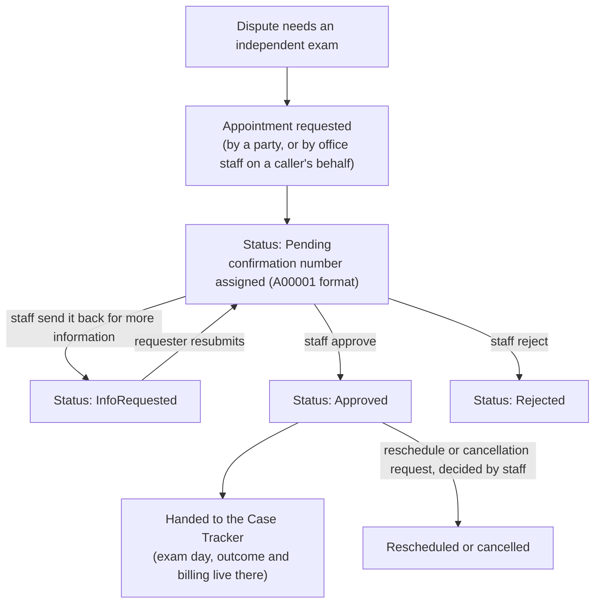

[Home](../INDEX.md) > [Business Domain](./) > Domain Overview

# Business Domain Overview: California Workers' Compensation IME Scheduling

> Purpose: plain-language explanation of the workers' compensation IME scheduling domain and of what
> this portal does within it. Audience: all contributors.

This page explains what the Appointment Portal does in plain language. No prior knowledge of
workers' compensation, healthcare or California law is assumed. For the exact rules, it links to the
pages that are verified against the code rather than restating them.

---

## The problem this application solves

When a worker is injured on the job in California, the state's **workers' compensation** system pays
for their medical treatment. This is not regular health insurance -- it is a separate, employer-funded
insurance program mandated by California law. The injured worker (called the "applicant" in legal
proceedings) receives medical care, wage replacement and other benefits through this system.

Sometimes a dispute arises. The worker might say, "My back injury is worse than the insurance company
thinks." The insurance company might respond, "We believe the worker has recovered." When neither side
can agree on the medical facts, the case requires an **Independent Medical Examination (IME)**: an
exam by a neutral doctor whose report carries significant legal weight in resolving the dispute.

**This portal owns the request and the decision for those appointments.** Parties or office staff
request an appointment, office staff approve or reject it, and an approved appointment can later be
rescheduled or cancelled. Once an appointment is approved it is handed to the **Case Tracker**, a
separate application that owns everything afterwards -- the day of the exam, the outcome and billing.
**This portal does not do billing.** See
[Appointment Lifecycle](APPOINTMENT-LIFECYCLE.md#where-this-portals-responsibility-ends).

---

## Key regulatory concepts

### Types of evaluating doctors

| Type | Full name | How selected |
|------|-----------|--------------|
| **QME** | Qualified Medical Evaluator | The state (DWC) issues a panel of doctors; the parties strike names and the remaining doctor performs the exam |
| **AME** | Agreed Medical Evaluator | Both sides (applicant attorney and defense attorney) agree on a specific doctor |

This is general background for readers new to the domain, not a statement of the law.

### WCAB (Workers' Compensation Appeals Board)

The **WCAB** is the California state body that hears workers' compensation disputes. Its regional
offices are reference data in this system (`WcabOffice`). The IME report produced from an appointment
scheduled through this portal often becomes central evidence in those proceedings.

### Panel number

A **Panel Number** identifies the state-issued QME panel. In this portal it is **required for a Panel
QME appointment and refused for every other appointment type**
(`AppointmentManager.EnsurePanelNumberMatchesType`).

---

## Who uses the portal

Seven named roles use the portal, plus the framework's built-in administrator. They are listed, with
what each can do, in [User Roles & Actors](USER-ROLES-AND-ACTORS.md). In short:

| Side | Roles | What they do here |
|------|-------|-------------------|
| Internal (office staff) | IT Admin, Staff Supervisor, Intake Staff | Publish availability, book on a caller's behalf, approve or reject requests, handle reschedules and cancellations |
| External (parties) | Patient, Applicant Attorney, Defense Attorney, Claim Examiner | Request appointments, see the appointments they are party to, upload documents |

**Doctors do not log in.** A doctor is a record in the office's data -- one doctor per practice --
that appointments, locations and availability refer to.

---

## The core process

```mermaid
flowchart TD
    A["Dispute needs an independent exam"] --> B["Appointment requested\n(by a party, or by office staff on a caller's behalf)"]
    B --> C["Status: Pending\nconfirmation number assigned (A00001 format)"]
    C -->|"staff send it back for more information"| I["Status: InfoRequested"]
    I -->|"requester resubmits"| C
    C -->|"staff approve"| D["Status: Approved"]
    C -->|"staff reject"| E["Status: Rejected"]
    D --> F["Handed to the Case Tracker\n(exam day, outcome and billing live there)"]
    D -->|"reschedule or cancellation request, decided by staff"| G["Rescheduled or cancelled"]
```

The complete status set, including the three statuses that can never be reached, is in
[Appointment Lifecycle](APPOINTMENT-LIFECYCLE.md). Do not copy that table here: a second copy is what
went stale before.

---

## Key business concepts

### Confirmation number

Every appointment receives an auto-generated **Request Confirmation Number**: `A` followed by 5 digits
(for example `A00001`). It is the human-readable reference used in all communication about an
appointment, stored in `Appointment.RequestConfirmationNumber`.

### Appointment types

The kinds of evaluation an office performs (for example a Panel QME or an AME). Stored as
`AppointmentType` records in each office's data.

### Locations

The physical sites where examinations take place, with an address and a **parking fee** that is
communicated to patients. Locations belong to the office: each office has its own list.

### Doctor availability

Before appointments can be booked, office staff publish time slots. A slot is one time window on a date
at a location, and it can offer **several appointment types**. Each slot has a **capacity** (default
3): it can take bookings until its active appointments reach that capacity. See
[Doctor Availability](DOCTOR-AVAILABILITY.md).

### Authorized users (accessors)

Beyond the parties on an appointment, additional people can be given access to it. An
`AppointmentAccessor` links a user to one appointment with **View** or **Edit** access -- for example a
paralegal at the attorney's firm.

### Employer details and attorneys

An appointment records the worker's employer (`AppointmentEmployerDetail`) and its applicant and defense
attorneys. Attorneys are stored once per office and linked to each appointment they are named on.

---

## How offices map to the system

**One office (a doctor's practice) is one tenant, and each office has its own database.** Nearly
everything -- appointments, patients, availability, locations, appointment types, even reference lists
such as US states and WCAB offices -- lives in that office's database, so no office can see another's
data and one database failing affects only its office. The host database holds only what spans offices,
such as the office registry and the office branding shown before sign-in. See
[Multi-Tenancy](../architecture/MULTI-TENANCY.md) and
[Tenancy and Isolation](../architecture/TENANCY-AND-ISOLATION.md).

A patient seen by two offices therefore has a record in each office. That duplication is the design,
not an oversight: it is what keeps one office's patient data out of another's database.

---

## Putting it all together

1. **Setup:** an operator creates a new practice, which creates the office, its database, its
   administrator and its doctor.
2. **Availability:** office staff publish slots, for example Wednesdays 9:00 AM to 4:00 PM at one
   location, in one-hour windows, each offering the office's appointment types.
3. **Request:** a claim examiner requests an appointment for an injured worker. The portal assigns a
   confirmation number such as `A00127`, and the appointment starts `Pending`.
4. **Decision:** Intake Staff review the request, check the required details (for example the panel
   number of a Panel QME) and approve it.
5. **Handoff:** the approved appointment goes to the Case Tracker, which runs the day of the exam and
   everything after it.
6. **Access:** throughout, each party sees the appointments they are named on; an authorized user added
   with View access can read this one.

---

## Related documentation

- [Appointment Lifecycle](APPOINTMENT-LIFECYCLE.md) -- every status and transition, and where the portal's
  responsibility ends
- [User Roles & Actors](USER-ROLES-AND-ACTORS.md) -- every role and what it can do
- [Doctor Availability](DOCTOR-AVAILABILITY.md) -- slots, capacity and bulk generation
- [Glossary](../GLOSSARY.md) -- domain and technical terms
- [Multi-Tenancy](../architecture/MULTI-TENANCY.md) -- database-per-office in technical detail
