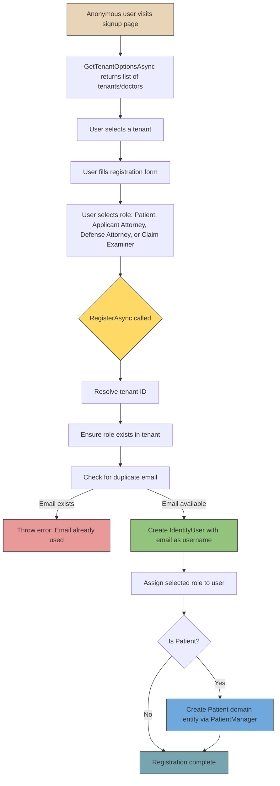
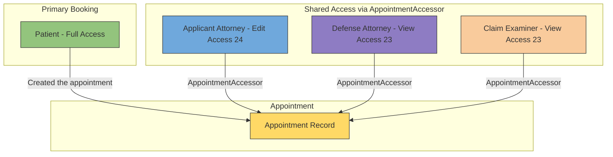

# User Roles and Actors

[Home](../INDEX.md) > [Business Domain](./) > User Roles & Actors

## Overview

The HCS Case Evaluation Portal uses a role-based access model built on top of ABP Framework's identity system. Roles are seeded at application startup and assigned during user registration. Each tenant (doctor practice) has its own set of users and role assignments.

---

## Seeded Roles

The `ExternalUserRoleDataSeedContributor` (`src/HealthcareSupport.CaseEvaluation.Domain/Identity/ExternalUserRoleDataSeedContributor.cs`) ensures the following roles exist in every tenant:

| Role                   | Description                                      |
|------------------------|--------------------------------------------------|
| **Patient**            | The injured worker undergoing evaluation         |
| **Claim Examiner**     | Insurance company representative                 |
| **Applicant Attorney** | Attorney representing the worker                 |
| **Defense Attorney**   | Attorney representing the employer/insurer       |

### Built-in ABP Role

| Role      | Description                                        |
|-----------|----------------------------------------------------|
| **admin** | System administrator with full permissions on all entities, users, roles, and tenants |

---

## Per-Role Capabilities

### Role Capability Matrix

| Capability                          | Admin | Patient | Applicant Attorney | Defense Attorney | Claim Examiner |
|-------------------------------------|:-----:|:-------:|:------------------:|:----------------:|:--------------:|
| Full CRUD on all entities           |   Y   |         |                    |                  |                |
| Manage users, roles, permissions    |   Y   |         |                    |                  |                |
| Manage tenants                      |   Y   |         |                    |                  |                |
| View own appointments               |   Y   |    Y    |         Y          |        Y         |       Y        |
| Book appointments                   |   Y   |    Y    |         Y          |                  |                |
| Book on behalf of patients          |   Y   |         |         Y          |                  |                |
| Edit own profile                    |   Y   |    Y    |         Y          |        Y         |       Y        |
| Request cancellation/reschedule     |   Y   |    Y    |         Y          |                  |                |
| View assigned appointments          |   Y   |         |         Y          |        Y         |       Y        |
| Manage case details                 |   Y   |         |                    |                  |       Y        |

---

## Entity-to-Role Mapping

Certain roles correspond to domain entities that hold additional profile data beyond the ABP `IdentityUser`:

| Role                   | Domain Entity          | Link Field                           |
|------------------------|------------------------|--------------------------------------|
| **Patient**            | `Patient`              | `Patient.IdentityUserId` -> `IdentityUser.Id` |
| **Applicant Attorney** | `ApplicantAttorney`    | `ApplicantAttorney.IdentityUserId` -> `IdentityUser.Id` |
| **Defense Attorney**   | _(no domain entity)_   | ABP `IdentityUser` only             |
| **Claim Examiner**     | _(no domain entity)_   | ABP `IdentityUser` only             |
| **admin**              | _(no domain entity)_   | ABP `IdentityUser` only             |

---

## External User Registration Flow

External users (non-admin) self-register through the `ExternalSignupAppService` (`src/HealthcareSupport.CaseEvaluation.Application/ExternalSignups/ExternalSignupAppService.cs`).

### ExternalUserType Enum

The registration form maps to `ExternalUserType` (defined in `src/HealthcareSupport.CaseEvaluation.Application.Contracts/ExternalSignups/ExternalUserType.cs`):

| Value | Type                | Maps to Role         |
|-------|---------------------|----------------------|
| 1     | Patient             | "Patient"            |
| 2     | ClaimExaminer       | "Claim Examiner"     |
| 3     | ApplicantAttorney   | "Applicant Attorney" |
| 4     | DefenseAttorney     | "Defense Attorney"   |

### Registration Sequence

### Registration Details

1. **Tenant selection is required** for non-tenant users (host-level). If the user is already in a tenant context, that tenant is used automatically.
2. **Email uniqueness** is enforced per tenant -- duplicate emails within the same tenant are rejected.
3. **Role seeding:** The `RegisterAsync` method calls `EnsureRoleAsync` before assigning the role, guaranteeing the role exists even if data seeding was skipped.
4. **Patient entity creation:** Only `Patient` registrations trigger creation of a corresponding domain entity (via `PatientManager.CreateAsync`). Other roles rely solely on the `IdentityUser` record.
5. **Default patient values:** New patients are created with `Gender.Male` and `DateOfBirth` set to the current UTC date as placeholders, to be updated later in profile editing.

---

## AppointmentAccessor Pattern

Beyond the primary booking user, additional users can be granted access to specific appointments through the `AppointmentAccessor` entity (`src/HealthcareSupport.CaseEvaluation.Domain/AppointmentAccessors/AppointmentAccessor.cs`).

### AccessType Enum

Defined in `src/HealthcareSupport.CaseEvaluation.Domain.Shared/Enums/AccessType.cs`:

| Value | Type     | Description                                    |
|-------|----------|------------------------------------------------|
| 23    | **View** | Read-only access to the appointment details    |
| 24    | **Edit** | Read and write access to the appointment       |

### AppointmentAccessor Entity

| Property          | Type         | Description                                    |
|-------------------|--------------|------------------------------------------------|
| `IdentityUserId`  | `Guid`       | The user being granted access                  |
| `AppointmentId`   | `Guid`       | The appointment being shared                   |
| `AccessTypeId`    | `AccessType` | Level of access (View or Edit)                 |
| `TenantId`        | `Guid?`      | Tenant scope (multi-tenant)                    |

The entity extends `FullAuditedEntity<Guid>` and implements `IMultiTenant`.

### Access Sharing Diagram

### Typical Usage

- A **Patient** books an appointment (they are the owner).
- An **Applicant Attorney** is granted **Edit (24)** access so they can update appointment details on behalf of their client.
- A **Defense Attorney** is granted **View (23)** access to monitor the appointment.
- A **Claim Examiner** is granted **View (23)** access to review case details.

This pattern allows fine-grained, per-appointment access control without granting broad role-based permissions.

---

## External User Lookup

The `ExternalSignupAppService.GetExternalUserLookupAsync` method provides a lookup of all external users, filtered to the roles: Patient, Applicant Attorney, and Defense Attorney. This is used in the UI when assigning appointment accessors or booking on behalf of another user.

The `GetMyProfileAsync` method allows authenticated external users to retrieve their own profile, including their assigned role.

---

## Source References

- **Role seeder:** `src/HealthcareSupport.CaseEvaluation.Domain/Identity/ExternalUserRoleDataSeedContributor.cs`
- **Signup service:** `src/HealthcareSupport.CaseEvaluation.Application/ExternalSignups/ExternalSignupAppService.cs`
- **ExternalUserType enum:** `src/HealthcareSupport.CaseEvaluation.Application.Contracts/ExternalSignups/ExternalUserType.cs`
- **AccessType enum:** `src/HealthcareSupport.CaseEvaluation.Domain.Shared/Enums/AccessType.cs`
- **AppointmentAccessor entity:** `src/HealthcareSupport.CaseEvaluation.Domain/AppointmentAccessors/AppointmentAccessor.cs`

---

## Related Documentation

- [Domain Overview](DOMAIN-OVERVIEW.md)
- [Permissions](../backend/PERMISSIONS.md)
- [Authentication Flow](../api/AUTHENTICATION-FLOW.md)
- [Role-Based UI](../frontend/ROLE-BASED-UI.md)
