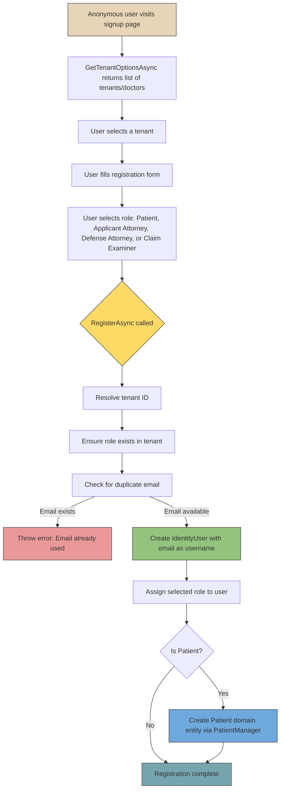
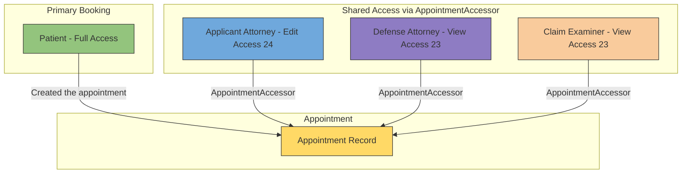

# User Roles and Actors

> Purpose: Defines every actor in the system, their seeded role names, capabilities, and registration flow. Audience: developer, QA.

[Home](../INDEX.md) > [Business Domain](./) > User Roles & Actors

## Overview

The HCS Case Evaluation Portal uses a role-based access model built on top of ABP Framework's identity system. Roles are seeded at application startup and assigned during user registration. Each tenant (doctor practice) has its own set of users and role assignments.

---

## Seeded Roles

> **This page listed four roles until 2026-09-28.** There are seven, plus the ABP superuser. The
> three internal roles were missing entirely, which meant the page described the people who use
> the portal least and omitted the ones who use it most.

### External roles

Seeded per office by `ExternalUserRoleDataSeedContributor`
(`src/HealthcareSupport.CaseEvaluation.Domain/Identity/ExternalUserRoleDataSeedContributor.cs`),
from `ExternalRoleConsts.All`:

| Role                   | Description                                      |
|------------------------|--------------------------------------------------|
| **Patient**            | The injured worker undergoing evaluation         |
| **Claim Examiner**     | Insurance company representative                 |
| **Applicant Attorney** | Attorney representing the worker                 |
| **Defense Attorney**   | Attorney representing the employer/insurer       |

External users never reach the internal shell. The Angular route table decides that with a
`canMatch` pair, `externalUserOnlyMatchGuard` and `internalUserOnlyMatchGuard`.

### Internal roles

Seeded by `InternalUserRoleDataSeedContributor`:

| Role                   | Scope  | Description                                          |
|------------------------|--------|------------------------------------------------------|
| **IT Admin**           | Host   | Configures the system: templates, parameters, offices |
| **Staff Supervisor**   | Tenant | Approves and rejects appointments, handles change requests |
| **Intake Staff**       | Tenant | Day-to-day booking and intake for the office          |

The shell filters its navigation by these three, plus the superuser, in
`angular/src/app/shared/auth/internal-user-roles.ts`. **Do not collapse them into "Admin"**: a
Staff Supervisor and an Intake Staff member see different navigation and are different people in
the office.

### Built-in ABP Role

| Role      | Description                                        |
|-----------|----------------------------------------------------|
| **admin** | The framework superuser. Sees every navigation item; used for host administration |

---

## Per-Role Capabilities

> **The matrix that used to be here was wrong, and wrong in a way worth understanding.** It denied
> Defense Attorney and Claim Examiner the ability to book appointments or request a cancellation,
> and gave those rights only to Patient and Applicant Attorney. At the permission layer, **all four
> external roles receive a byte-identical set.** The seeder loops over `ExternalRoleConsts.All` and
> grants every role the same `BookingBaselineGrants()` list.

### The four external roles have the same permissions

There is exactly one per-role difference in the entire external grant: **`Patients.RevealSsn` is
granted to `Patient` alone.** Everything else -- booking, change requests, document upload, the
whole child-resource set -- is granted identically to all four.

This is deliberate, and the seeder says why:

> Mirrors OLD where any authenticated external user could see the slot list and create their own
> appointment. Restrictions on cross-tenant and cross-user data are enforced by `IMultiTenant`
> plus AppService-level filtering, **not by withholding the permission**.

So a capability matrix expressed in permissions cannot describe this system. What a Defense
Attorney can actually reach is not decided by a permission; it is decided by whether they are a
party to the appointment.

### What actually decides access

Per-appointment access is `AppointmentReadAccessGuard` over `AppointmentAccessRules`: seven
pathways, first match wins.

| Pathway | Granted when |
|---|---|
| Internal user | The caller holds any internal role |
| Creator | The caller booked it (`CreatorId`, coalesced with `BookedByUserId`) |
| Patient | The caller is the patient on the appointment |
| Applicant Attorney | The caller is linked on an `AppointmentApplicantAttorney` row |
| Defense Attorney | The caller is linked on an `AppointmentDefenseAttorney` row |
| Claim Examiner | The caller's email matches an `AppointmentClaimExaminer` email |
| Appointment Accessor | The caller holds an explicit accessor grant (Edit access for write) |

Plus a row-level rule: the caller's email matches one of the appointment's denormalised party-email
columns **and** the caller holds that column's role. Email alone is not enough, deliberately -- a
firm whose address appears as the applicant attorney on one appointment and the defense attorney
on another sees each only while holding the matching role.

**Holding a permission is not having access.** That distinction is the single most important thing
on this page, and it is what the old matrix obscured.

### Internal capability, which IS permission-shaped

Unlike the external roles, the three internal roles get genuinely different grants, from
`ItAdminGrants()`, `StaffSupervisorTenantGrants()` and `IntakeStaffGrants()`.

| Capability | IT Admin | Staff Supervisor | Intake Staff |
|---|:---:|:---:|:---:|
| Dashboard | Host | Tenant | Tenant |
| Approve and reject appointments | Y | Y | Y |
| Approve and reject change requests | Y | Y | Y |
| Create and edit appointments | Y | Y | Y |
| Create and edit patients | Y | Y | Y |
| Reveal a patient's SSN | Y | Y | Y |
| Full CRUD on doctor availability slots | Y | Y | Y |
| Reports and export | Y | Y | Y |
| Full CRUD on every entity | Y | | |
| CRUD on lookup masters (locations, appointment types, languages, WCAB offices) | Y | Y | |
| Delete operational records other than availability slots | Y | Y | |

The three internal roles are **far more alike than the names suggest.** All three approve and
reject appointments and change requests, all three reveal SSNs, all three run reports, and all
three have full CRUD on availability slots. Intake Staff is the front-line reviewer for every
appointment in its office, so those grants are deliberate.

The real differences are narrow: **IT Admin alone has blanket CRUD on every entity**, Staff
Supervisor additionally manages the office's lookup masters, and **Intake Staff cannot delete
operational records** -- except availability slots, which it owns outright because keeping the
bookable grid current is its job.

If you are looking for the boundary that stops one internal person seeing another office's data,
it is not in this table. It is the per-office database.

The authority is the seeder, and the methods are named above. The Angular shell separately filters
navigation by `resolveInternalRoleKey`, which is a display concern and not a grant.

---

## Entity-to-Role Mapping

Certain roles correspond to domain entities that hold additional profile data beyond the ABP `IdentityUser`:

| Role                   | Domain Entity          | Link Field                           |
|------------------------|------------------------|--------------------------------------|
| **Patient**            | `Patient`              | `Patient.IdentityUserId` -> `IdentityUser.Id` |
| **Applicant Attorney** | `ApplicantAttorney`    | `ApplicantAttorney.IdentityUserId` -> `IdentityUser.Id` |
| **Defense Attorney**   | _(no domain entity)_   | ABP `IdentityUser` only             |
| **Claim Examiner**     | _(no domain entity)_   | ABP `IdentityUser` only             |
| **admin**              | _(no domain entity)_   | ABP `IdentityUser` only             |

---

## External User Registration Flow

External users (non-admin) self-register through the `ExternalSignupAppService` (`src/HealthcareSupport.CaseEvaluation.Application/ExternalSignups/ExternalSignupAppService.cs`).

### ExternalUserType Enum

The registration form maps to `ExternalUserType` (defined in `src/HealthcareSupport.CaseEvaluation.Domain.Shared/ExternalSignups/ExternalUserType.cs`):

| Value | Type                | Maps to Role         |
|-------|---------------------|----------------------|
| 1     | Patient             | "Patient"            |
| 2     | ClaimExaminer       | "Claim Examiner"     |
| 3     | ApplicantAttorney   | "Applicant Attorney" |
| 4     | DefenseAttorney     | "Defense Attorney"   |

### Registration Sequence

```mermaid
flowchart TD
    A[Anonymous user visits signup page] --> B[GetTenantOptionsAsync returns list of tenants/doctors]
    B --> C[User selects a tenant]
    C --> D[User fills registration form]
    D --> E[User selects role: Patient, Applicant Attorney, Defense Attorney, or Claim Examiner]
    E --> F{RegisterAsync called}
    F --> G[Resolve tenant ID]
    G --> H[Ensure role exists in tenant]
    H --> I[Check for duplicate email]
    I -->|Email exists| J[Throw error: Email already used]
    I -->|Email available| K[Create IdentityUser with email as username]
    K --> L[Assign selected role to user]
    L --> M{Is Patient?}
    M -->|Yes| N[Create Patient domain entity via PatientManager]
    M -->|No| O[Registration complete]
    N --> O

    style A fill:#e8d5b7,stroke:#333
    style F fill:#ffd966,stroke:#333
    style K fill:#93c47d,stroke:#333
    style N fill:#6fa8dc,stroke:#333
    style O fill:#76a5af,stroke:#333
    style J fill:#ea9999,stroke:#333
```

### Registration Details

1. **Tenant selection is required** for non-tenant users (host-level). If the user is already in a tenant context, that tenant is used automatically.
2. **Email uniqueness** is enforced per tenant -- duplicate emails within the same tenant are rejected.
3. **Role seeding:** The `RegisterAsync` method calls `EnsureRoleAsync` before assigning the role, guaranteeing the role exists even if data seeding was skipped.
4. **Patient entity creation:** Only `Patient` registrations trigger creation of a corresponding domain entity (via `PatientManager.CreateAsync`). Other roles rely solely on the `IdentityUser` record.
5. **Default patient values:** New patients are created with `Gender.Male` and `DateOfBirth` set to the current UTC date as placeholders, to be updated later in profile editing.

---

## AppointmentAccessor Pattern

Beyond the primary booking user, additional users can be granted access to specific appointments through the `AppointmentAccessor` entity (`src/HealthcareSupport.CaseEvaluation.Domain/AppointmentAccessors/AppointmentAccessor.cs`).

### AccessType Enum

Defined in `src/HealthcareSupport.CaseEvaluation.Domain.Shared/Enums/AccessType.cs`:

| Value | Type     | Description                                    |
|-------|----------|------------------------------------------------|
| 23    | **View** | Read-only access to the appointment details    |
| 24    | **Edit** | Read and write access to the appointment       |

### AppointmentAccessor Entity

| Property          | Type         | Description                                    |
|-------------------|--------------|------------------------------------------------|
| `IdentityUserId`  | `Guid`       | The user being granted access                  |
| `AppointmentId`   | `Guid`       | The appointment being shared                   |
| `AccessTypeId`    | `AccessType` | Level of access (View or Edit)                 |
| `TenantId`        | `Guid?`      | Tenant scope (multi-tenant)                    |

The entity extends `FullAuditedEntity<Guid>` and implements `IMultiTenant`.

### Access Sharing Diagram

```mermaid
flowchart TD
    subgraph Appointment
        APT[Appointment Record]
    end

    subgraph Primary Booking
        PAT[Patient - Full Access]
    end

    subgraph Shared Access via AppointmentAccessor
        AA1[Applicant Attorney - Edit Access 24]
        DA1[Defense Attorney - View Access 23]
        CE1[Claim Examiner - View Access 23]
    end

    PAT -->|Created the appointment| APT
    AA1 -->|AppointmentAccessor| APT
    DA1 -->|AppointmentAccessor| APT
    CE1 -->|AppointmentAccessor| APT

    style APT fill:#ffd966,stroke:#333
    style PAT fill:#93c47d,stroke:#333
    style AA1 fill:#6fa8dc,stroke:#333
    style DA1 fill:#8e7cc3,stroke:#333
    style CE1 fill:#f9cb9c,stroke:#333
```

### Typical Usage

- A **Patient** books an appointment (they are the owner).
- An **Applicant Attorney** is granted **Edit (24)** access so they can update appointment details on behalf of their client.
- A **Defense Attorney** is granted **View (23)** access to monitor the appointment.
- A **Claim Examiner** is granted **View (23)** access to review case details.

This pattern allows fine-grained, per-appointment access control without granting broad role-based permissions.

---

## External Layout Roles

All four external roles share the same simplified portal layout (no LeptonX sidebar; custom
`TopHeaderNavbarComponent` replaces the LeptonX topbar):

| Role                   | Gets external layout |
|------------------------|:--------------------:|
| **Patient**            | Y                    |
| **Applicant Attorney** | Y                    |
| **Defense Attorney**   | Y                    |
| **Claim Examiner**     | Y                    |

This is enforced in two places in the Angular app (both verified against code on main):

- `angular/src/app/shared/auth/external-user-roles.ts` -- `EXTERNAL_USER_ROLES` constant
  lists all four role names; `hasOnlyExternalRoles` (routing guard) and `hasAnyExternalRole`
  (CSS toggle) both operate on this constant.
- `angular/src/app/home/external-home.component.ts` -- `isPatientUser` getter explicitly includes
  all four: `'patient'`, `'applicant attorney'`, `'defense attorney'`, `'claim examiner'`.

Note: the code snippets in [Role-Based UI](../frontend/ROLE-BASED-UI.md) show only three
roles in some inline snippets; those snippets are stale. The canonical source is
`external-user-roles.ts` and the `isPatientUser` getter above.

---

## External User Lookup

`ExternalSignupAppService.GetExternalUserLookupAsync(filter)` is a SEARCH: a typed term is
required (a blank filter returns nothing -- never an enumerable list of every tenant user).
It covers all four external roles (**Patient, Applicant Attorney, Defense Attorney, Claim
Examiner**), but the result set is scoped by the caller:

- **Internal staff** (admin / Intake Staff / Staff Supervisor / Doctor) search the whole
  tenant.
- **External callers** see ONLY their co-parties -- the parties named on appointments the
  caller can already see (`AppointmentVisibilityService` + `ExternalCoPartyRules`). This is
  a HIPAA boundary: an external user must not enumerate parties on cases they are not on.

(History: the old "D-2" decision restricted the roles to Patient + Applicant Attorney;
reversed 2026-06-22 because the four roles are capability-equal. A second pass the same day
added the co-party scoping so external callers cannot enumerate strangers.) The lookup
feeds the booking/accessor pickers as a search bar, like the patient lookup.

The `GetMyProfileAsync` method allows authenticated external users to retrieve their own
profile, including their assigned role. Role resolution covers all four external roles
(Patient, Applicant Attorney, Defense Attorney, Claim Examiner).

---

## Source References

- **Role seeder:** `src/HealthcareSupport.CaseEvaluation.Domain/Identity/ExternalUserRoleDataSeedContributor.cs`
- **Signup service:** `src/HealthcareSupport.CaseEvaluation.Application/ExternalSignups/ExternalSignupAppService.cs`
- **ExternalUserType enum:** `src/HealthcareSupport.CaseEvaluation.Domain.Shared/ExternalSignups/ExternalUserType.cs`
- **AccessType enum:** `src/HealthcareSupport.CaseEvaluation.Domain.Shared/Enums/AccessType.cs`
- **AppointmentAccessor entity:** `src/HealthcareSupport.CaseEvaluation.Domain/AppointmentAccessors/AppointmentAccessor.cs`

---

## Related Documentation

- [Domain Overview](DOMAIN-OVERVIEW.md)
- [Permissions](../backend/PERMISSIONS.md)
- [Authentication Flow](../api/AUTHENTICATION-FLOW.md)
- [Role-Based UI](../frontend/ROLE-BASED-UI.md)
