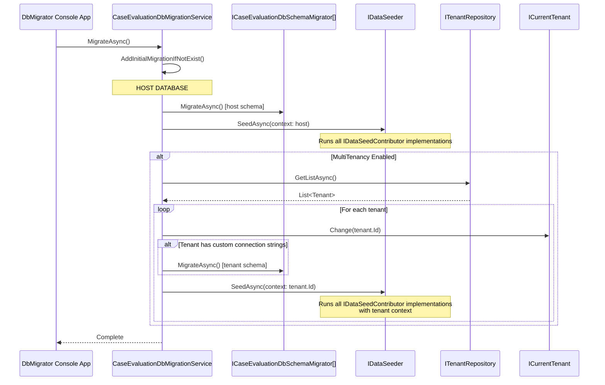

# Data Seeding

[Home](../INDEX.md) > [Database](./) > Data Seeding

## Overview

Data seeding in the HCS Case Evaluation Portal is orchestrated by `CaseEvaluationDbMigrationService`, which runs schema migrations followed by data seeding for the host database and then iterates through all tenants to do the same for each tenant database.

---

## Seeding Architecture



---

## Orchestrator: CaseEvaluationDbMigrationService

**File:** `src/HealthcareSupport.CaseEvaluation.Domain/Data/CaseEvaluationDbMigrationService.cs`

The migration service follows this sequence:

1. **Check for initial migration** -- If no `Migrations/` folder exists in the EF Core project, it triggers `abp create-migration-and-run-migrator` via CLI and returns early.
2. **Migrate host database schema** -- Iterates all registered `ICaseEvaluationDbSchemaMigrator` implementations and calls `MigrateAsync()`.
3. **Seed host data** -- Calls `IDataSeeder.SeedAsync()` with a `DataSeedContext` containing:
   - `AdminEmailPropertyName` = `CaseEvaluationConsts.AdminEmailDefaultValue`
   - `AdminPasswordPropertyName` = `CaseEvaluationConsts.AdminPasswordDefaultValue`
4. **Per-tenant processing** (if multi-tenancy is enabled):
   - Fetches all tenants from `ITenantRepository`
   - For each tenant, switches context via `ICurrentTenant.Change(tenant.Id)`
   - If the tenant has custom connection strings (and not already migrated), runs schema migration
   - Seeds data for the tenant with `DataSeedContext(tenant.Id)`

### Deduplication

The service tracks migrated connection strings in a `HashSet<string>` to avoid migrating the same physical database twice when multiple tenants share a connection string.

---

## Seed Contributors

ABP's `IDataSeeder` discovers and runs all registered `IDataSeedContributor` implementations. The following contributors exist in this project:

### 1. OpenIddictDataSeedContributor

**File:** `src/HealthcareSupport.CaseEvaluation.Domain/OpenIddict/OpenIddictDataSeedContributor.cs`

Creates OAuth/OIDC infrastructure required for authentication:

**Scopes created:**

| Scope Name | Display Name | Resources |
|------------|-------------|-----------|
| `CaseEvaluation` | CaseEvaluation API | `CaseEvaluation` |

**Applications created:**

| Application | Client Type | Grant Types | Purpose |
|------------|-------------|-------------|---------|
| `CaseEvaluation_App` | Public | AuthorizationCode, Password, ClientCredentials, RefreshToken, LinkLogin, Impersonation | Angular frontend / Console testing |
| `CaseEvaluation_Swagger` | Public | AuthorizationCode | Swagger UI authentication |

Both applications share common scopes: `address`, `email`, `phone`, `profile`, `roles`, `CaseEvaluation`.

Application client IDs and root URLs are read from `appsettings.json` under `OpenIddict:Applications`.

### 2. ExternalUserRoleDataSeedContributor

**File:** `src/HealthcareSupport.CaseEvaluation.Domain/Identity/ExternalUserRoleDataSeedContributor.cs`

Creates application-specific roles using `IdentityRoleManager`. Runs within the tenant context provided by the `DataSeedContext`.

**Roles created:**

| Role Name | Purpose |
|-----------|---------|
| `Patient` | Patient portal users |
| `Claim Examiner` | Insurance claim examiners |
| `Applicant Attorney` | Applicant-side attorneys |
| `Defense Attorney` | Defense-side attorneys |

Each role is created idempotently -- if a role with the same name already exists, it is skipped.

### 3. CaseEvaluationDataSeederContributor (BookStore template remnant)

**File:** `src/HealthcareSupport.CaseEvaluation.Domain/BookStoreDataSeederContributor.cs`

Seeds sample book data from the ABP BookStore template. Only inserts if the Books table is empty.

**Books seeded:**

| Name | Type | Publish Date | Price |
|------|------|-------------|-------|
| 1984 | Dystopia | 1949-06-08 | 19.84 |
| The Hitchhiker's Guide to the Galaxy | ScienceFiction | 1995-09-27 | 42.00 |

> **Note:** This is a template remnant and should be considered for removal in production.

### 4. SaasDataSeedContributor

**File:** `src/HealthcareSupport.CaseEvaluation.Domain/Saas/SaasDataSeedContributor.cs`

Seeds standard SaaS editions using ABP's `IEditionDataSeeder.CreateStandardEditionsAsync()`. Runs within the tenant context from the `DataSeedContext`.

### 5. ChangeIdentityPasswordPolicySettingDefinitionProvider

**File:** `src/HealthcareSupport.CaseEvaluation.Domain/Identity/ChangeIdentityPasswordPolicySettingDefinitionProvider.cs`

Not a seed contributor per se, but a `SettingDefinitionProvider` that relaxes the default ABP Identity password policy:

| Setting | Default (ABP) | Override |
|---------|--------------|----------|
| RequireNonAlphanumeric | `true` | `false` |
| RequireLowercase | `true` | `false` |
| RequireUppercase | `true` | `false` |
| RequireDigit | `true` | `false` |

### 6. ABP's IdentityDataSeedContributor (framework-provided)

Creates the default admin user. Credentials are passed via the `DataSeedContext` properties set by the migration service:

| Property | Value |
|----------|-------|
| Admin Email | `admin@abp.io` (from `IdentityDataSeedContributor.AdminEmailDefaultValue`) |
| Admin Password | ABP default (from `IdentityDataSeedContributor.AdminPasswordDefaultValue`) — see `TEST_PASSWORD` in `.env.local` |

---

## Default Credentials

| User | Email | Password | Notes |
|------|-------|----------|-------|
| Admin | admin@abp.io | See `TEST_PASSWORD` in `.env.local` | Created by ABP's IdentityDataSeedContributor |

> **Security Warning:** These are development defaults. Change the admin password immediately in production environments.

---

## Per-Tenant Seeding Behavior

When multi-tenancy is enabled (`MultiTenancyConsts.IsEnabled`), every seed contributor runs once for the host and once for each tenant:

1. **Host seeding** -- `DataSeedContext.TenantId` is `null`
2. **Tenant seeding** -- `DataSeedContext.TenantId` is set to the tenant's `Guid`

Contributors that are tenant-aware (like `ExternalUserRoleDataSeedContributor`) use `ICurrentTenant.Change(context?.TenantId)` to ensure data is created in the correct scope.

This means each tenant gets:
- Its own set of roles (Patient, Claim Examiner, Applicant Attorney, Defense Attorney)
- Its own admin user
- Its own OpenIddict configuration
- Its own SaaS edition setup

---

## Running the Seeder

The seeder runs automatically via the **DbMigrator** console application:

```bash
cd src/HealthcareSupport.CaseEvaluation.DbMigrator
dotnet run
```

The DbMigrator project references the Domain and EntityFrameworkCore projects, bootstraps the ABP module system, and calls `CaseEvaluationDbMigrationService.MigrateAsync()`.

---

## Related Documentation

- [EF Core Design](EF-CORE-DESIGN.md) -- DbContext architecture
- [Migration Guide](MIGRATION-GUIDE.md) -- How to add and apply migrations
- [Multi-Tenancy](../architecture/MULTI-TENANCY.md) -- Multi-tenancy architecture details
