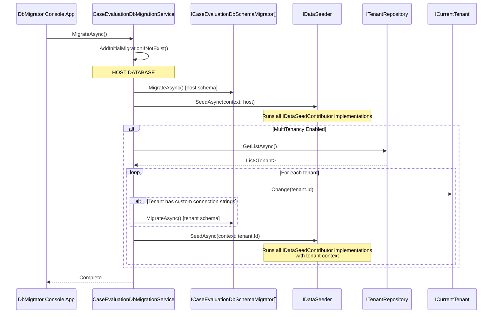

# Data Seeding

> Purpose: Describes the data seeding architecture, seed contributors, and default credentials for the Appointment Portal. Audience: backend developers.

[Home](../index.md) > [Database](./) > Data Seeding

## Overview

Data seeding in the Appointment Portal is orchestrated by `CaseEvaluationDbMigrationService`, which runs schema migrations followed by data seeding for the host database and then iterates through all tenants to do the same for each tenant database.

---

## Seeding Architecture


```mermaid
sequenceDiagram
    participant DbMigrator as DbMigrator Console App
    participant MigService as CaseEvaluationDbMigrationService
    participant Migrators as ICaseEvaluationDbSchemaMigrator[]
    participant DataSeeder as IDataSeeder
    participant TenantRepo as ITenantRepository
    participant CurrentTenant as ICurrentTenant

    DbMigrator->>MigService: MigrateAsync()
    MigService->>MigService: AddInitialMigrationIfNotExist()
    
    Note over MigService: HOST DATABASE
    MigService->>Migrators: MigrateAsync() [host schema]
    MigService->>DataSeeder: SeedAsync(context: host)
    Note over DataSeeder: Runs all IDataSeedContributor implementations

    alt MultiTenancy Enabled
        MigService->>TenantRepo: GetListAsync()
        TenantRepo-->>MigService: List<Tenant>
        
        loop For each tenant
            MigService->>CurrentTenant: Change(tenant.Id)
            
            alt Tenant has custom connection strings
                MigService->>Migrators: MigrateAsync() [tenant schema]
            end
            
            MigService->>DataSeeder: SeedAsync(context: tenant.Id)
            Note over DataSeeder: Runs all IDataSeedContributor implementations<br/>with tenant context
        end
    end
    
    MigService-->>DbMigrator: Complete
```

---

## Orchestrator: CaseEvaluationDbMigrationService

**File:** `src/HealthcareSupport.CaseEvaluation.Domain/Data/CaseEvaluationDbMigrationService.cs`

The migration service follows this sequence:

1. **Check for initial migration** -- If no `Migrations/` folder exists in the EF Core project, it triggers `abp create-migration-and-run-migrator` via CLI and returns early.
2. **Migrate host database schema** -- Iterates all registered `ICaseEvaluationDbSchemaMigrator` implementations and calls `MigrateAsync()`.
3. **Seed host data** -- Calls `IDataSeeder.SeedAsync()` with a `DataSeedContext` containing:
   - `AdminEmailPropertyName` = the office's admin email from `Saas/OfficeSeedData.cs`, or
     `CaseEvaluationConsts.AdminEmailDefaultValue` for the host and any office it does not list
   - `AdminPasswordPropertyName` = the value `AdminSeedPasswordResolver` returns (see [Admin passwords](#admin-passwords))

   It then calls `AdminPasswordRotator.RotateIfOnAKnownDefaultAsync`, which moves an existing admin still on a
   published default password onto a generated one.
4. **Per-tenant processing** (if multi-tenancy is enabled):
   - Fetches all tenants from `ITenantRepository`
   - For each tenant, switches context via `ICurrentTenant.Change(tenant.Id)`
   - If the tenant has custom connection strings (and not already migrated), runs schema migration
   - Seeds data for the tenant with `DataSeedContext(tenant.Id)`

### Deduplication

The service tracks migrated connection strings in a `HashSet<string>` to avoid migrating the same physical database twice when multiple tenants share a connection string.

---

## Seed Contributors

ABP's `IDataSeeder` discovers and runs all registered `IDataSeedContributor` implementations. This
project has many more than the few described below (catalogues, roles, users, templates, office
setup). List them from the code rather than trusting a copied list:

```bash
git grep -lE 'class \w+ *: *[^{]*IDataSeedContributor' -- 'src/*.cs'
```

Selected contributors:

### 1. OpenIddictDataSeedContributor

**File:** `src/HealthcareSupport.CaseEvaluation.Domain/OpenIddict/OpenIddictDataSeedContributor.cs`

Creates OAuth/OIDC infrastructure required for authentication:

**Scopes created:**

| Scope Name | Display Name | Resources |
|------------|-------------|-----------|
| `CaseEvaluation` | CaseEvaluation API | `CaseEvaluation` |

**Applications created:**

| Application | Client Type | Grant Types | Purpose |
|------------|-------------|-------------|---------|
| `CaseEvaluation_App` | Public | AuthorizationCode, Password, ClientCredentials, RefreshToken, LinkLogin, Impersonation | Angular frontend / Console testing |
| `CaseEvaluation_Swagger` | Public | AuthorizationCode | Swagger UI authentication |

Both applications share common scopes: `address`, `email`, `phone`, `profile`, `roles`, `CaseEvaluation`.

Application client IDs and root URLs are read from `appsettings.json` under `OpenIddict:Applications`.

### 2. ExternalUserRoleDataSeedContributor

**File:** `src/HealthcareSupport.CaseEvaluation.Domain/Identity/ExternalUserRoleDataSeedContributor.cs`

Creates application-specific roles using `IdentityRoleManager`. Runs within the tenant context provided by the `DataSeedContext`.

**Roles created:**

| Role Name | Purpose |
|-----------|---------|
| `Patient` | Patient portal users |
| `Claim Examiner` | Insurance claim examiners |
| `Applicant Attorney` | Applicant-side attorneys |
| `Defense Attorney` | Defense-side attorneys |

Each role is created idempotently -- if a role with the same name already exists, it is skipped.

### 3. SaasDataSeedContributor

**File:** `src/HealthcareSupport.CaseEvaluation.Domain/Saas/SaasDataSeedContributor.cs`

Seeds standard SaaS editions using ABP's `IEditionDataSeeder.CreateStandardEditionsAsync()`. Runs within the tenant context from the `DataSeedContext`.

### 4. ChangeIdentityPasswordPolicySettingDefinitionProvider

**File:** `src/HealthcareSupport.CaseEvaluation.Domain/Identity/ChangeIdentityPasswordPolicySettingDefinitionProvider.cs`

Not a seed contributor per se, but a `SettingDefinitionProvider` that relaxes the default ABP Identity password policy:

| Setting | Default (ABP) | Override |
|---------|--------------|----------|
| RequireNonAlphanumeric | `true` | `false` |
| RequireLowercase | `true` | `false` |
| RequireUppercase | `true` | `false` |
| RequireDigit | `true` | `false` |

### 5. ABP's IdentityDataSeedContributor (framework-provided)

Creates the admin user when a database has none; where an admin already exists it ignores the password. Credentials
are passed via the `DataSeedContext` properties set by the migration service:

| Property | Value |
|----------|-------|
| Admin Email | `admin@abp.io` (`IdentityDataSeedContributor.AdminEmailDefaultValue`) for the host; an office listed in `Saas/OfficeSeedData.cs` uses its own |
| Admin Password | From `AdminSeedPasswordResolver`: see [Admin passwords](#admin-passwords) |

---

## Admin passwords

Which password an admin is seeded with depends on the environment. The rule lives in one place,
`AdminPasswordStoreSelector` (`src/HealthcareSupport.CaseEvaluation.Domain/Identity/AdminPasswords/`).

| Environment | Store | What the admin gets |
|---|---|---|
| Development, neither key set | The published default (`PublishedDefaultAdminPasswordStore`) | The documented local credentials, exactly as before; local sign-in is unchanged |
| Anywhere else, `AdminPasswords:Directory` set | A folder: one file per database, mode 0600 (`FileAdminPasswordStore`) | A password generated on first use and kept in that database's file |
| Anywhere else, `AdminPasswords:VaultUri` set | Not part of this build | Start-up is refused and says so |
| Anywhere else, neither or both set | -- | The DbMigrator and the API refuse to start and name both keys |

What to know about the folder store:

- **An entry is written only when it is used**: when the migrator creates a database's admin, or when it rotates an
  admin still on a published default (it logs `Rotated the admin password of <database>`). An office created through
  the New Practice screen, or one whose admin already has its own password, gets no entry; its admin recovers access
  through forgot-password.
- **A rotated admin must change the password at first sign-in**, so after that the file holds only the handover
  value.
- **Outside Development the AuthServer refuses a published default at sign-in** (`KnownDefaultPasswordSignInManager`),
  even where it is the account's real password.
- **Operator setup** is in `env.prod.example` (`ADMIN_PASSWORD_DIRECTORY`): the folder must exist before the first
  deploy and be owned by the containers' user (uid 1654), or the first write fails and the migrator exits. Back the
  folder up with the database dumps: until an admin's first sign-in, a restored database's admin can be signed into
  with its entry only.

---

## Per-Tenant Seeding Behavior

When multi-tenancy is enabled (`MultiTenancyConsts.IsEnabled`), every seed contributor runs once for the host and once for each tenant:

1. **Host seeding** -- `DataSeedContext.TenantId` is `null`
2. **Tenant seeding** -- `DataSeedContext.TenantId` is set to the tenant's `Guid`

Contributors that are tenant-aware (like `ExternalUserRoleDataSeedContributor`) use `ICurrentTenant.Change(context?.TenantId)` to ensure data is created in the correct scope.

This means each tenant gets:

- Its own set of roles (Patient, Claim Examiner, Applicant Attorney, Defense Attorney)
- Its own admin user
- Its own OpenIddict configuration
- Its own SaaS edition setup

---

## Running the Seeder

The seeder runs automatically via the **DbMigrator** console application:

```bash
cd src/HealthcareSupport.CaseEvaluation.DbMigrator
dotnet run
```

The DbMigrator project references the Domain and EntityFrameworkCore projects, bootstraps the ABP module system, and calls `CaseEvaluationDbMigrationService.MigrateAsync()`.

---

## Related Documentation

- [EF Core Design](EF-CORE-DESIGN.md) -- DbContext architecture
- [Migration Guide](MIGRATION-GUIDE.md) -- How to add and apply migrations
- [Multi-Tenancy](../architecture/MULTI-TENANCY.md) -- Multi-tenancy architecture details
