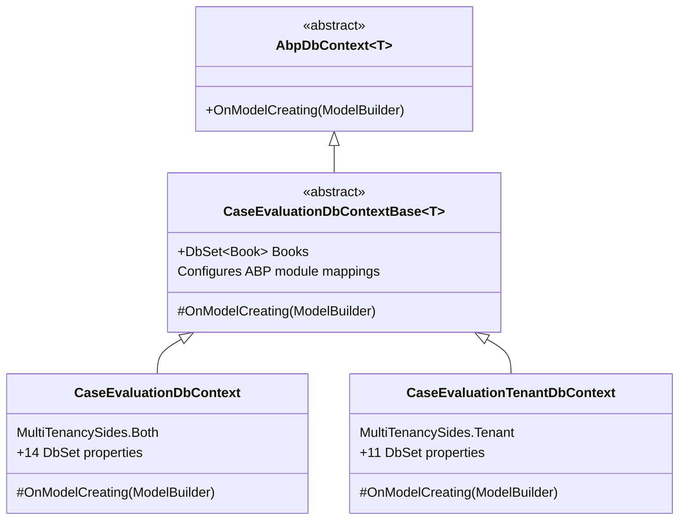
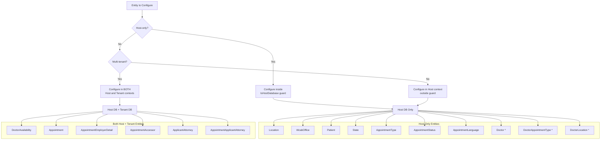

# EF Core Design

[Home](../INDEX.md) > [Database](./) > EF Core Design

## Overview

The HCS Case Evaluation Portal uses a **dual DbContext strategy** to support ABP's multi-tenancy model. Both contexts share a common base class that configures all ABP module entity mappings, while each context handles its own side of the multi-tenancy split.

- **Connection string name:** `"Default"` (set via `[ConnectionStringName("Default")]`)
- **Database provider:** SQL Server (configured in `CaseEvaluationDbContextFactoryBase` via `UseSqlServer`)
- **Table prefix:** `"App"` (from `CaseEvaluationConsts.DbTablePrefix`)
- **Schema:** `null` (from `CaseEvaluationConsts.DbSchema`) -- uses default schema

---

## DbContext Inheritance Hierarchy



---

## Base Context: CaseEvaluationDbContextBase\<T\>

**File:** `src/HealthcareSupport.CaseEvaluation.EntityFrameworkCore/EntityFrameworkCore/CaseEvaluationDbContextBase.cs`

Inherits from `AbpDbContext<T>` and configures all ABP framework module mappings:

| # | Module Configuration Method | ABP Module |
|---|---------------------------|------------|
| 1 | `ConfigurePermissionManagement()` | Permission Management |
| 2 | `ConfigureSettingManagement()` | Setting Management |
| 3 | `ConfigureBackgroundJobs()` | Background Jobs |
| 4 | `ConfigureAuditLogging()` | Audit Logging |
| 5 | `ConfigureIdentityPro()` | ABP Identity (Pro) |
| 6 | `ConfigureOpenIddictPro()` | OpenIddict (Pro) |
| 7 | `ConfigureFeatureManagement()` | Feature Management |
| 8 | `ConfigureLanguageManagement()` | Language Management |
| 9 | `ConfigureFileManagement()` | File Management |
| 10 | `ConfigureSaas()` | SaaS / Tenants |
| 11 | `ConfigureTextTemplateManagement()` | Text Template Management |
| 12 | `ConfigureBlobStoring()` | Blob Storing (Database) |
| 13 | `ConfigureGdpr()` | GDPR |

The base also configures the `Book` entity (template remnant from ABP BookStore sample):

```csharp
builder.Entity<Book>(b =>
{
    b.ToTable(CaseEvaluationConsts.DbTablePrefix + "Books", CaseEvaluationConsts.DbSchema);
    b.ConfigureByConvention();
    b.Property(x => x.Name).IsRequired().HasMaxLength(128);
});
```

---

## Host Context: CaseEvaluationDbContext

**File:** `src/HealthcareSupport.CaseEvaluation.EntityFrameworkCore/EntityFrameworkCore/CaseEvaluationDbContext.cs`

Sets `MultiTenancySides.Both` -- this context manages the host database, which contains both host-only and shared data.

### DbSet Properties (14)

| DbSet | Entity Type |
|-------|-------------|
| `Appointments` | `Appointment` |
| `Patients` | `Patient` |
| `Doctors` | `Doctor` |
| `DoctorAvailabilities` | `DoctorAvailability` |
| `Locations` | `Location` |
| `States` | `State` |
| `AppointmentTypes` | `AppointmentType` |
| `AppointmentStatuses` | `AppointmentStatus` |
| `AppointmentLanguages` | `AppointmentLanguage` |
| `WcabOffices` | `WcabOffice` |
| `AppointmentEmployerDetails` | `AppointmentEmployerDetail` |
| `AppointmentAccessors` | `AppointmentAccessor` |
| `ApplicantAttorneys` | `ApplicantAttorney` |
| `AppointmentApplicantAttorneys` | `AppointmentApplicantAttorney` |

### Host-Only Entities (guarded by `builder.IsHostDatabase()`)

These entities are configured inside `if (builder.IsHostDatabase())` blocks and will only exist in the host database:

- **Location** -- FK to State (SetNull), FK to AppointmentType (SetNull)
- **WcabOffice** -- FK to State (SetNull)
- **Doctor** -- FK to IdentityUser (SetNull), FK to Tenant (SetNull)
- **DoctorAppointmentType** -- composite key (DoctorId, AppointmentTypeId), Cascade deletes
- **DoctorLocation** -- composite key (DoctorId, LocationId), Cascade deletes
- **AppointmentStatus** -- standalone lookup
- **AppointmentType** -- standalone lookup
- **AppointmentLanguage** -- standalone lookup
- **Patient** -- FK to State (SetNull), FK to AppointmentLanguage (SetNull), FK to IdentityUser (NoAction), FK to Tenant (SetNull)
- **State** -- standalone lookup

### Shared Entities (configured outside `IsHostDatabase()` guards)

These entities exist in both host and tenant databases:

- **DoctorAvailability** -- FK to Location (NoAction), FK to AppointmentType (SetNull)
- **Appointment** -- FK to Patient (NoAction), FK to IdentityUser (NoAction), FK to AppointmentType (NoAction), FK to Location (NoAction), FK to DoctorAvailability (NoAction)
- **AppointmentEmployerDetail** -- FK to Appointment (NoAction), FK to State (SetNull)
- **AppointmentAccessor** -- FK to IdentityUser (NoAction), FK to Appointment (NoAction)
- **ApplicantAttorney** -- FK to State (SetNull), FK to IdentityUser (NoAction)
- **AppointmentApplicantAttorney** -- FK to Appointment (NoAction), FK to ApplicantAttorney (NoAction), FK to IdentityUser (NoAction)

---

## Tenant Context: CaseEvaluationTenantDbContext

**File:** `src/HealthcareSupport.CaseEvaluation.EntityFrameworkCore/EntityFrameworkCore/CaseEvaluationTenantDbContext.cs`

Sets `MultiTenancySides.Tenant` -- this context manages individual tenant databases.

### DbSet Properties (11)

| DbSet | Entity Type |
|-------|-------------|
| `Appointments` | `Appointment` |
| `Doctors` | `Doctor` |
| `DoctorAvailabilities` | `DoctorAvailability` |
| `AppointmentTypes` | `AppointmentType` |
| `AppointmentStatuses` | `AppointmentStatus` |
| `AppointmentLanguages` | `AppointmentLanguage` |
| `States` | `State` |
| `AppointmentEmployerDetails` | `AppointmentEmployerDetail` |
| `AppointmentAccessors` | `AppointmentAccessor` |
| `ApplicantAttorneys` | `ApplicantAttorney` |
| `AppointmentApplicantAttorneys` | `AppointmentApplicantAttorney` |

**Not in tenant context:** `Patient`, `Location`, `WcabOffice` (these are host-only or shared via the host DB).

The tenant context re-configures all its entities with full fluent API mappings (not relying on the host context configuration). It also configures the junction tables `DoctorAppointmentType` and `DoctorLocation` even though they are not explicit DbSets.

---

## Entity Configuration Pattern

All entities follow the same configuration pattern:

```csharp
builder.Entity<EntityName>(b => {
    b.ToTable(CaseEvaluationConsts.DbTablePrefix + "TableName", CaseEvaluationConsts.DbSchema);
    b.ConfigureByConvention();  // Maps ABP base class props (Id, audit fields, etc.)
    b.Property(x => x.Prop).HasColumnName(nameof(Entity.Prop)).IsRequired().HasMaxLength(Consts.MaxLength);
    b.HasOne<Related>().WithMany().HasForeignKey(x => x.FkId).OnDelete(DeleteBehavior.SetNull);
});
```

### Composite Keys

Two junction tables use composite primary keys:

- **DoctorAppointmentType:** `b.HasKey(x => new { x.DoctorId, x.AppointmentTypeId })`
- **DoctorLocation:** `b.HasKey(x => new { x.DoctorId, x.LocationId })`

Both have matching composite indexes on the same columns.

---

## Entity Distribution Flowchart



> **Note:** Entities marked with `*` are guarded by `IsHostDatabase()` in the host context but are also configured in the tenant context (Doctor, DoctorAppointmentType, DoctorLocation). This means they effectively exist in both host and tenant databases despite being inside the guard in the host context.

---

## Design-Time DbContext Factories

For EF Core CLI commands (`dotnet ef migrations add`, etc.), two factory classes are provided:

| Factory | DbContext | Connection String |
|---------|-----------|-------------------|
| `CaseEvaluationDbContextFactory` | `CaseEvaluationDbContext` | `"Default"` |
| `CaseEvaluationTenantDbContextFactory` | `CaseEvaluationTenantDbContext` | `"TenantDevelopmentTime"` |

Both inherit from `CaseEvaluationDbContextFactoryBase<T>` which implements `IDesignTimeDbContextFactory<T>`. The base reads configuration from the DbMigrator project's `appsettings.json`.

---

## Related Documentation

- [Schema Reference](SCHEMA-REFERENCE.md) -- Complete table-by-table column definitions
- [Data Seeding](DATA-SEEDING.md) -- Seed contributors and default data
- [Migration Guide](MIGRATION-GUIDE.md) -- How to add and run migrations
- [Multi-Tenancy](../architecture/MULTI-TENANCY.md) -- Multi-tenancy architecture details
