# EF Core Design

> Purpose: Documents the dual-DbContext EF Core strategy, DbSet inventory, and entity configuration patterns for the HCS Case Evaluation Portal. Audience: backend developers adding or modifying entities. Last verified: 2026-06-01 vs main.

[Home](../INDEX.md) > [Database](./) > EF Core Design

## Overview

The HCS Case Evaluation Portal uses a **dual DbContext strategy** to support ABP's multi-tenancy model. Both contexts share a common base class that configures all ABP module entity mappings, while each context handles its own side of the multi-tenancy split.

- **Connection string name:** `"Default"` (set via `[ConnectionStringName("Default")]`)
- **Database provider:** SQL Server (configured in `CaseEvaluationDbContextFactoryBase` via `UseSqlServer`)
- **Table prefix:** `"App"` (from `CaseEvaluationConsts.DbTablePrefix`)
- **Schema:** `null` (from `CaseEvaluationConsts.DbSchema`) -- uses default schema

---

## DbContext Inheritance Hierarchy


---

## Base Context: CaseEvaluationDbContextBase\<T\>

**File:** `src/HealthcareSupport.CaseEvaluation.EntityFrameworkCore/EntityFrameworkCore/CaseEvaluationDbContextBase.cs`

Inherits from `AbpDbContext<T>` and configures all ABP framework module mappings:

| # | Module Configuration Method | ABP Module |
|---|---------------------------|------------|
| 1 | `ConfigurePermissionManagement()` | Permission Management |
| 2 | `ConfigureSettingManagement()` | Setting Management |
| 3 | `ConfigureBackgroundJobs()` | Background Jobs |
| 4 | `ConfigureAuditLogging()` | Audit Logging |
| 5 | `ConfigureIdentityPro()` | ABP Identity (Pro) |
| 6 | `ConfigureOpenIddictPro()` | OpenIddict (Pro) |
| 7 | `ConfigureFeatureManagement()` | Feature Management |
| 8 | `ConfigureLanguageManagement()` | Language Management |
| 9 | `ConfigureFileManagement()` | File Management |
| 10 | `ConfigureSaas()` | SaaS / Tenants |
| 11 | `ConfigureTextTemplateManagement()` | Text Template Management |
| 12 | `ConfigureBlobStoring()` | Blob Storing (Database) |
| 13 | `ConfigureGdpr()` | GDPR |

The base also configures the `Book` entity (template remnant from ABP BookStore sample):

```csharp
builder.Entity<Book>(b =>
{
    b.ToTable(CaseEvaluationConsts.DbTablePrefix + "Books", CaseEvaluationConsts.DbSchema);
    b.ConfigureByConvention();
    b.Property(x => x.Name).IsRequired().HasMaxLength(128);
});
```

---

## Host Context: CaseEvaluationDbContext

**File:** `src/HealthcareSupport.CaseEvaluation.EntityFrameworkCore/EntityFrameworkCore/CaseEvaluationDbContext.cs`

Sets `MultiTenancySides.Both` -- this context manages the host database, which contains both host-only and shared data.

### DbSet Properties (35)

| DbSet | Entity Type |
|-------|-------------|
| `Appointments` | `Appointment` |
| `AppointmentApplicantAttorneys` | `AppointmentApplicantAttorney` |
| `ApplicantAttorneys` | `ApplicantAttorney` |
| `AppointmentDefenseAttorneys` | `AppointmentDefenseAttorney` |
| `DefenseAttorneys` | `DefenseAttorney` |
| `AppointmentInjuryDetails` | `AppointmentInjuryDetail` |
| `AppointmentBodyParts` | `AppointmentBodyPart` |
| `AppointmentClaimExaminers` | `AppointmentClaimExaminer` |
| `AppointmentPrimaryInsurances` | `AppointmentPrimaryInsurance` |
| `AppointmentAccessors` | `AppointmentAccessor` |
| `AppointmentEmployerDetails` | `AppointmentEmployerDetail` |
| `AppointmentDocuments` | `AppointmentDocument` |
| `AppointmentPackets` | `AppointmentPacket` |
| `AppointmentTypeFieldConfigs` | `AppointmentTypeFieldConfig` |
| `AppointmentChangeRequests` | `AppointmentChangeRequest` |
| `AppointmentChangeRequestDocuments` | `AppointmentChangeRequestDocument` |
| `SystemParameters` | `SystemParameter` |
| `Documents` | `Document` |
| `CustomFields` | `CustomField` |
| `CustomFieldValues` | `CustomFieldValue` |
| `PackageDetails` | `PackageDetail` |
| `DocumentPackages` | `DocumentPackage` |
| `NotificationTemplates` | `NotificationTemplate` |
| `NotificationTemplateTypes` | `NotificationTemplateType` |
| `Invitations` | `Invitation` |
| `Patients` | `Patient` |
| `DoctorAvailabilities` | `DoctorAvailability` |
| `DoctorPreferredLocations` | `DoctorPreferredLocation` |
| `WcabOffices` | `WcabOffice` |
| `Doctors` | `Doctor` |
| `Locations` | `Location` |
| `AppointmentLanguages` | `AppointmentLanguage` |
| `AppointmentStatuses` | `AppointmentStatus` |
| `AppointmentTypes` | `AppointmentType` |
| `States` | `State` |

### Host-Only Entities (guarded by `builder.IsHostDatabase()`)

These entities are configured inside `if (builder.IsHostDatabase())` blocks and will only exist in the host database:

- **Location** -- FK to State (SetNull), FK to AppointmentType (SetNull)
- **WcabOffice** -- FK to State (SetNull)
- **Doctor** -- FK to Tenant (SetNull); filtered unique index on TenantId enforces one-doctor-per-tenant
- **DoctorAppointmentType** -- composite key (DoctorId, AppointmentTypeId), Cascade deletes; no explicit DbSet
- **DoctorLocation** -- composite key (DoctorId, LocationId), Cascade deletes; no explicit DbSet
- **AppointmentStatus** -- standalone lookup
- **AppointmentType** -- standalone lookup
- **AppointmentLanguage** -- standalone lookup
- **Patient** -- implements `IMultiTenant`; entity config is host-only; FK to State (SetNull), FK to AppointmentLanguage (SetNull), FK to IdentityUser (NoAction), FK to Tenant (SetNull)
- **State** -- standalone lookup
- **NotificationTemplateType** -- lookup (Email / SMS); no tenant data

### Shared Entities (configured outside `IsHostDatabase()` guards)

These entities exist in both host and tenant databases:

- **DoctorAvailability** -- FK to Location (NoAction); appointment types linked via `DoctorAvailabilityAppointmentType` M2M join; default Capacity = 3
- **DoctorAvailabilityAppointmentType** -- M2M join between DoctorAvailability and AppointmentType; composite key (DoctorAvailabilityId, AppointmentTypeId); no explicit DbSet
- **DoctorPreferredLocation** -- M2M toggle; composite key (DoctorId, LocationId); FK to Location (NoAction), FK to Doctor (NoAction)
- **Appointment** -- FK to Patient (NoAction), FK to IdentityUser (NoAction), FK to AppointmentType (NoAction), FK to Location (NoAction), FK to DoctorAvailability (NoAction); unique index on (TenantId, RequestConfirmationNumber)
- **AppointmentDocument** -- FK to Appointment (NoAction); indexes on AppointmentId, (AppointmentId, Status), VerificationCode
- **AppointmentPacket** -- FK to Appointment (NoAction); unique filtered index on (TenantId, AppointmentId, Kind) where IsDeleted=0 and TenantId IS NOT NULL
- **AppointmentEmployerDetail** -- FK to Appointment (NoAction), FK to State (SetNull)
- **AppointmentAccessor** -- FK to IdentityUser (NoAction), FK to Appointment (NoAction)
- **ApplicantAttorney** -- FK to State (SetNull), FK to IdentityUser (NoAction, optional)
- **AppointmentApplicantAttorney** -- FK to Appointment (NoAction), FK to ApplicantAttorney (NoAction), FK to IdentityUser (NoAction, optional)
- **DefenseAttorney** -- FK to State (SetNull), FK to IdentityUser (NoAction, optional)
- **AppointmentDefenseAttorney** -- FK to Appointment (NoAction), FK to DefenseAttorney (NoAction), FK to IdentityUser (NoAction, optional)
- **AppointmentInjuryDetail** -- FK to Appointment (NoAction), FK to WcabOffice (NoAction)
- **AppointmentBodyPart** -- FK to AppointmentInjuryDetail (NoAction)
- **AppointmentClaimExaminer** -- FK to AppointmentInjuryDetail (NoAction), FK to State (SetNull)
- **AppointmentPrimaryInsurance** -- FK to AppointmentInjuryDetail (NoAction), FK to State (SetNull)
- **AppointmentChangeRequest** -- FK to Appointment (NoAction); indexes on AppointmentId and (AppointmentId, RequestStatus)
- **AppointmentChangeRequestDocument** -- FK to AppointmentChangeRequest (Cascade)
- **AppointmentTypeFieldConfig** -- FK to AppointmentType (Cascade); unique index on (TenantId, AppointmentTypeId, FieldName)
- **NotificationTemplate** -- FK to NotificationTemplateType (NoAction); unique index on (TenantId, TemplateCode)
- **SystemParameter** -- per-tenant singleton; unique index on TenantId
- **Document** -- master template catalog; no FK constraints
- **PackageDetail** -- FK owns DocumentPackage children (Cascade)
- **DocumentPackage** -- M2M link PackageDetail/Document; composite key (PackageDetailId, DocumentId)
- **CustomField** -- FK to AppointmentType implicit; index on (TenantId, AppointmentTypeId, IsActive)
- **CustomFieldValue** -- FK to CustomField (NoAction), FK to Appointment (NoAction)
- **Invitation** -- unique index on TokenHash

---

## Tenant Context: CaseEvaluationTenantDbContext

**File:** `src/HealthcareSupport.CaseEvaluation.EntityFrameworkCore/EntityFrameworkCore/CaseEvaluationTenantDbContext.cs`

Sets `MultiTenancySides.Tenant` -- this context manages individual tenant databases.

### DbSet Properties (31)

| DbSet | Entity Type |
|-------|-------------|
| `AppointmentApplicantAttorneys` | `AppointmentApplicantAttorney` |
| `ApplicantAttorneys` | `ApplicantAttorney` |
| `AppointmentDefenseAttorneys` | `AppointmentDefenseAttorney` |
| `DefenseAttorneys` | `DefenseAttorney` |
| `AppointmentInjuryDetails` | `AppointmentInjuryDetail` |
| `AppointmentBodyParts` | `AppointmentBodyPart` |
| `AppointmentClaimExaminers` | `AppointmentClaimExaminer` |
| `AppointmentPrimaryInsurances` | `AppointmentPrimaryInsurance` |
| `AppointmentAccessors` | `AppointmentAccessor` |
| `AppointmentEmployerDetails` | `AppointmentEmployerDetail` |
| `Doctors` | `Doctor` |
| `Appointments` | `Appointment` |
| `AppointmentDocuments` | `AppointmentDocument` |
| `SystemParameters` | `SystemParameter` |
| `Documents` | `Document` |
| `PackageDetails` | `PackageDetail` |
| `DocumentPackages` | `DocumentPackage` |
| `CustomFields` | `CustomField` |
| `CustomFieldValues` | `CustomFieldValue` |
| `NotificationTemplates` | `NotificationTemplate` |
| `NotificationTemplateTypes` | `NotificationTemplateType` |
| `Invitations` | `Invitation` |
| `AppointmentChangeRequests` | `AppointmentChangeRequest` |
| `AppointmentChangeRequestDocuments` | `AppointmentChangeRequestDocument` |
| `AppointmentPackets` | `AppointmentPacket` |
| `DoctorAvailabilities` | `DoctorAvailability` |
| `DoctorPreferredLocations` | `DoctorPreferredLocation` |
| `AppointmentLanguages` | `AppointmentLanguage` |
| `AppointmentStatuses` | `AppointmentStatus` |
| `AppointmentTypes` | `AppointmentType` |
| `States` | `State` |

**Not in tenant context:** `Patient`, `Location`, `WcabOffice` (host-only; no tenant rows for these entities).

The tenant context re-configures all its entities with full fluent API mappings (not relying on the host context configuration). It also configures the junction tables `DoctorAppointmentType`, `DoctorLocation`, and `DoctorAvailabilityAppointmentType` even though they are not explicit DbSets.

---

## Entity Configuration Pattern

All entity configuration is inline inside `OnModelCreating` in each DbContext file. There are no separate `IEntityTypeConfiguration<T>` classes and no `CaseEvaluationDbContextModelCreatingExtensions.cs`. Do not create such files -- the inline pattern is intentional.

All entities follow the same configuration pattern:

```csharp
builder.Entity<EntityName>(b => {
    b.ToTable(CaseEvaluationConsts.DbTablePrefix + "TableName", CaseEvaluationConsts.DbSchema);
    b.ConfigureByConvention();  // Maps ABP base class props (Id, audit fields, etc.)
    b.Property(x => x.Prop).HasColumnName(nameof(Entity.Prop)).IsRequired().HasMaxLength(Consts.MaxLength);
    b.HasOne<Related>().WithMany().HasForeignKey(x => x.FkId).OnDelete(DeleteBehavior.SetNull);
});
```

### Composite Keys

Four junction tables use composite primary keys (none have an explicit DbSet):

- **DoctorAppointmentType:** `b.HasKey(x => new { x.DoctorId, x.AppointmentTypeId })`
- **DoctorLocation:** `b.HasKey(x => new { x.DoctorId, x.LocationId })`
- **DoctorAvailabilityAppointmentType:** `b.HasKey(x => new { x.DoctorAvailabilityId, x.AppointmentTypeId })`
- **DocumentPackage:** `b.HasKey(x => new { x.PackageDetailId, x.DocumentId })`

The first three also have matching composite indexes on the same columns.

---

## Entity Distribution Flowchart

```mermaid
flowchart TD
    A[Entity to Configure] --> B{Host-only?}
    B -->|Yes| C[Configure inside<br/>IsHostDatabase guard]
    B -->|No| D{Multi-tenant?}
    D -->|Yes| E[Configure in BOTH<br/>Host and Tenant contexts]
    D -->|No| F[Configure in Host context<br/>outside guard]

    C --> G[Host DB Only]
    E --> H[Host DB + Tenant DB]
    F --> G

    subgraph "Host-Only Entities (IsHostDatabase guard)"
        H1[Location]
        H2[WcabOffice]
        H3[Patient]
        H4[State]
        H5[AppointmentType]
        H6[AppointmentStatus]
        H7[AppointmentLanguage]
        H8[Doctor]
        H9[DoctorAppointmentType]
        H10[DoctorLocation]
        H11[NotificationTemplateType]
    end

    subgraph "Both Host + Tenant Entities"
        B1[DoctorAvailability]
        B2[DoctorAvailabilityAppointmentType]
        B3[DoctorPreferredLocation]
        B4[Appointment]
        B5[AppointmentDocument]
        B6[AppointmentPacket]
        B7[AppointmentEmployerDetail]
        B8[AppointmentAccessor]
        B9[ApplicantAttorney]
        B10[AppointmentApplicantAttorney]
        B11[DefenseAttorney]
        B12[AppointmentDefenseAttorney]
        B13[AppointmentInjuryDetail]
        B14[AppointmentBodyPart]
        B15[AppointmentClaimExaminer]
        B16[AppointmentPrimaryInsurance]
        B17[AppointmentChangeRequest]
        B18[AppointmentChangeRequestDocument]
        B19[AppointmentTypeFieldConfig]
        B20[NotificationTemplate]
        B21[SystemParameter]
        B22[Document]
        B23[PackageDetail]
        B24[DocumentPackage]
        B25[CustomField]
        B26[CustomFieldValue]
        B27[Invitation]
    end

    G --> H1 & H2 & H3 & H4 & H5 & H6 & H7 & H8 & H9 & H10 & H11
    H --> B1 & B2 & B3 & B4 & B5 & B6 & B7 & B8 & B9 & B10 & B11 & B12 & B13 & B14 & B15 & B16 & B17 & B18 & B19 & B20 & B21 & B22 & B23 & B24 & B25 & B26 & B27
```



> **Note:** `Patient` implements `IMultiTenant` (added FEAT-09, 2026-05-05), so ABP's automatic tenant filter applies. Its `OnModelCreating` block is still inside the `IsHostDatabase()` guard because `Patient` rows only exist in the host database. Host or IT-Admin callers that need cross-tenant access must explicitly disable the multi-tenant filter via `IDataFilter<IMultiTenant>.Disable()`.

---

## Design-Time DbContext Factories

For EF Core CLI commands (`dotnet ef migrations add`, etc.), two factory classes are provided:

| Factory | DbContext | Connection String |
|---------|-----------|-------------------|
| `CaseEvaluationDbContextFactory` | `CaseEvaluationDbContext` | `"Default"` |
| `CaseEvaluationTenantDbContextFactory` | `CaseEvaluationTenantDbContext` | `"TenantDevelopmentTime"` |

Both inherit from `CaseEvaluationDbContextFactoryBase<T>` which implements `IDesignTimeDbContextFactory<T>`. The base reads configuration from the DbMigrator project's `appsettings.json`.

---

## Related Documentation

- [Schema Reference](SCHEMA-REFERENCE.md) -- Complete table-by-table column definitions
- [Data Seeding](DATA-SEEDING.md) -- Seed contributors and default data
- [Migration Guide](MIGRATION-GUIDE.md) -- How to add and run migrations
- [Multi-Tenancy](../architecture/MULTI-TENANCY.md) -- Multi-tenancy architecture details
