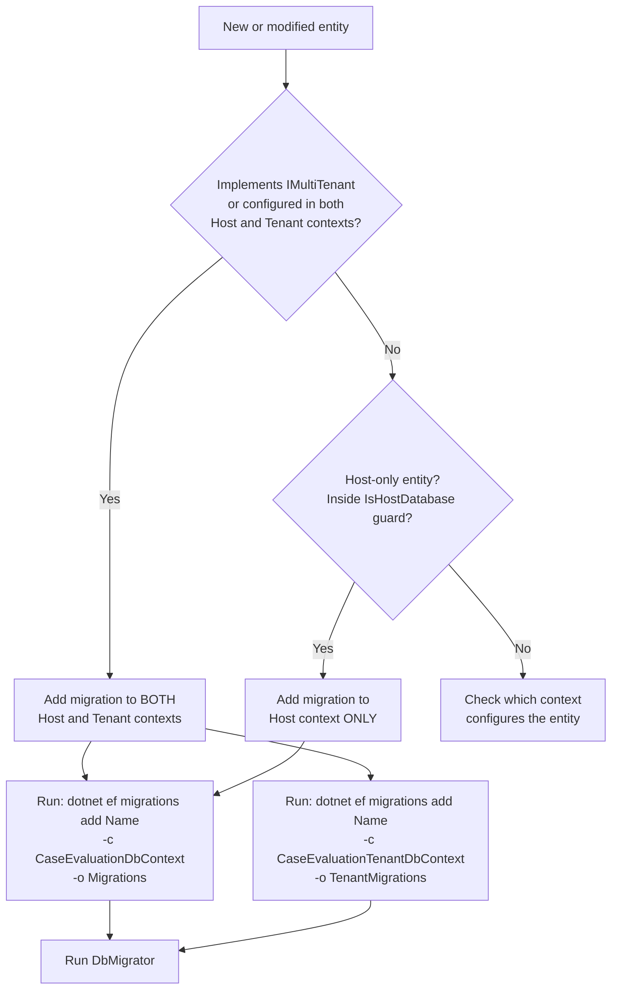

# Migration Guide

> Purpose: Reference for adding and applying EF Core migrations in the dual-context (host/tenant) setup. Audience: Backend developers. Last verified: 2026-06-01 vs main.

[Home](../INDEX.md) > [Database](./) > Migration Guide

## Overview

The HCS Case Evaluation Portal uses EF Core's code-first migrations with a **dual migration folder** strategy to support ABP's multi-tenancy model. Host and tenant databases have separate migration tracks, each tied to their respective DbContext.

---

## Dual Migration Folders

| Folder | DbContext | Connection String | Purpose |
|--------|-----------|-------------------|---------|
| `Migrations/` | `CaseEvaluationDbContext` | `"Default"` | Host database (all entities) |
| `TenantMigrations/` | `CaseEvaluationTenantDbContext` | `"TenantDevelopmentTime"` | Tenant databases (tenant-side entities only) |

Both folders live under `src/HealthcareSupport.CaseEvaluation.EntityFrameworkCore/`.

---

## DbContext Factories

EF Core CLI commands require design-time DbContext factories. Both factories inherit from `CaseEvaluationDbContextFactoryBase<T>` which implements `IDesignTimeDbContextFactory<T>`.

| Factory Class | Creates | Connection String Key |
|---------------|---------|----------------------|
| `CaseEvaluationDbContextFactory` | `CaseEvaluationDbContext` | `"Default"` |
| `CaseEvaluationTenantDbContextFactory` | `CaseEvaluationTenantDbContext` | `"TenantDevelopmentTime"` |

The base factory reads configuration from `src/HealthcareSupport.CaseEvaluation.DbMigrator/appsettings.json`, so both connection strings must be defined there for CLI commands to work.

---

## Adding Migrations

### Decision Flowchart



### Commands

All commands must be run from the **EntityFrameworkCore project directory**:

```bash
cd src/HealthcareSupport.CaseEvaluation.EntityFrameworkCore
```

#### Adding a Host Migration

```bash
dotnet ef migrations add <MigrationName> -c CaseEvaluationDbContext -o Migrations
```

#### Adding a Tenant Migration

```bash
dotnet ef migrations add <MigrationName> -c CaseEvaluationTenantDbContext -o TenantMigrations
```

#### Example: Adding a Multi-Tenant Entity

When adding a new entity that implements `IMultiTenant` and is configured in both DbContexts:

```bash
# Step 1: Add host migration
dotnet ef migrations add Added_NewEntity -c CaseEvaluationDbContext -o Migrations

# Step 2: Add tenant migration
dotnet ef migrations add Added_NewEntity -c CaseEvaluationTenantDbContext -o TenantMigrations
```

#### Example: Adding a Host-Only Entity

When adding an entity configured only inside `builder.IsHostDatabase()`:

```bash
# Only host migration needed
dotnet ef migrations add Added_NewLookupTable -c CaseEvaluationDbContext -o Migrations
```

---

## Running Migrations

Migrations are applied via the **DbMigrator** console application, not via `dotnet ef database update`:

```bash
cd src/HealthcareSupport.CaseEvaluation.DbMigrator
dotnet run
```

The DbMigrator:
1. Applies pending host database migrations
2. Seeds host data
3. Iterates all tenants and applies pending tenant database migrations
4. Seeds tenant data for each tenant

See [Data Seeding](DATA-SEEDING.md) for details on what gets seeded.

---

## Migration History

The project has evolved through the following host migrations (chronological order). As of 2026-06-01 there are **46** host migrations; the latest is `20260528030331_Phase20_DoctorAvailabilityCapacityAndTypeSet`.

| Timestamp | Migration Name | Description |
|-----------|---------------|-------------|
| 20260131164316 | `Initial` | ABP framework tables + AppBooks |
| 20260131174206 | `Added_State` | AppStates lookup table |
| 20260131180340 | `Added_AppointmentType` | AppAppointmentTypes lookup table |
| 20260131182820 | `Added_AppointmentStatus` | AppAppointmentStatuses lookup table |
| 20260131190456 | `Added_AppointmentLanguage` | AppAppointmentLanguages lookup table |
| 20260202081019 | `Added_Location` | AppLocations table |
| 20260202185434 | `Updated_Location_*` | Location schema update |
| 20260202193114 | `Added_WcabOffice` | AppWcabOffices table |
| 20260203071714 | `Added_Doctor` | AppDoctors + junction tables |
| 20260206061727 | `Updated_AppointmentStatus_*` | AppointmentStatus schema update |
| 20260206062930 | `Updated_AppointmentType_*` | AppointmentType schema update |
| 20260206064607 | `Updated_AppointmentLanguage_*` | AppointmentLanguage schema update |
| 20260206230752 | `Added_DoctorAvailability` | AppDoctorAvailabilities table |
| 20260210185726 | `Added_Patient` | AppPatients table |
| 20260213120521 | `Added_Appointment` | AppAppointments table |
| 20260216212948 | `Updated_Appointment_*` | Appointment schema update |
| 20260216222210 | `Updated_Appointment_*` | Appointment schema update |
| 20260217183357 | `Added_DocAvailabilityId_Appointment` | DoctorAvailabilityId FK on Appointment |
| 20260221140515 | `Updated_State_*` | State schema update |
| 20260223092105 | `Added_AppointEmployerDetails` | AppAppointmentEmployerDetails table |
| 20260225070723 | `Added-AppoitAccessor` | AppAppointmentAccessors table |
| 20260301195032 | `Added_ApplicantAttorney` | AppApplicantAttorneys table |
| 20260301195703 | `Updated_ApplicantAttorney_*` | ApplicantAttorney schema update |
| 20260302064409 | `Added_AppointmentApplicantAttorney` | AppAppointmentApplicantAttorneys table |
| 20260428003045 | `Added_AppointmentSendBackInfo` | AppAppointmentSendBackInfo table |
| 20260428053054 | `Added_AppointmentDocuments` | AppAppointmentDocuments table |
| 20260429174102 | `Added_AppointmentTypeFieldConfigs` | AppAppointmentTypeFieldConfigs table |
| 20260429194943 | `Added_DefenseAttorneys` | AppDefenseAttorneys table |
| 20260429212126 | `Added_AppointmentInjuryWorkflow` | Appointment injury workflow fields |
| 20260429223747 | `Added_DocumentReview_And_AppointmentPacket` | Document review + appointment packet tables |
| 20260430222449 | `AddAppointmentPartyEmails` | Appointment party email columns |
| 20260502000305 | `Drop_Doctor_IdentityUserId` | Remove IdentityUserId column from AppDoctors |
| 20260502001639 | `Drop_AppointmentSendBackInfo` | Remove AppAppointmentSendBackInfo table |
| 20260503004742 | `Phase1_Add_ParityEntities_And_AppointmentFields` | Parity entity additions and appointment field updates |
| 20260503230345 | `Phase6_Add_CustomFields` | Custom field support tables |
| 20260504010608 | `Phase7b_Add_DoctorPreferredLocations` | AppDoctorPreferredLocations table |
| 20260504170956 | `Phase11f_AppointmentConfirmationNumberUniqueIndex` | Unique index on appointment confirmation number |
| 20260505170252 | `G6_Drop_AppointmentDocument_Status_Default` | Remove default value from document status column |
| 20260507193705 | `AllowNullIdentityUserOnAttorneys` | Make IdentityUserId nullable on attorney tables |
| 20260508215314 | `Packet1A_Add_PacketKind_And_CompositeUnique` | Add PacketKind column and composite unique index |
| 20260512214140 | `Rename_InsuranceNumber_And_ClaimExaminerNumber_To_Suite` | Rename insurance/claim examiner number columns |
| 20260515183211 | `Added_Invitations` | AppInvitations table |
| 20260524012608 | `Packet_FilteredUniqueIndex_SoftDelete` | Filtered unique index on packet (soft-delete aware) |
| 20260527163118 | `Add_AttorneyName` | Attorney name column |
| 20260527234615 | `DoctorOnePerTenantUniqueIndex` | Unique index enforcing one doctor record per tenant |
| 20260528030331 | `Phase20_DoctorAvailabilityCapacityAndTypeSet` | Doctor availability capacity and type-set columns |

### Tenant Migration History

As of 2026-06-01 there are **5** tenant migrations; the count is intentionally small -- see the note below.

| Timestamp | Migration Name | Description |
|-----------|---------------|-------------|
| 20260131164326 | `Initial` | ABP framework tables + AppBooks (tenant side) |
| 20260131180355 | `Added_AppointmentType` | AppointmentType in tenant context |
| 20260131182835 | `Added_AppointmentStatus` | AppointmentStatus in tenant context |
| 20260131190523 | `Added_AppointmentLanguage` | AppointmentLanguage in tenant context |
| 20260131193951 | `Updated_AppointmentLanguage_*` | AppointmentLanguage update in tenant context |

> **Note:** The tenant migration history shows fewer migrations because many entities were initially configured as host-only and later added to the tenant context directly in the DbContext without a separate tenant migration. The tenant context's `OnModelCreating` configures all needed entities regardless.

---

## Important Guidelines

### Do

- Always run migrations from the `src/HealthcareSupport.CaseEvaluation.EntityFrameworkCore` directory.
- When adding a multi-tenant entity, add migrations to **both** host and tenant contexts.
- Use the DbMigrator console app to apply migrations (it handles both host and all tenant databases).
- Test migrations on a fresh database before applying to production.
- Use descriptive migration names (e.g., `Added_EntityName`, `Updated_EntityName_ChangeDescription`).

### Do Not

- Never manually edit generated migration files (the `Up()` / `Down()` methods or the `.Designer.cs` snapshot).
- Do not use `dotnet ef database update` directly -- use the DbMigrator instead, which handles multi-tenancy.
- Do not forget the `-o` output folder flag -- without it, migrations will go to the wrong directory.
- Do not add host-only entities to tenant migrations (they will create unnecessary tables in tenant databases).

### Multi-Tenancy Considerations

- Entities implementing `IMultiTenant` that are configured in both DbContexts need migrations in **both** folders.
- Lookup entities (State, AppointmentType, AppointmentStatus, AppointmentLanguage) are configured in both contexts even though they are guarded by `IsHostDatabase()` in the host context -- check each entity's presence in `CaseEvaluationTenantDbContext` to determine if a tenant migration is needed.
- The host context uses `MultiTenancySides.Both`, meaning it sees all data regardless of tenant.
- The tenant context uses `MultiTenancySides.Tenant`, meaning it only sees tenant-scoped data.

---

## Troubleshooting

### "The migration has already been applied to the database"

The migration is already in `__EFMigrationsHistory`. If you need to re-create it, remove the migration entry from the history table first (development only).

### "Could not find connection string"

Ensure both `"Default"` and `"TenantDevelopmentTime"` connection strings are defined in `src/HealthcareSupport.CaseEvaluation.DbMigrator/appsettings.json`.

### "No DbContext was found in assembly"

Make sure you are running the command from the EntityFrameworkCore project directory, and that the project builds successfully.

### Migration creates empty Up/Down methods

This usually means no schema changes were detected. Verify that:
1. The entity is registered as a `DbSet` in the target DbContext.
2. The entity is configured in `OnModelCreating` of the target DbContext.
3. You are targeting the correct DbContext with the `-c` flag.

---

## Related Documentation

- [EF Core Design](EF-CORE-DESIGN.md) -- DbContext architecture and entity configuration
- [Data Seeding](DATA-SEEDING.md) -- Seed contributors and default data
- [Development Setup](../runbooks/DOCKER-DEV.md) -- Local development environment setup
