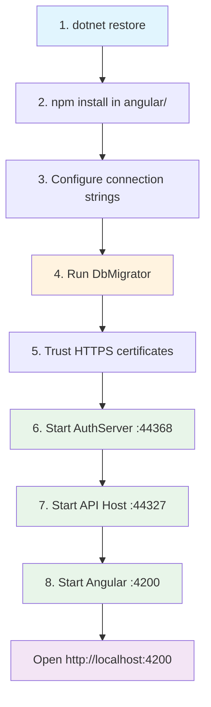

# Development Setup

[Home](../INDEX.md) > [DevOps](./) > Development Setup

---

## Prerequisites

| Tool | Purpose |
|------|---------|
| .NET 10 SDK | Backend build and runtime |
| Node.js | Angular CLI and frontend tooling |
| SQL Server LocalDB (or full SQL Server) | Database |
| Angular CLI (`npm install -g @angular/cli`) | Frontend development server |
| ABP CLI (`dotnet tool install -g Volo.Abp.Studio.Cli` or `dotnet tool install -g Volo.Abp.Cli`) | ABP framework tooling, library installs |
| Redis (optional, disabled by default) | Distributed caching (only needed for multi-instance) |

---

## Step-by-Step Setup

### 1. Clone the Repository

```bash
git clone <repository-url>
cd hcs-case-evaluation-portal
```

### 2. Install .NET Dependencies

```bash
dotnet restore
```

Run from the solution root directory.

### 3. Install Angular Dependencies

```bash
cd angular
npm install
```

### 4. Configure Connection String

Edit `src/HealthcareSupport.CaseEvaluation.DbMigrator/appsettings.json` if you need to change the default connection string:

```json
{
  "ConnectionStrings": {
    "Default": "Server=(LocalDb)\\MSSQLLocalDB;Database=CaseEvaluation;Trusted_Connection=True;TrustServerCertificate=true"
  }
}
```

The same connection string format is used in `HttpApi.Host/appsettings.json` and `AuthServer/appsettings.json`. Update all three if pointing to a different SQL Server instance.

### 5. Run DbMigrator

```bash
cd src/HealthcareSupport.CaseEvaluation.DbMigrator
dotnet run
```

This performs:
- Creates the `CaseEvaluation` database if it does not exist
- Runs all EF Core migrations
- Seeds initial data (admin user, OpenIddict applications)
- Registers OpenIddict clients: `CaseEvaluation_App` (Angular, root URL `http://localhost:4200`) and `CaseEvaluation_Swagger` (Swagger UI, root URL `https://localhost:44327/`)

**Default admin credentials:** `admin@abp.io` / see `TEST_PASSWORD` in `.env.local`

### 6. Trust HTTPS Development Certificates

```bash
dotnet dev-certs https --trust
```

The AuthServer also requires an OpenIddict signing certificate. The `initialize-solution.ps1` script generates this automatically (requires `CERT_PASSPHRASE` env var):

```powershell
dotnet dev-certs https -v -ep openiddict.pfx -p $env:CERT_PASSPHRASE
```

### 7. Start AuthServer

```bash
cd src/HealthcareSupport.CaseEvaluation.AuthServer
dotnet run
```

Runs on **https://localhost:44368**

### 8. Start API Host

```bash
cd src/HealthcareSupport.CaseEvaluation.HttpApi.Host
dotnet run
```

Runs on **https://localhost:44327**
Swagger UI available at **https://localhost:44327/swagger**

### 9. Start Angular

> **Warning:** Never use `ng serve` or `yarn start`. Angular 20's Vite pre-bundler splits `@abp/ng.core` across chunks, causing `NullInjectorError: CORE_OPTIONS`. Use `ng build` + `npx serve` instead.

```bash
cd angular
npx ng build --configuration development
npx serve -s dist/CaseEvaluation/browser -p 4200
```

Runs on **http://localhost:4200**

---

## Startup Sequence



---

## Port Reference

| Service | Port | URL |
|---------|------|-----|
| AuthServer | 44368 | https://localhost:44368 |
| API Host | 44327 | https://localhost:44327 |
| Angular | 4200 | http://localhost:4200 |
| SQL Server LocalDB | default | `(LocalDb)\MSSQLLocalDB` |
| Redis | 6379 | 127.0.0.1:6379 (optional) |

---

## Configuration Files

### HttpApi.Host/appsettings.json

API configuration including CORS origins, auth server authority URL, Swagger client ID (`CaseEvaluation_Swagger`), and health check endpoint (`/health-status`).

Key settings:
- `App:SelfUrl` = `https://localhost:44327`
- `App:AngularUrl` = `http://localhost:4200`
- `App:CorsOrigins` = `https://*.CaseEvaluation.com,http://localhost:4200,https://localhost:44368`
- `AuthServer:Authority` = `https://localhost:44368`
- `AuthServer:MetaAddress` = `https://localhost:44368`

### AuthServer/appsettings.json

Authentication server configuration including signing certificate passphrase, redirect allowed URLs, and CORS origins.

Key settings:
- `App:SelfUrl` = `https://localhost:44368`
- `App:RedirectAllowedUrls` = `http://localhost:4200,https://localhost:44382,...`
- `AuthServer:CertificatePassPhrase` = configured for OpenIddict signing

### DbMigrator/appsettings.json

Connection string and OpenIddict application registration for seeding.

Key settings:
- `ConnectionStrings:Default` = `Server=(LocalDb)\MSSQLLocalDB;Database=CaseEvaluation;...`
- `OpenIddict:Applications:CaseEvaluation_App:RootUrl` = `http://localhost:4200`
- `OpenIddict:Applications:CaseEvaluation_Swagger:RootUrl` = `https://localhost:44327/`

### angular/src/environments/environment.ts

Frontend environment configuration:
- `apis.default.url` = `https://localhost:44327`
- `oAuthConfig.issuer` = `https://localhost:44368/`
- `oAuthConfig.clientId` = `CaseEvaluation_App`
- `oAuthConfig.scope` = `offline_access CaseEvaluation`

---

## Redis

Redis is **optional and disabled by default** in all projects:

```json
{
  "Redis": {
    "Configuration": "127.0.0.1",
    "IsEnabled": false
  }
}
```

Enable Redis for distributed caching in multi-instance deployment scenarios by setting `"IsEnabled": true` and ensuring a Redis server is running on port 6379.

---

## ABP Studio

Optional IDE integration is configured via profiles in `etc/abp-studio/`:

- **Run Profile:** `etc/abp-studio/run-profiles/Default.abprun.json` -- defines startup order for all services (Angular order 2, AuthServer order 3, HttpApi.Host order 4) and container dependencies (Redis).
- **K8s Profile:** `etc/abp-studio/k8s-profiles/local.abpk8s.json` -- targets `docker-desktop` context in the `caseevaluation-local` namespace.
- **Initialize Solution Task:** Runs `etc/scripts/initialize-solution.ps1` which installs ABP libraries, runs DbMigrator, and generates the dev certificate in parallel.
- **Migrate Database Task:** Runs `etc/scripts/migrate-database.ps1` which executes the DbMigrator project.

---

## Common Issues

| Issue | Solution |
|-------|----------|
| SSL certificate errors | Run `dotnet dev-certs https --trust` and restart the services |
| Port conflicts | Verify no other services are using ports 44327, 44368, or 4200 |
| Migration errors | Delete the `CaseEvaluation` database and re-run DbMigrator |
| Angular proxy errors | Ensure the API Host is running before starting Angular |
| ABP library missing errors | Run `abp install-libs` from the solution root |
| OpenIddict certificate not found | Run `initialize-solution.ps1` or manually generate the pfx file in the AuthServer project folder |

---

**Related:**
- [Getting Started](../onboarding/GETTING-STARTED.md)
- [Docker & Deployment](DOCKER-AND-DEPLOYMENT.md)
- [Migration Guide](../database/MIGRATION-GUIDE.md)
