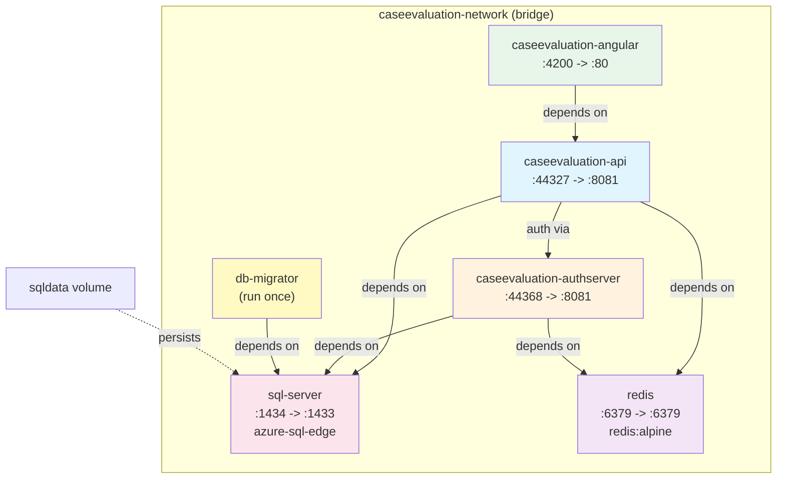
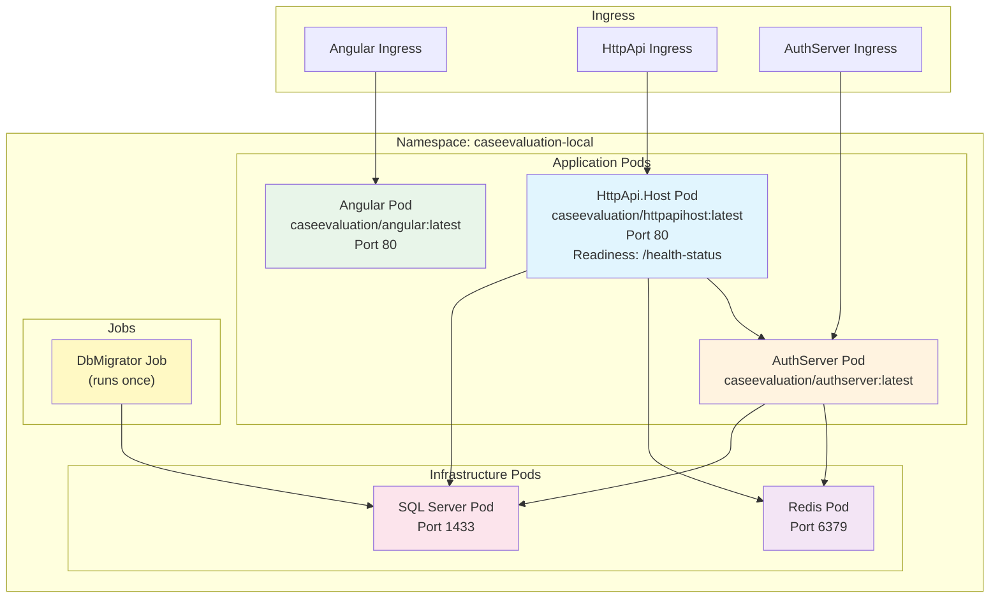

# Docker & Deployment

[Home](../INDEX.md) > [DevOps](./) > Docker & Deployment

---

## Docker Compose

### Location

`etc/docker-compose/docker-compose.yml`

### Services

| Container Name | Image | Ports | Depends On |
|----------------|-------|-------|------------|
| `caseevaluation-angular` | `healthcaresupport/caseevaluation-angular:latest` | 4200:80 | caseevaluation-api |
| `caseevaluation-api` | `healthcaresupport/caseevaluation-api:latest` | 44327:8081 | sql-server, redis |
| `caseevaluation-authserver` | `healthcaresupport/caseevaluation-authserver:latest` | 44368:8081 | sql-server, redis |
| `db-migrator` | `healthcaresupport/caseevaluation-db-migrator:latest` | -- | sql-server |
| `sql-server` | `mcr.microsoft.com/azure-sql-edge:1.0.7` | 1434:1433 | -- |
| `redis` | `redis:alpine` | 6379:6379 | -- |

All services communicate over a bridge network named `caseevaluation-network`. SQL data is persisted in a named volume `caseevaluation_sqldata`.

### Health Checks

- **sql-server:** Uses `sqlcmd` to verify connectivity (interval 10s, 10 retries).
- **redis:** Uses `redis-cli ping`.
- **caseevaluation-api** and **caseevaluation-authserver:** Restart on failure (`restart: on-failure`), depend on healthy sql-server and redis.

### Scripts

| Script | Purpose |
|--------|---------|
| `etc/docker-compose/run-docker.ps1` | Start all Docker Compose services |
| `etc/docker-compose/run-docker.sh` | Start all services (Linux/macOS) |
| `etc/docker-compose/stop-docker.ps1` | Stop all Docker Compose services |
| `etc/docker-compose/stop-docker.sh` | Stop all services (Linux/macOS) |
| `etc/docker-compose/build-images-locally.ps1` | Build all Docker images locally |

### Build Images Locally

`etc/docker-compose/build-images-locally.ps1` builds images in this order:

1. **DbMigrator** -- `dotnet publish -c Release`, then `docker build` as `healthcaresupport/caseevaluation-db-migrator`
2. **Angular** -- `npx yarn` + `npm run build:prod`, then `docker build` as `healthcaresupport/caseevaluation-angular`
3. **HttpApi.Host** -- `dotnet publish -c Release`, then `docker build` as `healthcaresupport/caseevaluation-api`
4. **AuthServer** -- `dotnet publish -c Release`, then `docker build` as `healthcaresupport/caseevaluation-authserver`

Pass a version tag: `./build-images-locally.ps1 -version 1.0.0` (defaults to `latest`).

### Docker Compose Topology



---

## Helm Charts

### Location

`etc/helm/caseevaluation/`

### Chart Structure

```
etc/helm/caseevaluation/
  Chart.yaml                          # v1.0.0, appVersion "1.0"
  values.yaml                         # Global TLS secret, ABP Studio proxy
  values.caseevaluation-local.yaml    # Local overrides (hosts, connection strings)
  templates/_helpers.tpl              # Template helper functions
  charts/
    angular/                          # Angular frontend deployment
      Chart.yaml
      values.yaml                     # image: caseevaluation/angular:latest
      templates/
        angular.yaml                  # Deployment
        angular-service.yaml          # Service
        angular-ingress.yaml          # Ingress
        angular-configmap.yaml        # ConfigMap
    authserver/                       # AuthServer deployment
      Chart.yaml
      values.yaml                     # image: caseevaluation/authserver:latest
      templates/
        authserver.yaml               # Deployment
        authserver-service.yaml       # Service
        authserver-ingress.yaml       # Ingress
    httpapihost/                      # API Host deployment
      Chart.yaml
      values.yaml                     # image: caseevaluation/httpapihost:latest
      templates/
        httpapihost.yaml              # Deployment (port 80, readiness on /health-status)
        httpapihost-service.yaml      # Service
        httpapihost-ingress.yaml      # Ingress
    dbmigrator/                       # Database migration job
      Chart.yaml
      values.yaml
      templates/
        migrator.yaml                 # Job
    redis/                            # Redis cache
      Chart.yaml
      values.yaml
      templates/
        redis.yaml                    # Deployment
        redis-service.yaml            # Service
    sqlserver/                        # SQL Server
      Chart.yaml
      values.yaml
      templates/
        sqlserver.yaml                # Deployment
        sqlserver-service.yaml        # Service
```

### Local Values Override

`values.caseevaluation-local.yaml` configures local Kubernetes deployment:

- **Connection string:** `Server=[RELEASE_NAME]-sqlserver,1433; Database=CaseEvaluation; User Id=sa; Password=REPLACE_ME; TrustServerCertificate=True`
- **Environment:** `Staging`
- **TLS Secret:** `caseevaluation-local-tls`
- **Host naming:** `[RELEASE_NAME]-<service>` pattern (e.g., `[RELEASE_NAME]-authserver`)

### Helm Scripts

| Script | Purpose |
|--------|---------|
| `etc/helm/install.ps1` | Install Helm chart to cluster |
| `etc/helm/uninstall.ps1` | Uninstall Helm release |
| `etc/helm/build-all-images.ps1` | Build all Docker images for Helm |
| `etc/helm/build-image.ps1` | Build a single service Docker image |
| `etc/helm/create-tls-secrets.ps1` | Create TLS secrets in Kubernetes |

### Kubernetes Pod Layout



---

## Kubernetes Profiles

### ABP Studio K8s Profile

`etc/abp-studio/k8s-profiles/local.abpk8s.json`

- **Context:** `docker-desktop`
- **Namespace:** `caseevaluation-local`
- **Environment:** `Staging`

---

## Container Definitions

### Redis Container (ABP Studio)

`etc/docker/containers/redis.yml`

Used by ABP Studio run profiles for local development:

- **Image:** `redis:7.2.2-alpine`
- **Port:** `6379:6379`
- **Network:** External `caseevaluation` network

Supporting scripts:
- `etc/docker/up.ps1` -- Start containers
- `etc/docker/down.ps1` -- Stop containers

---

## Infrastructure Scripts

| Script | Location | Purpose |
|--------|----------|---------|
| `initialize-solution.ps1` | `etc/scripts/` | Runs three parallel jobs: `abp install-libs`, DbMigrator (with Redis disabled), and dev certificate generation |
| `migrate-database.ps1` | `etc/scripts/` | Runs DbMigrator as a background job to apply latest migrations |

---

**Related:**
- [Development Setup](DEVELOPMENT-SETUP.md)
- [Testing Strategy](TESTING-STRATEGY.md)
- [Architecture Overview](../architecture/OVERVIEW.md)
