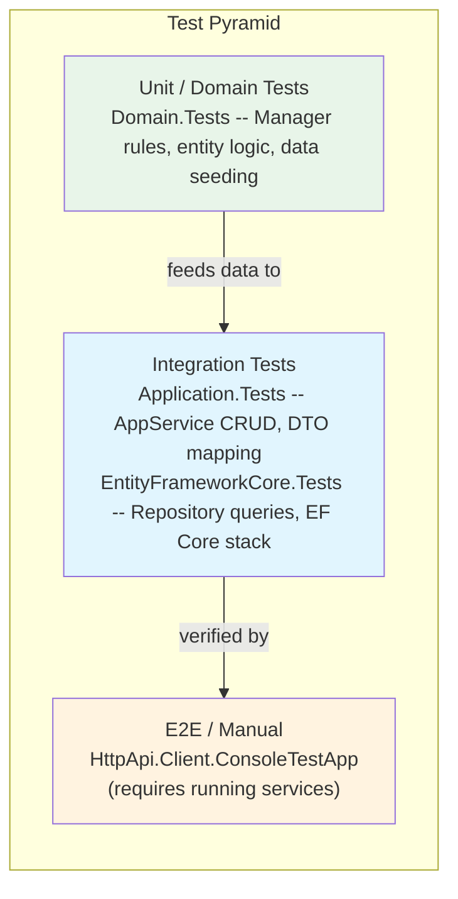

# Testing Strategy

[Home](../INDEX.md) > [DevOps](./) > Testing Strategy

---

## Test Projects

The solution contains four test projects under the `test/` directory, plus a console-based E2E test app.

### 1. HealthcareSupport.CaseEvaluation.TestBase

**Purpose:** Shared test infrastructure and base classes for all other test projects.

Key classes:
- **`CaseEvaluationTestBase<TStartupModule>`** -- Extends `AbpIntegratedTest<TStartupModule>`. Configures Autofac, loads `appsettings.json`, and provides `WithUnitOfWorkAsync()` helper methods for wrapping test logic in a unit of work.
- **`CaseEvaluationTestDataBuilder`** -- Builds shared test data.
- **`CaseEvaluationTestConsts`** -- Shared constants including `CollectionDefinitionName` for xUnit collection fixtures.
- **`FakeCurrentPrincipalAccessor`** (in `Security/`) -- Provides a fake principal for testing authenticated scenarios.

### 2. HealthcareSupport.CaseEvaluation.Domain.Tests

**Purpose:** Unit tests for domain logic and test data seeding.

Key contents:
- **`DoctorsDataSeedContributor`** -- Implements `IDataSeedContributor` to seed two test `Doctor` entities with known GUIDs (`63b171d1-...` and `b6d53903-...`). Uses `ISingletonDependency` to ensure seeding runs only once per test session.
- **`SampleDomainTests`** -- Baseline domain service tests.
- **`CaseEvaluationDomainTestModule`** -- Module configuration for domain test project.

Test patterns:
- Validate Manager business rules (entity creation constraints, validation)
- Verify domain entity behavior and invariants
- Seed contributors provide consistent test data across all test layers

### 3. HealthcareSupport.CaseEvaluation.Application.Tests

**Purpose:** Integration tests for application services (AppServices), testing through the full service layer including DTO mapping, permission checks, and repository integration.

Key contents:
- **`DoctorApplicationTests`** -- Abstract generic test class (`DoctorsAppServiceTests<TStartupModule>`) that tests `IDoctorsAppService` CRUD operations:
  - `GetListAsync()` -- Verifies seeded data returns 2 doctors
  - `GetAsync()` -- Retrieves a single doctor by known GUID
  - `CreateAsync()` -- Creates a doctor and verifies persistence
  - `UpdateAsync()` -- Updates a doctor and verifies all fields changed
  - `DeleteAsync()` -- Deletes a doctor and verifies removal
- **`BookAppService_Tests`** -- Application service tests for the Books sample.
- **`SampleAppServiceTests`** -- Baseline application service tests.

Test patterns:
- Resolve `IAppService` and `IRepository` via dependency injection
- Assert against known seeded data GUIDs
- Use `Shouldly` assertions for readability

### 4. HealthcareSupport.CaseEvaluation.EntityFrameworkCore.Tests

**Purpose:** EF Core integration tests for repositories and domain services that exercise the actual database layer (using an in-memory or test database).

Key contents:
- **`CaseEvaluationEntityFrameworkCoreCollection`** -- xUnit `[CollectionDefinition]` that uses `CaseEvaluationEntityFrameworkCoreFixture` as `ICollectionFixture`, ensuring a shared database setup across all EF Core tests.
- **`CaseEvaluationEntityFrameworkCoreFixture`** -- Implements `IDisposable` for shared test database lifecycle management.
- **`DoctorRepositoryTests`** -- Tests `IDoctorRepository` custom methods:
  - `GetListAsync()` -- Filters by firstName, lastName, email and verifies exact match
  - `GetCountAsync()` -- Filters and verifies count
- **`EfCoreDoctorsAppServiceTests`** -- Runs the abstract `DoctorsAppServiceTests` against the EF Core module, testing the full stack from AppService through EF Core.
- **`EfCoreBookAppService_Tests`** / **`EfCoreSampleAppServiceTests`** / **`EfCoreSampleDomainTests`** -- Run corresponding abstract tests against the EF Core infrastructure.

Test patterns:
- Wrap repository calls in `WithUnitOfWorkAsync()` for proper transaction scoping
- Use collection fixtures for shared database state
- Test custom repository query methods (filtering, counting)
- Test navigation property loading

### 5. HealthcareSupport.CaseEvaluation.HttpApi.Client.ConsoleTestApp

**Purpose:** Manual end-to-end testing console application that exercises the HTTP API Client against a running API.

Key contents:
- **`ClientDemoService`** -- Uses `IProfileAppService` and `IIdentityUserAppService` to call the running API, printing user profile and user list to console.
- Requires the AuthServer and API Host to be running.

---

## Test Framework Stack

| Component | Technology |
|-----------|------------|
| Test runner | xUnit |
| ABP integration | `Volo.Abp.Testing` (`AbpIntegratedTest<T>`) |
| Assertions | Shouldly |
| DI container | Autofac (configured in `CaseEvaluationTestBase`) |
| Data seeding | ABP `IDataSeedContributor` |
| Collection fixtures | xUnit `ICollectionFixture<T>` |

---

## Test Data Seeding

Test data is seeded via `DoctorsDataSeedContributor` in the Domain.Tests project. This contributor:

1. Implements `IDataSeedContributor` for ABP's automatic seeding pipeline
2. Is registered as `ISingletonDependency` with an `IsSeeded` guard to run only once
3. Inserts two `Doctor` entities with deterministic GUIDs and known field values
4. Calls `SaveChangesAsync()` on the current unit of work

All test projects that reference Domain.Tests automatically receive this seeded data.

---

## Running Tests

### All Tests

```bash
dotnet test
```

Run from the solution root to execute all test projects.

### Individual Test Project

```bash
cd test/HealthcareSupport.CaseEvaluation.Domain.Tests
dotnet test
```

```bash
cd test/HealthcareSupport.CaseEvaluation.Application.Tests
dotnet test
```

```bash
cd test/HealthcareSupport.CaseEvaluation.EntityFrameworkCore.Tests
dotnet test
```

### Console Test App (E2E)

```bash
cd test/HealthcareSupport.CaseEvaluation.HttpApi.Client.ConsoleTestApp
dotnet run
```

Requires the AuthServer (`https://localhost:44368`) and API Host (`https://localhost:44327`) to be running.

---

## Test Pyramid



### Layer Responsibilities

| Layer | Scope | Speed | Projects |
|-------|-------|-------|----------|
| **Unit (Domain)** | Manager validation, entity creation, business logic | Fast | Domain.Tests |
| **Integration (Application)** | AppService CRUD, permission checks, DTO mapping | Medium | Application.Tests |
| **Integration (EF Core)** | Repository queries, filtering, navigation properties, full stack | Medium | EntityFrameworkCore.Tests |
| **E2E (Manual)** | HTTP API Client against running services | Slow | HttpApi.Client.ConsoleTestApp |

---

**Related:**
- [Development Setup](DEVELOPMENT-SETUP.md)
- [Solution Structure](../architecture/SOLUTION-STRUCTURE.md)
- [Domain Services](../backend/DOMAIN-SERVICES.md)
