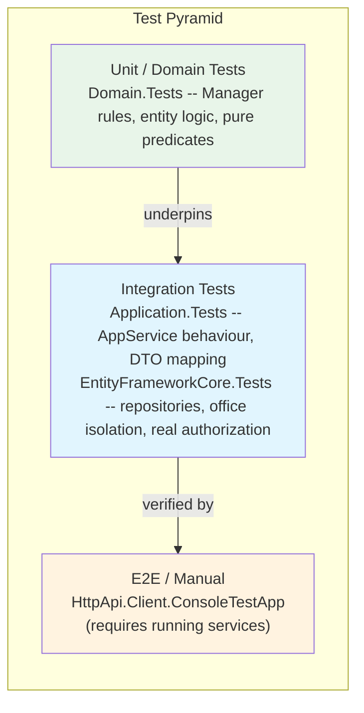

# Testing Strategy

> Purpose: Describes the test projects, harnesses, data seeding approach, and test layers for the Patient Portal backend and frontend. Audience: developers.

[Home](../index.md) > [DevOps](./) > Testing Strategy

> Backend test coverage: [docs/testing/coverage-status.md](../testing/coverage-status.md) names the
> commands that report test counts and coverage. It deliberately stores no figures, so there is
> nothing here to verify or date.

---

## Test Projects

The solution contains four test projects under the `test/` directory, plus a console-based E2E test app.

### 1. HealthcareSupport.CaseEvaluation.TestBase

**Purpose:** Shared test infrastructure and base classes for all other test projects.

Key classes:

- **`CaseEvaluationTestBase<TStartupModule>`** -- Extends `AbpIntegratedTest<TStartupModule>`. Configures Autofac, loads `appsettings.json`, and provides `WithUnitOfWorkAsync()` helper methods for wrapping test logic in a unit of work.
- **`CaseEvaluationTestBaseModule`** -- Registers `AddAlwaysAllowAuthorization()`, so in every harness built on it
  ABP's authorization interceptor always succeeds and an `[Authorize]` attribute cannot refuse a caller (#707). See
  [Where authorization is tested](#where-authorization-is-tested).
- **`Data/CaseEvaluationIntegrationTestSeedContributor`** -- The single seeder for integration tests (see
  [Test Data Seeding](#test-data-seeding)); fixed ids live in the `Data/*TestData.cs` classes.
- `CaseEvaluationTestDataBuilder.cs` holds only an empty `CaseEvaluationTestDataSeedContributor` stub from the ABP
  template.
- **`CaseEvaluationTestConsts`** -- Shared constants. Its `CollectionDefinitionName` (the old shared EF Core collection) is `[Obsolete(error: true)]`, kept only so a leftover `[Collection]` attribute fails to compile (#1034).
- **`FakeCurrentPrincipalAccessor`** (in `Security/`) -- Provides a fake principal for testing authenticated scenarios.

### 2. HealthcareSupport.CaseEvaluation.Domain.Tests

**Purpose:** Unit tests for domain logic and test data seeding.

Key contents:

- **`SampleDomainTests`** -- Baseline domain service tests.
- **`CaseEvaluationDomainTestModule`** -- Module configuration for domain test project.

Test patterns:

- Validate Manager business rules (entity creation constraints, validation)
- Verify domain entity behavior and invariants
- Pure rules (for example the booking and access predicates) are tested here directly, without a database

### 3. HealthcareSupport.CaseEvaluation.Application.Tests

**Purpose:** Integration tests for application services, testing through the full service layer including DTO
mapping and repository integration. Authorization is always allowed in this project, so a permission check here cannot
fail; see [Where authorization is tested](#where-authorization-is-tested). The project references `HttpApi.Host` and
`AuthServer`, which matters for one local gotcha (see [Running Tests](#running-tests)).

Key contents:

- **`DoctorApplicationTests`** -- Abstract generic test class (`DoctorsAppServiceTests<TStartupModule>`) that tests `IDoctorsAppService` CRUD operations:
  - `GetListAsync()` -- Verifies seeded data returns 2 doctors
  - `GetAsync()` -- Retrieves a single doctor by known GUID
  - `CreateAsync()` -- Creates a doctor and verifies persistence
  - `UpdateAsync()` -- Updates a doctor and verifies all fields changed
  - `DeleteAsync()` -- Deletes a doctor and verifies removal
- **`SampleAppServiceTests`** -- Baseline application service tests.
- One `*AppServiceTests` class (or folder) per feature, for example `Patients/`, `Appointments/`, `ExternalSignups/`.

Test patterns:

- Resolve `IAppService` and `IRepository` via dependency injection
- Assert against known seeded data GUIDs
- Use `Shouldly` assertions for readability

### 4. HealthcareSupport.CaseEvaluation.EntityFrameworkCore.Tests

**Purpose:** EF Core integration tests for repositories and domain services that exercise the actual database layer (using an in-memory or test database).

Key contents:

- **One database per test, classes in parallel (#1034).** Each test builds its own ABP application, and `CaseEvaluationEntityFrameworkCoreTestModule` opens a new in-memory SQLite connection for it. So the test classes carry no `[Collection]` attribute and xUnit runs them in parallel, one collection per class. Only the `MultiOffice` and `RealAuthorization` classes keep named collections, because their named shared-cache databases outlive a single test.
- **`TestCollectionAllowlistTests`** -- Fails if any test class joins a collection other than those two. **`PerTestDatabaseIsolationTests`** proves at run time that each test has its own database. **`TestTenantIdentityTests`** proves the fixed test-tenant ids resolve in each test's own database.
- **`DoctorRepositoryTests`** -- Tests `IDoctorRepository` custom methods:
  - `GetListAsync()` -- Filters by firstName, lastName, email and verifies exact match
  - `GetCountAsync()` -- Filters and verifies count
- **`EfCoreDoctorsAppServiceTests`** -- Runs the abstract `DoctorsAppServiceTests` against the EF Core module, testing the full stack from AppService through EF Core.
- **`EfCoreSampleAppServiceTests`** / **`EfCoreSampleDomainTests`** -- Run corresponding abstract tests against the EF Core infrastructure.
- **`MultiOffice/`** -- The multi-office harness (`CaseEvaluationMultiOfficeTestBase`, `CaseEvaluationMultiOfficeTestModule`):
  a separate database per office, so tests can prove that one office's data is invisible from another. It includes a
  self-validation test of the harness itself.
- **`RealAuthorization/`** -- The real-authorization harness (`CaseEvaluationRealAuthorizationTestBase`). It does NOT
  install the always-allow authorization, so this is where a permission check can actually refuse a caller.

Test patterns:

- Wrap repository calls in `WithUnitOfWorkAsync()` for proper transaction scoping
- Do not share state between tests: every test starts from a freshly seeded database, and classes run concurrently, so a static that one test or seed writes is visible to another
- Test custom repository query methods (filtering, counting)
- Test navigation property loading

### 5. HealthcareSupport.CaseEvaluation.HttpApi.Client.ConsoleTestApp

**Purpose:** Manual end-to-end testing console application that exercises the HTTP API Client against a running API.

Key contents:

- **`ClientDemoService`** -- Uses `IProfileAppService` and `IIdentityUserAppService` to call the running API, printing user profile and user list to console.
- Requires the AuthServer and API Host to be running.

---

## Test Framework Stack

| Component | Technology |
|-----------|------------|
| Test runner | xUnit |
| ABP integration | `Volo.Abp.Testing` (`AbpIntegratedTest<T>`) |
| Assertions | Shouldly |
| DI container | Autofac (configured in `CaseEvaluationTestBase`) |
| Data seeding | ABP `IDataSeedContributor` |
| Collections | None by default (classes run in parallel); only `MultiOffice` and `RealAuthorization` use named collections |

---

## Test Data Seeding

Integration-test data is seeded by one contributor,
`test/HealthcareSupport.CaseEvaluation.TestBase/Data/CaseEvaluationIntegrationTestSeedContributor.cs`. It is a single
orchestrator on purpose: ABP does not guarantee the order of several contributors, and the data has a strict foreign-key
chain. It seeds, in order: tenants (created through the same `ITenantManager` path production uses, then pinned to fixed
ids), system parameters, identity users, states, appointment types, statuses and languages, WCAB offices, locations,
doctor availabilities, doctors, patients, applicant attorneys and appointments.

Every fixed id a test may reference is in the `Data/*TestData.cs` classes (for example `TenantsTestData`,
`PatientsTestData`, `AppointmentsTestData`). All synthetic.

## Where authorization is tested

| Layer | Where | Proves |
|-------|-------|--------|
| Declaration | `Application.Tests/Authorization/` (`AuthorizationSurfaceSnapshotTests`, `AuthorizationSurfaceInvariantTests`) | The `[Authorize]` attributes on the application services have not changed or gone missing |
| Mechanism | `EntityFrameworkCore.Tests/RealAuthorization/` | A caller without the permission is actually refused, on the PHI-bearing surfaces |

Everywhere else, `AddAlwaysAllowAuthorization()` makes permission attributes inert, so do not write a permission
assertion in `Application.Tests` or the ordinary EF Core tests: it cannot fail.

---

## Running Tests

### All Tests

```bash
dotnet test
```

Run from the solution root to execute all test projects.

### Individual Test Project

```bash
cd test/HealthcareSupport.CaseEvaluation.Domain.Tests
dotnet test
```

```bash
cd test/HealthcareSupport.CaseEvaluation.Application.Tests
dotnet test
```

```bash
cd test/HealthcareSupport.CaseEvaluation.EntityFrameworkCore.Tests
dotnet test
```

### Local gotcha: the wrong `appsettings.json` in the EF Core test output

`Application.Tests` references the `HttpApi.Host` and `AuthServer` projects, so their `appsettings.json` files can be
copied into `test/HealthcareSupport.CaseEvaluation.EntityFrameworkCore.Tests/bin/Debug/net10.0/` and replace the
TestBase one, depending on build order (a full-solution build, such as the pre-push hook, can cause it). The tests then
read a real connection string, and a few EF Core tests fail locally while CI, which builds clean, stays green. If that
happens: delete that `appsettings.json` from the bin folder, build only the EF Core test project, confirm the file is
the small TestBase one, and run `dotnet test --no-build`.

### Frontend (Angular)

Karma and Jasmine, run headless:

```bash
cd angular
npx ng test --watch=false --browsers=ChromeHeadless
```

On Windows, set `CHROME_BIN` to a Chrome or Edge executable first. Scope a run with
`--include='**/<area>/**/*.spec.ts'`. CI runs the same suite with `--code-coverage` in `Frontend: Test`.

### Console Test App (E2E)

```bash
cd test/HealthcareSupport.CaseEvaluation.HttpApi.Client.ConsoleTestApp
dotnet run
```

Requires the AuthServer (`https://localhost:44368`) and API Host (`https://localhost:44327`) to be running.

---

## Test Pyramid


```mermaid
flowchart TB
    subgraph pyramid["Test Pyramid"]
        direction TB
        e2e["E2E / Manual\nHttpApi.Client.ConsoleTestApp\n(requires running services)"]
        integration["Integration Tests\nApplication.Tests -- AppService behaviour, DTO mapping\nEntityFrameworkCore.Tests -- repositories, office isolation, real authorization"]
        unit["Unit / Domain Tests\nDomain.Tests -- Manager rules, entity logic, pure predicates"]
    end

    unit -->|underpins| integration
    integration -->|verified by| e2e

    style unit fill:#e8f5e9
    style integration fill:#e1f5fe
    style e2e fill:#fff3e0
```

### Layer Responsibilities

| Layer | Scope | Speed | Projects |
|-------|-------|-------|----------|
| **Unit (Domain)** | Manager validation, entity creation, business logic | Fast | Domain.Tests |
| **Integration (Application)** | AppService behaviour and DTO mapping (authorization always allowed) | Medium | Application.Tests |
| **Integration (EF Core)** | Repository queries, full stack, office isolation (`MultiOffice`), real authorization (`RealAuthorization`) | Medium | EntityFrameworkCore.Tests |
| **Frontend** | Component and service specs (Karma + Jasmine) | Fast | `angular/` |
| **E2E (Manual)** | HTTP API Client against running services | Slow | HttpApi.Client.ConsoleTestApp |

---

**Related:**

- [Development Setup](../runbooks/DOCKER-DEV.md)
- [Solution Structure](../architecture/OVERVIEW.md)
- Domain services are documented per-feature in the Domain CLAUDE.md files
