# Angular Architecture

[Home](../INDEX.md) > [Frontend](./) > Angular Architecture

## Overview

The HCS Case Evaluation Portal frontend is an **Angular 20** application built entirely with **standalone components** (no NgModules). It leverages the ABP Commercial Angular framework for authentication, authorization, theming, and multi-tenancy.

## App Bootstrap Sequence

The application bootstraps via `main.ts` using Angular's `bootstrapApplication()`:

```
main.ts -> bootstrapApplication(AppComponent, appConfig)
```

- **AppComponent** (`app.component.ts`) -- Root component with `<abp-loader-bar>`, `<abp-dynamic-layout>`, and `<abp-gdpr-cookie-consent>`
- **appConfig** (`app.config.ts`) -- `ApplicationConfig` providing all framework and feature providers

```mermaid
flowchart TD
    A[main.ts] --> B[bootstrapApplication]
    B --> C[AppComponent]
    B --> D[appConfig]
    D --> E[provideRouter - APP_ROUTES]
    D --> F[provideAnimations]
    D --> G[provideAbpCore<br/>environment + registerLocale]
    D --> H[provideAbpOAuth]
    D --> I[ABP Module Configs]
    D --> J[LeptonX Theme]
    D --> K[Route Providers]
    I --> I1[provideIdentityConfig]
    I --> I2[provideSettingManagementConfig]
    I --> I3[provideFeatureManagementConfig]
    I --> I4[provideAccountAdminConfig<br/>provideAccountPublicConfig]
    I --> I5[provideCommercialUiConfig]
    I --> I6[provideGdprConfig]
    I --> I7[provideLanguageManagementConfig]
    I --> I8[provideFileManagementConfig]
    I --> I9[provideSaasConfig]
    I --> I10[provideAuditLoggingConfig]
    I --> I11[provideOpeniddictproConfig]
    I --> I12[provideTextTemplateManagementConfig]
    J --> J1[provideThemeLeptonX]
    J --> J2[provideSideMenuLayout]
    J --> J3[provideLogo + withEnvironmentOptions]
    K --> K1[APP_ROUTE_PROVIDER]
    K --> K2[DOCTOR_MANAGEMENT_ROUTE_PROVIDER]
    K --> K3[Entity Route Providers x10]
```



## app.config.ts Providers

The `appConfig` registers the following providers in order:

| Provider | Purpose |
|----------|---------|
| `provideRouter(APP_ROUTES)` | Application routing |
| `APP_ROUTE_PROVIDER` | Home and Dashboard menu registration |
| `provideAnimations()` | Angular animations |
| `provideAbpCore(withOptions({ environment, registerLocaleFn }))` | ABP framework core with environment and locale |
| `provideAbpOAuth()` | OAuth/OIDC authentication |
| `provideIdentityConfig()` | Identity module UI |
| `provideSettingManagementConfig()` | Settings module UI |
| `provideFeatureManagementConfig()` | Feature management UI |
| `provideAccountAdminConfig()` / `provideAccountPublicConfig()` | Account pages |
| `provideCommercialUiConfig()` | Commercial UI components (LookupSelect, etc.) |
| `provideThemeLeptonX()` / `provideSideMenuLayout()` | LeptonX theme with side menu layout |
| `provideAbpThemeShared(withHttpErrorConfig, withValidationBluePrint)` | HTTP error screens (401/403/404/500) and validation |
| `provideLogo(withEnvironmentOptions(environment))` | Logo configuration |
| `provideGdprConfig(withCookieConsentOptions)` | GDPR cookie/privacy consent |
| `provideLanguageManagementConfig()` | Language management UI |
| `provideFileManagementConfig()` | File management UI |
| `provideSaasConfig()` | SaaS/tenant management UI |
| `provideAuditLoggingConfig()` | Audit log viewer |
| `provideOpeniddictproConfig()` | OpenIddict management UI |
| `provideTextTemplateManagementConfig()` | Text template management |
| Entity route providers (x11) | Menu registration for each feature module |

## ABP Angular Packages

| Package | Version |
|---------|---------|
| `@abp/ng.core` | ~10.0.2 |
| `@abp/ng.components` | ~10.0.2 |
| `@abp/ng.oauth` | ~10.0.2 |
| `@abp/ng.theme.shared` | ~10.0.2 |
| `@abp/ng.setting-management` | ~10.0.2 |
| `@abp/ng.feature-management` | ~10.0.2 |
| `@volo/abp.ng.identity` | ~10.0.2 |
| `@volo/abp.ng.saas` | ~10.0.2 |
| `@volo/abp.ng.openiddictpro` | ~10.0.2 |
| `@volo/abp.ng.account` | ~10.0.2 |
| `@volo/abp.ng.audit-logging` | ~10.0.2 |
| `@volo/abp.ng.gdpr` | ~10.0.2 |
| `@volo/abp.ng.language-management` | ~10.0.2 |
| `@volo/abp.ng.file-management` | ~10.0.2 |
| `@volo/abp.ng.text-template-management` | ~10.0.2 |
| `@volo/abp.commercial.ng.ui` | ~10.0.2 |
| `@volosoft/abp.ng.theme.lepton-x` | ~5.0.2 |

## Environment Configuration

Defined in `angular/src/environments/environment.ts`:

```typescript
apis: {
  default: {
    url: 'https://localhost:44327',        // Main API (HttpApi.Host)
    rootNamespace: 'HealthcareSupport.CaseEvaluation',
  },
  AbpAccountPublic: {
    url: 'https://localhost:44368/',       // AuthServer
    rootNamespace: 'AbpAccountPublic',
  },
}

oAuthConfig: {
  issuer: 'https://localhost:44368/',
  clientId: 'CaseEvaluation_App',
  responseType: 'code',
  scope: 'offline_access CaseEvaluation',
  requireHttps: true,
  impersonation: { tenantImpersonation: true, userImpersonation: true },
}
```

## Feature Modules

```mermaid
flowchart TD
    APP[AppComponent] --> HOME[home]
    APP --> DASH[dashboard]
    APP --> APT_MGMT[Appointment Management]
    APP --> DOC_MGMT[Doctor Management]
    APP --> CONFIG[Configurations]
    APP --> ATTORNEYS[applicant-attorneys]
    APP --> ABP_BUILTIN[ABP Built-in Modules]

    APT_MGMT --> AT[appointment-types]
    APT_MGMT --> AS[appointment-statuses]
    APT_MGMT --> AL[appointment-languages]

    DOC_MGMT --> LOC[locations]
    DOC_MGMT --> WCAB[wcab-offices]
    DOC_MGMT --> DOC[doctors]
    DOC_MGMT --> DA[doctor-availabilities]
    DOC_MGMT --> PAT[patients]

    CONFIG --> ST[states]

    APP --> APPTS[appointments]
    APPTS --> APPTS_LIST[Appointment List]
    APPTS --> APPTS_ADD[Appointment Add]
    APPTS --> APPTS_VIEW[Appointment View]

    ABP_BUILTIN --> ACCT[account]
    ABP_BUILTIN --> IDENT[identity]
    ABP_BUILTIN --> SAAS[saas]
    ABP_BUILTIN --> OIDC[openiddict]
    ABP_BUILTIN --> AUDIT[audit-logs]
    ABP_BUILTIN --> SETTINGS[setting-management]
    ABP_BUILTIN --> LANG[language-management]
    ABP_BUILTIN --> TXT[text-template-management]
    ABP_BUILTIN --> FILE[file-management]
    ABP_BUILTIN --> GDPR_CC[gdpr-cookie-consent]
    ABP_BUILTIN --> GDPR[gdpr]
```



## Proxy Services

All proxy services live in `angular/src/app/proxy/` and are auto-generated from the backend API via ABP CLI. Each entity has a `service.ts` + `models.ts` + `index.ts`. See [Proxy Services](PROXY-SERVICES.md) for details.

## Styles

The application uses `styles.scss` which includes:

- **LeptonX theme CSS** -- Custom properties for light/dim/dark themes, logo configuration
- **External user overrides** -- `body.externaluser-role` class hides LeptonX topbar, sidebar, and expands content area
- **Asset references** -- SVG backgrounds for login pages, logos, and getting-started imagery

Third-party style dependencies are loaded via `angular.json` and include ngx-datatable, FontAwesome, Bootstrap Icons, and LeptonX theme CSS bundles.

## Key Source Files

| File | Purpose |
|------|---------|
| `angular/src/main.ts` | Bootstrap entry point |
| `angular/src/app/app.component.ts` | Root component with role detection |
| `angular/src/app/app.config.ts` | All providers and module configuration |
| `angular/src/app/app.routes.ts` | Complete route definitions |
| `angular/src/app/route.provider.ts` | Home/Dashboard menu registration |
| `angular/src/environments/environment.ts` | API URLs and OAuth config |
| `angular/src/styles.scss` | Global styles and LeptonX overrides |

---

**Related Documentation:**
- [Component Patterns](COMPONENT-PATTERNS.md)
- [Routing & Navigation](ROUTING-AND-NAVIGATION.md)
- [Proxy Services](PROXY-SERVICES.md)
- [Architecture Overview](../architecture/OVERVIEW.md)
