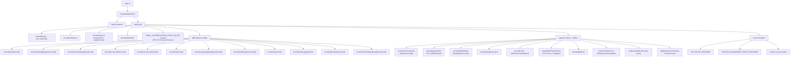

# Angular Architecture

> Purpose: Describes the Angular 20 SPA bootstrap sequence, provider list, feature module structure, and key source files. Audience: frontend developers.

[Home](../INDEX.md) > [Frontend](./) > Angular Architecture

## Overview

The HCS Case Evaluation Portal frontend is an **Angular 20** application built entirely with **standalone components** (no NgModules). It leverages the ABP Commercial Angular framework for authentication, authorization, theming, and multi-tenancy.

## App Bootstrap Sequence

The application bootstraps via `main.ts` using Angular's `bootstrapApplication()`:

```text
main.ts -> bootstrapApplication(AppComponent, appConfig)
```

- **AppComponent** (`app.component.ts`) -- Root component rendering `<abp-loader-bar />`, a bare `<router-outlet />`, `<abp-gdpr-cookie-consent />` and, while offline, `<app-offline-overlay />`. There is no ABP dynamic layout: each page owns its chrome (the external navbar or the internal sidebar shell). It also starts three root services: the pending-appointments badge poll, the session identity watcher and offline detection.
- **appConfig** (`app.config.ts`) -- `ApplicationConfig` providing all framework and feature providers


```mermaid
flowchart TD
    A[main.ts] --> B[bootstrapApplication]
    B --> C[AppComponent]
    B --> D[appConfig]
    D --> E[provideRouter - APP_ROUTES]
    D --> F[provideAnimations]
    D --> G[provideAbpCore<br/>environment + registerLocale]
    D --> H[provideAbpOAuth]
    D --> FIX[CHECK_AUTHENTICATION_STATE_FN_KEY override<br/>ABP 10.0.2 bug workaround]
    D --> I[ABP Module Configs]
    D --> J[LeptonX Theme + utilities]
    D --> K[Route Providers]
    I --> I1[provideIdentityConfig]
    I --> I2[provideSettingManagementConfig]
    I --> I3[provideFeatureManagementConfig]
    I --> I4[provideAccountAdminConfig]
    I --> I5[provideCommercialUiConfig]
    I --> I6[provideGdprConfig]
    I --> I7[provideLanguageManagementConfig]
    I --> I8[provideFileManagementConfig]
    I --> I9[provideSaasConfig]
    I --> I10[provideAuditLoggingConfig]
    I --> I11[provideOpeniddictproConfig]
    I --> I12[provideTextTemplateManagementConfig]
    J --> J1[provideThemeLeptonX<br/>defaultTheme light]
    J --> J2[provideAppInitializer<br/>LPX_THEME backfill]
    J --> J2B[provideAppInitializer<br/>BrandingService.load]
    J --> J3[provideSideMenuLayout]
    J --> J4[provideLogo + withEnvironmentOptions]
    J --> J5[provideAbpThemeShared<br/>HTTP errors + validation]
    J --> J6[provideNgxMask]
    J --> J7[importProvidersFrom RxReactiveFormsModule]
    J --> J8[AddressValidationProvider factory]
    J --> J9[NgbDateParserFormatter<br/>US date format]
    K --> K1[APP_ROUTE_PROVIDER]
    K --> K2[DOCTOR_MANAGEMENT_ROUTE_PROVIDER]
    K --> K3[Feature route providers]
```

## app.config.ts Providers

The `appConfig` providers, in registration order (framework and utility entries first, then one route provider per feature menu):

| Provider | Purpose |
|----------|---------|
| `provideRouter(APP_ROUTES)` | Application routing |
| `APP_ROUTE_PROVIDER` | Home and Dashboard menu registration |
| `provideAnimations()` | Angular animations |
| `provideAbpCore(withOptions({ environment, registerLocaleFn }))` | ABP framework core with environment and locale |
| `provideAbpOAuth()` | OAuth/OIDC authentication |
| `{ provide: CHECK_AUTHENTICATION_STATE_FN_KEY, useValue: fn }` | ABP 10.0.2 bug workaround: `checkAccessToken` crashes in strict mode because it reads `this.injector` instead of the injector parameter. The override clears OAuth storage via the injector argument instead. Remove when upgrading past ABP 10.1.0. |
| `provideIdentityConfig()` | Identity module UI |
| `provideSettingManagementConfig()` | Settings module UI |
| `provideFeatureManagementConfig()` | Feature management UI |
| `provideAccountAdminConfig()` | Account admin pages (Account Public removed 2026-05-15; auth UI now served by AuthServer Razor pages) |
| `provideCommercialUiConfig()` | Commercial UI components (LookupSelect, etc.) |
| `provideThemeLeptonX(withThemeLeptonXOptions(...))` | LeptonX theme; `defaultTheme: 'light'`, system option disabled |
| `provideAppInitializer(...)` | Backfills `LPX_THEME = 'light'` for returning users whose localStorage still holds `'system'` |
| `provideAppInitializer(...)` | Starts `BrandingService.load()`: fetches the current office's name and logo (resolved by subdomain) without blocking boot |
| `provideSideMenuLayout()` | Side-menu shell layout |
| `provideNgxMask()` | Drives SSN on-screen redaction (`[hiddenInput]="true"` shows `*` while typing) |
| `importProvidersFrom(RxReactiveFormsModule)` | Adds named domain validators (`socialSecurityNumber`, conditional required, digit) on top of Angular `Validators.*` |
| `{ provide: AddressValidationProvider, useFactory: fn }` | Injects `SmartyAddressProvider` when `addressValidation.smartyKey` is set, otherwise `MockAddressProvider`. `environment.ts` and `environment.docker.ts` carry an embedded key; `environment.prod.ts` leaves it empty, so a production build uses the mock. As of 2026-09-28 the Smarty subscription has not been renewed. |
| `provideAbpThemeShared(withHttpErrorConfig, withValidationBluePrint)` | Replaces ABP's error screen with the branded `AppHttpErrorComponent` for 401/403/404/500, and sets the validation blueprint |
| `{ provide: NgbDateParserFormatter, useClass: UsDateParserFormatter }` | US date display and typed-date parsing everywhere; must come after `provideAbpThemeShared` to outrank ABP's culture-driven formatter |
| `provideLogo(withEnvironmentOptions(environment))` | Logo configuration |
| `provideGdprConfig(withCookieConsentOptions)` | GDPR cookie/privacy consent |
| `provideLanguageManagementConfig()` | Language management UI |
| `provideFileManagementConfig()` | File management UI |
| `provideSaasConfig()` | SaaS/tenant management UI |
| `provideAuditLoggingConfig()` | Audit log viewer |
| `provideOpeniddictproConfig()` | OpenIddict management UI |
| `provideTextTemplateManagementConfig()` | Text template management |
| Feature route providers | Menu registration for each feature module (see list below) |

Feature route provider tokens, registered at the end of the providers array (as of 2026-09-28):

- `STATES_STATE_ROUTE_PROVIDER`
- `APPOINTMENT_TYPES_APPOINTMENT_TYPE_ROUTE_PROVIDER`
- `APPOINTMENT_STATUSES_APPOINTMENT_STATUS_ROUTE_PROVIDER`
- `APPOINTMENT_DOCUMENT_TYPES_APPOINTMENT_DOCUMENT_TYPE_ROUTE_PROVIDER`
- `APPOINTMENT_LANGUAGES_APPOINTMENT_LANGUAGE_ROUTE_PROVIDER`
- `DOCTOR_MANAGEMENT_ROUTE_PROVIDER`
- `LOCATIONS_LOCATION_ROUTE_PROVIDER`
- `DOCTORS_DOCTOR_ROUTE_PROVIDER`
- `DOCTOR_AVAILABILITIES_DOCTOR_AVAILABILITY_ROUTE_PROVIDER`
- `PATIENTS_PATIENT_ROUTE_PROVIDER`
- `APPOINTMENTS_APPOINTMENT_ROUTE_PROVIDER`
- `APPOINTMENTS_CHANGE_REQUEST_ROUTE_PROVIDER`
- `APPLICANT_ATTORNEYS_APPLICANT_ATTORNEY_ROUTE_PROVIDER`
- `DEFENSE_ATTORNEYS_DEFENSE_ATTORNEY_ROUTE_PROVIDER`
- `CLAIM_EXAMINERS_CLAIM_EXAMINER_ROUTE_PROVIDER`

Re-derive the list with `grep -o "[A-Z_]*ROUTE_PROVIDER" angular/src/app/app.config.ts | sort -u`.

Note: `APP_ROUTE_PROVIDER` (Home/Dashboard menu registration) is also a route provider token but is registered at position 2 in the providers array, immediately after `provideRouter`.

## ABP Angular Packages

| Package | Version |
|---------|---------|
| `@abp/ng.core` | ~10.0.2 |
| `@abp/ng.components` | ~10.0.2 |
| `@abp/ng.oauth` | ~10.0.2 |
| `@abp/ng.theme.shared` | ~10.0.2 |
| `@abp/ng.setting-management` | ~10.0.2 |
| `@abp/ng.feature-management` | ~10.0.2 |
| `@volo/abp.ng.identity` | ~10.0.2 |
| `@volo/abp.ng.saas` | ~10.0.2 |
| `@volo/abp.ng.openiddictpro` | ~10.0.2 |
| `@volo/abp.ng.account` | ~10.0.2 |
| `@volo/abp.ng.audit-logging` | ~10.0.2 |
| `@volo/abp.ng.gdpr` | ~10.0.2 |
| `@volo/abp.ng.language-management` | ~10.0.2 |
| `@volo/abp.ng.file-management` | ~10.0.2 |
| `@volo/abp.ng.text-template-management` | ~10.0.2 |
| `@volo/abp.commercial.ng.ui` | ~10.0.2 |
| `@volosoft/abp.ng.theme.lepton-x` | ~5.0.2 |

## Environment Configuration

Defined in `angular/src/environments/environment.ts`:

```typescript
apis: {
  default: {
    url: 'https://localhost:44327',        // Main API (HttpApi.Host)
    rootNamespace: 'HealthcareSupport.CaseEvaluation',
  },
  AbpAccountPublic: {
    url: 'https://localhost:44368/',       // AuthServer
    rootNamespace: 'AbpAccountPublic',
  },
}

oAuthConfig: {
  issuer: 'https://localhost:44368/',
  clientId: 'CaseEvaluation_App',
  responseType: 'code',
  scope: 'offline_access CaseEvaluation',
  requireHttps: true,
  impersonation: { tenantImpersonation: true, userImpersonation: true },
}
```

## Feature Modules

Feature directories under `angular/src/app/` (excluding `proxy/` and `shared/`), as of 2026-09-28. Re-derive
the list with `ls -d angular/src/app/*/`.

| Area | Directories |
|------|-------------|
| Appointments | `appointments` (list, request wizard, view, change requests), `appointment-documents`, `appointment-packet`, `appointment-change-logs` |
| Reference lists | `appointment-types`, `appointment-statuses`, `appointment-languages`, `appointment-document-types`, `states`, `wcab-offices`, `configuration` (the configuration hub) |
| Doctor management | `doctor-management` (menu provider), `doctors`, `doctor-availabilities`, `locations` |
| People and users | `people`, `patients`, `applicant-attorneys`, `defense-attorneys`, `attorneys`, `claim-examiners`, `users` (the users hub), `internal-users`, `external-users`, `user-queries` |
| Office and host administration | `admin`, `branding`, `host-operators`, `reports` |
| Landing pages | `home` (external), `dashboard` (internal) |
| Public pages (no sign-in) | `public-document-upload`, `public-change-request-consent`, `gdpr-cookie-consent` |
| ABP module wrappers | `files`, `languages` |

## Proxy Services

All proxy services live in `angular/src/app/proxy/` and are auto-generated from the backend API via ABP CLI. Each entity has a `service.ts` + `models.ts` + `index.ts`. The Angular proxy is auto-generated (see `angular/src/app/CLAUDE.md`).

## Styles

The application uses `styles.scss` which includes:

- **LeptonX theme CSS** -- Custom properties for light/dim/dark themes, logo configuration
- **No LeptonX chrome overrides** -- the LeptonX layout is no longer rendered, so the former `externaluser-role` body-class hide rules are retired (see the note in `styles.scss`)
- **Asset references** -- SVG backgrounds for login pages, logos, and getting-started imagery

Third-party style dependencies are loaded via `angular.json` and include ngx-datatable, FontAwesome, Bootstrap Icons, and LeptonX theme CSS bundles.

## Key Source Files

| File | Purpose |
|------|---------|
| `angular/src/main.ts` | Bootstrap entry point |
| `angular/src/app/app.component.ts` | Root component: router outlet plus the always-on globals |
| `angular/src/app/app.config.ts` | All providers and module configuration |
| `angular/src/app/app.routes.ts` | Complete route definitions |
| `angular/src/app/route.provider.ts` | Home/Dashboard menu registration |
| `angular/src/environments/environment.ts` | API URLs and OAuth config |
| `angular/src/styles.scss` | Global styles and LeptonX overrides |

---

**Related Documentation:**

- [Component Patterns](COMPONENT-PATTERNS.md)
- [Routing & Navigation](ROUTING-AND-NAVIGATION.md)
- Proxy Services (the Angular proxy is auto-generated; see `angular/src/app/CLAUDE.md`)
- [Architecture Overview](../architecture/OVERVIEW.md)
