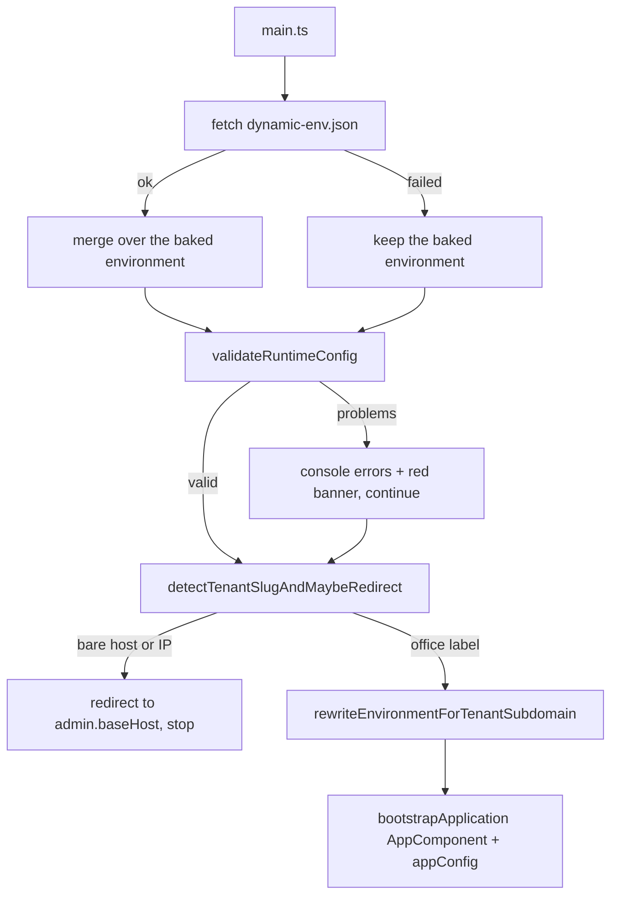

# Angular Architecture

> Purpose: Describes the Angular 20 SPA: how it starts (runtime settings and the office), its providers and
> libraries, its configuration files, feature directories, styles, build tooling and key source files. Audience:
> frontend developers.

[Home](../index.md) > [Frontend](./) > Angular Architecture

## Overview

The Appointment Portal frontend is an **Angular 20** application built entirely with **standalone components** (no NgModules). It leverages the ABP Commercial Angular framework for authentication, authorization, theming, and multi-tenancy.

## App Bootstrap Sequence

`main.ts` does four things before Angular starts, all inside one async function:

1. **Load the runtime settings.** It fetches `dynamic-env.json` (no cache) and merges it over the
   `environment` object that the build baked in. If the fetch fails it logs a warning and keeps the baked
   values. This is what lets one built image serve any deployment: the file is written at container start
   (see [Runtime configuration](#runtime-configuration)).
2. **Check them.** `validateRuntimeConfig` (`src/config-validation.ts`) returns one message per invalid
   setting. The app still starts, but it logs each problem and shows a red banner naming the settings.
   Missing keys are not errors, because the baked environment covers them.
3. **Work out the office from the host name.** `detectTenantSlugAndMaybeRedirect` (`src/tenant-bootstrap.ts`)
   reads the leftmost label of the host name. A bare base host (for example `localhost:4200`), an IPv4
   address or `::1` is redirected to `admin.<baseHost>`, the host administration surface, and bootstrap stops because the page
   is navigating away. `baseHost` comes from `dynamic-env.json` and falls back to `localhost`.
4. **Point the URLs at that office.** `rewriteEnvironmentForTenantSubdomain` inserts the office label after
   the scheme of every first-party URL: `application.baseUrl`, the OAuth `issuer`, `redirectUri` and
   `postLogoutRedirectUri`, and every `apis.*.url`. So `office-a.localhost:4200` talks to
   `office-a.localhost:44368` and `office-a.localhost:44327`. Then it calls `enableProdMode()` when
   `environment.production` is true, and `bootstrapApplication(AppComponent, appConfig)`.


```mermaid
flowchart TD
    A[main.ts] --> B[fetch dynamic-env.json]
    B -->|ok| C[merge over the baked environment]
    B -->|failed| C2[keep the baked environment]
    C --> D[validateRuntimeConfig]
    C2 --> D
    D -->|problems| E[console errors + red banner, continue]
    D -->|valid| F[detectTenantSlugAndMaybeRedirect]
    E --> F
    F -->|bare host or IP| G[redirect to admin.baseHost, stop]
    F -->|office label| H[rewriteEnvironmentForTenantSubdomain]
    H --> I[bootstrapApplication AppComponent + appConfig]
```

- **AppComponent** (`app.component.ts`) -- Root component rendering `<abp-loader-bar />`, a bare `<router-outlet />`, `<abp-gdpr-cookie-consent />` and, while offline, `<app-offline-overlay />`. There is no ABP dynamic layout: each page owns its chrome (the external navbar or the internal sidebar shell). It also starts three root services: the pending-appointments badge poll, the session identity watcher and offline detection.
- **appConfig** (`app.config.ts`) -- `ApplicationConfig` providing all framework and feature providers


```mermaid
flowchart TD
    A[main.ts] --> B[bootstrapApplication]
    B --> C[AppComponent]
    B --> D[appConfig]
    D --> E[provideRouter - APP_ROUTES]
    D --> F[provideAnimations]
    D --> G[provideAbpCore<br/>environment + registerLocale]
    D --> H[provideAbpOAuth]
    D --> FIX[CHECK_AUTHENTICATION_STATE_FN_KEY override<br/>ABP 10.0.2 bug workaround]
    D --> I[ABP Module Configs]
    D --> J[LeptonX Theme + utilities]
    D --> K[Route Providers]
    I --> I1[provideIdentityConfig]
    I --> I2[provideSettingManagementConfig]
    I --> I3[provideFeatureManagementConfig]
    I --> I4[provideAccountAdminConfig]
    I --> I5[provideCommercialUiConfig]
    I --> I6[provideGdprConfig]
    I --> I7[provideLanguageManagementConfig]
    I --> I8[provideFileManagementConfig]
    I --> I9[provideSaasConfig]
    I --> I10[provideAuditLoggingConfig]
    I --> I11[provideOpeniddictproConfig]
    I --> I12[provideTextTemplateManagementConfig]
    J --> J1[provideThemeLeptonX<br/>defaultTheme light]
    J --> J2[provideAppInitializer<br/>LPX_THEME backfill]
    J --> J2B[provideAppInitializer<br/>BrandingService.load]
    J --> J3[provideSideMenuLayout]
    J --> J4[provideLogo + withEnvironmentOptions]
    J --> J5[provideAbpThemeShared<br/>HTTP errors + validation]
    J --> J6[provideNgxMask]
    J --> J7[importProvidersFrom RxReactiveFormsModule]
    J --> J8[AddressValidationProvider factory]
    J --> J9[NgbDateParserFormatter<br/>US date format]
    K --> K1[APP_ROUTE_PROVIDER]
    K --> K2[DOCTOR_MANAGEMENT_ROUTE_PROVIDER]
    K --> K3[Feature route providers]
```

## app.config.ts Providers

The `appConfig` providers, in registration order (framework and utility entries first, then one route provider per feature menu):

| Provider | Purpose |
|----------|---------|
| `provideRouter(APP_ROUTES)` | Application routing |
| `APP_ROUTE_PROVIDER` | Menu registration for Home, Dashboard, User Management (with Invite External User and Internal Users), Change Logs and Reports |
| `provideAnimations()` | Angular animations |
| `provideAbpCore(withOptions({ environment, registerLocaleFn }))` | ABP framework core with environment and locale |
| `provideAbpOAuth()` | OAuth/OIDC authentication |
| `{ provide: CHECK_AUTHENTICATION_STATE_FN_KEY, useValue: fn }` | ABP 10.0.2 bug workaround: `checkAccessToken` crashes in strict mode because it reads `this.injector` instead of the injector parameter. The override clears OAuth storage via the injector argument instead. Remove when upgrading past ABP 10.1.0. |
| `provideIdentityConfig()` | Identity module UI |
| `provideSettingManagementConfig()` | Settings module UI |
| `provideFeatureManagementConfig()` | Feature management UI |
| `provideAccountAdminConfig()` | Account admin pages (Account Public removed 2026-05-15; auth UI now served by AuthServer Razor pages) |
| `provideCommercialUiConfig()` | Commercial UI components (LookupSelect, etc.) |
| `provideThemeLeptonX(withThemeLeptonXOptions(...))` | LeptonX theme; `defaultTheme: 'light'`, system option disabled |
| `provideAppInitializer(...)` | Backfills `LPX_THEME = 'light'` for returning users whose localStorage still holds `'system'` |
| `provideAppInitializer(...)` | Starts `BrandingService.load()`: fetches the current office's name and logo (resolved by subdomain) without blocking boot |
| `provideSideMenuLayout()` | Side-menu shell layout |
| `provideNgxMask()` | Drives SSN on-screen redaction (`[hiddenInput]="true"` shows `*` while typing) |
| `importProvidersFrom(RxReactiveFormsModule)` | Adds named domain validators (`socialSecurityNumber`, conditional required, digit) on top of Angular `Validators.*` |
| `{ provide: AddressValidationProvider, useFactory: fn }` | Injects `SmartyAddressProvider` when `addressValidation.smartyKey` is set, otherwise `MockAddressProvider`. `environment.ts` and `environment.docker.ts` carry an embedded key; `environment.prod.ts` leaves it empty, so a production build uses the mock. As of 2026-09-28 the Smarty subscription has not been renewed. |
| `provideAbpThemeShared(withHttpErrorConfig, withValidationBluePrint)` | Replaces ABP's error screen with the branded `AppHttpErrorComponent` for 401/403/404/500, and sets the validation blueprint |
| `{ provide: NgbDateParserFormatter, useClass: UsDateParserFormatter }` | US date display and typed-date parsing everywhere; must come after `provideAbpThemeShared` to outrank ABP's culture-driven formatter |
| `provideLogo(withEnvironmentOptions(environment))` | Logo configuration |
| `provideGdprConfig(withCookieConsentOptions)` | GDPR cookie/privacy consent |
| `provideLanguageManagementConfig()` | Language management UI |
| `provideFileManagementConfig()` | File management UI |
| `provideSaasConfig()` | SaaS/tenant management UI |
| `provideAuditLoggingConfig()` | Audit log viewer |
| `provideOpeniddictproConfig()` | OpenIddict management UI |
| `provideTextTemplateManagementConfig()` | Text template management |
| Feature route providers | Menu registration for each feature module (see list below) |

Feature route provider tokens, registered at the end of the providers array (as of 2026-09-28):

- `STATES_STATE_ROUTE_PROVIDER`
- `APPOINTMENT_TYPES_APPOINTMENT_TYPE_ROUTE_PROVIDER`
- `APPOINTMENT_STATUSES_APPOINTMENT_STATUS_ROUTE_PROVIDER`
- `APPOINTMENT_DOCUMENT_TYPES_APPOINTMENT_DOCUMENT_TYPE_ROUTE_PROVIDER`
- `APPOINTMENT_LANGUAGES_APPOINTMENT_LANGUAGE_ROUTE_PROVIDER`
- `DOCTOR_MANAGEMENT_ROUTE_PROVIDER`
- `LOCATIONS_LOCATION_ROUTE_PROVIDER`
- `DOCTORS_DOCTOR_ROUTE_PROVIDER`
- `DOCTOR_AVAILABILITIES_DOCTOR_AVAILABILITY_ROUTE_PROVIDER`
- `PATIENTS_PATIENT_ROUTE_PROVIDER`
- `APPOINTMENTS_APPOINTMENT_ROUTE_PROVIDER`
- `APPOINTMENTS_CHANGE_REQUEST_ROUTE_PROVIDER`
- `APPLICANT_ATTORNEYS_APPLICANT_ATTORNEY_ROUTE_PROVIDER`
- `DEFENSE_ATTORNEYS_DEFENSE_ATTORNEY_ROUTE_PROVIDER`
- `CLAIM_EXAMINERS_CLAIM_EXAMINER_ROUTE_PROVIDER`

Re-derive the list with `grep -o "[A-Z_]*ROUTE_PROVIDER" angular/src/app/app.config.ts | sort -u`.

Note: `APP_ROUTE_PROVIDER` (`route.provider.ts`) is also a route provider token but is registered at position 2 in the providers array, immediately after `provideRouter`.

No layout renders these menu registrations: the SPA draws its own sidebar from `internal-nav.config.ts`. They are
still read, because ABP's `permissionGuard` takes a route's policy from the matching registration when the route has
no `data.requiredPolicy` (see [Where a route's permission comes from](ROUTING-AND-NAVIGATION.md#where-a-routes-permission-comes-from)).

## ABP Angular Packages

| Package | Version |
|---------|---------|
| `@abp/ng.core` | ~10.0.2 |
| `@abp/ng.components` | ~10.0.2 |
| `@abp/ng.oauth` | ~10.0.2 |
| `@abp/ng.theme.shared` | ~10.0.2 |
| `@abp/ng.setting-management` | ~10.0.2 |
| `@abp/ng.feature-management` | ~10.0.2 |
| `@volo/abp.ng.identity` | ~10.0.2 |
| `@volo/abp.ng.saas` | ~10.0.2 |
| `@volo/abp.ng.openiddictpro` | ~10.0.2 |
| `@volo/abp.ng.account` | ~10.0.2 |
| `@volo/abp.ng.audit-logging` | ~10.0.2 |
| `@volo/abp.ng.gdpr` | ~10.0.2 |
| `@volo/abp.ng.language-management` | ~10.0.2 |
| `@volo/abp.ng.file-management` | ~10.0.2 |
| `@volo/abp.ng.text-template-management` | ~10.0.2 |
| `@volo/abp.commercial.ng.ui` | ~10.0.2 |
| `@volosoft/abp.ng.theme.lepton-x` | ~5.0.2 |

Other runtime libraries, as declared in `angular/package.json` (the version in brackets is the one
`angular/yarn.lock` resolves):

| Package | Declared | Used for |
|---------|----------|----------|
| `@angular/*` | ~20.3.19 (20.3.19) | The framework |
| `rxjs` | ~7.8.0 (7.8.2) | Observables |
| `zone.js` | ~0.15.0 (0.15.1) | Change detection |
| `angular-oauth2-oidc` | via `@abp/ng.oauth` (20.0.2) | OAuth code flow with PKCE, token storage and refresh |
| `ngx-mask` | ~20.0.3 (20.0.3) | Input masks, including the on-screen SSN mask |
| `@rxweb/reactive-form-validators` | ^13 (13.0.1) | Named validators on top of Angular's `Validators` |
| `ngx-quill` + `quill` | 28.0.2 + 2.0.3 | Rich-text editor in the admin hub's notification templates |
| `@fullcalendar/angular` + `fullcalendar` | ^7.0.2 (7.0.2) | The staff schedule calendar (`/doctor-management/schedule`) |
| `temporal-polyfill` | ^1.0.2 (1.0.2) | Peer dependency of FullCalendar 7; no application code imports it |

## Runtime Configuration

The build bakes an `environment` object into the bundle; at start-up `main.ts` merges `dynamic-env.json` over it
(see [App Bootstrap Sequence](#app-bootstrap-sequence)).

**Build-time files** in `angular/src/environments/`, chosen by the build configuration in `angular/angular.json`:

| Configuration | Environment file | Notes |
|---------------|------------------|-------|
| `production` (the default for `ng build`) | `environment.prod.ts` | `production: true`, empty Smarty key, output hashing on |
| `development` (the default for `ng serve`) | `environment.ts` | No optimization, source maps on |
| `docker` | `environment.docker.ts` | Plain-HTTP localhost URLs for the Docker stack |
| `local` | `environment.local.ts` | Gitignored; `scripts/worktrees/render-config.sh` generates one per worktree |

`environment.ts` holds the local development values: the SPA at `http://localhost:4200`, the API
(`apis.default.url`) at `https://localhost:44327`, and the AuthServer (`oAuthConfig.issuer`, also
`apis.AbpAccountPublic.url`) at `https://localhost:44368/`, with client `CaseEvaluation_App`, response type `code`,
scope `offline_access CaseEvaluation`, and tenant and user impersonation enabled. The file also exports
`addressValidation` (the Smarty key and URLs), which lives outside `environment` so the office rewrite never touches
it.

**Run-time file.** `dynamic-env.json` is served beside `index.html`. Three producers write it:

| Where the SPA runs | Written by | What it sets |
|--------------------|------------|--------------|
| Local `npx serve` of a build | `angular/dynamic-env.json`, copied by the build as an asset | Nothing: the file is `{}`, so the baked environment applies |
| Docker development stack (`dev` target) | `angular/dev-entrypoint.sh`, after it builds | Plain-HTTP localhost URLs on the stack's ports, and the scope `offline_access openid profile email phone CaseEvaluation` |
| Production image (`prod` target, nginx) | `angular/prod-dynamic-env.envsh`, run by the nginx entrypoint at container start | Office-less service URLs from `APP_BASE_HOST`, `APP_SPA_BASE_URL`, `APP_AUTH_URL`, `APP_API_URL`, `APP_NAME` and `APP_REQUIRE_HTTPS`, plus `baseHost` and the same scope |

The production script refuses to start the container when `APP_BASE_HOST` is not a bare host name, while the SPA's
own check (`validateRuntimeConfig`) starts anyway and shows a banner. The service URLs carry no office: the SPA adds
the office label at start-up.

## Feature Modules

Feature directories under `angular/src/app/` (excluding `proxy/` and `shared/`), as of 2026-09-28. Re-derive
the list with `ls -d angular/src/app/*/`.

| Area | Directories |
|------|-------------|
| Appointments | `appointments` (list, request wizard, view, change requests), `appointment-documents`, `appointment-packet`, `appointment-change-logs` |
| Reference lists | `appointment-types`, `appointment-statuses`, `appointment-languages`, `appointment-document-types`, `states`, `wcab-offices`, `configuration` (the configuration hub) |
| Doctor management | `doctor-management` (menu provider), `doctors`, `doctor-availabilities`, `locations` |
| People and users | `people`, `patients`, `applicant-attorneys`, `defense-attorneys`, `attorneys`, `claim-examiners`, `users` (the users hub), `internal-users`, `external-users`, `user-queries` |
| Office and host administration | `admin`, `branding`, `host-operators`, `reports` |
| Landing pages | `home` (external), `dashboard` (internal) |
| Public pages (no sign-in) | `public-document-upload`, `public-change-request-consent`, `gdpr-cookie-consent` |
| Custom pages replacing ABP module pages | `files` (`/file-management`), `languages` (`/language-management`) |

## Proxy Services

The typed API clients live in `angular/src/app/proxy/`, one folder per backend area (58 folders), each with
`<name>.service.ts`, `models.ts` and `index.ts`. They are generated by the ABP CLI from the running API's
`/api/abp/api-definition` endpoint, and `generate-proxy.json` in the same folder is the generator's lock file. Do not
edit them by hand; regenerate after a backend DTO or service change, with `HttpApi.Host` running:

```bash
cd angular
abp generate-proxy -t ng
```

## Styles

`src/styles.scss` is the global stylesheet. It pulls in 24 partials from `src/styles/` with `@use`:

- **Design tokens and brand** -- `_tokens.scss` and `_brand.scss`, the colours, spacing and type the partials share.
- **One partial per screen family** -- for example `_in-shell.scss` (the staff sidebar and top bar), `_ra-wizard.scss`
  (the booking wizard), `_ad-detail.scss` (the appointment detail), `_in-admin.scss` and `_in-users.scss` (the two hubs).
- **Shared pieces** -- utilities, buttons, the file drop zone and loading skeletons.

It also keeps the LeptonX custom properties (theme backgrounds and logo) that the ABP components still read. The
LeptonX layout itself is not rendered.

Third-party stylesheets are listed in the build target's `styles` array in `angular.json`: Quill (snow theme),
ngx-datatable, Font Awesome, the ng-zorro tree, the LeptonX bundles, Bootstrap Icons, Cropper.js, the Uppy core and
dashboard, and the Roboto font.

## Build, Test and Lint

| Task | Command (from `angular/`) | Tooling |
|------|---------------------------|---------|
| Install | `yarn install` | Yarn 4.16.0 (`packageManager` in `package.json`) |
| Build | `npx ng build --configuration development` (production is the default configuration) | `@angular/build:application` (esbuild), TypeScript 5.8.3 |
| Serve locally | `npx serve -s dist/CaseEvaluation/browser -p 4200` | Not `ng serve`: see [ADR-005](../decisions/005-no-ng-serve-vite-workaround.md) |
| Unit tests | `npx ng test --watch=false --browsers=ChromeHeadless` | `@angular/build:karma`, Karma 6.4.4, Jasmine 4.0.1; set `CHROME_BIN` on Windows |
| Lint | `yarn lint` | `@angular-eslint/builder:lint` over `src/**/*.ts` and `src/**/*.html`, ESLint 8.57.1 with the legacy `.eslintrc.json` |
| Format | `yarn format:check` (`yarn format` to fix) | Prettier 3.8.2 |

The production and docker configurations carry bundle budgets: a warning at 2 MB and an error at 2.5 MB for the
initial bundle, and 20 KB and 100 KB for any one component's styles. There is no end-to-end test target.

CI runs the same commands in `.github/workflows/ci.yml`: `Frontend: Build` (`yarn build:prod`), `Frontend: Lint`,
`Frontend: Test` (with `--code-coverage`) and `Frontend: Format Check`, on Node 22. See
[CI Tests and Checks](../devops/CI-TESTS-AND-CHECKS.md).

A commit runs `lint-staged` (Prettier, then ESLint with no warnings allowed, on staged `.ts` and `.html` files) from
the husky hooks in `angular/.husky/`, which `yarn install` activates through the `prepare` script.

## Key Source Files

| File | Purpose |
|------|---------|
| `angular/src/main.ts` | Entry point: loads and checks the runtime settings, resolves the office, then bootstraps |
| `angular/src/tenant-bootstrap.ts` | Office detection from the host name, and the URL rewrite |
| `angular/src/config-validation.ts` | Checks the merged runtime settings |
| `angular/src/app/app.component.ts` | Root component: router outlet plus the always-on globals |
| `angular/src/app/app.config.ts` | All providers and module configuration |
| `angular/src/app/app.routes.ts` | Complete route definitions |
| `angular/src/app/route.provider.ts` | Menu registration for Home, Dashboard, User Management, Change Logs and Reports |
| `angular/src/environments/environment.ts` | Local development URLs, OAuth settings and the address-validation settings |
| `angular/prod-dynamic-env.envsh` | Writes `dynamic-env.json` in the production image |
| `angular/src/styles.scss` | Global stylesheet: the `src/styles/` partials and the LeptonX variables |

---

**Related Documentation:**

- [Component Patterns](COMPONENT-PATTERNS.md)
- [Routing & Navigation](ROUTING-AND-NAVIGATION.md)
- Proxy Services (the Angular proxy is auto-generated; see `angular/src/app/CLAUDE.md`)
- [Architecture Overview](../architecture/OVERVIEW.md)
