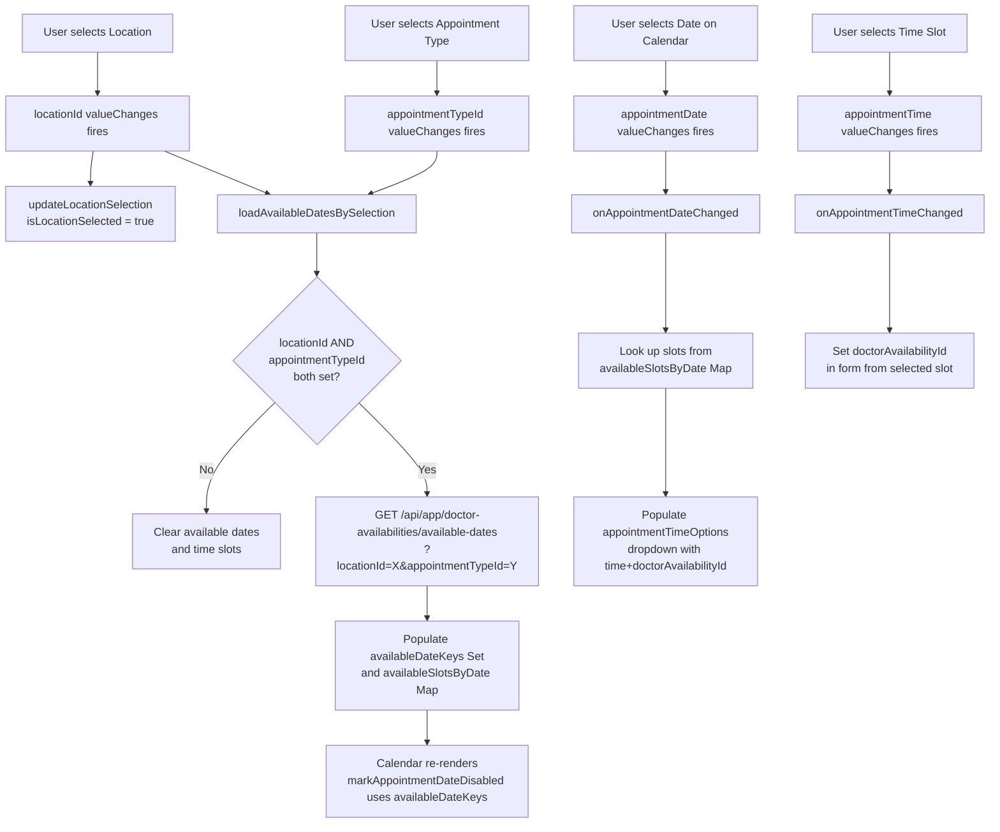
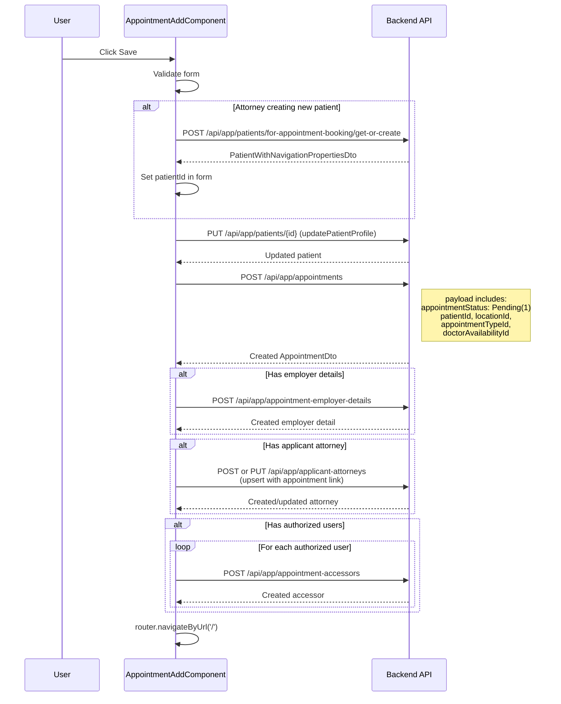

# Appointment Booking Flow

> Purpose: Documents the AppointmentAddComponent booking form: architecture, section split, form fields, cascading logic, and save flow. Audience: frontend developer. Last verified: 2026-06-01 vs main.

[Home](../INDEX.md) > [Frontend](./) > Appointment Booking Flow

## Overview

The `AppointmentAddComponent` is the most complex Angular component in the application. It is a standalone, multi-section form that handles the complete appointment booking workflow including patient lookup/creation, cascading dropdown selections, date/time slot picking, authorized user management, and multi-step API calls on save.

**Source:** `angular/src/app/appointments/appointment-add.component.ts`
**Route:** `/appointments/add` (protected by `authGuard` only -- no permission required)

## Component Architecture

As of 2026-05-13 (#121) the monolithic template was split into 7 standalone section
sub-components. The parent component retains the 66-entry reactive FormGroup (65 scalar
controls + 1 `customFieldsValues` FormArray), every cascade subscription, every
lookup/HTTP call, and every role-based visibility gate. Each section child receives
`@Input() form: FormGroup` and renders template controls only -- no form-building or
HTTP calls live in a section.

```typescript
@Component({
  selector: 'app-appointment-add',
  standalone: true,
  imports: [
    CommonModule,
    ReactiveFormsModule,
    LocalizationPipe,
    TopHeaderNavbarComponent,
    NgxValidateCoreModule,
    AppointmentAddScheduleComponent,
    AppointmentAddPatientDemographicsComponent,
    AppointmentAddAuthorizedUsersComponent,
    AppointmentAddEmployerDetailsComponent,
    AppointmentAddAttorneySectionComponent,
    AppointmentAddClaimInformationComponent,
    AppointmentAddCustomFieldsComponent,
    ConfirmAddressDialogComponent,
  ],
  providers: [
    ListService, AppointmentViewService,
    { provide: NgbDateAdapter, useClass: DateAdapter },
    { provide: NgbTimeAdapter, useClass: TimeAdapter },
  ],
})
export class AppointmentAddComponent { ... }
```

Key injected services: `FormBuilder`, `Router`, `ActivatedRoute`, `ConfigStateService`,
`RestService`, `CustomFieldsService`, `DoctorAvailabilityService`, `ToasterService`,
`ConfirmationService`, `AddressValidationProvider`.

## Form Sections

Each section corresponds to one of the 7 standalone sub-components under
`angular/src/app/appointments/sections/`. The parent scrolls the user through sections
on a single page; there is no NgbNav tab controller. All FormGroup state and cascade
subscriptions stay in the parent.

| # | Component file | Section |
|---|---------------|---------|
| 1 | `appointment-add-schedule.component.ts` | Schedule |
| 2 | `appointment-add-patient-demographics.component.ts` | Patient Demographics |
| 3 | `appointment-add-authorized-users.component.ts` | Authorized Users |
| 4 | `appointment-add-employer-details.component.ts` | Employer Details |
| 5 | `appointment-add-attorney-section.component.ts` | Attorney Section (Applicant + Defense) |
| 6 | `appointment-add-claim-information.component.ts` | Claim Information |
| 7 | `appointment-add-custom-fields.component.ts` | Custom Fields |

### Section 1: Appointment Details (Schedule)

| Field | Type | Validation | Notes |
|-------|------|------------|-------|
| Appointment Type | `LookupSelectComponent` | Required | Lookup from `/api/app/appointments/appointment-type-lookup` |
| Panel Number | Text input | Max 50 chars | Optional |
| Location | `LookupSelectComponent` | Required | Lookup from `/api/app/appointments/location-lookup`; triggers cascading updates |
| Appointment Date | `NgbDatepicker` calendar | Required | Only dates with available slots are selectable |
| Appointment Time | Dropdown | Required | Populated from available slots for selected date |
| Due Date | Date picker | Optional | |
| Appointment Status | Lookup | -- | Auto-set to `AppointmentStatusType.Pending` (1) on create |
| Confirmation Number | Hidden/auto | -- | Defaults to "A"; server generates final `A00001` format |

### Section 2: Patient Demographics

**For Patient role users:** Profile auto-loaded from `/api/app/patients/me`.

**For Attorney role users:** Can search/select existing patient by email or create new inline. Uses `/api/app/patients/for-appointment-booking/by-email` and `/api/app/patients/for-appointment-booking/get-or-create`.

| Field | Type | Validation |
|-------|------|------------|
| First Name | Text | Required, max 50 |
| Last Name | Text | Required, max 50 |
| Middle Name | Text | Max 50 |
| Email | Text (`[readonly]` for Patient role -- not disabled, to preserve validation) | Required, max 50, email format |
| Gender | Dropdown (enum) | Optional |
| Date of Birth | Date picker | Required for all external roles (OLD parity -- live audit 2026-05-07) |
| Cell Phone | Text | Max 12 |
| Phone Number | Text | Max 20 |
| Phone Number Type | Dropdown (Work=28, Home=29) | Optional |
| SSN | Text | Max 20 |
| Street | Text | Max 255 |
| Address | Text | Max 100 |
| City | Text | Max 50 |
| State | Lookup | Optional |
| Zip Code | Text | Max 15 |
| Appointment Language | Lookup | Optional |
| Needs Interpreter | Checkbox | Optional |
| Interpreter Vendor Name | Text | Max 255 |
| Referred By | Text | Max 50 |

### Section 3: Authorized Users

Manages `AppointmentAccessor` records -- other users who can access this appointment.

| Feature | Detail |
|---------|--------|
| Add/Edit modal | `isAuthorizedUserModalOpen` controls visibility |
| User selection | Dropdown of external users loaded from `/api/app/external-users/by-role` |
| Access Type | View (23) or Edit (24) |
| Storage | `appointmentAuthorizedUsers: AppointmentAuthorizedUserDraft[]` array |
| Display | ngx-datatable showing name, email, role, access type |

### Section 4: Employer Details

| Field | Type | Validation |
|-------|------|------------|
| Employer Name | Text | Required, max 255 |
| Employer Occupation | Text | Required, max 255 |
| Employer Phone | Text | Max 12 |
| Employer Street | Text | Max 255 |
| Employer City | Text | Max 255 |
| Employer State | Lookup | Optional |
| Employer Zip | Text | Max 10 |

### Section 5: Attorney Section (Applicant + Defense Attorney)

Both the Applicant Attorney and Defense Attorney sub-sections live in the same section
component (`AppointmentAddAttorneySectionComponent`). Each has an Enabled toggle that
defaults to `true`. Toggling off opens an ABP confirmation modal before clearing
required validators. The Defense Attorney email-search flow uses a separate lookup path
(see `appointments/CLAUDE.md` for DA lookup exclusion note).

| Field | Type | Validation |
|-------|------|------------|
| Enabled toggle | Checkbox | -- |
| First/Last Name | Text | Max 50 each |
| Email | Text | Max 50, required when enabled |
| Firm Name | Text | Max 50 |
| Web Address | Text | Max 100 |
| Phone / Fax | Text | Max 20 / 19 |
| Address fields | Text | Various max lengths |

### Section 6: Claim Information

Rendered by `AppointmentAddClaimInformationComponent` (extracted in #121 phase T4,
2026-05-13). Owns the modal state, the per-injury flat `FormGroup` (`injuryForm`), WCAB
office and state lookup arrays, and the cumulative-injury + Insurance/CE toggle
conditional-validator wiring. The parent retains the `injuryDrafts: AppointmentInjuryDraft[]`
array (consumed at submit by `persistInjuryDraftsIfProvided` and the Bug C email fan-out
resolver). At least one claim entry is required before submit (BUG-043 guard).

The `AppointmentInjuryDraft` and `ClaimExaminerPrefill` types are defined in the section
file and re-exported; the parent imports them for type-checking the submit flow.

**Injury modal FormGroup fields (flat layout -- serialized to nested draft on save):**

| Field key | Required | Notes |
|-----------|----------|-------|
| `injuryCumulative` | No | Cumulative injury toggle |
| `injuryDateOfInjury` | Yes | Date of injury |
| `injuryToDateOfInjury` | No | "To" date for cumulative |
| `injuryClaimNumber` | Yes | Claim number |
| `injuryBodyParts` | Yes (FormArray) | Repeatable structured body-part descriptions (OBS-41) |
| `injuryWcabOfficeId` | No | WCAB office lookup |
| `injuryWcabAdj` | No | WCAB ADJ number |
| `injuryInsuranceEnabled` | -- | Primary Insurance toggle |
| `injuryInsuranceName` | Yes when enabled | Insurance carrier name |
| `injuryInsuranceAttention` | No | Attn line |
| `injuryInsurancePhone` | No | |
| `injuryInsuranceFax` | No | |
| `injuryInsuranceStreet` | No | |
| `injuryInsuranceSte` | No | Suite |
| `injuryInsuranceCity` | No | |
| `injuryInsuranceStateId` | No | |
| `injuryInsuranceZip` | No | |
| `injuryClaimExaminerEnabled` | -- | Claim Examiner toggle |
| `injuryClaimExaminerName` | Yes when enabled | |
| `injuryClaimExaminerEmail` | Yes when enabled, email format | |
| `injuryClaimExaminerPhone` | Yes when enabled | |
| `injuryClaimExaminerFax` | Yes when enabled | |
| `injuryClaimExaminerStreet` | Yes when enabled | |
| `injuryClaimExaminerSte` | No | Suite (optional) |
| `injuryClaimExaminerCity` | Yes when enabled | |
| `injuryClaimExaminerStateId` | Yes when enabled | |
| `injuryClaimExaminerZip` | Yes when enabled | |

When the booker is the Claim Examiner role (and not IT Admin), the parent computes
`claimExaminerPrefillForInjuryModal` and passes it as `@Input() claimExaminerPrefill`
to auto-fill the CE name + email on each new injury modal (OLD parity:
`appointment-add.component.ts:145-149`).

Lookups loaded on first modal open:
- `GET /api/app/appointment-injury-details/wcab-office-lookup` (WCAB offices)
- `GET /api/app/applicant-attorneys/state-lookup` (states for insurance/CE address)

### Section 7: Custom Fields

Rendered by `AppointmentAddCustomFieldsComponent`. Receives `[formArray]="customFieldsArray"`.
The `customFieldsValues` FormArray is rebuilt by the parent's
`loadCustomFieldsForAppointmentType()` each time AppointmentType changes (via
`CustomFieldsService.getActiveForAppointmentType(appointmentTypeId)`). Each child
FormGroup carries static metadata (id, label, type, options, mandatory) plus the
booker-supplied `customFieldValue` control. Field types: Alphanumeric, Numeric, Date,
Time, Tickbox (single- and multi-option). The FormArray is serialized to
`CustomFieldValueInputDto[]` at submit time; empty/whitespace values are dropped.

## Cascading Dropdown Logic



## 3-Day Booking Rule

The component enforces a minimum booking window:

```typescript
readonly minimumBookingDays = 3;
```

- `markAppointmentDateDisabled()` returns `true` for dates within 3 days of today
- `isBeforeMinimumBookingDate()` compares selected date against `today + 3 days`
- `showMinimumBookingRuleWarning` getter displays a warning message when a too-early date is selected
- Warning message: "You can book appointment after 3 days of today's date."

## Calendar Behavior

Uses `NgbDatepicker` from `@ng-bootstrap/ng-bootstrap`:

- **Available dates** are highlighted using `isAvailableAppointmentDate()` custom day template
- **Disabled dates** are controlled by `markAppointmentDateDisabled()`:
  - Dates before minimum booking window (3 days)
  - Dates with no available doctor slots
  - All dates disabled if no appointment type is selected yet
- **Loading state:** `isAvailableDatesLoading` shows spinner while fetching available dates from API

## Save Flow



### Save Steps in Detail

1. **Validate form** -- Check required fields; for Attorney users creating new patients, verify firstName, lastName, email, dateOfBirth
2. **Guard Claim Information** -- `injuryDrafts.length === 0` blocks submit with an inline message (BUG-043; OLD parity)
3. **Standardize addresses** -- `standardizeAddressesBeforeSubmit()` runs USPS validation on patient, employer, AA, and DA address groups; any diff prompts the inline confirm dialog (F2, 2026-05-29)
4. **Create Patient** (if new, Attorney/non-Patient flow) -- `POST /api/app/patients/for-appointment-booking/get-or-create`; falls back to `GET /by-email` if response is empty
5. **Update Patient Profile** -- `PUT /api/app/patients/{id}` with latest form values
6. **Create Appointment** -- `POST /api/app/appointments` with `AppointmentCreateDto`:
   - `appointmentStatus: AppointmentStatusType.Pending` (1)
   - `requestConfirmationNumber: "A"` (server generates final number like A00001)
   - Combined `appointmentDate` (date + time merged)
   - References: `patientId`, `appointmentTypeId`, `locationId`, `doctorAvailabilityId`, `identityUserId`
   - `claimExaminerEmail` sourced from `injuryDrafts[0].claimExaminer.email` (Bug C fix)
   - `customFieldValues: CustomFieldValueInputDto[]` from `serializeCustomFieldValues()`
7. **Create Employer Details** (if provided) -- `POST /api/app/appointment-employer-details`
8. **Upsert Applicant Attorney** (if provided) -- Creates or updates the applicant attorney record and links to appointment
9. **Upsert Defense Attorney** (if provided) -- Same pattern as Applicant Attorney
10. **Persist Injury Drafts** -- `persistInjuryDraftsIfProvided()` iterates `injuryDrafts[]`; for each draft: `POST /api/app/appointment-injury-details`, then optionally `POST /api/app/appointment-primary-insurances` and `POST /api/app/appointment-claim-examiners`
11. **Create Appointment Accessors** (for each authorized user) -- `POST /api/app/appointment-accessors`
12. **Navigate home** -- `router.navigateByUrl('/')`

## Section Layout

All 7 sections are rendered on a single scrollable page (no NgbNav tabs). The user fills
them top to bottom:

1. Schedule (appointment type, location, date/time)
2. Patient Demographics (profile fields)
3. Authorized Users (add/edit modal)
4. Employer Details
5. Attorney Section (Applicant + Defense)
6. Claim Information (add/edit injury modal; at least one entry required)
7. Custom Fields (per-AppointmentType dynamic fields)

The Authorized Users and Claim Information sections each have their own inline modal for
adding / editing records.

## Role-Specific Behavior

| Behavior | Patient Role | Attorney Role (Applicant/Defense) |
|----------|-------------|-----------------------------------|
| Patient loading | Auto-loads own profile via `/api/app/patients/me` | Can search by email or create new |
| Email field | `[readonly]` (pre-filled) | Enabled for search/entry |
| Patient selection | Not applicable (always self) | Dropdown of existing patients + new |
| Applicant Attorney section | Visible, editable | Auto-populated if user is Applicant Attorney |
| `TopHeaderNavbarComponent` | Shown (external user layout) | Shown (external user layout) |

## Form Validation

- **Reactive Forms** with `Validators.required`, `Validators.maxLength()`, `Validators.email`
- **ngx-validate** (`@ngx-validate/core`) for validation message rendering
- **Custom validation:** `isFieldInvalid()` helper checks `invalid && (dirty || touched)`
- **Cross-field:** Attorney flow requires firstName + lastName + email + dateOfBirth when creating new patient

---

**Related Documentation:**
- [Application Services](../backend/APPLICATION-SERVICES.md)
- [Appointment Lifecycle](../business-domain/APPOINTMENT-LIFECYCLE.md)
- [Doctor Availability](../business-domain/DOCTOR-AVAILABILITY.md)
