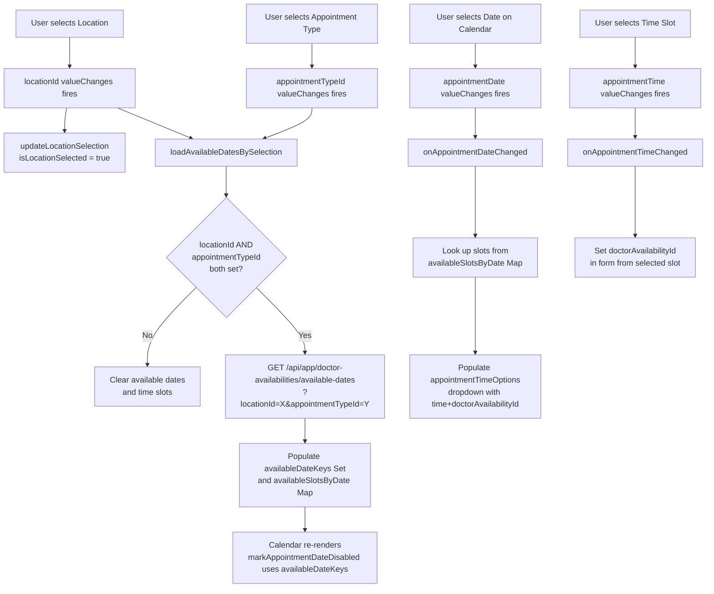
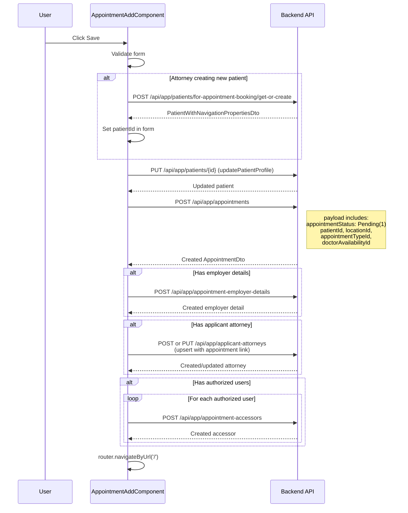
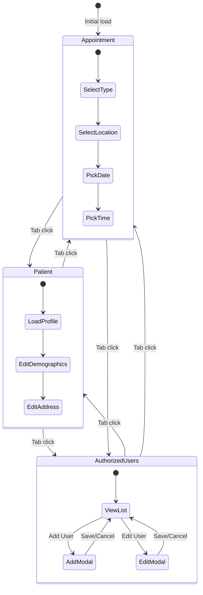

# Appointment Booking Flow

[Home](../INDEX.md) > [Frontend](./) > Appointment Booking Flow

## Overview

The `AppointmentAddComponent` is the most complex Angular component in the application. It is a standalone, multi-section form that handles the complete appointment booking workflow including patient lookup/creation, cascading dropdown selections, date/time slot picking, authorized user management, and multi-step API calls on save.

**Source:** `angular/src/app/appointments/appointment-add.component.ts`
**Route:** `/appointments/add` (protected by `authGuard` only -- no permission required)

## Component Architecture

```typescript
@Component({
  selector: 'app-appointment-add',
  standalone: true,
  imports: [
    CommonModule, FormsModule, ReactiveFormsModule,
    NgxDatatableModule, LocalizationPipe, TopHeaderNavbarComponent,
    LookupSelectComponent, NgxValidateCoreModule,
    NgbDatepickerModule, NgbNavModule,
  ],
  providers: [
    ListService, AppointmentViewService,
    { provide: NgbDateAdapter, useClass: DateAdapter },
    { provide: NgbTimeAdapter, useClass: TimeAdapter },
  ],
})
export class AppointmentAddComponent { ... }
```

Key injected services: `FormBuilder`, `Router`, `ConfigStateService`, `RestService`.

## Form Sections

The form uses **NgbNav** (Bootstrap tab navigation) with `activeTabId` controlling the visible section:

### Tab 1: Appointment Details (`activeTabId = 'appointment'`)

| Field | Type | Validation | Notes |
|-------|------|------------|-------|
| Appointment Type | `LookupSelectComponent` | Required | Lookup from `/api/app/appointments/appointment-type-lookup` |
| Panel Number | Text input | Max 50 chars | Optional |
| Location | `LookupSelectComponent` | Required | Lookup from `/api/app/appointments/location-lookup`; triggers cascading updates |
| Appointment Date | `NgbDatepicker` calendar | Required | Only dates with available slots are selectable |
| Appointment Time | Dropdown | Required | Populated from available slots for selected date |
| Due Date | Date picker | Optional | |
| Appointment Status | Lookup | -- | Auto-set to `AppointmentStatusType.Pending` (1) on create |
| Confirmation Number | Hidden/auto | -- | Defaults to "A"; server generates final `A00001` format |

### Tab 2: Patient Demographics (`activeTabId = 'patient'`)

**For Patient role users:** Profile auto-loaded from `/api/app/patients/me`.

**For Attorney role users:** Can search/select existing patient by email or create new inline. Uses `/api/app/patients/for-appointment-booking/by-email` and `/api/app/patients/for-appointment-booking/get-or-create`.

| Field | Type | Validation |
|-------|------|------------|
| First Name | Text | Required, max 50 |
| Last Name | Text | Required, max 50 |
| Middle Name | Text | Max 50 |
| Email | Text (disabled for Patient role) | Required, max 50, email format |
| Gender | Dropdown (enum) | Optional |
| Date of Birth | Date picker | Optional (required if creating new patient as Attorney) |
| Cell Phone | Text | Max 12 |
| Phone Number | Text | Max 20 |
| Phone Number Type | Dropdown (Work=28, Home=29) | Optional |
| SSN | Text | Max 20 |
| Street | Text | Max 255 |
| Address | Text | Max 100 |
| City | Text | Max 50 |
| State | Lookup | Optional |
| Zip Code | Text | Max 15 |
| Appointment Language | Lookup | Optional |
| Needs Interpreter | Checkbox | Optional |
| Interpreter Vendor Name | Text | Max 255 |
| Referred By | Text | Max 50 |

### Tab 3: Authorized Users (`activeTabId = 'authorized-users'`)

Manages `AppointmentAccessor` records -- other users who can access this appointment.

| Feature | Detail |
|---------|--------|
| Add/Edit modal | `isAuthorizedUserModalOpen` controls visibility |
| User selection | Dropdown of external users loaded from `/api/app/external-users/by-role` |
| Access Type | View (23) or Edit (24) |
| Storage | `appointmentAuthorizedUsers: AppointmentAuthorizedUserDraft[]` array |
| Display | ngx-datatable showing name, email, role, access type |

### Tab 4: Employer Details (within the form)

| Field | Type | Validation |
|-------|------|------------|
| Employer Name | Text | Max 255 |
| Employer Occupation | Text | Max 255 |
| Employer Phone | Text | Max 12 |
| Employer Street | Text | Max 255 |
| Employer City | Text | Max 255 |
| Employer State | Lookup | Optional |
| Employer Zip | Text | Max 10 |

### Applicant Attorney Section

| Field | Type | Validation |
|-------|------|------------|
| Enabled toggle | Checkbox | -- |
| First/Last Name | Text | Max 50 each |
| Email | Text | Max 50 |
| Firm Name | Text | Max 50 |
| Web Address | Text | Max 100 |
| Phone / Fax | Text | Max 20 / 19 |
| Address fields | Text | Various max lengths |

## Cascading Dropdown Logic



## 3-Day Booking Rule

The component enforces a minimum booking window:

```typescript
readonly minimumBookingDays = 3;
```

- `markAppointmentDateDisabled()` returns `true` for dates within 3 days of today
- `isBeforeMinimumBookingDate()` compares selected date against `today + 3 days`
- `showMinimumBookingRuleWarning` getter displays a warning message when a too-early date is selected
- Warning message: "You can book appointment after 3 days of today's date."

## Calendar Behavior

Uses `NgbDatepicker` from `@ng-bootstrap/ng-bootstrap`:

- **Available dates** are highlighted using `isAvailableAppointmentDate()` custom day template
- **Disabled dates** are controlled by `markAppointmentDateDisabled()`:
  - Dates before minimum booking window (3 days)
  - Dates with no available doctor slots
  - All dates disabled if no appointment type is selected yet
- **Loading state:** `isAvailableDatesLoading` shows spinner while fetching available dates from API

## Save Flow



### Save Steps in Detail

1. **Validate form** -- Check required fields; for Attorney users creating new patients, verify firstName, lastName, email, dateOfBirth
2. **Create Patient** (if new, Attorney flow) -- `POST /api/app/patients/for-appointment-booking/get-or-create` with patient data; falls back to `GET /by-email` if response is empty
3. **Update Patient Profile** -- `PUT /api/app/patients/{id}` with latest form values
4. **Create Appointment** -- `POST /api/app/appointments` with `AppointmentCreateDto`:
   - `appointmentStatus: AppointmentStatusType.Pending` (1)
   - `requestConfirmationNumber: "A"` (server generates final number like A00001)
   - Combined `appointmentDate` (date + time merged)
   - References: `patientId`, `appointmentTypeId`, `locationId`, `doctorAvailabilityId`, `identityUserId`
5. **Create Employer Details** (if provided) -- `POST /api/app/appointment-employer-details`
6. **Upsert Applicant Attorney** (if provided) -- Creates or updates the applicant attorney record and links to appointment
7. **Create Appointment Accessors** (for each authorized user) -- `POST /api/app/appointment-accessors`
8. **Navigate home** -- `router.navigateByUrl('/')`

## Form Tab Navigation



## Role-Specific Behavior

| Behavior | Patient Role | Attorney Role (Applicant/Defense) |
|----------|-------------|-----------------------------------|
| Patient loading | Auto-loads own profile via `/api/app/patients/me` | Can search by email or create new |
| Email field | Disabled (pre-filled) | Enabled for search/entry |
| Patient selection | Not applicable (always self) | Dropdown of existing patients + new |
| Applicant Attorney section | Visible, editable | Auto-populated if user is Applicant Attorney |
| `TopHeaderNavbarComponent` | Shown (external user layout) | Shown (external user layout) |

## Form Validation

- **Reactive Forms** with `Validators.required`, `Validators.maxLength()`, `Validators.email`
- **ngx-validate** (`@ngx-validate/core`) for validation message rendering
- **Custom validation:** `isFieldInvalid()` helper checks `invalid && (dirty || touched)`
- **Cross-field:** Attorney flow requires firstName + lastName + email + dateOfBirth when creating new patient

---

**Related Documentation:**
- [Application Services](../backend/APPLICATION-SERVICES.md)
- [Appointment Lifecycle](../business-domain/APPOINTMENT-LIFECYCLE.md)
- [Doctor Availability](../business-domain/DOCTOR-AVAILABILITY.md)
