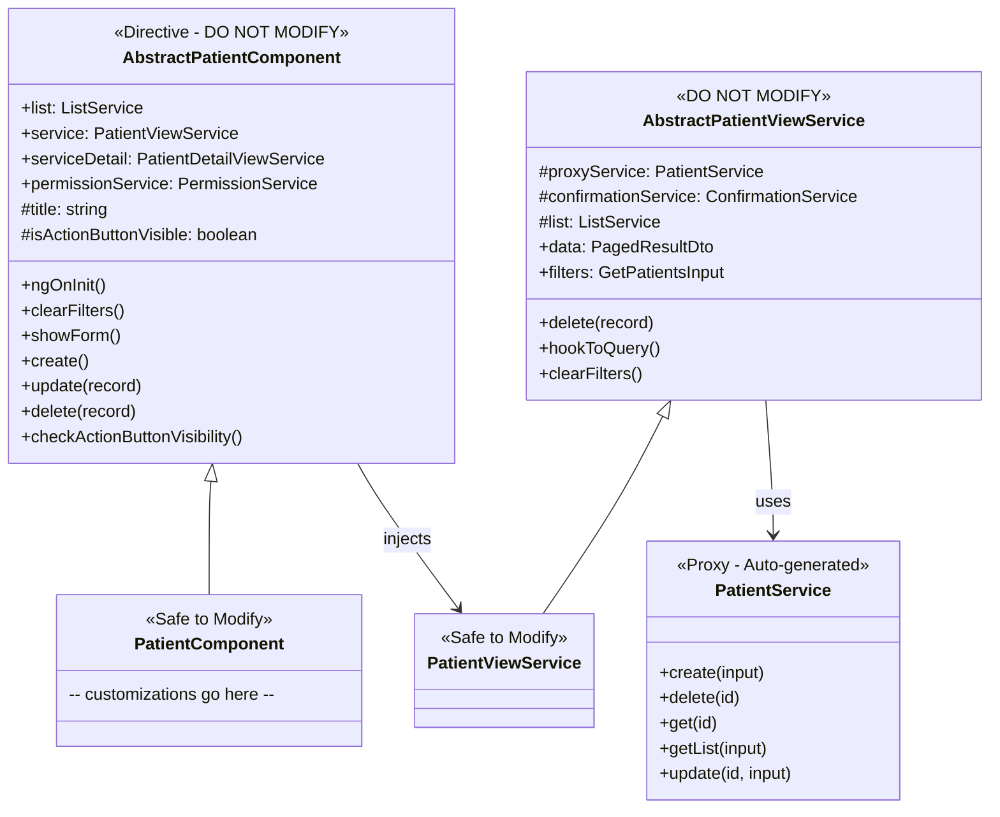
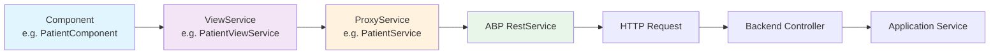

# Component Patterns

[Home](../INDEX.md) > [Frontend](./) > Component Patterns

## Overview

The Angular frontend follows two distinct component patterns: **ABP Suite-generated** components for standard CRUD entities and **custom components** for specialized workflows. All components are standalone (no NgModules).

## ABP Suite Abstract/Concrete Pattern

For each entity (e.g., Patient, Appointment, Doctor), ABP Suite generates a set of paired files that follow an abstract/concrete inheritance pattern:

### Generated File Structure

For an entity named `Patient`, Suite generates:

| File | Purpose | Modify? |
|------|---------|---------|
| `patient.abstract.component.ts` | Base class: list management, CRUD actions, filter handling | **DO NOT MODIFY** -- overwritten on regeneration |
| `patient.component.ts` | Concrete class extending abstract; place customizations here | Safe to modify |
| `patient-detail.component.ts` | Detail/edit modal component | Safe to modify |
| `patient.abstract.service.ts` | Abstract service: ListService hooks, proxy calls | **DO NOT MODIFY** |
| `patient.service.ts` | Concrete service extending abstract | Safe to modify |
| `patient-detail.abstract.service.ts` | Abstract detail service | **DO NOT MODIFY** |
| `patient-detail.service.ts` | Concrete detail service | Safe to modify |

### Inheritance Diagram



### Key Points

- The `@Directive()` decorator on abstract components makes them injectable containers without a template
- Abstract components use `inject()` for dependency injection (Angular 20 pattern, no constructor injection)
- The concrete class (`PatientComponent`) extends the abstract and is the class referenced in routes
- Permission checks (e.g., `CaseEvaluation.Patients.Edit`, `CaseEvaluation.Patients.Delete`) determine action button visibility

## Service Layer Flow



**Detailed flow for a list query:**

1. **Component** calls `service.hookToQuery()` in `ngOnInit()`
2. **ViewService** (`AbstractPatientViewService.hookToQuery()`) connects ABP `ListService` to the proxy
3. **ListService** manages pagination, sorting, and filter state; calls `proxyService.getList()` on changes
4. **ProxyService** (`PatientService`) uses `RestService.request()` to make the HTTP call
5. **RestService** resolves the API URL from `environment.apis.default.url` and adds auth headers
6. Response flows back: HTTP -> RestService -> ProxyService -> ViewService -> Component template

## List Page Pattern

All ABP Suite list pages follow a consistent structure:

- **ABP ListService** for pagination state (skipCount, maxResultCount, sorting, filter)
- **ngx-datatable** (`@swimlane/ngx-datatable`) for table rendering with `[list]` directive binding
- **ABP NgxDatatableDefaultDirective** and **NgxDatatableListDirective** for ABP integration
- **Sidebar or modal** for create/edit forms (via `PatientDetailViewService.showForm()`)
- **Filter panel** with collapsible accordion for advanced filtering
- **ABP ConfirmationService** for delete confirmations

## Custom (Non-Suite) Components

These components are hand-written and do not follow the abstract/concrete pattern:

| Component | Location | Purpose |
|-----------|----------|---------|
| `AppointmentAddComponent` | `appointments/appointment-add.component.ts` | Multi-section booking form (most complex component) |
| `AppointmentViewComponent` | `appointments/appointment/components/appointment-view.component.ts` | Read-only appointment detail |
| `DoctorAvailabilityGenerateComponent` | `doctor-availabilities/.../doctor-availability-generate.component.ts` | Bulk generate availability slots |
| `PatientProfileComponent` | `patients/patient/components/patient-profile.component.ts` | Self-service patient profile editing |
| `TopHeaderNavbarComponent` | `shared/components/top-header-navbar/` | Custom header for external users |
| `HomeComponent` | `home/home.component.ts` | Landing page with role-based rendering |
| `DashboardComponent` | `dashboard/dashboard.component.ts` | Admin dashboard |

## Shared Components

### TopHeaderNavbarComponent

A standalone component used in the external-user (Patient/Attorney) layout:

```typescript
@Component({
  selector: 'app-top-header-navbar',
  standalone: true,
  imports: [CommonModule],
})
export class TopHeaderNavbarComponent {
  @Input() tenantName = '';
  @Input() userName = '';
  @Input() roleName = '';
  @Input() showProfile = true;
  @Input() showHelp = true;
  @Input() showLogout = true;

  @Output() profileClick = new EventEmitter<void>();
  @Output() helpClick = new EventEmitter<void>();
  @Output() logoutClick = new EventEmitter<void>();
}
```

Used by `HomeComponent` and `AppointmentAddComponent` to provide a simplified navigation header for external users, replacing the full LeptonX topbar.

## Entities Using Suite Pattern

All of the following use the full abstract/concrete generation pattern:

- Appointments
- Patients
- Doctors
- Doctor Availabilities
- Locations
- WCAB Offices
- States
- Appointment Types
- Appointment Statuses
- Appointment Languages
- Applicant Attorneys

---

**Related Documentation:**
- [Angular Architecture](ANGULAR-ARCHITECTURE.md)
- [ABP Framework](../architecture/ABP-FRAMEWORK.md)
- [Proxy Services](PROXY-SERVICES.md)
