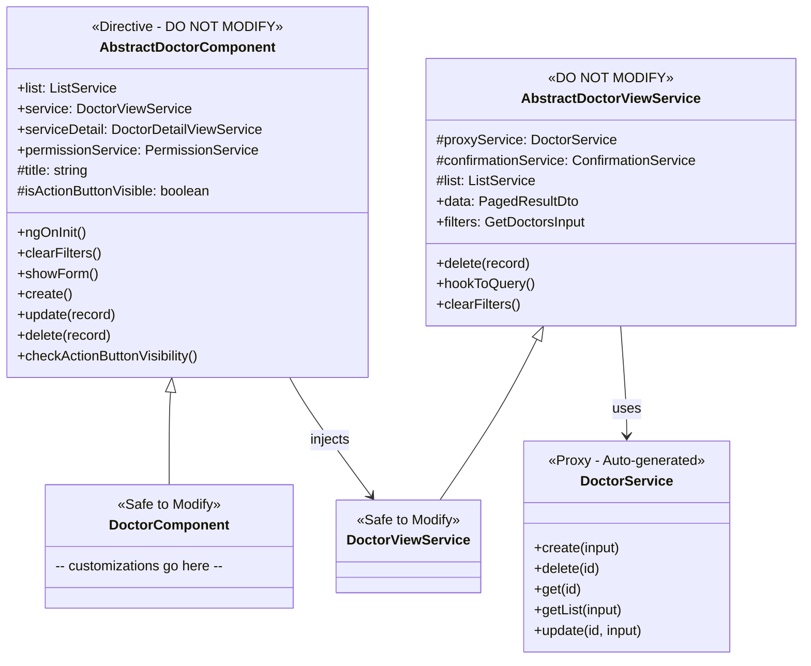
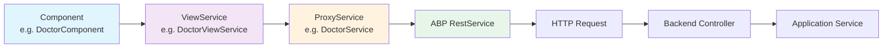

# Component Patterns

> Purpose: Describes the two Angular component patterns (ABP Suite abstract/concrete and custom hand-written) used across the patient portal frontend. Audience: frontend developers.

[Home](../index.md) > [Frontend](./) > Component Patterns

## Overview

The Angular frontend follows two distinct component patterns: **ABP Suite-generated** components for standard CRUD entities and **custom components** for specialized workflows. All components are standalone (no NgModules).

## ABP Suite Abstract/Concrete Pattern

For each entity, ABP Suite generates a set of paired files that follow an abstract/concrete inheritance pattern. Only the Doctor list page (`doctor-management/doctors`) still uses it: the other entities' generated pages were replaced by custom screens, and their unused generated view services were removed in #1062.

### Generated File Structure

For an entity named `Doctor`, Suite generates:

| File | Purpose | Modify? |
|------|---------|---------|
| `doctor.abstract.component.ts` | Base class: list management, CRUD actions, filter handling | **DO NOT MODIFY** -- overwritten on regeneration |
| `doctor.component.ts` | Concrete class extending abstract; place customizations here | Safe to modify |
| `doctor-detail.component.ts` | Detail/edit modal component | Safe to modify |
| `doctor.abstract.service.ts` | Abstract service: ListService hooks, proxy calls | **DO NOT MODIFY** |
| `doctor.service.ts` | Concrete service extending abstract | Safe to modify |
| `doctor-detail.abstract.service.ts` | Abstract detail service | **DO NOT MODIFY** |
| `doctor-detail.service.ts` | Concrete detail service | Safe to modify |

### Inheritance Diagram

```mermaid
classDiagram
    class AbstractDoctorComponent {
        <<Directive - DO NOT MODIFY>>
        +list: ListService
        +service: DoctorViewService
        +serviceDetail: DoctorDetailViewService
        +permissionService: PermissionService
        #title: string
        #isActionButtonVisible: boolean
        +ngOnInit()
        +clearFilters()
        +showForm()
        +create()
        +update(record)
        +delete(record)
        +checkActionButtonVisibility()
    }

    class DoctorComponent {
        <<Safe to Modify>>
        -- customizations go here --
    }

    class AbstractDoctorViewService {
        <<DO NOT MODIFY>>
        #proxyService: DoctorService
        #confirmationService: ConfirmationService
        #list: ListService
        +data: PagedResultDto
        +filters: GetDoctorsInput
        +delete(record)
        +hookToQuery()
        +clearFilters()
    }

    class DoctorViewService {
        <<Safe to Modify>>
    }

    class DoctorService {
        <<Proxy - Auto-generated>>
        +create(input)
        +delete(id)
        +get(id)
        +getList(input)
        +update(id, input)
    }

    AbstractDoctorComponent <|-- DoctorComponent
    AbstractDoctorViewService <|-- DoctorViewService
    AbstractDoctorViewService --> DoctorService : uses
    AbstractDoctorComponent --> DoctorViewService : injects
```

### Key Points

- The `@Directive()` decorator on abstract components makes them injectable containers without a template
- Abstract components use `inject()` for dependency injection (Angular 20 pattern, no constructor injection)
- The concrete class (`DoctorComponent`) extends the abstract and is the class referenced in routes
- Permission checks (e.g., `CaseEvaluation.Doctors.Edit`, `CaseEvaluation.Doctors.Delete`) determine action button visibility

## Service Layer Flow

```mermaid
flowchart LR
    A[Component<br/>e.g. DoctorComponent] --> B[ViewService<br/>e.g. DoctorViewService]
    B --> C[ProxyService<br/>e.g. DoctorService]
    C --> D[ABP RestService]
    D --> E[HTTP Request]
    E --> F[Backend Controller]
    F --> G[Application Service]

    style A fill:#e1f5fe
    style B fill:#f3e5f5
    style C fill:#fff3e0
    style D fill:#e8f5e9
```

**Detailed flow for a list query:**

1. **Component** calls `service.hookToQuery()` in `ngOnInit()`
2. **ViewService** (`AbstractDoctorViewService.hookToQuery()`) connects ABP `ListService` to the proxy
3. **ListService** manages pagination, sorting, and filter state; calls `proxyService.getList()` on changes
4. **ProxyService** (`DoctorService`) uses `RestService.request()` to make the HTTP call
5. **RestService** resolves the API URL from `environment.apis.default.url` and adds auth headers
6. Response flows back: HTTP -> RestService -> ProxyService -> ViewService -> Component template

## List Page Pattern

All ABP Suite list pages follow a consistent structure:

- **ABP ListService** for pagination state (skipCount, maxResultCount, sorting, filter)
- **ngx-datatable** (`@swimlane/ngx-datatable`) for table rendering with `[list]` directive binding
- **ABP NgxDatatableDefaultDirective** and **NgxDatatableListDirective** for ABP integration
- **Sidebar or modal** for create/edit forms (via `DoctorDetailViewService.showForm()`)
- **Filter panel** with collapsible accordion for advanced filtering
- **ABP ConfirmationService** for delete confirmations

## Custom (Non-Suite) Components

These components are hand-written and do not follow the abstract/concrete pattern:

A selection of the main ones (paths under `angular/src/app/`):

| Component | Location | Purpose |
|-----------|----------|---------|
| `AppointmentWizardComponent` | `appointments/wizard/appointment-wizard.component.ts` | The stepped booking wizard at `/appointments/request`, for external users and staff alike. It **extends** `AppointmentAddComponent` (`appointments/appointment-add.component.ts`), which no route loads any more and which survives as the base class holding the form state and cascades |
| `InternalAppointmentsComponent` | `appointments/appointment/components/internal-appointments.component.ts` | The staff appointment queue at `/appointments` |
| `InternalAppointmentDetailComponent` | `appointments/appointment/components/internal-appointment-detail.component.ts` | Appointment detail for staff (`/appointments/view/:id` inside the shell): status banner, office actions and edit mode |
| `ExternalAppointmentDetailComponent` | `appointments/appointment/components/external-appointment-detail.component.ts` | Read-only appointment detail for external users |
| `AppointmentViewComponent` | `appointments/appointment/components/appointment-view.component.ts` | Not a page: a selector-less `@Directive()` base class holding the shared load, form and actions. Both detail pages above **extend** it |
| `InternalConfigurationComponent` | `configuration/internal-configuration.component.ts` | One hub for the reference lists (states, appointment types, statuses, document types, languages), one section per route |
| `InternalPeopleComponent` | `people/internal-people.component.ts` | One hub for patients, applicant attorneys, defense attorneys and claim examiners, one section per route |
| `InternalGenerateSlotsComponent` | `doctor-availabilities/doctor-availability/internal-generate-slots.component.ts` | Bulk generation of availability slots |
| `PatientProfileRedesignComponent` | `patients/patient/components/patient-profile-redesign.component.ts` | The routed My Profile page; extends `PatientProfileComponent`, which holds the form logic |
| `ExternalHomeComponent` | `home/external-home.component.ts` | External users' landing page |
| `InternalDashboardComponent` | `dashboard/internal-dashboard.component.ts` | Staff dashboard |
| `InternalShellLayoutComponent` | `shared/components/internal-shell/internal-shell-layout.component.ts` | Sidebar and top bar around every staff page |
| `AppointmentPacketComponent` | `appointment-packet/appointment-packet.component.ts` | Per-kind packet status display with download and regenerate actions; polls every 5 s while any packet is Generating |

## Shared Components

### ExternalNavbarComponent

`shared/components/external-navbar/external-navbar.component.ts` is the top bar of every external page: the
external home, the external appointment detail, the booking wizard (for external bookers) and the three
profile pages. It takes the office logo and name, the user's name, role and email, and notifications as
inputs, and emits `profileClick`, `documentsClick`, `helpClick` and `logoutClick` for the page to handle.

The older `TopHeaderNavbarComponent` (`shared/components/top-header-navbar/`) is referenced only by the
template of `PatientProfileComponent`, which no route renders directly.

## Entities Using Suite Pattern

Only **Doctors** (`doctor-management/doctors`) still uses the full abstract/concrete pattern.

The other Suite-generated entities (Appointments, Patients, Doctor Availabilities, Locations, WCAB Offices,
States, Appointment Types, Statuses and Languages, Applicant and Defense Attorneys) had their generated
list and detail pages replaced by custom screens, and their unused generated view services were
removed in #1062. Their `*-routes.ts` files remain and load the custom screens; for example, States
load `InternalConfigurationComponent`.

---

**Related Documentation:**

- [Angular Architecture](ANGULAR-ARCHITECTURE.md)
- [ABP Framework](../architecture/ABP-FRAMEWORK.md)
