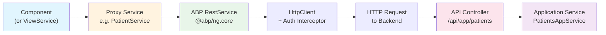

# Proxy Services

[Home](../INDEX.md) > [Frontend](./) > Proxy Services

## Overview

Proxy services are TypeScript classes auto-generated by the ABP CLI that provide typed HTTP clients for calling backend API endpoints. They live in `angular/src/app/proxy/` and use ABP's `RestService` to manage HTTP requests, authentication, and API URL resolution.

## Location

```
angular/src/app/proxy/
  appointments/
    appointment.service.ts      # AppointmentService
    models.ts                   # AppointmentDto, AppointmentCreateDto, etc.
    index.ts                    # Barrel export
  patients/
    patient.service.ts          # PatientService
    models.ts                   # PatientDto, PatientCreateDto, etc.
    index.ts
  doctors/
    doctor.service.ts           # DoctorService
    doctor-tenant.service.ts    # DoctorTenantService (tenant management for doctors)
    models.ts
    index.ts
  doctor-availabilities/
    doctor-availability.service.ts
    models.ts
    index.ts
  locations/
    ...
  states/
    ...
  wcab-offices/
    ...
  appointment-types/
    ...
  appointment-statuses/
    ...
  appointment-languages/
    ...
  applicant-attorneys/
    ...
  users/
    user-extended.service.ts    # UserExtendedService (custom identity user operations)
    index.ts
  books/
    ...
  enums/
    appointment-status-type.enum.ts
    booking-status.enum.ts
    gender.enum.ts
    phone-number-type.enum.ts
    index.ts
  shared/
    models.ts                   # LookupDto, LookupRequestDto, etc.
    index.ts
  volo/
    abp/                        # ABP identity models
    saas/                       # SaaS tenant models
  generate-proxy.json           # ABP proxy generation config
  index.ts                      # Root barrel export
```

## Per-Entity Structure

Each entity proxy folder contains three files:

| File | Purpose |
|------|---------|
| `service.ts` | Injectable service class with CRUD + lookup methods |
| `models.ts` | TypeScript interfaces matching backend DTOs |
| `index.ts` | Barrel export for the folder |

## How Proxy Services Work

All proxy services follow the same pattern:

1. **Injectable** with `providedIn: 'root'` (singleton)
2. **Inject** `RestService` from `@abp/ng.core`
3. **Set** `apiName = 'Default'` (maps to `environment.apis.default.url`)
4. **Methods** use `restService.request<TInput, TOutput>()` with request config

### Data Flow



**URL resolution:** `RestService` reads the `apiName` property (e.g., `'Default'`) and resolves it against `environment.apis.default.url` (e.g., `https://localhost:44327`). The request URL path (e.g., `/api/app/patients`) is appended to this base.

## Example: PatientService

```typescript
@Injectable({ providedIn: 'root' })
export class PatientService {
  private restService = inject(RestService);
  apiName = 'Default';

  create = (input: PatientCreateDto, config?: Partial<Rest.Config>) =>
    this.restService.request<any, PatientDto>(
      { method: 'POST', url: '/api/app/patients', body: input },
      { apiName: this.apiName, ...config },
    );

  get = (id: string, config?: Partial<Rest.Config>) =>
    this.restService.request<any, PatientDto>(
      { method: 'GET', url: `/api/app/patients/${id}` },
      { apiName: this.apiName, ...config },
    );

  getList = (input: GetPatientsInput, config?: Partial<Rest.Config>) =>
    this.restService.request<any, PagedResultDto<PatientWithNavigationPropertiesDto>>(
      { method: 'GET', url: '/api/app/patients', params: { ...input } },
      { apiName: this.apiName, ...config },
    );

  update = (id: string, input: PatientUpdateDto, config?: Partial<Rest.Config>) =>
    this.restService.request<any, PatientDto>(
      { method: 'PUT', url: `/api/app/patients/${id}`, body: input },
      { apiName: this.apiName, ...config },
    );

  delete = (id: string, config?: Partial<Rest.Config>) =>
    this.restService.request<any, void>(
      { method: 'DELETE', url: `/api/app/patients/${id}` },
      { apiName: this.apiName, ...config },
    );
}
```

## Enum Proxies

Enum proxy files define TypeScript enums matching backend C# enums and provide `mapEnumToOptions()` for use in dropdown selects:

| File | Enum | Values |
|------|------|--------|
| `appointment-status-type.enum.ts` | `AppointmentStatusType` | Pending(1), Approved(2), Rejected(3), NoShow(4), CancelledNoBill(5), CancelledLate(6), RescheduledNoBill(7), RescheduledLate(8), CheckedIn(9), CheckedOut(10), Billed(11), RescheduleRequested(12), CancellationRequested(13) |
| `booking-status.enum.ts` | `BookingStatus` | Available(8), Booked(9), Reserved(10) |
| `gender.enum.ts` | `Gender` | Male(1), Female(2), Other(3) |
| `phone-number-type.enum.ts` | `PhoneNumberType` | Work(28), Home(29) |

Each enum file exports a `*Options` constant (e.g., `genderOptions`) produced by `mapEnumToOptions()` from `@abp/ng.core`. This returns an array of `{ key: string, value: number }` objects suitable for `<select>` or `<abp-lookup-select>` dropdowns.

## Model Types

Each entity's `models.ts` defines TypeScript interfaces matching backend DTOs:

- **Entity DTOs:** `AppointmentDto`, `PatientDto`, `DoctorDto`, etc.
- **Create DTOs:** `AppointmentCreateDto`, `PatientCreateDto`, etc.
- **Update DTOs:** `AppointmentUpdateDto`, `PatientUpdateDto`, etc.
- **Navigation DTOs:** `AppointmentWithNavigationPropertiesDto`, `PatientWithNavigationPropertiesDto` -- include related entity data
- **Query inputs:** `GetAppointmentsInput`, `GetPatientsInput` -- extend `PagedAndSortedResultRequestDto` with filter fields
- **Shared models:** `LookupDto<T>`, `LookupRequestDto`, `DownloadTokenResultDto`, `AppFileDescriptorDto`

## Special Proxy Services

### DoctorTenantService

Located at `proxy/doctors/doctor-tenant.service.ts`. Manages multi-tenant doctor setup:

- CRUD for tenants (create, update, delete)
- Connection string management
- Database migrations
- Edition lookups
- Password management

Uses SaaS DTOs (`SaasTenantCreateDto`, `SaasTenantDto`, etc.) from `proxy/volo/saas/host/dtos/models`.

### UserExtendedService

Located at `proxy/users/user-extended.service.ts`. Extends ABP identity user management with:

- Standard CRUD for users
- `findByEmail`, `findById`, `findByUsername`
- Role/claim management
- Organization unit management
- Two-factor auth toggling
- User import/export (CSV, Excel)
- Lock/unlock operations
- External user import

## Regeneration

Proxy services are regenerated using the ABP CLI:

```bash
abp generate-proxy -t ng
```

Configuration is stored in `angular/src/app/proxy/generate-proxy.json`.

**Warning:** Do not manually edit proxy `service.ts` or `models.ts` files. They will be overwritten on regeneration. If you need custom logic, wrap the proxy service in a ViewService (following the abstract/concrete pattern described in [Component Patterns](COMPONENT-PATTERNS.md)).

## Direct RestService Usage

The `AppointmentAddComponent` also makes direct `RestService` calls for endpoints not covered by generated proxies:

- `GET /api/app/patients/me` -- Get current patient profile
- `GET /api/app/external-users/me` -- Get current external user profile
- `POST /api/app/patients/for-appointment-booking/get-or-create` -- Get or create patient during booking
- `GET /api/app/patients/for-appointment-booking/by-email` -- Find patient by email
- `POST /api/app/appointment-employer-details` -- Create employer detail record
- `GET /api/app/doctor-availabilities/available-dates` -- Get available appointment dates
- `GET /api/app/external-users/by-role` -- Get users by role for authorized user selection

---

**Related Documentation:**
- [Component Patterns](COMPONENT-PATTERNS.md)
- [API Architecture](../api/API-ARCHITECTURE.md)
- [Application Services](../backend/APPLICATION-SERVICES.md)
