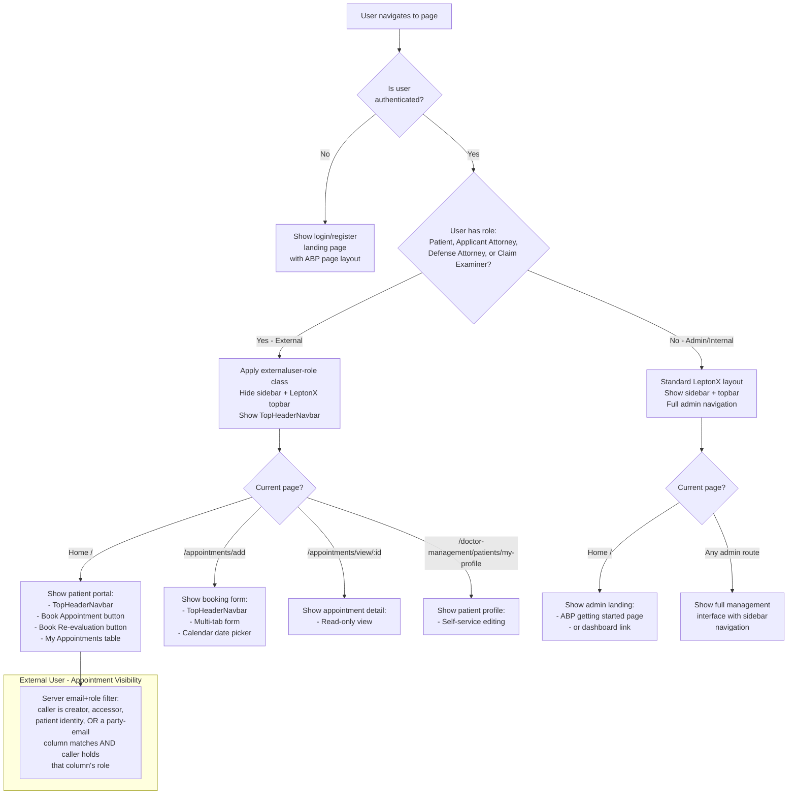

# Role-Based UI

> Purpose: Describes how the app selects layout and content based on user role. Audience: frontend developer. Last verified: 2026-06-01 vs main.

[Home](../INDEX.md) > [Frontend](./) > Role-Based UI

## Overview

The application renders different UI layouts and content based on the current user's role. The primary distinction is between **external users** (Patient, Applicant Attorney, Defense Attorney, Claim Examiner) who see a simplified portal, and **internal/admin users** who see the full ABP management interface with LeptonX sidebar navigation.

## External vs Internal Users

| Aspect | External Users | Internal/Admin Users |
|--------|---------------|---------------------|
| Roles | Patient, Applicant Attorney, Defense Attorney, Claim Examiner | Admin, and any role without external designation |
| Sidebar | Hidden | Visible (LeptonX side menu) |
| Topbar | Hidden (LeptonX), replaced by `TopHeaderNavbarComponent` | Visible (LeptonX topbar) |
| Content width | Full width (no sidebar margin) | Standard width with sidebar offset |
| Home page | Simplified portal with booking buttons + appointment table | ABP default landing with login prompt |
| Navigation | Custom header with Profile/Help/Logout buttons | LeptonX sidebar menu |

## Role Detection

### AppComponent (app.component.ts)

Role detection happens in the root `AppComponent` and runs on every `NavigationEnd` event:

```typescript
// import at top of app.component.ts
import { hasAnyExternalRole } from './shared/auth/external-user-roles';

private updatePatientRoleClass(): void {
  const currentUser = this.configState.getOne('currentUser') as { roles?: string[] } | null;
  const isExternalUser = hasAnyExternalRole(currentUser?.roles ?? []);

  document.body.classList.toggle('externaluser-role', isExternalUser);
  document.documentElement.classList.toggle('externaluser-role', isExternalUser);
  this.applySidebarVisibility(isExternalUser);
}
```

- Uses ABP `ConfigStateService` to read `currentUser.roles` from the application configuration
- Delegates role classification to `hasAnyExternalRole()` from `shared/auth/external-user-roles.ts` -- the canonical role list lives there (4 entries: patient, applicant attorney, defense attorney, claim examiner); `app.component.ts` holds no inline role array
- `hasAnyExternalRole` returns true when at least one role is external (case-insensitive, trimmed); a mixed internal+external user therefore gets the sidebar-hidden layout
- Toggles CSS classes on both `<body>` and `<html>` elements
- Directly manipulates DOM elements to hide/show sidebar and expand content

### HomeComponent (home.component.ts)

The home page performs role detection for rendering:

```typescript
/** Patient, Applicant Attorney, Defense Attorney, and Claim Examiner share the same layout. */
get isPatientUser(): boolean {
  if (!this.hasLoggedIn) return false;
  const roles = this.currentUser?.roles ?? [];
  const externalUserRoles = new Set([
    'patient',
    'applicant attorney',
    'defense attorney',
    'claim examiner',
  ]);
  return roles.some(role => externalUserRoles.has(role?.toLowerCase() ?? ''));
}
```

`HomeComponent` does not import the shared utility directly; it maintains a local 4-entry `Set` that mirrors `EXTERNAL_USER_ROLES`. There is no separate `isAttorneyUser` getter -- attorney-specific appointment filtering was removed when the server-side S-NEW-2 visibility filter was introduced (see "Appointment Filtering by Role" below).

## CSS Class Toggles

When an external user is detected, the following changes are applied:

### Global Styles (styles.scss)

```scss
body.externaluser-role, html.externaluser-role {
  // Hide LeptonX topbar
  .lpx-topbar-container, .lpx-topbar {
    display: none !important;
  }

  // Hide sidebar
  .lpx-sidebar-container, .lpx-sidebar,
  aside, .externaluser-sidebar-hidden {
    display: none !important;
  }

  // Full-width content
  .lpx-content-container, main, .externaluser-main-full {
    margin-left: 0 !important;
    padding-left: 0 !important;
  }

  // Hide user text next to avatar
  lpx-avatar + .lpx-menu-item-text {
    display: none !important;
  }
}
```

### DOM Class Manipulation (AppComponent)

In addition to the CSS body class, `applySidebarVisibility()` directly toggles classes on DOM elements:

- **Sidebar selectors:** `.lpx-sidebar-container`, `.lpx-sidebar`, `.lpx-menu-container`, `.lpx-menu`, `aside` -- get `externaluser-sidebar-hidden` class
- **Main content selectors:** `.lpx-content-container`, `.lpx-main-container`, `.lpx-main-content`, `.lpx-page`, `main` -- get `externaluser-main-full` class

## TopHeaderNavbarComponent

Custom header component for external users, replacing the LeptonX topbar:

```typescript
@Component({
  selector: 'app-top-header-navbar',
  standalone: true,
  imports: [CommonModule],
})
export class TopHeaderNavbarComponent {
  @Input() tenantName = '';    // e.g., "ABC Medical Group"
  @Input() userName = '';      // e.g., "John Doe"
  @Input() roleName = '';      // e.g., "Patient"
  @Input() showProfile = true;
  @Input() showHelp = true;
  @Input() showLogout = true;

  @Output() profileClick = new EventEmitter<void>();
  @Output() helpClick = new EventEmitter<void>();
  @Output() logoutClick = new EventEmitter<void>();
}
```

Used in:
- `HomeComponent` -- with `profileClick` navigating to `/doctor-management/patients/my-profile`
- `AppointmentAddComponent` -- with same profile navigation

## UI Rendering Decision Tree



## HomeComponent Rendering by Role

### Unauthenticated Users

Shows a simple landing page wrapped in `<abp-page>`:
- "Appointment Scheduling Portal" heading
- "Click to login or register" message
- Login button that calls `authService.navigateToLogin()`

### Patient / Attorney / Claim Examiner Users (`isPatientUser === true`)

Shows the external user portal:

1. **TopHeaderNavbar** -- Displays tenant name, user name, role; profile button navigates to my-profile
2. **Action buttons row:**
   - "Book Appointment" -- navigates to `/appointments/add?type=1`
   - "Book Re-evaluation" -- button present but not yet wired
3. **My Appointments Requests table** -- ngx-datatable showing:
   - Appointment Type (name)
   - Patient (firstName + lastName)
   - Panel Number
   - Confirmation Number (clickable link to `/appointments/view/:id`)
   - Appointment Date
   - Appointment Status (localized enum display)
   - Location (name)

### Admin Users (not external)

Shows the standard ABP landing page within `<abp-page>`. If not logged in, shows login prompt. Otherwise, the sidebar provides navigation to all management screens.

## Appointment Filtering by Role

Client-side role-based filtering was removed; the server narrows the appointment list. As of the
firm-based AA/DA work (2026-06-12, `ComputeExternalPartyVisibilityAsync`), the narrowing is
**email + role gated**: an external caller sees an appointment only where they are the **creator**,
an explicit **AppointmentAccessor**, the **patient identity** on the row, OR one of the appointment's
denormalized party-email columns equals their email **AND they hold that column's role**
(`PatientEmail`->Patient, `ApplicantAttorneyEmail`->Applicant Attorney, `DefenseAttorneyEmail`->Defense
Attorney, `ClaimExaminerEmail`->Claim Examiner). The earlier role-AGNOSTIC email match and the bare
id-based AA/DA link unions were dropped -- they would surface a column to a user who lacks that role
(e.g. a Defense-Attorney account whose email happens to be the Applicant-Attorney column). The
per-appointment read guard (`AppointmentReadAccessGuard`) applies the *same* rule, so a row shown in
the list never 403s on click. A firm holding both Applicant + Defense Attorney (accumulated via an
accessor invite) sees both sides; a single-role account sees only its own.

`HomeComponent.ngOnInit()` calls `this.service.hookToQuery()` unconditionally once `isPatientUser` is confirmed true; no per-role filter is pre-set on the client.

## Registration field branching (firm-based AA/DA)

The AuthServer sign-up overlay (`AuthServer/wwwroot/global-scripts.js`) branches the visible fields by
selected role: **Patient / Claim Examiner** show First/Last name; **Applicant / Defense Attorney**
hide First/Last and show **Firm Name** (those roles register as firm accounts). Because an attorney
account's `Name`/`Surname` are blank, every display surface falls back via
`resolveExternalUserDisplayName` (First+Last -> Firm Name -> email): the home banner and the
appointment-view attorney picker show the firm name, never a blank or raw email. On the booking form
the attorney section is **free-entry** for an AA/DA booker (a firm/paralegal books on behalf of a
distinct attorney), so it is no longer auto-seeded with the booker's own identity.

## Patient Self-Service Routes

External users have access to specific routes without requiring ABP permissions (only `authGuard`):

| Route | Purpose |
|-------|---------|
| `/` | Home with portal view |
| `/appointments/add` | Book new appointment |
| `/appointments/view/:id` | View appointment detail |
| `/doctor-management/patients/my-profile` | Edit own patient profile |

All other routes require `permissionGuard` and specific ABP policies, making them inaccessible to external users unless explicitly granted.

## Cleanup

`AppComponent.ngOnDestroy()` cleans up the role-based CSS modifications:

```typescript
ngOnDestroy(): void {
  this.subscription.unsubscribe();
  document.body.classList.remove('externaluser-role');
  document.documentElement.classList.remove('externaluser-role');
  this.applySidebarVisibility(false);
}
```

---

**Related Documentation:**
- [Routing & Navigation](ROUTING-AND-NAVIGATION.md)
- [Permissions](../backend/PERMISSIONS.md)
- [User Roles & Actors](../business-domain/USER-ROLES-AND-ACTORS.md)
