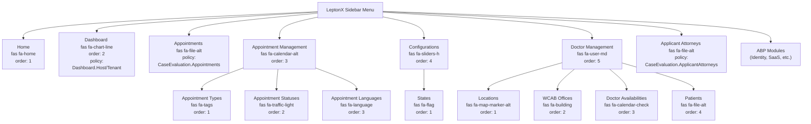

# Routing & Navigation

[Home](../INDEX.md) > [Frontend](./) > Routing & Navigation

## Overview

The application uses Angular's standalone router with lazy loading via `loadComponent` and `loadChildren`. Routes are defined in `app.routes.ts` and menu items are registered separately via ABP `RoutesService` through route providers.

## Complete Route Tree

```mermaid
flowchart TD
    ROOT["/ (root)"]

    ROOT --> HOME["/ <br/> HomeComponent <br/> no guard"]
    ROOT --> DASH["/dashboard <br/> DashboardComponent <br/> authGuard + permissionGuard"]

    ROOT --> ABP_ROUTES["ABP Built-in Routes"]
    ABP_ROUTES --> ACCT["/account <br/> loadChildren"]
    ABP_ROUTES --> GDPR_M["/gdpr <br/> loadChildren"]
    ABP_ROUTES --> IDENT["/identity <br/> loadChildren"]
    ABP_ROUTES --> LANG["/language-management <br/> loadChildren"]
    ABP_ROUTES --> SAAS["/saas <br/> loadChildren"]
    ABP_ROUTES --> AUDIT["/audit-logs <br/> loadChildren"]
    ABP_ROUTES --> OIDC["/openiddict <br/> loadChildren"]
    ABP_ROUTES --> TXTM["/text-template-management <br/> loadChildren"]
    ABP_ROUTES --> FILEM["/file-management <br/> loadChildren"]
    ABP_ROUTES --> GDPR_CC["/gdpr-cookie-consent <br/> children: GDPR_COOKIE_CONSENT_ROUTES"]
    ABP_ROUTES --> SETTINGS["/setting-management <br/> loadChildren"]

    ROOT --> CONFIG["Configurations"]
    CONFIG --> STATES["/configurations/states <br/> StateComponent <br/> authGuard + permissionGuard"]

    ROOT --> APT_MGMT["Appointment Management"]
    APT_MGMT --> APTYPES["/appointment-management/appointment-types <br/> AppointmentTypeComponent <br/> authGuard + permissionGuard"]
    APT_MGMT --> APSTAT["/appointment-management/appointment-statuses <br/> AppointmentStatusComponent <br/> authGuard + permissionGuard"]
    APT_MGMT --> APLANG["/appointment-management/appointment-languages <br/> AppointmentLanguageComponent <br/> authGuard + permissionGuard"]

    ROOT --> APPTS["Appointments"]
    APPTS --> APPTS_LIST["/appointments <br/> AppointmentComponent <br/> authGuard + permissionGuard"]
    APPTS --> APPTS_ADD["/appointments/add <br/> AppointmentAddComponent <br/> authGuard only"]
    APPTS --> APPTS_VIEW["/appointments/view/:id <br/> AppointmentViewComponent <br/> authGuard only"]

    ROOT --> DOC_MGMT["Doctor Management"]
    DOC_MGMT --> LOCS["/doctor-management/locations <br/> LocationComponent <br/> authGuard + permissionGuard"]
    DOC_MGMT --> WCAB["/doctor-management/wcab-offices <br/> WcabOfficeComponent <br/> authGuard + permissionGuard"]
    DOC_MGMT --> DOCS["/doctor-management/doctors <br/> DoctorComponent <br/> authGuard + permissionGuard"]
    DOC_MGMT --> DA_LIST["/doctor-management/doctor-availabilities <br/> DoctorAvailabilityComponent <br/> authGuard + permissionGuard"]
    DOC_MGMT --> DA_GEN["/doctor-management/doctor-availabilities/generate <br/> DoctorAvailabilityGenerateComponent <br/> authGuard + permissionGuard"]
    DOC_MGMT --> DA_ADD["/doctor-management/doctor-availabilities/add <br/> DoctorAvailabilityGenerateComponent <br/> authGuard + permissionGuard"]
    DOC_MGMT --> PAT_LIST["/doctor-management/patients <br/> PatientComponent <br/> authGuard + permissionGuard"]
    DOC_MGMT --> PAT_PROF["/doctor-management/patients/my-profile <br/> PatientProfileComponent <br/> authGuard only"]

    ROOT --> ATTORNEYS["/applicant-attorneys <br/> ApplicantAttorneyComponent <br/> authGuard + permissionGuard"]
```

## Route Details Table

### Root Routes

| Path | Component | Guard | Notes |
|------|-----------|-------|-------|
| `/` | `HomeComponent` | None | Role-based landing page |
| `/dashboard` | `DashboardComponent` | `authGuard` + `permissionGuard` | Policy: `CaseEvaluation.Dashboard.Host \|\| CaseEvaluation.Dashboard.Tenant` |

### ABP Built-in Routes

| Path | Load Strategy | Notes |
|------|---------------|-------|
| `/account` | `loadChildren` | Login, register, password reset |
| `/gdpr` | `loadChildren` | GDPR management |
| `/identity` | `loadChildren` | Users, roles, organization units |
| `/language-management` | `loadChildren` | Language resources |
| `/saas` | `loadChildren` | Tenant management |
| `/audit-logs` | `loadChildren` | Audit log viewer |
| `/openiddict` | `loadChildren` | OpenIddict application/scope management |
| `/text-template-management` | `loadChildren` | Email/notification templates |
| `/file-management` | `loadChildren` | File browser |
| `/setting-management` | `loadChildren` | Application settings |
| `/gdpr-cookie-consent` | `children` | Cookie/privacy policy pages |

### Configuration Routes

| Path | Component | Guard | Permission |
|------|-----------|-------|------------|
| `/configurations/states` | `StateComponent` | `authGuard` + `permissionGuard` | `CaseEvaluation.States` |

### Appointment Management Routes

| Path | Component | Guard | Permission |
|------|-----------|-------|------------|
| `/appointment-management/appointment-types` | `AppointmentTypeComponent` | `authGuard` + `permissionGuard` | `CaseEvaluation.AppointmentTypes` |
| `/appointment-management/appointment-statuses` | `AppointmentStatusComponent` | `authGuard` + `permissionGuard` | `CaseEvaluation.AppointmentStatuses` |
| `/appointment-management/appointment-languages` | `AppointmentLanguageComponent` | `authGuard` + `permissionGuard` | `CaseEvaluation.AppointmentLanguages` |

### Appointment Routes

| Path | Component | Guard | Permission |
|------|-----------|-------|------------|
| `/appointments` | `AppointmentComponent` | `authGuard` + `permissionGuard` | `CaseEvaluation.Appointments` |
| `/appointments/add` | `AppointmentAddComponent` | `authGuard` only | No permission required (any logged-in user) |
| `/appointments/view/:id` | `AppointmentViewComponent` | `authGuard` only | No permission required (any logged-in user) |

### Doctor Management Routes

| Path | Component | Guard | Permission |
|------|-----------|-------|------------|
| `/doctor-management/locations` | `LocationComponent` | `authGuard` + `permissionGuard` | `CaseEvaluation.Locations` |
| `/doctor-management/wcab-offices` | `WcabOfficeComponent` | `authGuard` + `permissionGuard` | `CaseEvaluation.WcabOffices` |
| `/doctor-management/doctors` | `DoctorComponent` | `authGuard` + `permissionGuard` | `CaseEvaluation.Doctors` |
| `/doctor-management/doctor-availabilities` | `DoctorAvailabilityComponent` | `authGuard` + `permissionGuard` | `CaseEvaluation.DoctorAvailabilities` |
| `/doctor-management/doctor-availabilities/generate` | `DoctorAvailabilityGenerateComponent` | `authGuard` + `permissionGuard` | `CaseEvaluation.DoctorAvailabilities` |
| `/doctor-management/doctor-availabilities/add` | `DoctorAvailabilityGenerateComponent` | `authGuard` + `permissionGuard` | `CaseEvaluation.DoctorAvailabilities` |
| `/doctor-management/patients` | `PatientComponent` | `authGuard` + `permissionGuard` | `CaseEvaluation.Patients` |
| `/doctor-management/patients/my-profile` | `PatientProfileComponent` | `authGuard` only | No permission required |

### Attorney Routes

| Path | Component | Guard | Permission |
|------|-----------|-------|------------|
| `/applicant-attorneys` | `ApplicantAttorneyComponent` | `authGuard` + `permissionGuard` | `CaseEvaluation.ApplicantAttorneys` |

## Guards

| Guard | Source | Purpose |
|-------|--------|---------|
| `authGuard` | `@abp/ng.core` | Requires authenticated user; redirects to login if not |
| `permissionGuard` | `@abp/ng.core` | Requires specific ABP permission defined in route's `requiredPolicy`; shows 403 if denied |

**Important:** Routes with only `authGuard` (no `permissionGuard`) are accessible to any logged-in user, including external users (Patient, Attorney). This is by design for `/appointments/add`, `/appointments/view/:id`, and `/doctor-management/patients/my-profile`.

## Lazy Loading

All routes use lazy loading:

- **ABP modules** use `loadChildren` with dynamic imports (e.g., `import('@volo/abp.ng.identity').then(c => c.createRoutes())`)
- **Feature routes** use `children` with `loadComponent` inside the child route definition
- **Custom routes** use `loadComponent` directly (e.g., `import('./home/home.component').then(c => c.HomeComponent)`)
- **Exception:** `AppointmentAddComponent` is eagerly imported and resolved via `Promise.resolve()` in the route definition

## Menu Registration

Menus are registered separately from routes via ABP `RoutesService`, using route providers injected in `app.config.ts`:

### Route Providers

| Provider | Menu Items |
|----------|------------|
| `APP_ROUTE_PROVIDER` | Home (`/`), Dashboard (`/dashboard`) |
| `DOCTOR_MANAGEMENT_ROUTE_PROVIDER` | Doctor Management parent, Locations, WCAB Offices, Doctor Availabilities |
| `STATES_STATE_ROUTE_PROVIDER` | Configurations parent, States |
| `APPOINTMENT_TYPES_APPOINTMENT_TYPE_ROUTE_PROVIDER` | Appointment Management parent, Appointment Types |
| `APPOINTMENT_STATUSES_APPOINTMENT_STATUS_ROUTE_PROVIDER` | Appointment Statuses |
| `APPOINTMENT_LANGUAGES_APPOINTMENT_LANGUAGE_ROUTE_PROVIDER` | Appointment Languages |
| `LOCATIONS_LOCATION_ROUTE_PROVIDER` | (already in DOCTOR_MANAGEMENT) |
| `DOCTORS_DOCTOR_ROUTE_PROVIDER` | Doctors |
| `DOCTOR_AVAILABILITIES_DOCTOR_AVAILABILITY_ROUTE_PROVIDER` | Doctor Availabilities |
| `PATIENTS_PATIENT_ROUTE_PROVIDER` | Patients |
| `APPOINTMENTS_APPOINTMENT_ROUTE_PROVIDER` | Appointments |
| `APPLICANT_ATTORNEYS_APPLICANT_ATTORNEY_ROUTE_PROVIDER` | Applicant Attorneys |

### Sidebar Menu Structure

**Note:** The sidebar is hidden for external users (Patient, Applicant Attorney, Defense Attorney). See [Role-Based UI](ROLE-BASED-UI.md) for details.

## Route Definition Order

Route order in `app.routes.ts` matters. Notable ordering decisions:

1. `/doctor-management/doctor-availabilities/generate` and `/add` are defined **before** the generic `/doctor-management/doctor-availabilities` children routes to ensure they match first
2. `/appointments/add` is defined **after** the `/appointments` children route (which handles `/appointments` list and `/appointments/view/:id`)
3. `/doctor-management/patients/my-profile` is defined **before** `/doctor-management/patients` children to prevent the list route from consuming it

---

**Related Documentation:**
- [Angular Architecture](ANGULAR-ARCHITECTURE.md)
- [Role-Based UI](ROLE-BASED-UI.md)
- [Permissions](../backend/PERMISSIONS.md)
