# Dependency graph + wave ordering

**Phase 3 output, locked 2026-04-24** (post-scope-lock deltas applied -- see "Post-scope-lock deltas" section below). Built from the `## Dependencies` section of each brief in `solutions/`, refreshed after the Q&A scope lock in `blocked-on-scope.md`. 40 capabilities total: 35 IN-MVP, 4 OUT-of-MVP (handled post-MVP), 1 doc-only. 0 cycles detected. 4 waves.

## Scope delta vs initial Phase 3 draft

- `appointment-notes`, `anonymous-document-upload`, `joint-declarations`, `appointment-request-report-export` -> OUT of MVP.
- `document-packages`, `user-query-contact-us`, `custom-fields`, `appointment-documents`, `appointment-injury-workflow` -> IN-MVP.
- `background-jobs-infrastructure` (Hangfire) promoted from deferred to Wave 0 mandatory (legal recurring jobs).
- `sms-sender-consumer` -> OUT of MVP (defer; OLD has SMS disabled).

## Post-scope-lock deltas (2026-04-24+)

Findings from the pre-Wave-0 readiness audit (post-2026-04-24 Q&A scope lock) applied to this graph:

- **E1 email provider**: `email-sender-consumer` SMTP target flipped from AWS SES to Azure ACS Email (Adrian's existing Azure Plan subscription). Pending manager sign-off; HIPAA path via Microsoft BAA from the Service Trust Portal. ABP `SmtpEmailSender` is unchanged -- only host/port/credentials swap.
- **G7 SEC-03 reconciliation**: SECURITY.md SEC-03 (`GetExternalUserLookupAsync` user-enumeration on `ExternalSignupAppService` line 62) auto-closes via the `new-sec-04` class deletion. Single fix, no separate work item.
- **Wave 0 capability added**: `security-hardening` covers SECURITY.md SEC-04 (CORS wide-open: AllowAnyMethod + AllowAnyHeader + wildcard subdomain) + SEC-05 (relaxed password policy: length 6, no complexity). XS effort (~0.5d). Wave 0 cap count 15 -> 16; Wave 0 effort 15-22d -> 15.5-22.5d.
- **Brief revision notes queued for Wave 0 housekeeping PR** (not applied in this delta -- only dependency-graph row notes are touched here): `appointment-state-machine` (keep dormant post-Booked states; rename `MoreInfoRequested` -> `AwaitingMoreInfo`); `lookup-data-seeds` (drop AppointmentStatus entity seeding -- per `docs/product/appointment-statuses.md` it's an enum, not entity); `scheduler-notifications` (add `AwaitingMoreInfoTimeoutJob`); `appointment-change-requests` (structured field-flags + free-text note shape for send-back).

## Wave ordering

### Wave 0 -- foundation + leaf fixes (16 capabilities)

Safe to parallelise. First-10-days tranche.

| slug | effort | note |
|---|---|---|
| [new-sec-05-hsts-header](solutions/new-sec-05-hsts-header.md) | XS | 1-line fix |
| [security-hardening](solutions/security-hardening.md) | XS (~0.5d) | SECURITY.md SEC-04 (CORS lock-down) + SEC-05 (password policy tighten) folded into one Wave 0 leaf |
| [new-sec-01-appointment-route-permission-guard](solutions/new-sec-01-appointment-route-permission-guard.md) | XS-S | 2-line Angular fix |
| [new-sec-03-transactional-tenant-provisioning](solutions/new-sec-03-transactional-tenant-provisioning.md) | XS-S | UoW flag flip |
| [new-sec-02-method-level-authorize](solutions/new-sec-02-method-level-authorize.md) | S | attribute additions on 3 AppServices + 4 helpers |
| [new-sec-04-external-signup-real-defaults](solutions/new-sec-04-external-signup-real-defaults.md) | S | **Rewritten scope:** remove anonymous signup endpoint, not fix defaults; class deletion also closes SECURITY.md SEC-03 (`GetExternalUserLookupAsync` enumeration) |
| [rest-api-parity-cleanup](solutions/rest-api-parity-cleanup.md) | S | ADR-006 cascade-delete + G-API-17/18/20/21 docs |
| [lookup-data-seeds](solutions/lookup-data-seeds.md) | S | 4 reference seeders (AppointmentStatus dropped per `docs/product/appointment-statuses.md` -- enum, not entity) + 1 demo Location seeder |
| [internal-role-seeds](solutions/internal-role-seeds.md) | S-M | 3 internal tiers + baseline grants; permission matrix authored |
| [blob-storage-provider](solutions/blob-storage-provider.md) | M | DB BLOB for MVP; S3 migration = config-only post-MVP |
| [email-sender-consumer](solutions/email-sender-consumer.md) | S-M | ABP SmtpEmailSender + Azure ACS Email SMTP (pending manager sign-off; AWS SES dropped post-scope-lock per pre-Wave-0 plan E1) |
| [background-jobs-infrastructure](solutions/background-jobs-infrastructure.md) | S-M | **Now mandatory Wave 0:** Hangfire + SQL Server storage |
| [system-parameters-vs-abp-settings](solutions/system-parameters-vs-abp-settings.md) | S | ABP SettingManagement + ~12 SettingDefinitions |
| [users-admin-management](solutions/users-admin-management.md) | S | verify-only; delegate to ABP Identity |
| [patient-auto-match](solutions/patient-auto-match.md) | M | FindOrCreateAsync; subsumes NEW-SEC-04 remediation |
| [account-self-service](solutions/account-self-service.md) | S | verify ABP Account Module wired; delegate to @volo/abp.ng.account/public |

**Wave 0 effort roll-up:** ~15.5-22.5 engineer-days when parallelised across 4-6 engineers. Higher than prior 15-22d estimate due to `security-hardening` add (+0.5d) post-scope-lock. (Prior: ~13-18d -> 15-22d due to Hangfire promotion +2-3d + permission-matrix authoring +0.5-1d + `account-self-service` moved earlier.)

### Wave 1 -- depends on Wave 0 (11 capabilities)

| slug | effort | blocked by |
|---|---|---|
| [appointment-state-machine](solutions/appointment-state-machine.md) | S-M (~1.5d) | none (scope: MVP-active subset + dormant post-Booked states per A1 2026-04-24; `MoreInfoRequested` -> `AwaitingMoreInfo` per T11) |
| [appointment-lead-time-limits](solutions/appointment-lead-time-limits.md) | M | system-parameters-vs-abp-settings |
| [appointment-accessor-auto-provisioning](solutions/appointment-accessor-auto-provisioning.md) | L+ (~5-6d) | email-sender-consumer, internal-role-seeds; **Rewritten scope:** `FindOrCreateExternalUserAsync` is canonical for all 4 external roles, not just accessors |
| [templates-email-sms](solutions/templates-email-sms.md) | M | email-sender-consumer |
| [appointment-full-field-snapshot](solutions/appointment-full-field-snapshot.md) | S-M | lookup-data-seeds, internal-role-seeds |
| [appointment-documents](solutions/appointment-documents.md) | L (~7d) | blob-storage-provider, lookup-data-seeds |
| [custom-fields](solutions/custom-fields.md) | S (~1d) | lookup-data-seeds; **Rewritten scope:** per-AppointmentType field visibility / pre-fill / disable config, NOT dynamic form builder |
| [document-packages](solutions/document-packages.md) | M | blob-storage-provider, appointment-documents |
| [attorney-defense-patient-separation](solutions/attorney-defense-patient-separation.md) | M (~5d) | none (Option B locked: split DefenseAttorney + AppointmentDefenseAttorney) |
| [user-query-contact-us](solutions/user-query-contact-us.md) | S (~1d) | email-sender-consumer (optional notify-admin-on-submit) |
| [new-qual-01-critical-path-test-coverage](solutions/new-qual-01-critical-path-test-coverage.md) | M | logical: NEW-SEC-02/03/04 fixes (tests encode current-behaviour then fix PRs invert) |

**Wave 1 effort roll-up:** ~28-38 engineer-days. Higher than prior 25-35d due to attorney-separation +3.5d (Option B) + accessor-provisioning +~1d (canonical external-user invite).

### Wave 2 -- depends on Wave 1 (8 capabilities)

| slug | effort | blocked by |
|---|---|---|
| [appointment-booking-cascade](solutions/appointment-booking-cascade.md) | M | appointment-state-machine |
| [appointment-search-listview](solutions/appointment-search-listview.md) | S | lookup-data-seeds, internal-role-seeds (Wave 0) |
| [appointment-change-log-audit](solutions/appointment-change-log-audit.md) | S-M (~2.5d) | internal-role-seeds (W0), appointment-state-machine (W1) |
| [appointment-injury-workflow](solutions/appointment-injury-workflow.md) | L (~7d) | lookup-data-seeds (W0) |
| [external-user-home](solutions/external-user-home.md) | S | internal-role-seeds, new-sec-04 |
| [scheduler-notifications](solutions/scheduler-notifications.md) | M (~3-4d) | background-jobs (W0), email (W0), templates (W1), accessor (W1); **Rewritten scope:** 4 jobs -- 3 CCR-driven reminders (RequestScheduling / CancellationReschedule / AppointmentDay) + `AwaitingMoreInfoTimeoutJob` (per T11 follow-on) |
| [dashboard-counters](solutions/dashboard-counters.md) | S-M (~2d) | internal-role-seeds, appointment-state-machine; **Revised scope:** all 13 cards in DTO, placeholders for post-MVP |

### Wave 3 -- depends on Wave 2 (1 capability in MVP)

| slug | effort | blocked by |
|---|---|---|
| [appointment-change-requests](solutions/appointment-change-requests.md) | L (~7.5d) | appointment-state-machine, appointment-booking-cascade; **note:** uses structured field-flags + free-text note shape for send-back (per pre-Wave-0 plan) |

### Out of MVP (4 capabilities; handled post-MVP)

- [appointment-notes](solutions/appointment-notes.md) -- features-after-MVP, pending manager call.
- [anonymous-document-upload](solutions/anonymous-document-upload.md) -- post-MVP; no current use case.
- [joint-declarations](solutions/joint-declarations.md) -- post-MVP.
- [appointment-request-report-export](solutions/appointment-request-report-export.md) -- post-MVP.
- [sms-sender-consumer](solutions/sms-sender-consumer.md) -- post-MVP (track-10 erratum 2: OLD has SMS disabled).

## Mermaid graph (MVP-scoped)

```mermaid
graph TD
  subgraph W0["Wave 0 (15 foundation + leaf fixes)"]
    SEC05[new-sec-05-hsts-header]
    SEC01[new-sec-01-route-guard]
    SEC03[new-sec-03-txn-tenant]
    SEC02[new-sec-02-method-authz]
    SEC04[new-sec-04-signup-redesign]
    SECHRD[security-hardening]
    APIP[rest-api-parity-cleanup]
    LS[lookup-data-seeds]
    IRS[internal-role-seeds]
    BLOB[blob-storage-provider]
    EMAIL[email-sender-consumer]
    BGJ[background-jobs-infrastructure]
    SYS[system-parameters-vs-abp-settings]
    UAM[users-admin-management]
    PAM[patient-auto-match]
    ACC_SS[account-self-service]
  end

  subgraph W1["Wave 1 (11)"]
    SM[appointment-state-machine]
    LT[appointment-lead-time-limits]
    ACC[accessor-auto-provisioning]
    TPL[templates-email-sms]
    FFS[appointment-full-field-snapshot]
    DOCS[appointment-documents]
    CF[custom-fields]
    DPK[document-packages]
    ATY[attorney-defense-patient-separation]
    UQ[user-query-contact-us]
    QUAL01[new-qual-01-test-coverage]
  end

  subgraph W2["Wave 2 (8)"]
    BC[appointment-booking-cascade]
    SRC[appointment-search-listview]
    LOG[appointment-change-log-audit]
    INJ[appointment-injury-workflow]
    EXH[external-user-home]
    SCH[scheduler-notifications]
    DC[dashboard-counters]
  end

  subgraph W3["Wave 3 (1)"]
    CR[appointment-change-requests]
  end

  EMAIL --> ACC_SS
  SYS --> LT
  EMAIL --> ACC
  IRS --> ACC
  EMAIL --> TPL
  LS --> FFS
  IRS --> FFS
  BLOB --> DOCS
  LS --> DOCS
  LS --> CF
  BLOB --> DPK
  DOCS --> DPK
  SEC02 --> QUAL01
  SEC03 --> QUAL01
  SEC04 --> QUAL01
  EMAIL --> UQ

  SM --> BC
  LS --> SRC
  IRS --> SRC
  IRS --> LOG
  SM --> LOG
  LS --> INJ
  IRS --> EXH
  SEC04 --> EXH
  BGJ --> SCH
  EMAIL --> SCH
  TPL --> SCH
  ACC --> SCH
  IRS --> DC
  SM --> DC

  SM --> CR
  BC --> CR
```

## Effort roll-up (revised post-Q&A)

- **Wave 0:** ~15.5-22.5 engineer-days
- **Wave 1:** ~28-38 engineer-days
- **Wave 2:** ~20-28 engineer-days
- **Wave 3:** ~7-10 engineer-days

**Grand total: ~70.5-100.5 engineer-days.** (Prior 70-100; +0.5d from `security-hardening` add post-scope-lock. Original 70-95 widened due to attorney-separation Option B + accessor-provisioning scope expansion adding ~5d, partly offset by state-machine subset saving ~1.5d and dropped OUT-MVP capabilities.)

At 1 engineer (Adrian), ~16-22 calendar weeks (4-5.5 months) at 100% allocation with some parallel-PR opportunity within waves.

## Cycle audit

Every edge forward-pointing across waves. 0 cycles.

## Post-MVP backlog (not in waves above)

- appointment-notes, anonymous-document-upload, joint-declarations, appointment-request-report-export (scope drops).
- sms-sender-consumer (defer).
- CCR 8 Sec. 38 30-day report rule + extension-notice rule + missed-appointment-fee liability (depend on check-in/check-out/bill which are OUT of MVP state-subset).
- BRAND-01, BRAND-02, BRAND-03 (per-tenant branding) -- deferred per Adrian 2026-04-23.
- Q32 Book demo feature removal.
- Q29 PROD schema parity verification (Adrian provides pre-launch).
